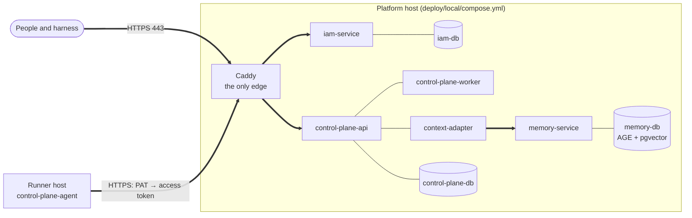

# Operations

This section is for the engineer who deploys the Taimen platform in a
production environment and maintains it: installation layout, edge,
upgrades, secrets, backups, observability, resources, and emergency
procedures. Diagnosing specific symptoms is covered in
[Troubleshooting](../troubleshooting/index.md).

## The installation model in brief

A production Taimen installation is **one machine with Docker Compose** and,
if needed, **a separate runner host** for autonomous executors.

Key principles:

- **One description file**: the superproject's `deploy/local/compose.yml` with
  profiles (`core`, `edge`, `notify`). A local installation and a production
  one differ only in the `.env` file and the Caddyfile.
- **One edge**: only the `caddy` container publishes ports (80/443).
  All other services listen on the host's `127.0.0.1` or only on the internal
  network.
- **A release is a superproject commit.** Component versions are pinned by
  submodule pointers; an upgrade is a `git pull` of the superproject and
  `git submodule update`.
- **Secrets live only in `.env` and `secrets/`** (both in `.gitignore`), mode `0600`.
- **Schema migrations are applied at startup** of the services
  (`alembic upgrade head` in the container command); there is no separate
  migration step.

## Articles in this section

| Article | What is inside |
|---|---|
| [Production deployment](deployment.md) | Directory layout, `.env`, profiles, first start, bootstrap, runner host |
| [Edge and TLS](edge-and-tls.md) | Caddy routes, certificate issuance, closing internal paths, common mistakes |
| [Upgrades and migrations](upgrades.md) | Standard rollout, Alembic migrations, minimizing downtime, rollback |
| [Secrets and rotation](secrets.md) | Secret inventory, file permissions, rotating PATs, the signing key, passwords |
| [Backup](backup.md) | What to back up, `pg_dump` of each database, Apache AGE specifics, restore |
| [Monitoring and health](monitoring.md) | Health endpoints, `/metrics`, `make smoke`, logs, what to alert on |
| [Resources and scaling](capacity.md) | Memory limits from `deploy/local/compose.yml`, minimum and recommended configurations |
| [Emergency procedures](emergency.md) | IAM outage, release rollback, loss of the runner host, credential compromise |

## On-call checklist

- [ ] `make smoke` is green, `tools/compose --profile "*" ps` shows no `unhealthy`.
- [ ] Control Plane `GET /health/ready` returns `200`, not `503`.
- [ ] `context_adapter_parked_tenants` equals `0`.
- [ ] At least 20% of the disk is free (the Control Plane log and memory grow).
- [ ] The PATs of executors and operators do not expire within the next
      two weeks (see [Secrets and rotation](secrets.md)).
- [ ] The last successful backup of all databases is less than a day old.

!!! tip "Where to run commands"
    All `docker compose` commands in this section run from the root of the
    superproject clone, where `deploy/local/compose.yml` and `.env` live. The `make`
    targets are described in the [Make targets](../reference/make.md)
    reference.

## See also

- [Installation and first start](../getting-started/quickstart.md)
- [.env configuration](../getting-started/configuration.md)
- [Services and ports](../reference/services-and-ports.md)
- [Troubleshooting](../troubleshooting/index.md)
