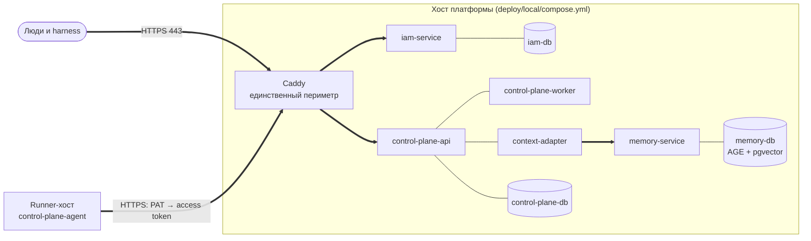

# Эксплуатация

Раздел для инженера, который разворачивает платформу Taimen в промышленном
окружении и сопровождает её: раскладка установки, внешний периметр, обновления,
секреты, резервные копии, наблюдаемость, ресурсы и аварийные процедуры.
Диагностика конкретных симптомов вынесена в раздел
[Диагностика](../troubleshooting/index.md).

## Модель установки в двух словах

Промышленная установка Taimen — это **одна машина с Docker Compose** и, при
необходимости, **отдельный runner-хост** для автономных исполнителей.

Ключевые принципы:

- **Один файл описания** — `deploy/local/compose.yml` суперпроекта с профилями
  (`core`, `edge`, `notify`). Локальная установка и промышленная различаются
  только файлом `.env` и Caddyfile.
- **Один периметр** — наружу публикует порты только контейнер `caddy` (80/443).
  Все прочие сервисы слушают на `127.0.0.1` хоста или только во внутренней сети.
- **Релиз = коммит суперпроекта.** Версии компонентов закреплены указателями
  сабмодулей; обновление — это `git pull` суперпроекта и
  `git submodule update`.
- **Секреты только в `.env` и `secrets/`** (оба в `.gitignore`), права `0600`.
- **Миграции схем применяются при старте** сервисов (`alembic upgrade head` в
  команде контейнера), отдельного шага миграции нет.

## Статьи раздела

| Статья | Что внутри |
|---|---|
| [Промышленное развёртывание](deployment.md) | Раскладка каталогов, `.env`, профили, первый запуск, bootstrap, runner-хост |
| [Периметр и TLS](edge-and-tls.md) | Маршруты Caddy, выпуск сертификатов, закрытие служебных путей, типичные ошибки |
| [Обновление и миграции](upgrades.md) | Штатная выкладка, миграции Alembic, минимизация простоя, откат |
| [Секреты и ротация](secrets.md) | Инвентарь секретов, права файлов, ротация PAT, ключа подписи, паролей |
| [Резервное копирование](backup.md) | Что бэкапить, `pg_dump` каждой БД, особенности Apache AGE, восстановление |
| [Мониторинг и здоровье](monitoring.md) | Health-эндпоинты, `/metrics`, `make smoke`, логи, что алертить |
| [Ресурсы и масштабирование](capacity.md) | Лимиты памяти из `deploy/local/compose.yml`, минимальные и рекомендуемые конфигурации |
| [Аварийные процедуры](emergency.md) | Отказ IAM, откат релиза, потеря runner-хоста, компрометация credentials |

## Чек-лист дежурного

- [ ] `make smoke` зелёный, `tools/compose --profile "*" ps` без `unhealthy`.
- [ ] `GET /health/ready` Control Plane отвечает `200`, а не `503`.
- [ ] `context_adapter_parked_tenants` равен `0`.
- [ ] Свободно не меньше 20 % диска (журнал Control Plane и память растут).
- [ ] Срок действия PAT исполнителей и операторов не истекает в ближайшие
      две недели (см. [Секреты и ротация](secrets.md)).
- [ ] Последний успешный бэкап всех БД моложе суток.

!!! tip "Где команды"
    Все команды `docker compose` в разделе выполняются из корня клона
    суперпроекта: там лежат `deploy/local/compose.yml` и `.env`. Цели `make` описаны в
    справочнике [Цели make](../reference/make.md).

## См. также

- [Установка и первый запуск](../getting-started/quickstart.md)
- [Конфигурация .env](../getting-started/configuration.md)
- [Сервисы и порты](../reference/services-and-ports.md)
- [Диагностика](../troubleshooting/index.md)
