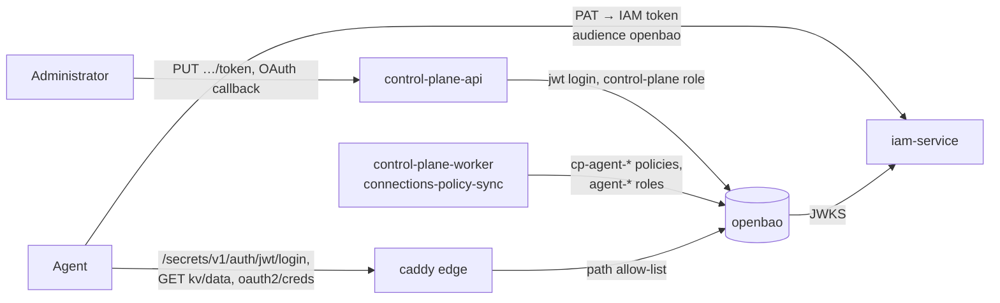

# Secret store

How the platform's secret store, OpenBao in the `core` profile, is built and
operated: deployment, unsealing, service tokens, revoking the root token, the
policy guard, backup and restore, and a KMS seal for a production installation.
This article is for the operations engineer and the person responsible for
security.

The rationale is TAI-ADR-0061 (connections and the store) and CP-ADR-0079
(connections in the core); where secrets are kept is set by article VI of the
development constitution.

## Two classes of secrets

| Class | What it is | Where it lives |
|---|---|---|
| Infrastructure secrets of the platform | Database passwords, signing keys, bootstrap tokens, credentials of the platform components' service accounts: everything without which the platform and the store itself do not start | `.env` and `secrets/` on the host (see [Secrets and rotation](secrets.md)) |
| Secrets of connections and agents | Tokens and keys of external systems ([connections](../control-plane/connections.md)), secrets of registry agents by name | The secret store (this article) |

The boundary is the owner of the credential: for a platform component it is
infrastructure, for a registry agent it is the second class, even if the agent
is not placed anywhere. The store cannot depend on itself, so its own unseal key
and root token are infrastructure secrets in `secrets/`.

The core keeps only the information about a connection and the `secretRef`
reference; the value passes through the core in transit and reaches neither
the database, nor the event log, nor the logs. An agent reads its material
itself, directly from the store, with its own token.

## How it works



| Component | What it does |
|---|---|
| `openbao` | OpenBao 2.6.3 with the `openbao-plugin-secrets-oauthapp` v3.4.1 plugin (image `deploy/openbao`). Storage is raft on a single node, the `openbao_data` volume. No ports on the host, the web UI is off |
| `openbao-bootstrap` | A one-shot idempotent setup container (`deploy/openbao/bootstrap.py`): init, engines, the plugin, the `jwt` method, the core's policy and role, service tokens, the policy guard |
| The `kv/` engine | kv-v2 with `max_versions=1`: connection keys (`kv/data/tenants/<t>/connections/<key>`), agent secrets (`kv/data/tenants/<t>/agents/<agent>/<name>`), credentials of connection types' OAuth applications (`kv/data/platform/oauth-apps/<type>`) |
| The `oauth2/` engine | The `oauthapp` plugin: a connection's OAuth server and its tokens (`oauth2/creds/tenants/<t>/connections/<key>`). The plugin itself refreshes the access token with the refresh token, including a one-time one |
| The `jwt/` method | Login with an IAM token: the IAM JWKS and issuer, store tokens live 5 min, at most 1 h |
| Audit log | The `file` device is declared in `config.hcl`; the file `/openbao/logs/audit.log` is on the `openbao_audit` volume, secret values are HMACs |
| Edge `/secrets/*` | Caddy lets through to the store only the login and reads of tenants' secrets (see [below](#perimeter)) |

### Who logs in and how

| Who | `jwt` role | Policy | What it can do |
|---|---|---|---|
| The core (the `control-plane` service account in IAM) | `control-plane`, only from the compose network (`token_bound_cidrs`), a 15 min token | `control-plane` (`deploy/openbao/policies/control-plane.hcl`) | Write and delete connection material and agent secrets, OAuth application credentials; maintain the `cp-agent-*` policies and `agent-*` roles. `sys/*` beyond that is closed |
| A registry agent | `agent-<principal>`, created by the core | `cp-agent-<principal>`, created by the core | Only `read` of its own connections (`spec.connections`) and its own secrets, a 5 min token |
| Backup | — (a periodic token) | `backup` | Only the raft snapshot |
| The policy guard | — (a periodic token) | `policy-guard` | Only reading `cp-agent-*` and `agent-*` |

The core's `connections-policy-sync` worker reconciles agents' policies and
roles (see [Connections](../control-plane/connections.md#policy-sync)). The
core is not given a root token: the `jwt` method does not create root.

!!! warning "The core is the source of agent policies"
    The store's ACL does not restrict the content of the `cp-agent-*` policies
    or the parameters of the `agent-*` roles. Compromise of the core's service
    account equals compromise of the store's configuration (but not root
    access). That is why there is a [policy guard](#policy-guard) that checks
    them against the template.

## Deployment

The store is part of the `core` profile and comes up with the core:

```bash
make secrets                 # including secrets/openbao-unseal.key if it is missing
make up                      # openbao and openbao-bootstrap are in the core profile
make bootstrap               # the core's service account → the control-plane role in the store
```

`make bootstrap` writes the subject of the core's role to
`secrets/openbao/control-plane-subject.json` and restarts `openbao-bootstrap`
itself: until the file exists, the core role step is skipped.

### `.env` variables { #env }

| Variable | Default | Purpose |
|---|---|---|
| `OPENBAO_UNSEAL_KEY_FILE` | `./secrets/openbao-unseal.key` | The unseal key (the `static` seal): 64 hex characters without a newline, `0600`, owned by uid `10001` on Linux. `make secrets` creates it and never overwrites it |
| `OPENBAO_UNSEAL_KEY_ID` | `unseal-1` | The key identifier (`BAO_STATIC_SEAL_CURRENT_KEY_ID`); changes only when the key is rotated |
| `OPENBAO_MEM_LIMIT` | `256m` | The container's memory limit; it also sets `memswap_limit`, so the container gets no swap |
| `OPENBAO_CORE_CIDRS` | empty | Where the core may log in to the store from (`token_bound_cidrs` of the `control-plane` role). Empty means the compose network's subnet without its gateways; a set value is taken as is |
| `VOLUME_OPENBAO_DATA`, `VOLUME_OPENBAO_AUDIT` | `<project>_openbao_data`, `<project>_openbao_audit` | Names of the raft data and audit log volumes |

The core is configured with the `CP_SECRET_STORE_*` variables (address,
audience, role); see [Connections → Configuration](../control-plane/connections.md#configuration).

!!! warning "The store address is set for the core separately"
    `deploy/local/compose.yml` does not give the core processes `CP_SECRET_STORE_URL`:
    without it, the routes that need the store answer `503
    secret_store_unavailable` (`details.reason: not_configured`). Set it, and
    `CP_OAUTH_REDIRECT_URI` and `CP_CONNECTIONS_RETURN_URL` for OAuth, in
    `compose.override.yml` for `control-plane-api` and `control-plane-worker`:

    ```yaml
    services:
      control-plane-api:
        environment:
          CP_SECRET_STORE_URL: http://openbao:8200
          CP_OAUTH_REDIRECT_URI: https://platform.example.com/api/v1/connections:callback
          CP_CONNECTIONS_RETURN_URL: https://intranet.example.com/connection-done  # your own page
      control-plane-worker:
        environment:
          CP_SECRET_STORE_URL: http://openbao:8200
    ```

### The `openbao` container

- The root file system is read-only (`read_only`). Writes go to the
  `openbao_data` and `openbao_audit` volumes and the `/tmp` tmpfs (16 MB,
  `noexec`; the plugin's sockets live there).
- The config `/openbao/config/config.hcl`, the plugin directory, and the plugin
  itself are owned by root and only read: the process under uid `10001` cannot
  rewrite either the config or the binary.
- `cap_drop: [ALL]`, `no-new-privileges`. The healthcheck is `bao status` (code
  0 means unsealed).
- The OpenBao and plugin versions are pinned in `deploy/openbao/Dockerfile`: the
  image by tag and digest, the plugin by version, the archive's sha256, and the
  binary's sha256. Bootstrap registers the plugin in the catalog with the same
  sha256.

!!! danger "No mlock: close swap"
    OpenBao 2.x does not use mlock, and memory pages with decrypted secrets
    and keys can go to the host's swap. That is why `memswap_limit` equals
    `mem_limit`. This works only if the Linux kernel accounts swap in the
    cgroup: otherwise Docker prints `Your kernel does not support swap limit
    capabilities`, and the limit silently does nothing. Check `docker inspect`
    of the container and `memory.swap.max` of its cgroup. Without such
    accounting, use a host without swap or with encrypted swap.

### Permissions of `secrets/openbao/` on Linux

`openbao-bootstrap` runs as uid `10001` and sees only `secrets/openbao/`. A
directory that does not exist before the first `up` is created by docker under
root, and bootstrap cannot write to it. Create it in advance:

```bash
install -d -m 0700 -o 10001 -g 10001 secrets/openbao
sudo chown 10001:10001 secrets/openbao-unseal.key && chmod 600 secrets/openbao-unseal.key
```

`deploy/bootstrap.py` run as root hands the directory and the
`control-plane-subject.json` file to uid `10001` itself; run as another user, it
prints the command. Bootstrap checks that it can write to the directory
**before** `sys/init`: init returns the root token and the recovery key once,
and without the check they would be lost. On macOS (Docker Desktop) the owner
does not matter.

### What `openbao-bootstrap` does

It runs on every `up` and after `make bootstrap`; a repeated run changes nothing
and prints `openbao-bootstrap: готово, изменений 0` ("done, 0 changes").

1. `sys/init`, once. The root token and the recovery key go to
   `secrets/openbao/root-token` and `secrets/openbao/recovery-key` (`0600`). If
   the volume was recreated, the old files move to
   `secrets/openbao/stale-<time>/`.
2. Waits for the store to unseal (the key is `secrets/openbao-unseal.key`).
3. The `oauthapp` plugin in the catalog (the binary's sha256 from the
   Dockerfile); on a version change, re-registration and an engine reload.
4. The `kv/` (kv-v2, `max_versions=1`) and `oauth2/` (oauthapp) engines.
5. A check of the audit log.
6. The `jwt/` method: the IAM JWKS and issuer (`${TAIMEN_PUBLIC_URL}/iam`).
7. The `control-plane` policy and the `control-plane` role (the subject is the
   core's service account in IAM, audience `openbao`, no default policy, a 15
   min token, login only from the `token_bound_cidrs` addresses).
8. The `backup` and `policy-guard` service tokens →
   `secrets/openbao/backup-token`, `secrets/openbao/guard-token` (`0600`):
   periodic orphan tokens without the default policy, with a 30-day period. An
   `openbao-bootstrap` run renews a token only when it has less than 15 days
   left; using a token does not renew it. `backup` is also renewed by the
   explicit `bao token renew` in the [backup](#backup) command, `policy-guard`
   only by a bootstrap run.
9. The core's [policy guard](#policy-guard).
10. A check that the unauthenticated `sys/generate-root/*` endpoints are closed.

Bootstrap does not print secrets: the output has only paths and names.

Checks after deployment:

```bash
tools/compose exec openbao bao status                    # Sealed false, Seal Type static
tools/compose run --rm --no-deps openbao-bootstrap       # "0 changes"
```

### The core's network: `token_bound_cidrs`

Login with the `control-plane` role and its token work only from addresses of
the compose network. Without `OPENBAO_CORE_CIDRS`, bootstrap takes the subnet
of its own interface **minus the networks' gateways**: requests from the host
itself to the published edge port (hairpin NAT) reach Caddy from the gateway
address, and with the whole subnet the store would take them for the core. If a
gateway is inside the given `OPENBAO_CORE_CIDRS`, bootstrap warns but does not
change the value. If the network cannot be determined, bootstrap fails rather
than create a role without the restriction.

Behind the edge, the store takes the client address from `X-Forwarded-For`
(the listener trusts private networks, and Caddy replaces a header supplied from
outside), so a login with the core role through `/secrets/*` from outside or
from the host is refused. If the compose network was recreated (a new subnet),
run `openbao-bootstrap` again.

## Unsealing { #unseal }

OpenBao keeps data encrypted with the barrier key; the barrier key is protected
by the seal. The delivery uses the `static` seal: a 32-byte key from
`secrets/openbao-unseal.key` (the `openbao_unseal_key` docker secret). After the
container restarts, the store unseals itself; no person is needed.

```hcl
# deploy/openbao/config.hcl
seal "static" {
  current_key_id = "unseal-1"
  current_key    = "file:///run/secrets/openbao_unseal_key"
}
```

| Situation | What you see | What to do |
|---|---|---|
| The key has a newline | OpenBao does not start: `unknown encoding for AES-256 key` | Rewrite the file without `\n` (`printf '%s' …`) |
| uid `10001` cannot read the key file | The container restarts, the log shows a seal read error | `chown 10001:10001`, `chmod 600` |
| The key is lost | The data cannot be read | There is no recovery: the store is created again, connections are reconnected, agent secrets are set again |
| The store is sealed | The core and agents get `503 secret_store_unavailable` (`sealed_or_standby` in the SDK) | Check `bao status`, the key, and the container log |

!!! danger "The unseal key is the only way to the data"
    Losing the key loses the store. Keep a copy of the key off the host,
    **apart from the snapshots** (see [Backup](#backup)): together they open
    the whole store.

Rotating the `static` key uses the `previous_key` and `previous_key_id` pair in
the seal block (the old key for reading, the new one as current) and a new
`OPENBAO_UNSEAL_KEY_ID`. The old key is a second file mounted into the container
as a separate compose secret (for example, `previous_key =
"file:///run/secrets/openbao_unseal_key_previous"`): `deploy/local/compose.yml` has no such
secret, so add it in `compose.override.yml` for the time of the rotation. The
config is in the image, so after the edit run `tools/compose build openbao &&
tools/compose up -d openbao`.

### A KMS seal for a production installation { #kms-seal }

The `static` seal keeps the key on the same host as the data: whoever gets the
whole host disk gets the store too. For a production installation, replace it
with an external KMS seal: a cloud KMS or an HSM that the pinned OpenBao version
supports. Then an external service decrypts the barrier key, the key never
leaves the KMS, and access to it is revoked on the KMS side.

The transition:

1. Create a key in the KMS and an account for the host with the right only to
   encrypt and decrypt with that key.
2. Take a [snapshot](#backup) and keep the `static` key.
3. In `deploy/openbao/config.hcl`, add the KMS seal block and set
   `disabled = "true"` on the `static` block: at startup, OpenBao then migrates
   the seal from the old one to the new one.
4. Rebuild and restart `openbao`, then finish the migration with the recovery
   key: `bao operator unseal -migrate` (the key from
   `secrets/openbao/recovery-key`, brought back from offline for the duration of
   the procedure).
5. Check `bao status` (the seal type is the new KMS), remove the `static` block
   from the config, and rebuild the image. Keep the `static` key and the old
   snapshots until the first new snapshot.

!!! warning "Check against the OpenBao documentation"
    Seal block names, their parameters, and the migration steps depend on the
    OpenBao version and the kind of KMS. Test the procedure on a copy of the
    volume before running it on the live store. The host's KMS credentials are
    an infrastructure secret.

## Revoking the root token and the recovery key { #root-token }

Bootstrap needs the root token while the store's configuration changes. Once
the core's role is created and stable, revoke it:

```bash
tools/compose run --rm --no-deps openbao-bootstrap revoke-root
```

The token is revoked and the `secrets/openbao/root-token` file is deleted. Right
after that, **take the recovery key `secrets/openbao/recovery-key` off the host
into offline storage** (the owner's password manager, a safe) and delete it from
disk: with it and access to the API, anyone can issue a new root. While the key
is on the host and root is revoked, bootstrap reminds you about it.

After the revocation, `openbao-bootstrap` checks unsealing, renews the service
tokens, and runs the guard with the `policy-guard` token, but does not reconcile
the configuration and says so.

### A new root token: `generate-root`

If the configuration has to change again (a new policy, a change of
`OPENBAO_CORE_CIDRS`, a new plugin version), root is issued with the recovery
key. `bao operator generate-root` in OpenBao 2.6 calls the authenticated
`sys/generate-root-token/*` and is useless without a token. So the procedure
goes through the older `sys/generate-root/*`, opened only for its duration:

1. In `deploy/openbao/config.hcl`, set
   `disable_unauthed_generate_root_endpoints = false`, then `tools/compose build
   openbao && tools/compose up -d openbao`.
2. Bring the recovery key back from offline to `secrets/openbao/recovery-key`
   (`0600`, owned by `10001` on Linux).
3. `tools/compose run --rm --no-deps openbao-bootstrap generate-root`: the token
   is decrypted inside (XOR with the OTP) and goes to
   `secrets/openbao/root-token` (`0600`), not to the output. An unfinished
   attempt by someone else is cancelled, and its own attempt is cancelled on any
   exit, including an error. A wrong key gives a clear refusal.
4. **Close the endpoints at once**: set the parameter back to `true`, `docker
   compose build openbao && tools/compose up -d openbao` (the root token
   survives the restart).
5. `tools/compose run --rm --no-deps openbao-bootstrap` applies the
   configuration change, then `revoke-root`; the recovery key goes back offline.

While the endpoints are open, both `openbao-bootstrap` and `check-agents` warn
loudly and exit with code `4`: without a token, anyone can start or cancel an
attempt.

## Policy guard { #policy-guard }

The guard checks every `cp-agent-*` policy and `agent-*` role that the core
writes against the CP-ADR-0079 template and **only reports** a divergence,
fixing nothing: the core is the source of the policies, and a divergence is a
reason to investigate. It detects a widening but does not prevent it: the window
lasts until the next run.

The template:

- **A policy**: only `capabilities = ["read"]` and only the paths
  `oauth2/creds/tenants/<t>/connections/<key>`,
  `kv/data/tenants/<t>/connections/<key>`, and
  `kv/data/tenants/<t>/agents/<agent>/*` (or `/<name>`) of one tenant and one
  agent. Segments are literal, without `*`, `+`, `..`, and `{{…}}` templates;
  there are no other path parameters. The policy is parsed the way OpenBao
  applies it: a repeated key in JSON or `capabilities` twice in HCL is a
  divergence, and so is a parse error.
- **A role**: `role_type=jwt`, `user_claim=sub`, a non-empty `bound_subject`,
  `bound_audiences=["openbao"]`, `bound_claims_type=string`,
  `bound_claims.principal_type=agent` and exactly one `tenant_id`,
  `token_policies=["cp-agent-<the same id>"]`, `token_max_ttl` from 1 to 300 s,
  `token_ttl` and `token_explicit_max_ttl` no more than 300 s, time leeways no
  more than 60 s, no `token_period`, `token_policies_template_claims`, or
  `groups_claim`.

The guard runs at the end of every `openbao-bootstrap` (with the root token or,
after the revocation, with `policy-guard`) and separately:

```bash
tools/compose run --rm --no-deps openbao-bootstrap check-agents
```

| Code | Meaning |
|---|---|
| `0` | All agent policies and roles match the template |
| `2` | Nothing to check with: neither the root token nor `guard-token` |
| `3` | A divergence; lines such as `!! страж: политика cp-agent-…: путь 'sys/*' вне шаблона …` ("guard: policy cp-agent-…: path 'sys/*' outside the template …") |
| `4` | The unauthenticated `sys/generate-root/*` are open: close them |

Run it on a schedule (every 5–15 minutes) with an alert on a non-zero code.
`check-agents` only checks `guard-token` (`lookup-self`) and does not renew it:
an `openbao-bootstrap` run renews it when the token has less than half of its
period (15 days) left. Run `openbao-bootstrap` at least once every two weeks;
otherwise `guard-token` expires after 30 days and `check-agents` exits with code
`2`.

## Perimeter { #perimeter }

Caddy `/secrets/*` → `openbao:8200` (the prefix is stripped) lets through exactly
three kinds of requests; everything else is `404`:

| Request | Who |
|---|---|
| `POST /secrets/v1/auth/jwt/login` | An agent's login with an IAM token of the `openbao` audience |
| `GET /secrets/v1/kv/data/tenants/…` | Reading a connection key or an agent secret |
| `GET /secrets/v1/oauth2/creds/tenants/…` | Reading the token of an OAuth connection |

- `sys/*`, `auth/*/role`, writes, `kv/metadata`, `kv/data/platform/*`, and the
  UI are not reachable from outside; the `version` parameter (older kv-v2
  versions) gives `404`, and the rest of the query is stripped.
- The `X-Vault-Namespace`, `X-Vault-Wrap-*`, `X-Vault-Policy-Override`, and
  `X-HTTP-Method-Override` headers are not accepted from outside.
- Paths are compared case-sensitively; segments have no leading dot.
- `X-Vault-Token` is not written to the Caddy log, neither to the site log nor
  to the error log.

A check from outside:

```bash
curl -s -o /dev/null -w '%{http_code}\n' https://platform.example.com/secrets/v1/sys/health          # 404
curl -s -o /dev/null -w '%{http_code}\n' https://platform.example.com/secrets/v1/sys/policies/acl    # 404
```

An agent's login `POST /secrets/v1/auth/jwt/login` with `{"role":
"agent-<principal>", "jwt": "<IAM token>"}`: a token of the `openbao` audience
gives `200`, a token of another audience gives `400` or `403`.

### The `openbao` audience in IAM

`make bootstrap` creates the `openbao` audience in IAM with the `secrets:read`
scope (OpenBao does not check scopes; its policies set the permissions) and
gives it to the core's service account.
A repeated `make bootstrap` brings the audiences to the registry: a missing
audience is created, missing scopes are added (only `--prune-scopes` removes
extra ones), and the audiences and ceiling of the service accounts of the core
and other services are updated by `PATCH …/service-accounts/{clientId}` without
changing the secret.

## Backup and restore { #backup }

A raft snapshot is taken with the `backup` token (the `backup` policy: only
`sys/storage/raft/snapshot`, no root needed). The token goes on stdin, not in
the command arguments; `bao token renew` renews it, so a regular backup keeps the
token alive itself:

```bash
tools/compose exec -T openbao sh -c 'read -r BAO_TOKEN; export BAO_TOKEN;
  bao token renew >/dev/null && bao operator raft snapshot save /openbao/data/snap' \
  < secrets/openbao/backup-token
tools/compose cp openbao:/openbao/data/snap backups/openbao-$(date +%Y%m%d-%H%M%S).snap
tools/compose exec openbao rm /openbao/data/snap
```

Schedule it with cron on the host, for example once a day: the token has a
30-day period and is renewed by every run.

!!! danger "The snapshot and the unseal key are kept apart"
    The snapshot is encrypted with the barrier key, which the seal protects:
    without `secrets/openbao-unseal.key` the snapshot cannot be read, and
    together they are the whole store. Snapshots leave the host for the backup
    storage, and a copy of the unseal key goes elsewhere (the owner's offline
    storage, together with the recovery key, but not with the snapshot
    archive). Never put them in one archive or one bucket.

Restore:

1. Bring up `openbao` with **the same** unseal key and the previous
   `OPENBAO_UNSEAL_KEY_ID`: without them, the snapshot cannot be decrypted.
2. You need a valid root token of the current store: on a new volume,
   `sys/init` issues it on the first `openbao-bootstrap`; on the existing one,
   use [`generate-root`](#root-token).
3. Restore the snapshot:

    ```bash
    tools/compose cp backups/openbao-<time>.snap openbao:/openbao/data/snap
    tools/compose exec -T openbao sh -c 'read -r BAO_TOKEN; export BAO_TOKEN;
      bao operator raft snapshot restore -force /openbao/data/snap' \
      < secrets/openbao/root-token
    tools/compose exec openbao rm /openbao/data/snap
    ```

4. After the restore, the tokens and keys of the snapshot's moment apply: the
   root token used for the restore is no longer accepted; the recovery key is
   the one the snapshot's store had; the `backup` and `policy-guard` service
   tokens are those from the snapshot. Run `openbao-bootstrap` and
   `check-agents`; if the configuration needs a fix or the service tokens
   expired, run `generate-root` with the recovery key of the snapshot's store,
   then `openbao-bootstrap` and `revoke-root`.

!!! note "OAuth connections after a restore"
    With providers that use one-time refresh tokens, the token from the
    snapshot may already be invalid: an agent sees such a connection as
    `expired`, and it has to be connected again.

### Audit log

Every request to the store, including reads of connection material, is written
to `/openbao/logs/audit.log` (the `openbao_audit` volume) with HMACs instead of
values. Rotation is external: logrotate with `copytruncate` on the volume or
`tools/compose kill -s HUP openbao`, after which the `file` device reopens the
file.

## Common problems

| Symptom | Cause | Fix |
|---|---|---|
| `openbao-bootstrap` fails before init with a write refusal | The `secrets/openbao/` directory is owned by root (Linux) | `install -d -m 0700 -o 10001 -g 10001 secrets/openbao` and repeat `up` |
| The `control-plane` role is not created | There is no `secrets/openbao/control-plane-subject.json` | `make bootstrap` (writes the file and restarts `openbao-bootstrap`) |
| The core answers `503 secret_store_unavailable` with `reason: not_configured` | The core has no `CP_SECRET_STORE_URL` | Set it in `compose.override.yml` (see [above](#env)) |
| The core's login is refused after the compose network changed | The subnet changed, `token_bound_cidrs` is the old one | Run `openbao-bootstrap` again (root is needed: [`generate-root`](#root-token)) |
| The backup answers `403` | The `backup` token expired (not renewed for 30 days) | Issue it again: a root token, then `openbao-bootstrap` |
| `check-agents` exits with code `2` | Root is revoked, `guard-token` is missing or expired | Root through `generate-root`, then `openbao-bootstrap` issues the token |
| `check-agents` exits with code `3` | An agent's policy or role is outside the template | Read the guard's output; the source is the core: check the event log and the core's account |

## See also

- [Connections](../control-plane/connections.md)
- [Secrets and rotation](secrets.md)
- [Backup](backup.md)
- [Edge and TLS](edge-and-tls.md)
- [Tokens, audiences, scopes](../iam/tokens.md)
