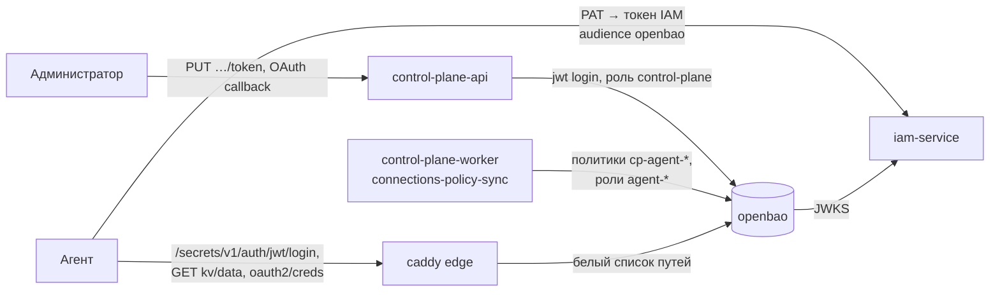

# Хранилище секретов

Как устроено и как эксплуатируется хранилище секретов платформы — OpenBao в
профиле `core`: развёртывание, распечатывание, служебные токены, отзыв
root-токена, страж политик, бэкап и восстановление, KMS-seal для промышленной
установки. Статья для инженера эксплуатации и ответственного за безопасность.

Обоснование — TAI-ADR-0061 (подключения и хранилище) и CP-ADR-0079 (подключения
в ядре); место хранения секретов задаёт статья VI конституции разработки.

## Два класса секретов

| Класс | Что это | Где живёт |
|---|---|---|
| Инфраструктурные секреты платформы | Пароли баз, ключи подписи, bootstrap-токены, учётные данные service accounts компонентов платформы — всё, без чего платформа и само хранилище не стартуют | `.env` и `secrets/` на хосте (см. [Секреты и ротация](secrets.md)) |
| Секреты подключений и агентов | Токены и ключи внешних систем ([подключения](../control-plane/connections.md)), секреты агентов реестра по имени | Хранилище секретов (эта статья) |

Граница — по владельцу credential: у компонента платформы это инфраструктура, у
агента реестра — второй класс, даже если агент нигде не размещается. Хранилище
не может зависеть от самого себя, поэтому его собственный ключ распечатывания и
root-токен — инфраструктурные секреты в `secrets/`.

Ядро хранит только сведения о подключении и ссылку `secretRef`; значение проходит
через ядро транзитом и не попадает ни в базу, ни в журнал событий, ни в логи.
Агент читает свой материал сам, напрямую из хранилища, своим токеном.

## Как устроено



| Компонент | Что делает |
|---|---|
| `openbao` | OpenBao 2.6.3 с плагином `openbao-plugin-secrets-oauthapp` v3.4.1 (образ `deploy/openbao`). Хранение — raft на одном узле, том `openbao_data`. Портов на хост нет, веб-интерфейс выключен |
| `openbao-bootstrap` | Одноразовый идемпотентный контейнер настройки (`deploy/openbao/bootstrap.py`): init, движки, плагин, метод `jwt`, политика и роль ядра, служебные токены, страж политик |
| Движок `kv/` | kv-v2 с `max_versions=1`: ключи подключений (`kv/data/tenants/<t>/connections/<ключ>`), секреты агентов (`kv/data/tenants/<t>/agents/<агент>/<имя>`), учётные данные OAuth-приложений типов (`kv/data/platform/oauth-apps/<тип>`) |
| Движок `oauth2/` | Плагин `oauthapp`: сервер OAuth подключения и его токены (`oauth2/creds/tenants/<t>/connections/<ключ>`). Плагин сам обновляет access token по refresh token, в том числе одноразовому |
| Метод `jwt/` | Вход токеном IAM: JWKS и issuer IAM, срок токенов хранилища 5 мин, потолок 1 ч |
| Журнал аудита | Устройство `file` объявлено в `config.hcl`; файл `/openbao/logs/audit.log` на томе `openbao_audit`, значения секретов — HMAC |
| Edge `/secrets/*` | Caddy пропускает к хранилищу только вход и чтение секретов tenant'ов (см. [ниже](#perimeter)) |

### Кто и как входит

| Кто | Роль `jwt` | Политика | Что может |
|---|---|---|---|
| Ядро (service account `control-plane` в IAM) | `control-plane`, только из сети compose (`token_bound_cidrs`), токен 15 мин | `control-plane` (`deploy/openbao/policies/control-plane.hcl`) | Писать и удалять материал подключений и секреты агентов, учётные данные OAuth-приложений; вести политики `cp-agent-*` и роли `agent-*`. `sys/*` кроме этого — закрыт |
| Агент реестра | `agent-<principal>` — заводит ядро | `cp-agent-<principal>` — заводит ядро | Только `read` своих подключений (`spec.connections`) и своих секретов, токен 5 мин |
| Бэкап | — (периодический токен) | `backup` | Только снимок raft |
| Страж политик | — (периодический токен) | `policy-guard` | Только чтение `cp-agent-*` и `agent-*` |

Политики и роли агентов сводит воркер ядра `connections-policy-sync` (см.
[Подключения](../control-plane/connections.md#policy-sync)). Root-токен ядру не
выдаётся: метод `jwt` root не создаёт.

!!! warning "Ядро — источник политик агентов"
    Содержимое политик `cp-agent-*` и параметры ролей `agent-*` ACL хранилища не
    ограничивает. Компрометация service account'а ядра равна компрометации
    конфигурации хранилища (но не root-доступу). Поэтому есть [страж
    политик](#policy-guard), который сверяет их с шаблоном.

## Развёртывание

Хранилище входит в профиль `core` и поднимается вместе с ядром:

```bash
make secrets                 # в том числе secrets/openbao-unseal.key, если его нет
make up                      # openbao и openbao-bootstrap — в профиле core
make bootstrap               # service account ядра → роль control-plane в хранилище
```

`make bootstrap` пишет субъект роли ядра в `secrets/openbao/control-plane-subject.json`
и сам перезапускает `openbao-bootstrap`: пока файла нет, шаг роли ядра
пропускается.

### Переменные `.env` { #env }

| Переменная | По умолчанию | Назначение |
|---|---|---|
| `OPENBAO_UNSEAL_KEY_FILE` | `./secrets/openbao-unseal.key` | Ключ распечатывания (seal `static`): 64 hex-символа без перевода строки, `0600`, на Linux владелец uid `10001`. `make secrets` создаёт его и никогда не перезаписывает |
| `OPENBAO_UNSEAL_KEY_ID` | `unseal-1` | Идентификатор ключа (`BAO_STATIC_SEAL_CURRENT_KEY_ID`); меняется только при ротации ключа |
| `OPENBAO_MEM_LIMIT` | `256m` | Лимит памяти контейнера; им же задаётся `memswap_limit` — swap контейнеру закрыт |
| `OPENBAO_CORE_CIDRS` | пусто | Откуда ядру можно входить в хранилище (`token_bound_cidrs` роли `control-plane`). Пусто — подсеть сети compose без её шлюзов; задано — берётся как есть |
| `VOLUME_OPENBAO_DATA`, `VOLUME_OPENBAO_AUDIT` | `<проект>_openbao_data`, `<проект>_openbao_audit` | Имена томов данных raft и журнала аудита |

Ядро настраивается переменными `CP_SECRET_STORE_*` (адрес, audience, роль) — см.
[Подключения → Конфигурация](../control-plane/connections.md#configuration).

!!! warning "Адрес хранилища ядру задаётся отдельно"
    В `deploy/local/compose.yml` у процессов ядра нет `CP_SECRET_STORE_URL`: без него маршруты,
    которым нужно хранилище, отвечают `503 secret_store_unavailable`
    (`details.reason: not_configured`). Задайте его, а также
    `CP_OAUTH_REDIRECT_URI` и `CP_CONNECTIONS_RETURN_URL` для OAuth, в
    `compose.override.yml` для `control-plane-api` и `control-plane-worker`:

    ```yaml
    services:
      control-plane-api:
        environment:
          CP_SECRET_STORE_URL: http://openbao:8200
          CP_OAUTH_REDIRECT_URI: https://platform.example.com/api/v1/connections:callback
          CP_CONNECTIONS_RETURN_URL: https://intranet.example.com/connection-done  # своя страница
      control-plane-worker:
        environment:
          CP_SECRET_STORE_URL: http://openbao:8200
    ```

### Контейнер `openbao`

- Корень только для чтения (`read_only`). Запись — тома `openbao_data` и
  `openbao_audit` и tmpfs `/tmp` (16 МБ, `noexec`; там сокеты плагина).
- Конфиг `/openbao/config/config.hcl`, каталог плагинов и сам плагин принадлежат
  root и только читаются: процесс под uid `10001` не перепишет ни конфиг, ни бинарь.
- `cap_drop: [ALL]`, `no-new-privileges`. Healthcheck — `bao status` (код 0 —
  распечатано).
- Версии OpenBao и плагина закреплены в `deploy/openbao/Dockerfile`: образ — тегом и
  digest, плагин — версией, sha256 архива и sha256 бинаря. Тем же sha256 bootstrap
  регистрирует плагин в каталоге.

!!! danger "mlock нет — закройте swap"
    В OpenBao 2.x mlock не используется, и страницы памяти с расшифрованными
    секретами и ключами могут уйти в swap хоста. Поэтому `memswap_limit` равен
    `mem_limit`. Это действует, только если ядро Linux учитывает swap в cgroup:
    иначе Docker пишет `Your kernel does not support swap limit capabilities`, и
    лимит молча не работает. Проверьте `docker inspect` контейнера и
    `memory.swap.max` его cgroup. Без такого учёта — хост без swap или
    зашифрованный swap.

### Права каталога `secrets/openbao/` на Linux

`openbao-bootstrap` работает под uid `10001` и видит только `secrets/openbao/`.
Каталог, которого нет до первого `up`, docker создаст под root, и bootstrap не
сможет в него писать. Создайте его заранее:

```bash
install -d -m 0700 -o 10001 -g 10001 secrets/openbao
sudo chown 10001:10001 secrets/openbao-unseal.key && chmod 600 secrets/openbao-unseal.key
```

`deploy/bootstrap.py`, запущенный от root, сам отдаёт uid `10001` каталог и файл
`control-plane-subject.json`; запущенный не от root — печатает команду. Запись в
каталог bootstrap проверяет **до** `sys/init`: init выдаёт root-токен и ключ
восстановления один раз, и без проверки они были бы потеряны. На macOS (Docker
Desktop) владелец не важен.

### Что делает `openbao-bootstrap`

Запускается на каждом `up` и после `make bootstrap`; повторный прогон ничего не
меняет и пишет `openbao-bootstrap: готово, изменений 0`.

1. `sys/init` — один раз. Root-токен и ключ восстановления →
   `secrets/openbao/root-token` и `secrets/openbao/recovery-key` (`0600`). Если том
   пересоздан, прежние файлы уходят в `secrets/openbao/stale-<время>/`.
2. Ждёт распечатывания (ключ — `secrets/openbao-unseal.key`).
3. Плагин `oauthapp` в каталоге (sha256 бинаря из Dockerfile); при смене версии —
   перерегистрация и перезагрузка движка.
4. Движки `kv/` (kv-v2, `max_versions=1`) и `oauth2/` (oauthapp).
5. Проверка журнала аудита.
6. Метод `jwt/`: JWKS и issuer IAM (`${TAIMEN_PUBLIC_URL}/iam`).
7. Политика `control-plane` и роль `control-plane` (субъект — service account ядра в
   IAM, audience `openbao`, без default-политики, токен 15 мин, вход только с
   адресов `token_bound_cidrs`).
8. Служебные токены `backup` и `policy-guard` → `secrets/openbao/backup-token`,
   `secrets/openbao/guard-token` (`0600`): периодические orphan-токены без
   default-политики, срок 30 суток. Прогон `openbao-bootstrap` продлевает
   токен, только если ему осталось меньше 15 суток; использование токена срок не
   продлевает. `backup` продлевается ещё и явным `bao token renew` в команде
   [бэкапа](#backup), `policy-guard` — только прогоном bootstrap.
9. [Страж политик](#policy-guard) ядра.
10. Проверка, что неаутентифицированные `sys/generate-root/*` закрыты.

Секреты bootstrap не печатает: в выводе только пути и имена.

Проверка после развёртывания:

```bash
tools/compose exec openbao bao status                    # Sealed false, Seal Type static
tools/compose run --rm --no-deps openbao-bootstrap       # «изменений 0»
```

### Сеть ядра: `token_bound_cidrs`

Вход ролью `control-plane` и её токен действуют только с адресов сети compose.
Без `OPENBAO_CORE_CIDRS` bootstrap берёт подсеть своего интерфейса **за вычетом
шлюзов сетей**: запросы с самого хоста на опубликованный порт edge (hairpin NAT)
приходят в Caddy с адреса шлюза, и с подсетью целиком хранилище приняло бы их за
ядро. Если шлюз оказался в заданной `OPENBAO_CORE_CIDRS`, bootstrap
предупреждает, но значение не меняет. Не определилась сеть — bootstrap падает, а
не заводит роль без ограничения.

Адрес клиента за edge хранилище берёт из `X-Forwarded-For` (листенер доверяет
частным сетям, Caddy подставленный снаружи заголовок заменяет), поэтому вход ролью
ядра через `/secrets/*` снаружи и с хоста получает отказ. Сеть compose
пересоздана (новая подсеть) — повторите `openbao-bootstrap`.

## Распечатывание { #unseal }

OpenBao хранит данные зашифрованными ключом барьера; ключ барьера защищён seal.
В поставке — seal `static`: 32-байтовый ключ из `secrets/openbao-unseal.key`
(docker secret `openbao_unseal_key`). После перезапуска контейнера хранилище
распечатывается само, человек не нужен.

```hcl
# deploy/openbao/config.hcl
seal "static" {
  current_key_id = "unseal-1"
  current_key    = "file:///run/secrets/openbao_unseal_key"
}
```

| Ситуация | Что видно | Что делать |
|---|---|---|
| Ключ с переводом строки | OpenBao не стартует: `unknown encoding for AES-256 key` | Перезаписать файл без `\n` (`printf '%s' …`) |
| Файл ключа не читается uid `10001` | Контейнер перезапускается, в журнале — ошибка чтения seal | `chown 10001:10001`, `chmod 600` |
| Ключ потерян | Данные не прочитать | Восстановления нет: хранилище создаётся заново, подключения переподключаются, секреты агентов задаются снова |
| Хранилище запечатано | Ядро и агенты получают `503 secret_store_unavailable` (`sealed_or_standby` у SDK) | Проверить `bao status`, ключ и журнал контейнера |

!!! danger "Ключ распечатывания — единственный путь к данным"
    Потеря ключа — потеря хранилища. Держите копию ключа вне хоста, **отдельно
    от снимков** (см. [Бэкап](#backup)): вместе они открывают всё хранилище.

Ротация ключа `static` — пара `previous_key` и `previous_key_id` в блоке seal
(прежний ключ — для чтения, новый — текущий) и новый `OPENBAO_UNSEAL_KEY_ID`.
Прежний ключ — второй файл, смонтированный в контейнер отдельным секретом compose
(например, `previous_key = "file:///run/secrets/openbao_unseal_key_previous"`):
в `deploy/local/compose.yml` такого секрета нет, его добавляют в `compose.override.yml` на
время ротации. Конфиг в образе, поэтому после правки — `tools/compose build
openbao && tools/compose up -d openbao`.

### KMS-seal для промышленной установки { #kms-seal }

Seal `static` держит ключ на том же хосте, что и данные: кто получил диск хоста
целиком, получил и хранилище. Для промышленной установки замените его seal
внешнего KMS — облачного KMS или HSM, который поддерживает закреплённая версия
OpenBao. Тогда ключ барьера расшифровывает внешний сервис, ключ не покидает KMS,
а доступ к нему отзывается на стороне KMS.

Порядок перехода:

1. Заведите ключ в KMS и учётную запись хоста с правом только шифровать и
   расшифровывать этим ключом.
2. Сделайте [снимок](#backup) и сохраните ключ `static`.
3. В `deploy/openbao/config.hcl` добавьте блок seal KMS, а блоку `static` поставьте
   `disabled = "true"` — так OpenBao при старте мигрирует seal со старого на новый.
4. Пересоберите и перезапустите `openbao`, затем завершите миграцию ключом
   восстановления: `bao operator unseal -migrate` (ключ — из
   `secrets/openbao/recovery-key`, на время процедуры возвращённый из офлайна).
5. Проверьте `bao status` (тип seal — нового KMS), уберите блок `static` из
   конфига, пересоберите образ. Ключ `static` и прежние снимки храните до
   первого нового снимка.

!!! warning "Сверяйте с документацией OpenBao"
    Имена блоков seal, их параметры и ход миграции зависят от версии OpenBao и
    вида KMS. Проверьте процедуру на копии тома, прежде чем выполнять её на
    рабочем хранилище. Учётные данные KMS для хоста — инфраструктурный секрет.

## Отзыв root-токена и ключ восстановления { #root-token }

Root-токен нужен bootstrap, пока конфигурация хранилища меняется. Когда роль ядра
заведена и стабильна, отзовите его:

```bash
tools/compose run --rm --no-deps openbao-bootstrap revoke-root
```

Токен отзывается, файл `secrets/openbao/root-token` удаляется. Сразу после этого
**унесите ключ восстановления `secrets/openbao/recovery-key` с хоста в офлайн**
(менеджер паролей владельца, сейф) и удалите с диска: с ним и доступом к API
любой выпустит новый root. Пока ключ на хосте, а root отозван, bootstrap об этом
напоминает.

После отзыва `openbao-bootstrap` проверяет распечатывание, продлевает служебные
токены и запускает стража токеном `policy-guard`, но конфигурацию не сверяет и
пишет об этом.

### Новый root-токен: `generate-root`

Если конфигурацию снова нужно менять (новая политика, смена `OPENBAO_CORE_CIDRS`,
новая версия плагина), root выпускается ключом восстановления. `bao operator
generate-root` в OpenBao 2.6 ходит в аутентифицированные `sys/generate-root-token/*`
и без токена бесполезен. Поэтому процедура идёт через прежние
`sys/generate-root/*`, открытые только на её время:

1. В `deploy/openbao/config.hcl` — `disable_unauthed_generate_root_endpoints = false`,
   затем `tools/compose build openbao && tools/compose up -d openbao`.
2. Верните ключ восстановления из офлайна в `secrets/openbao/recovery-key` (`0600`,
   на Linux владелец `10001`).
3. `tools/compose run --rm --no-deps openbao-bootstrap generate-root` — токен
   расшифровывается внутри (XOR с OTP) и ложится в `secrets/openbao/root-token`
   (`0600`), в вывод не попадает. Незавершённая чужая попытка отменяется, своя —
   отменяется на любом выходе, в том числе при ошибке. Неверный ключ — понятный
   отказ.
4. **Сразу закройте эндпоинты**: параметр — обратно `true`, `tools/compose build
   openbao && tools/compose up -d openbao` (root-токен перезапуск переживает).
5. `tools/compose run --rm --no-deps openbao-bootstrap` — правка конфигурации,
   затем `revoke-root`; ключ восстановления — снова в офлайн.

Пока эндпоинты открыты, и `openbao-bootstrap`, и `check-agents` громко
предупреждают и выходят с кодом `4`: без токена попытку может начать или
отменить кто угодно.

## Страж политик { #policy-guard }

Страж сверяет каждую политику `cp-agent-*` и роль `agent-*`, которые пишет ядро, с
шаблоном CP-ADR-0079 и **только сообщает** о расхождении, ничего не исправляя:
источник политик — ядро, и расхождение — повод разбираться. Он обнаруживает
расширение, но не предотвращает его: окно — до следующего запуска.

Шаблон:

- **Политика** — только `capabilities = ["read"]` и только пути
  `oauth2/creds/tenants/<t>/connections/<ключ>`,
  `kv/data/tenants/<t>/connections/<ключ>` и `kv/data/tenants/<t>/agents/<агент>/*`
  (или `/<имя>`) одного tenant'а и одного агента. Сегменты — буквальные, без `*`,
  `+`, `..` и шаблонов `{{…}}`; других параметров пути нет. Политика разбирается так,
  как её применит OpenBao: повтор ключа в JSON или `capabilities` дважды в HCL —
  расхождение, ошибка разбора — тоже.
- **Роль** — `role_type=jwt`, `user_claim=sub`, непустой `bound_subject`,
  `bound_audiences=["openbao"]`, `bound_claims_type=string`,
  `bound_claims.principal_type=agent` и ровно один `tenant_id`,
  `token_policies=["cp-agent-<тот же id>"]`, `token_max_ttl` от 1 до 300 с,
  `token_ttl` и `token_explicit_max_ttl` не больше 300 с, допуски по времени не
  больше 60 с, без `token_period`, `token_policies_template_claims` и
  `groups_claim`.

Страж запускается в конце каждого `openbao-bootstrap` (токеном root или, после
отзыва, `policy-guard`) и отдельно:

```bash
tools/compose run --rm --no-deps openbao-bootstrap check-agents
```

| Код | Значение |
|---|---|
| `0` | Все политики и роли агентов — по шаблону |
| `2` | Нечем проверить: нет ни root-токена, ни `guard-token` |
| `3` | Расхождение; строки вида `!! страж: политика cp-agent-…: путь 'sys/*' вне шаблона …` |
| `4` | Открыты неаутентифицированные `sys/generate-root/*` — закройте их |

Запускайте его по расписанию (раз в 5–15 минут) с оповещением по ненулевому
коду. `check-agents` только проверяет `guard-token` (`lookup-self`) и не продлевает
его: продлевает прогон `openbao-bootstrap`, когда токену осталось меньше половины
срока (15 суток). Запускайте `openbao-bootstrap` хотя бы раз в две недели, иначе
через 30 суток `guard-token` истечёт и `check-agents` выйдет с кодом `2`.

## Периметр { #perimeter }

Caddy `/secrets/*` → `openbao:8200` (префикс срезается) пропускает ровно три вида
запросов, всё прочее — `404`:

| Запрос | Кто |
|---|---|
| `POST /secrets/v1/auth/jwt/login` | Вход агента токеном IAM audience `openbao` |
| `GET /secrets/v1/kv/data/tenants/…` | Чтение ключа подключения или секрета агента |
| `GET /secrets/v1/oauth2/creds/tenants/…` | Чтение токена OAuth-подключения |

- `sys/*`, `auth/*/role`, запись, `kv/metadata`, `kv/data/platform/*` и UI снаружи
  недоступны; параметр `version` (прежние версии kv-v2) — `404`, остальной query
  срезается.
- Заголовки `X-Vault-Namespace`, `X-Vault-Wrap-*`, `X-Vault-Policy-Override` и
  `X-HTTP-Method-Override` снаружи не принимаются.
- Пути сравниваются с учётом регистра; сегменты без ведущей точки.
- В журнал Caddy не пишется `X-Vault-Token` — ни в журнал сайта, ни в журнал
  ошибок.

Проверка снаружи:

```bash
curl -s -o /dev/null -w '%{http_code}\n' https://platform.example.com/secrets/v1/sys/health          # 404
curl -s -o /dev/null -w '%{http_code}\n' https://platform.example.com/secrets/v1/sys/policies/acl    # 404
```

Вход агента `POST /secrets/v1/auth/jwt/login` с `{"role": "agent-<principal>",
"jwt": "<токен IAM>"}`: токен audience `openbao` — `200`, другого audience —
`400` или `403`.

### Audience `openbao` в IAM

`make bootstrap` заводит в IAM audience `openbao` со scope `secrets:read` (OpenBao
scope не проверяет — права задают его политики) и выдаёт его service account
ядра.
Повторный `make bootstrap` доводит audiences до реестра: недостающий audience
заводится, недостающие scope дописываются (лишние снимает только
`--prune-scopes`), а audiences и потолок service account'ов ядра и других
служб обновляются `PATCH …/service-accounts/{clientId}` без смены
секрета.

## Бэкап и восстановление { #backup }

Снимок raft снимается токеном `backup` (политика `backup`: только
`sys/storage/raft/snapshot`, root не нужен). Токен передаётся на stdin, не в
аргументах команды; `bao token renew` продлевает его, поэтому регулярный бэкап сам
держит токен живым:

```bash
tools/compose exec -T openbao sh -c 'read -r BAO_TOKEN; export BAO_TOKEN;
  bao token renew >/dev/null && bao operator raft snapshot save /openbao/data/snap' \
  < secrets/openbao/backup-token
tools/compose cp openbao:/openbao/data/snap backups/openbao-$(date +%Y%m%d-%H%M%S).snap
tools/compose exec openbao rm /openbao/data/snap
```

Расписание — cron на хосте, например раз в сутки: токен живёт 30 суток и
продлевается каждым запуском.

!!! danger "Снимок и ключ распечатывания — раздельно"
    Снимок зашифрован ключом барьера, который защищён seal: без
    `secrets/openbao-unseal.key` снимок не прочитать, а вместе они — всё хранилище.
    Снимки уходят с хоста в хранилище бэкапов, копия ключа распечатывания — в
    другое место (офлайн владельца, вместе с ключом восстановления, но не с
    архивом снимков). В один архив и один бакет их не кладут.

Восстановление:

1. Поднимите `openbao` с **тем же** ключом распечатывания и прежним
   `OPENBAO_UNSEAL_KEY_ID`: без них снимок не расшифровать.
2. Нужен действующий root-токен текущего хранилища: на новом томе его выдаёт
   `sys/init` при первом `openbao-bootstrap`, на прежнем — [`generate-root`](#root-token).
3. Восстановите снимок:

    ```bash
    tools/compose cp backups/openbao-<время>.snap openbao:/openbao/data/snap
    tools/compose exec -T openbao sh -c 'read -r BAO_TOKEN; export BAO_TOKEN;
      bao operator raft snapshot restore -force /openbao/data/snap' \
      < secrets/openbao/root-token
    tools/compose exec openbao rm /openbao/data/snap
    ```

4. После восстановления действуют токены и ключи на момент снимка: root-токен,
   которым восстанавливали, больше не принимается; ключ восстановления — тот, что
   был у хранилища снимка; служебные токены `backup` и `policy-guard` — из снимка.
   Запустите `openbao-bootstrap` и `check-agents`; если конфигурацию нужно
   поправить или служебные токены истекли — `generate-root` ключом
   восстановления хранилища снимка, `openbao-bootstrap`, `revoke-root`.

!!! note "OAuth-подключения после восстановления"
    У провайдеров с одноразовым refresh token токен из снимка может быть уже
    недействителен: такое подключение агент увидит `expired`, и его нужно
    подключить заново.

### Журнал аудита

Каждый запрос к хранилищу, в том числе чтение материала подключения, пишется в
`/openbao/logs/audit.log` (том `openbao_audit`) с HMAC вместо значений. Ротация —
внешняя: logrotate с `copytruncate` по тому или `tools/compose kill -s HUP
openbao` — устройство `file` переоткрывает файл.

## Типичные проблемы

| Симптом | Причина | Решение |
|---|---|---|
| `openbao-bootstrap` падает до init с отказом записи | Каталог `secrets/openbao/` принадлежит root (Linux) | `install -d -m 0700 -o 10001 -g 10001 secrets/openbao` и повторить `up` |
| Роль `control-plane` не заводится | Нет `secrets/openbao/control-plane-subject.json` | `make bootstrap` (пишет файл и перезапускает `openbao-bootstrap`) |
| Ядро отвечает `503 secret_store_unavailable` с `reason: not_configured` | У ядра не задан `CP_SECRET_STORE_URL` | Задать в `compose.override.yml` (см. [выше](#env)) |
| Ядро получает отказ входа после смены сети compose | Подсеть сменилась, `token_bound_cidrs` прежний | Повторить `openbao-bootstrap` (нужен root — [`generate-root`](#root-token)) |
| Бэкап отвечает `403` | Токен `backup` истёк (не продлевался 30 суток) | Выпустить заново: root-токен, затем `openbao-bootstrap` |
| `check-agents` выходит с кодом `2` | Root отозван, `guard-token` отсутствует или истёк | Root через `generate-root`, затем `openbao-bootstrap` выпустит токен |
| `check-agents` выходит с кодом `3` | Политика или роль агента вне шаблона | Разобрать вывод стража; источник — ядро: проверить журнал событий и учётку ядра |

## См. также

- [Подключения](../control-plane/connections.md)
- [Секреты и ротация](secrets.md)
- [Резервное копирование](backup.md)
- [Периметр и TLS](edge-and-tls.md)
- [Токены, audiences, scopes](../iam/tokens.md)
