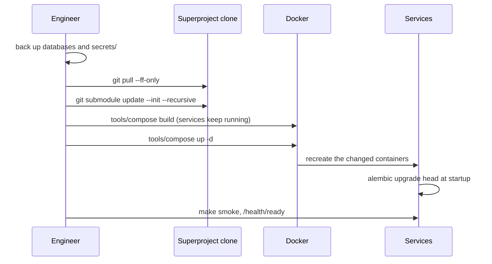

# Upgrades and migrations

How to roll out a new version of the platform: the standard procedure, who
applies schema migrations and when, how to reduce downtime, and how to roll
back. This article is for the engineer who deploys to a production
installation.

## What a release is

A platform release is a **superproject commit**. It pins the revisions of
all components with submodule pointers, along with `deploy/local/compose.yml`,
`.env.example`, `deploy/`, and catalog packages. Upgrading an installation
means moving the superproject clone to the new commit, updating submodules
to the pinned revisions, rebuilding images, and recreating the containers
that changed.



## Standard rollout


```bash
cd /opt/taimen/src
PROFILES="--profile core --profile edge"   # your installation's profiles

# 0. Backup (mandatory before a release with migrations)
#    see "Backup"

# 1. Code
git fetch && git log --oneline HEAD..origin/main       # what is coming in
git pull --ff-only
git submodule update --init --recursive
git submodule status                                    # no line with "+" or "-"

# 2. Build ahead of time: running containers are not touched
tools/compose $PROFILES build

# 3. Switchover: only containers with a new image or configuration are recreated
tools/compose $PROFILES up -d

# 4. Verification
make smoke
curl -fsS http://127.0.0.1:18000/health/ready           # {"status":"ready","revision":"..."}
tools/compose --profile "*" ps
```

!!! tip "Build first, then up"
    `make up` runs `up -d --build`, that is, it builds images right at the
    moment of the switchover. On a weak machine the build takes minutes, and
    all that time some services may already be recreated while others are
    not yet. Separate `build` and `up -d` steps shrink the switchover window
    to seconds: recreating the API container with a ready image takes about
    5–10 seconds, and a live executor's claim (`CP_CLAIM_TTL_SECONDS=300` by
    default) survives that.

!!! warning "Run commands from the clone root"
    `docker compose` reads `.env` from the project directory. If you run
    compose from another directory or with `-f`, pass
    `--env-file /opt/taimen/src/.env`; otherwise interpolation fails with
    `required variable CP_POSTGRES_PASSWORD is missing a value`.

## One Control Plane image for three processes

`control-plane-api`, `control-plane-worker`, and `context-adapter` run from
**one** image, `${IMAGE_PREFIX}/control-plane:${IMAGE_TAG}`. Only
`control-plane-api` has a `build:` section; the worker and the adapter do
not.

Consequences:

- `tools/compose build control-plane-worker` builds nothing. Build
  `control-plane-api` or the whole `core` profile.
- After the build, recreate **all three** containers. `tools/compose up -d`
  without service names does this itself (all three have a new image). If
  you list services explicitly, list all three:

  ```bash
  tools/compose up -d control-plane-api control-plane-worker context-adapter
  ```

- The adapter service name is `context-adapter`, without the
  `control-plane-` prefix. A wrong name fails the whole `up` command with
  `no such service`, and none of the listed services starts.

## Schema migrations

There is no separate migration step: every service with its own database
brings the schema to head at startup.

| Service | When migrations are applied | Mechanism |
|---|---|---|
| `iam-service` | At container startup | `alembic upgrade head && uvicorn …` |
| `control-plane-api` | At container startup | `alembic upgrade head && uvicorn …` |
| `control-plane-worker`, `context-adapter` | Do not apply them | Start after `control-plane-api` becomes healthy |
| `memory-service` | At startup, idempotently | The service creates missing tables and indexes; migrations are additive |

Control Plane `GET /health/ready` compares the database revision with the
image's head and returns `503` with `reason: migrations_pending` while they
differ, so the healthcheck does not let the worker and the adapter reach
the old schema:

```json
{"status": "unavailable", "reason": "migrations_pending",
 "dbRevision": "<old revision>", "headRevision": "<new revision>"}
```

Check revisions manually:

```bash
tools/compose exec control-plane-db psql -U control_plane -d control_plane \
  -c 'SELECT version_num FROM alembic_version'
tools/compose exec iam-db psql -U iam -d iam -c 'SELECT version_num FROM alembic_version'
tools/compose run --rm --no-deps control-plane-api alembic heads
```

!!! warning "Indexes are not built CONCURRENTLY"
    Control Plane migrations create indexes with a plain `CREATE INDEX`,
    which blocks writes to the table while it is built. On a large database,
    roll out a release with new indexes in a maintenance window.

### A release with Control Plane migrations

For a release that changes the schema of the log or cursors, the
conservative order is as follows (the memory delivery adapter is a
singleton, so it is better to stop it before the schema changes):

```bash
tools/compose $PROFILES build
tools/compose stop context-adapter
tools/compose up -d control-plane-api          # applies migrations
curl -fsS http://127.0.0.1:18000/health/ready    # wait for 200
tools/compose up -d control-plane-worker context-adapter
```

## After the upgrade

| What to check | When it is needed |
|---|---|
| Rerun `deploy/bootstrap.py` | If the release changed `AUDIENCES`, service account ceilings, default agent permissions, or catalog packages. The script is idempotent: it brings the audiences' `allowedScopes` in line with the registry (`PATCH`), and if a ceiling changed it reissues the core service account and revokes the previous one |
| Restart the core after bootstrap | If bootstrap reissued `secrets/control-plane-iam.env`: `tools/compose up -d control-plane-api control-plane-worker context-adapter` |
| Catalog plan | `package-sdk plan --install deploy/packages.yaml --server https://platform.example.com --out plan.json` shows catalog differences before applying them (token in `CP_TOKEN`) |
| Keycloak realm | Edits to the `platform-realm.json` template **do not reach** an existing realm: `--import-realm` imports only on the first start. Make changes through the Admin API or the `deploy/keycloak/` scripts |
| Runner host | Upgrade separately; see below |
| Operator workstations | Reinstall the `control-plane` package (MCP plugin, CLI) and restart the session: new `cp_*` tools appear only in a new session |

## Upgrading the runner host

The executor is not upgraded together with the platform host.


=== "Container"

    Rebuild the executor image from the updated superproject tree and
    recreate the container (`docker compose -f <executor compose file>
    up -d --build`). Update the bare repository mirrors (`git fetch`) before
    the container starts or at startup.

=== "systemd"

    Do everything as the `runner` user; otherwise root-owned files appear in
    the directories and the next installation fails with
    `Permission denied`:

    ```bash
    sudo -u runner git -C <runner-root>/src/services/control-plane pull --ff-only
    sudo -u runner git -C <runner-root>/src/sdk/platform-auth-sdk pull --ff-only
    sudo -u runner env HOME=/home/runner \
      UV_TOOL_DIR=<runner-root>/tools UV_TOOL_BIN_DIR=<runner-root>/bin \
      /home/runner/.local/bin/uv tool install --reinstall <runner-root>/src/services/control-plane
    sudo -u runner git -C <runner-root>/<repo>.git fetch origin '+refs/heads/*:refs/heads/*'
    sudo systemctl restart <executor units>
    ```

    `uv tool install` as root installs the package into
    `/root/.local/share/uv/tools`, bypassing the services, and they silently
    stay on the old code. Update both places: `src/` (what the daemon is
    built from) and the bare mirror (what task working copies are made
    from). The clones in `src/` follow the delivery layout:
    `src/services/control-plane` and its path dependency
    `src/sdk/platform-auth-sdk`.

Stopping the executor is safe at any moment: at the next start the daemon
finds its orphaned run and closes it with `failure_reason=restart_recovery`;
the task returns to the queue, and the working copy is preserved.

## Release rollback

### Fast rollback without migrations

If the new release did not change the schema (the Alembic revisions before
and after are the same), rolling back means moving back to the previous
commit:

```bash
git checkout <previous superproject commit>
git submodule update --init --recursive
tools/compose $PROFILES build
tools/compose $PROFILES up -d
```

!!! tip "Keep previous images"
    By default all images are tagged `local`, and a new build overwrites the
    old one. If you set `IMAGE_TAG=<short commit hash>` in `.env` before
    building, the image of the previous release stays on the host, and
    rolling back comes down to restoring the previous `IMAGE_TAG` and
    running `tools/compose up -d`, without a rebuild.

### Rollback with migrations

Alembic can roll back the schema only with code that **knows** the new
revision, so the order is strict:

1. Determine the revision to roll back to (the head of the previous
   release): from the deployment log (see below) or with `alembic heads`
   run in the previous release's image.
2. Run the downgrade with the **new** image:

    ```bash
    tools/compose stop control-plane-worker context-adapter control-plane-api
    tools/compose run --rm --no-deps control-plane-api alembic downgrade <revision>
    ```

3. Switch the code and images to the previous release (as in the fast
   rollback).
4. Start the services and check `/health/ready`.

!!! danger "If a downgrade is impossible"
    Not every migration is reversible without loss. If the downgrade fails,
    restore the database from the backup taken before the release (see
    [Backup](backup.md)) and start the previous release on top of the
    restored database. After a restore from a dump, Control Plane delivers
    events to memory again; this is safe, because memory deduplicates them
    by event identifier.

## Deployment log

For each deployment, record: the superproject commit, `IMAGE_TAG`, the
Alembic revisions of `control-plane` and `iam-service` before and after, the
switchover time, and the `make smoke` result. You need this data for
rollbacks and incident analysis.

## See also

- [Backup](backup.md)
- [Monitoring and health](monitoring.md)
- [Emergency procedures](emergency.md)
- [Installing executors](../runner/installation.md)
- [Installation and startup: troubleshooting](../troubleshooting/startup.md)
