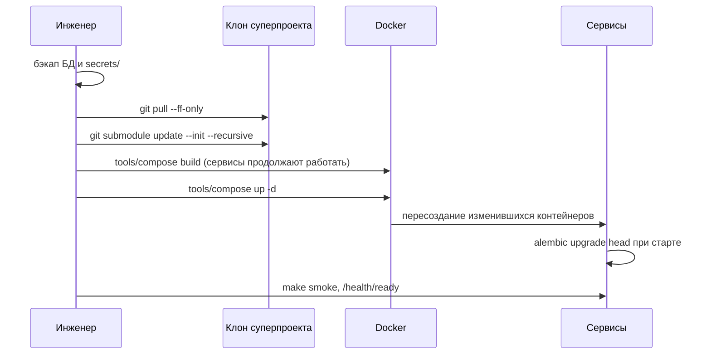

# Обновление и миграции

Как выкатить новую версию платформы: штатная процедура, кто и когда применяет
миграции схем, как сократить простой, как откатиться. Статья для инженера,
который выполняет выкладку на промышленную установку.

## Что такое релиз

Релиз платформы — **коммит суперпроекта**. Он закрепляет ревизии всех
компонентов указателями сабмодулей, а заодно `deploy/local/compose.yml`, `.env.example`,
`deploy/` и пакеты каталога. Обновить установку — значит перевести клон
суперпроекта на новый коммит, подтянуть сабмодули на закреплённые ревизии,
пересобрать образы и пересоздать изменившиеся контейнеры.



## Штатная выкладка


```bash
cd /opt/taimen/src
PROFILES="--profile core --profile edge"   # профили вашей установки

# 0. Бэкап (обязательно перед релизом с миграциями)
#    см. «Резервное копирование»

# 1. Код
git fetch && git log --oneline HEAD..origin/main       # что приезжает
git pull --ff-only
git submodule update --init --recursive
git submodule status                                    # ни одной строки с «+» или «-»

# 2. Сборка заранее: работающие контейнеры не трогаются
tools/compose $PROFILES build

# 3. Переключение: пересоздаются только контейнеры с новым образом или конфигурацией
tools/compose $PROFILES up -d

# 4. Проверка
make smoke
curl -fsS http://127.0.0.1:18000/health/ready           # {"status":"ready","revision":"..."}
tools/compose --profile "*" ps
```

!!! tip "Сначала build, потом up"
    `make up` выполняет `up -d --build`, то есть собирает образы прямо в
    момент переключения. На слабой машине сборка занимает минуты, и всё это
    время часть сервисов может быть пересоздана, а часть — ещё нет. Раздельные
    `build` и `up -d` сокращают окно переключения до секунд: пересоздание
    контейнера API с готовым образом занимает порядка 5–10 секунд, а claim
    живого исполнителя (по умолчанию `CP_CLAIM_TTL_SECONDS=300`) это
    переживает.

!!! warning "Команды — из корня клона"
    `docker compose` читает `.env` из каталога проекта. Если запускаете
    compose из другого каталога или с `-f`, передавайте
    `--env-file /opt/taimen/src/.env`, иначе интерполяция упадёт на
    `required variable CP_POSTGRES_PASSWORD is missing a value`.

## Один образ Control Plane на три процесса

`control-plane-api`, `control-plane-worker` и `context-adapter` запускаются
из **одного** образа `${IMAGE_PREFIX}/control-plane:${IMAGE_TAG}`. Секция
`build:` есть только у `control-plane-api`; у worker и адаптера её нет.

Следствия:

- `tools/compose build control-plane-worker` ничего не собирает. Собирайте
  `control-plane-api` или весь профиль `core`.
- После сборки пересоздайте **все три** контейнера. `tools/compose up -d`
  без имён сервисов сделает это сам (у всех трёх сменился образ). Если
  перечисляете сервисы явно — перечисляйте все три:

  ```bash
  tools/compose up -d control-plane-api control-plane-worker context-adapter
  ```

- Имя сервиса адаптера — `context-adapter`, без префикса `control-plane-`.
  Ошибка в имени роняет всю команду `up` с `no such service`, и не
  поднимается ни один из перечисленных сервисов.

## Миграции схем

Отдельного шага миграции нет: каждый сервис с собственной БД приводит схему
к head при старте.

| Сервис | Когда применяются миграции | Механизм |
|---|---|---|
| `iam-service` | При старте контейнера | `alembic upgrade head && uvicorn …` |
| `control-plane-api` | При старте контейнера | `alembic upgrade head && uvicorn …` |
| `control-plane-worker`, `context-adapter` | Не применяют | Стартуют после того, как `control-plane-api` стал healthy |
| `memory-service` | При старте, идемпотентно | Сервис создаёт недостающие таблицы и индексы; миграции аддитивные. Исключение — установка, где граф ещё в Apache AGE (до v0.2.1): до первого запуска новой версии граф переносится `cb migrate-graph-from-age`, см. [Переход с Apache AGE](../memory/configuration.md#age-migration) |

`GET /health/ready` Control Plane сравнивает ревизию БД с head образа и
отвечает `503` с `reason: migrations_pending`, пока они расходятся — поэтому
healthcheck не пропустит worker и адаптер к старой схеме:

```json
{"status": "unavailable", "reason": "migrations_pending",
 "dbRevision": "<старая ревизия>", "headRevision": "<новая ревизия>"}
```

Проверить ревизии вручную:

```bash
tools/compose exec control-plane-db psql -U control_plane -d control_plane \
  -c 'SELECT version_num FROM alembic_version'
tools/compose exec iam-db psql -U iam -d iam -c 'SELECT version_num FROM alembic_version'
tools/compose run --rm --no-deps control-plane-api alembic heads
```

!!! warning "Индексы строятся не CONCURRENTLY"
    Миграции Control Plane создают индексы обычным `CREATE INDEX`, который
    блокирует запись в таблицу на время построения. На большой базе релиз с
    новыми индексами выкатывайте в окно обслуживания.

### Релиз с миграциями Control Plane

Для релиза, который меняет схему журнала или курсоров, консервативный порядок
такой (адаптер доставки в память — singleton, его лучше остановить до смены
схемы):

```bash
tools/compose $PROFILES build
tools/compose stop context-adapter
tools/compose up -d control-plane-api          # применит миграции
curl -fsS http://127.0.0.1:18000/health/ready    # ждать 200
tools/compose up -d control-plane-worker context-adapter
```

## После обновления

| Что проверить | Когда нужно |
|---|---|
| Повторный прогон `deploy/bootstrap.py` | Если релиз менял `AUDIENCES`, потолки service accounts, права агентов по умолчанию или пакеты каталога. Скрипт идемпотентен: приводит `allowedScopes` audiences к реестру (`PATCH`), при изменившемся потолке перевыпускает service account ядра и отзывает прежний |
| Перезапуск ядра после bootstrap | Если bootstrap перевыпустил `secrets/control-plane-iam.env`: `tools/compose up -d control-plane-api control-plane-worker context-adapter` |
| План каталога | `package-sdk plan --install deploy/packages.yaml --server https://platform.example.com --out plan.json` показывает расхождения каталога до применения (токен — `CP_TOKEN`) |
| Realm Keycloak | Правки шаблона `platform-realm.json` на существующий realm **не попадают**: `--import-realm` импортирует только при первом старте. Изменения вносятся через Admin API или скрипты `deploy/keycloak/` |
| Runner-хост | Обновить отдельно, см. ниже |
| Рабочие места операторов | Переустановить пакет `control-plane` (MCP-плагин, CLI) и перезапустить сессию: новые инструменты `cp_*` появляются только в новой сессии |

## Обновление runner-хоста

Исполнитель не обновляется вместе с хостом платформы.


=== "Контейнер"

    Пересоберите образ исполнителя из обновлённого дерева суперпроекта и
    пересоздайте контейнер (`docker compose -f <compose-файл исполнителя>
    up -d --build`). Bare-зеркала репозиториев обновите (`git fetch`) до
    старта или при старте контейнера.

=== "systemd"

    Всё — от пользователя `runner`, иначе в каталогах появятся файлы
    root, и следующая установка упадёт с `Permission denied`:

    ```bash
    sudo -u runner git -C <runner-root>/src/services/control-plane pull --ff-only
    sudo -u runner git -C <runner-root>/src/sdk/platform-auth-sdk pull --ff-only
    sudo -u runner env HOME=/home/runner \
      UV_TOOL_DIR=<runner-root>/tools UV_TOOL_BIN_DIR=<runner-root>/bin \
      /home/runner/.local/bin/uv tool install --reinstall <runner-root>/src/services/control-plane
    sudo -u runner git -C <runner-root>/<repo>.git fetch origin '+refs/heads/*:refs/heads/*'
    sudo systemctl restart <юниты исполнителей>
    ```

    `uv tool install` от root ставит пакет в `/root/.local/share/uv/tools` —
    мимо сервисов, и они молча остаются на старом коде. Обновлять нужно оба
    места: `src/` (из чего собран демон) и bare-зеркало (из чего делаются
    рабочие копии задач). Клоны в `src/` лежат в раскладке поставки:
    `src/services/control-plane` и его path-зависимость `src/sdk/platform-auth-sdk`.


Остановка исполнителя безопасна в любой момент: при следующем старте демон
находит свой осиротевший run и закрывает его с
`failure_reason=restart_recovery`, задача возвращается в очередь, рабочая
копия сохраняется.

## Откат релиза

### Быстрый откат без миграций

Если новый релиз не менял схему (ревизии Alembic до и после совпадают),
откат — это обратный переход по коммиту:

```bash
git checkout <предыдущий коммит суперпроекта>
git submodule update --init --recursive
tools/compose $PROFILES build
tools/compose $PROFILES up -d
```

!!! tip "Держите предыдущие образы"
    По умолчанию все образы помечаются тегом `local` и новая сборка
    перезаписывает старую. Если перед сборкой выставлять в `.env`
    `IMAGE_TAG=<короткий хэш коммита>`, образ предыдущего релиза остаётся
    на хосте, и откат сводится к возврату прежнего `IMAGE_TAG` и
    `tools/compose up -d` — без пересборки.

### Откат с миграциями

Alembic откатывает схему только кодом, который **знает** новую ревизию,
поэтому порядок строгий:

1. Определите ревизию, на которую откатываетесь (head предыдущего релиза):
   по журналу выкладок (см. ниже) или командой `alembic heads`, выполненной
   образом предыдущего релиза.
2. **Новым** образом выполните downgrade:

    ```bash
    tools/compose stop control-plane-worker context-adapter control-plane-api
    tools/compose run --rm --no-deps control-plane-api alembic downgrade <ревизия>
    ```

3. Переключите код и образы на предыдущий релиз (как в быстром откате).
4. Поднимите сервисы и проверьте `/health/ready`.

!!! danger "Если downgrade невозможен"
    Не каждая миграция обратима без потерь. Если downgrade не проходит,
    восстановите БД из бэкапа, снятого перед релизом (см.
    [Резервное копирование](backup.md)), и поднимите предыдущий релиз
    поверх восстановленной базы. После восстановления из дампа Control Plane
    доставит в память события повторно — это безопасно: память
    дедуплицирует их по идентификатору события.

## Журнал выкладок

Записывайте для каждой выкладки: коммит суперпроекта, `IMAGE_TAG`, ревизии
Alembic `control-plane` и `iam-service` до и после, время переключения,
результат `make smoke`. Эти данные нужны для отката и для разбора инцидентов.

## См. также

- [Резервное копирование](backup.md)
- [Мониторинг и здоровье](monitoring.md)
- [Аварийные процедуры](emergency.md)
- [Установка runner](../runner/installation.md)
- [Установка и запуск — диагностика](../troubleshooting/startup.md)
