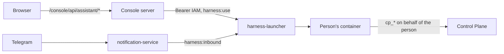

# Assistant

The assistant is a person's own conversation partner in the [console](console.md): a panel
that opens from any screen, sees what the person is looking at, and answers from the core's
data. This page is for those who work with it and for the administrator who enables it.
Rationale: TAI-ADR-0058 (rev. 2).

## What it is

The assistant panel is one more surface of the person's conversation, not a separate console
chat. A person has a single conversation, run by the assistant engine; the console only shows
it and passes messages along. The console does not store the conversation and does not write
it to its log.
The engine is the person's own container (see [Personal workspace](../workplace/index.md)).
The same conversation continues [in Telegram](../workplace/telegram.md): what you write to the
bot is visible in the panel, and vice versa. The assistant has no separate web window — the
`/harness/` address leads to the console with the panel open.

The assistant reads tasks, approvals, runs, processes, and company memory with Control Plane
tools and answers from them, not from the conversation's memory. Its permissions are the
person's own: the assistant cannot do more than the person can.

## Opening the panel

| How | What happens |
|---|---|
| The "Assistant" button in the header | The panel opens to the right of the screen; the screen stays in place |
| ⌘J / Ctrl+J | The same from the keyboard; pressing again closes the panel |
| An address with `?assistant=open` | The console opens with the panel already open; the parameter is removed from the address, so reloading or going "Back" does not open the panel again |
| "Discuss" on an item in Waiting for you on the Today screen | The panel opens with the context of that item; the screen does not change |

Escape closes the panel. The message draft is not lost when the panel closes. The live
conversation stream stays open while the panel is open; after reopening, it continues from
where it stopped.

## Screen context

With every message the assistant receives the screen context — so you do not have to name
the object in your question: "why is this stuck?" on a work screen refers to that work.

Above the input field there is a "Context" chip with the screen's label. You can remove it —
then the context is not sent until the person presses "Send again" or moves to another screen.
When the screen changes, the context changes by itself.

The console server collects the context on behalf of the signed-in person, from the same data
the screen shows. The browser sends only the screen address; anything else it might send as
context is discarded.

| Screen | What goes to the assistant |
|---|---|
| Work | a condensed provenance chain: where the work came from, its runs, its verification |
| Process instance | open steps, time on the step, the latest decision log entries |
| Run | the outcome, the latest actions, and the latest checkpoint |
| Rule, agent, artifact | label and status |
| Overview screens | only the screen kind and address |

The context contains only identifiers, statuses, short labels, and timestamps. It has no run
input or output, no process data, no artifact content or address; values that look like
tokens and passwords are scrubbed. Of the address parameters only the tab, the status and kind
filters, the workspace, and the revision remain — search text is not sent. The context is no
larger than 8 KB: lists are shortened first, and in the worst case only the screen kind and
address remain. If the data is not collected within 3 seconds, the message goes out with the
screen kind and address and nothing else.

## Conversation

- **History.** The panel shows the latest messages of the conversation; "Show earlier" loads
  earlier ones. Your messages sent from outside the console are marked with where they came
  from.
- **The assistant's turn.** While the assistant is answering, the panel shows "The assistant
  is answering…" and a summary "Read and done: N" — which tools it called and with what
  outcome.
- **Queue.** A message sent while the assistant is answering is queued and goes out when it
  finishes the current turn.
- **Retry.** A message that failed to send can be retried: the retry goes out with the same
  request number and does not duplicate the message.

### Confirmations

The assistant does not perform an action that changes state in the core — creating a task,
accepting a result, deciding an approval, invoking a skill — without confirmation. The panel
shows a card "The assistant asks for confirmation" with the action, the waiting deadline, and
the Allow and Decline buttons.
The same request arrives in Telegram: the first answer counts, a repeated decision is
rejected, and the card shows where the decision was made.
A request that gets no answer expires; an interrupted turn withdraws its requests.

## Waiting for you on the Today screen

The personal part of the [Today screen](console.md#today) is the Waiting for you list:
decisions addressed to the person or their role, results under review, approaching and missed
deadlines, blocked work, and assignments that keep failing for their executor. The core
computes the list (`GET /api/v1/me/attention`), and every item has a reason.

An item has buttons: "Discuss" (opens the assistant with the item's context) and "No need to
show" — feedback to the core; an approval can be decided right in the list. Hidden items can
be shown and brought back.

## Privacy

Only its owner sees the conversation. The console stores neither messages nor answers: the
console server's access log has only the request number, without text. The organization sees
core objects and the action log (tasks, approvals, artifacts, events), but not the
correspondence. Each person talks only to their own assistant: the console server takes the
principal from the session, not from the request.

## How it works

- The console server obtains for the person a token for the `human-harness` audience with the
  `harness:use` scope through the same `federation:exchange` as the other tokens, and calls
  the launcher over the compose network:
  `…/_launcher/internal/principals/{principal}/surface/{message,stream,history,approval}`.
  The launcher checks that the token was issued to the same principal as in the address.
- If the container was asleep, the launcher wakes it up, and the stream sends a wake-up
  event — the panel shows "The assistant is waking up". An open stream does not keep the
  container from falling asleep: only messages and decisions reset the idle timer.
- From the outside, only the launcher's service routes (`/harness/_launcher/internal/*` and
  health) remain behind it. Any other address under `/harness` leads to
  `/console/?assistant=open`.
- The "Open window" link in long Telegram answers leads to the same place. The launcher builds
  the address from `LAUNCHER_PUBLIC_URL` (`<host>/console/?assistant=open`) and passes it to
  the container in the `HARNESS_WINDOW_URL` variable; `LAUNCHER_WINDOW_URL` sets your own
  address. People's containers are created once, so they get a new value only after being
  recreated (`docker rm -f harness-<principal-id>`; the volume with the conversation remains).

## Enabling

1. The `harness` profile and the people registry — see
   [Personal workspace](../workplace/index.md). The model in the container has a shell: the
   Docker proxy is visible only to the launcher, and people's containers are in a separate
   network, see [Isolation and networks](../workplace/index.md#isolation).
2. The console — see [Installing the console](console.md#install). Compose sets the launcher
   address for it by itself: `CONSOLE_LAUNCHER_URL=http://harness-launcher:8080/harness`.
3. IAM: the `human-harness` audience with the `harness:use` scope in federation — it is
   registered by `deploy/bootstrap.py`.

## If something is wrong

| What the panel shows | Cause and what to do |
|---|---|
| "The assistant is waking up…" | The assistant's container is starting; the console keeps working. A cold start takes seconds |
| "The assistant did not wake up in time" | The engine did not start within the allotted time — "Retry"; if it repeats, check the engine's log |
| "Could not load the conversation: …" | The engine is unavailable or refused; the error code is in the message |
| "The assistant stream is not open: …" | The engine refused the stream (for example, missing permissions); the stream does not reconnect by itself — after fixing, press "Retry" |
| "The assistant is open in too many tabs." | The limit of concurrent streams per person is exceeded — close the panel in the extra tabs |
| "The screen context is too large" | Remove the context chip and retry |
| "The session has ended — going to sign-in" | The console session has expired; after signing in, the console returns you to the same screen |
| The assistant answers "Claude Code is not authorized" | The subscription token in the person's secrets is missing or expired — see [Personal workspace](../workplace/index.md) |

## See also

- [Console](console.md)
- [Personal workspace](../workplace/index.md)
- [Assistant in Telegram](../workplace/telegram.md)
- [Approvals](../control-plane/approvals.md)
- [Operator guide](index.md)
