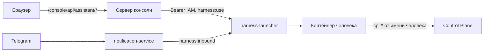

# Ассистент

Ассистент — личный собеседник человека в [консоли](console.md): панель, которая
открывается с любого экрана, видит, на что человек смотрит, и отвечает по данным ядра.
Страница для тех, кто с ним работает, и для администратора, который его включает.
Обоснование решений — TAI-ADR-0058 (ред. 2).

## Что это

Панель ассистента — ещё одна поверхность беседы человека, а не отдельный чат консоли.
Беседа у человека одна, её ведёт движок ассистента, а консоль только показывает её и
передаёт реплики. Консоль беседу не хранит и в журнал не пишет.
Движок — персональный контейнер человека (см. [Рабочее место человека](../workplace/index.md)).
Та же беседа продолжается [в Telegram](../workplace/telegram.md): написанное боту видно в
панели, и наоборот. Отдельного веб-окна у ассистента нет — адрес `/harness/` ведёт в
консоль с открытой панелью.

Ассистент читает задачи, согласования, прогоны, процессы и память компании инструментами
Control Plane и отвечает по ним, а не по памяти диалога. Права у него — права самого
человека: больше, чем человек, ассистент сделать не может.

## Открыть панель

| Как | Что происходит |
|---|---|
| Кнопка «Ассистент» в шапке | Панель открывается справа от экрана, экран остаётся на месте |
| ⌘J / Ctrl+J | То же с клавиатуры; повторное нажатие закрывает панель |
| Адрес с `?assistant=open` | Консоль открывается сразу с панелью; параметр убирается из адреса, поэтому перезагрузка и «Назад» панель заново не открывают |
| «Обсудить» у элемента «Ждёт вас» на пульсе | Панель открывается с контекстом этого элемента, экран не меняется |

Escape закрывает панель. Черновик сообщения при закрытии не теряется. Живой поток беседы
открыт, пока открыта панель; после повторного открытия он продолжается с того места, где
остановился.

## Контекст экрана

С каждым сообщением ассистент получает контекст экрана — поэтому название объекта в
вопросе можно не писать: «почему это застряло?» на экране работы относится к этой работе.

Над полем ввода видна плашка «Контекст» с подписью экрана. Её можно снять — тогда
контекст не передаётся, пока человек не нажмёт «Передавать снова» или не перейдёт на
другой экран. При смене экрана контекст меняется сам.

Контекст собирает сервер консоли от имени вошедшего человека, из тех же данных, что
показывает экран. Браузер присылает только адрес экрана; всё остальное, что он мог бы
прислать как контекст, отбрасывается.

| Экран | Что уходит ассистенту |
|---|---|
| Работа | сжатая цепочка происхождения: откуда работа взялась, прогоны, проверка |
| Экземпляр процесса | открытые шаги, время на шаге, последние записи журнала решений |
| Прогон | итог, последние действия и последний checkpoint |
| Правило, агент, артефакт | подпись и статус |
| Обзорные экраны | только вид экрана и адрес |

В контекст попадают только идентификаторы, статусы, короткие подписи и время. Входа и
выхода прогона, данных процесса, содержимого и адреса артефакта в нём нет; значения,
похожие на токены и пароли, вычищаются. Из параметров адреса остаются только вкладка,
фильтры статуса и вида, workspace и ревизия — текст поиска не уходит. Контекст не больше
8 КБ: сначала укорачиваются списки, в крайнем случае остаются только вид и адрес экрана.
Если данные не собрались за 3 секунды, сообщение уходит с видом и адресом экрана, без
остального.

## Беседа

- **История.** Панель показывает последние реплики беседы; «Показать раньше» догружает
  предыдущие. У ваших реплик, отправленных не из консоли, есть пометка, откуда они пришли.
- **Ход ассистента.** Пока ассистент отвечает, панель показывает «Ассистент отвечает…» и
  сводку «Прочитано и сделано: N» — какие инструменты он вызвал и с каким итогом.
- **Очередь.** Сообщение, отправленное, пока ассистент отвечает, встаёт в очередь и
  уходит, когда он закончит текущий ход.
- **Повтор.** Не отправленное из-за сбоя сообщение можно повторить: повтор уходит с тем же
  номером запроса и не задваивает реплику.

### Подтверждения

Действие, которое меняет состояние в ядре — создать задачу, принять результат, решить
согласование, вызвать скилл, — ассистент без подтверждения не выполняет. В панели
появляется карточка «Ассистент просит подтверждения» с действием и сроком ожидания и
кнопками «Разрешить» и «Отклонить».
Тот же запрос приходит в Telegram: засчитывается первый ответ, повторное решение отклоняется, а карточка показывает, где решили.
Запрос, который не дождался ответа, истекает; прерванный ход снимает свои запросы.

## «Ждёт вас» на пульсе

Личная часть [экрана «Сегодня»](console.md#today) — список «Ждёт вас»: решения, адресованные человеку
или его роли, результаты на проверке, близкие и прошедшие сроки, заблокированная работа и
поручения, которые раз за разом не выходят у исполнителя. Список считает ядро
(`GET /api/v1/me/attention`), у каждого элемента — причина.

У элемента есть кнопки: «Обсудить» (открывает ассистента с контекстом элемента) и «Не
нужно показывать» — обратная связь в ядро; согласование можно решить прямо в списке.
Скрытые элементы можно показать и вернуть.

## Приватность

Беседу видит только её владелец. Консоль не хранит ни реплик, ни ответов: в журнале
доступа сервера консоли — только номер запроса, без текста. Организации видны объекты
ядра и журнал действий (задачи, согласования, артефакты, события), но не переписка.
Каждый человек говорит только со своим ассистентом: сервер консоли берёт principal из
сессии, а не из запроса.

## Как это устроено

- Сервер консоли получает для человека токен audience `human-harness` со scope
  `harness:use` тем же `federation:exchange`, что и остальные токены, и ходит в
  launcher по сети compose: `…/_launcher/internal/principals/{principal}/surface/{message,stream,history,approval}`.
  Launcher сверяет, что токен выдан тому же principal, что в адресе.
- Если контейнер спал, launcher будит его, а поток отдаёт событие пробуждения — панель
  пишет «Ассистент просыпается». Открытый поток не мешает контейнеру уснуть: простой
  сбрасывают только сообщения и решения.
- Снаружи за launcher'ом остаются только его служебные маршруты
  (`/harness/_launcher/internal/*` и health). Любой другой адрес под `/harness` ведёт в
  `/console/?assistant=open`.
- Ссылка «Открыть окно» в длинных ответах Telegram ведёт туда же. Адрес строит launcher
  от `LAUNCHER_PUBLIC_URL` (`<хост>/console/?assistant=open`) и передаёт контейнеру
  переменной `HARNESS_WINDOW_URL`; свой адрес задаёт `LAUNCHER_WINDOW_URL`. Контейнеры
  людей создаются один раз, поэтому новое значение они получают после пересоздания
  (`docker rm -f harness-<principal-id>`, volume с беседой остаётся).

## Включение

1. Профиль `harness` и реестр людей — см. [Рабочее место человека](../workplace/index.md).
   У модели в контейнере есть shell: прокси Docker виден только launcher'у, контейнеры
   людей — в отдельной сети, см. [Изоляция и сети](../workplace/index.md#isolation).
2. Консоль — см. [Установка консоли](console.md#install). Адрес launcher'а для неё
   compose задаёт сам: `CONSOLE_LAUNCHER_URL=http://harness-launcher:8080/harness`.
3. IAM: audience `human-harness` со scope `harness:use` в federation — его заводит
   `deploy/bootstrap.py`.

## Если что-то не так

| Что видно в панели | Причина и что делать |
|---|---|
| «Ассистент просыпается…» | Контейнер ассистента стартует; консоль при этом работает. Холодный старт — секунды |
| «Ассистент не проснулся вовремя» | Движок не поднялся за отведённое время — «Повторить»; если повторяется, смотреть журнал движка |
| «Не удалось получить беседу: …» | Движок недоступен или отказал; код ошибки — в сообщении |
| «Поток ассистента не открыт: …» | Движок отказал в потоке (например, не хватает прав); сам поток не переподключится — после исправления нажать «Повторить» |
| «Открыто слишком много вкладок с ассистентом» | Превышен лимит одновременных потоков на человека — закрыть панель в лишних вкладках |
| «Контекст экрана слишком большой» | Снять плашку контекста и повторить |
| «Сессия закончилась — перехожу ко входу» | Истекла сессия консоли; после входа консоль вернёт на тот же экран |
| Ассистент отвечает «Claude Code не авторизован» | Нет или истёк токен подписки в секретах человека — см. [Рабочее место человека](../workplace/index.md) |

## См. также

- [Консоль](console.md)
- [Рабочее место человека](../workplace/index.md)
- [Ассистент в Telegram](../workplace/telegram.md)
- [Approvals](../control-plane/approvals.md)
- [Работа оператора](index.md)
