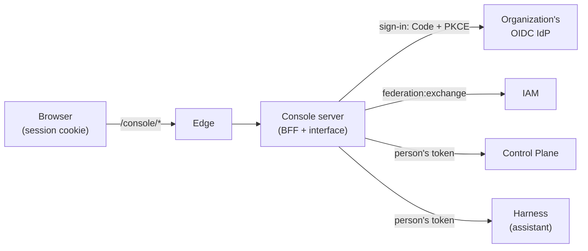
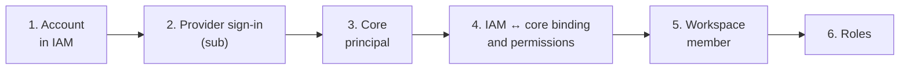

# Console

The console is the platform's web application. It shows how the organization's work is
going, where a person is needed, and what evidence backs the result. It is also where a
person makes decisions, assigns work, and configures the organization: rules, packages,
people. The page is for the owner, administrators, and members of the
organization. The rationale for the decisions is TAI-ADR-0058.

## What it is and what the console does not have

The console has no database of its own; it shows platform objects. Work, approvals, rules,
roles, and package settings are stored in the Control Plane, accounts in IAM, knowledge in
memory behind the core, and the conversation with the assistant is held by the person's
personal harness. The console consists of the interface (SPA) in the browser and the
console server (BFF). The BFF handles sign-in, stores tokens, passes requests to the core
through an allow-list, and runs multi-step flows such as "Add person".



What the console deliberately does not have:

- **A configuration editor.** Work types, rules, processes, agents, and screens are
  declared by [packages](../control-plane/catalog-packages.md) in git and installed by
  `package-sdk`. In the console you can edit a package's settings (if the package declares
  them) and turn rules on or off.
- **Execution screens.** There are no separate lists of runs, processes, agents, or nodes.
  An executor's attempts are visible in the work history, a process case in the related
  work and on the package screen, and all journal entries in the [Journal](#journal). The
  rest is in the [MCP plugin](mcp-plugin.md) and the CLI.
- **Billing, plans, and invitations.** An organization is an IAM tenant and principals
  together with the core's workspaces, roles, and permissions.

## Sign-in { #login }

The console signs in through the organization's OIDC IdP. A person signs in once and then
works without a password for as long as the IdP session lives.

1. An address under `/console/` without a session redirects to
   `/console/_auth/login?next=<address>` and, after sign-in, returns to the same address.
   That is why a link to a piece of work from a notification opens exactly that work.
2. The BFF performs Authorization Code + PKCE S256 as a confidential client
   (`runtime-console` by default). An unfinished sign-in lives for 10 minutes in the
   encrypted `console_login` cookie. The BFF passes the `login_hint` parameter with an
   e-mail to the provider, which prefills the address in the form.
3. The id token is exchanged in IAM (`federation:exchange`) for short-lived tokens with
   audience `control-plane`. As needed, the BFF also obtains `human-harness` (scope
   `harness:use`, for the assistant) and `iam` (scope `iam:people`, for managing people).
   Every request is made on behalf of the signed-in person, and the core and IAM journals
   record that person as the author.

Tokens never reach the browser. The browser stores only the `console_session` cookie with a
signed random session id (HttpOnly, SameSite=Lax, `Path=/console`, `Secure` for a public
https address). A session lives 12 hours (`RUNTIME_CONSOLE_SESSION_TTL_HOURS`), with at most
10 sessions per person: a new one evicts the oldest.

Sessions survive restarts and rollouts: they are stored in a file in
`CONSOLE_SESSION_STORE_DIR`, encrypted with a key derived from the cookie secret (audience
tokens are not written there). If you change the cookie secret, everyone signs in again.

"Sign out" closes the session and leads to sign-out from the IdP (the refresh token is
revoked if there are no other console sessions with the same IdP session). Sign-in failures
are shown as a page with a "Sign in again" button: "Sign-in provider unavailable",
"Sign-in attempt expired" (longer than 10 minutes), "No access to the console" (IAM refused
the exchange), "Account service unavailable".

!!! note "Which IdP fits"
    Any OIDC IdP registered in IAM as an identity provider will do. The console only knows
    the issuer, client id, secret, and the provider key in IAM. How to register an IdP is
    described in [Identity federation](../iam/federation.md); the console client in
    Keycloak is created by a service script
    ([Keycloak as an external IdP](../iam/keycloak.md#scripts)).


## Sections

Every screen has a permanent address. Filters, the section, and the workspace are also kept
in the address, so you can send a link to a colleague or to the assistant.

| Address | Screen | What it shows |
|---|---|---|
| `/console/` | Today | The day's summary, decisions waiting for you, what broke, the flow of work, the journal |
| `/console/work` | Work | All of the organization's work, grouped by what it needs |
| `/console/work/new?…` | Work | The "Assign work" form, prefilled from a link |
| `/console/work/<number>` | Work | A single piece of work: decision, materials, details, history |
| `/console/documents/<id>` | Document | A work material with a viewer |
| `/console/knowledge` | Knowledge base | Knowledge kinds, validity periods, sources |
| `/console/journal` | Journal | All entries of the core journal: who, what, when, on what; export |
| `/console/knowledge/entry?kind=…&key=…` | Knowledge base document | A single entry: details, validity, relations |
| `/console/v/<key>`, `/console/v/<key>/<id>` | Package screens | Screens declared by packages |
| `/console/settings?section=…` | Settings | Packages, Rules, People and roles |
| `/console/settings/people/<id>` | Person | Access, details, permissions, roles, visibility |

The menu on the left (☰, pinned on windows wider than 1280 px): "Today", "Work" with a
counter of decisions waiting for you, "Knowledge base", "Journal", package screens, and at
the bottom the language, "Settings", and "Sign out". A chip above the screen shows the
connection to the core journal and the time of the latest data.

### Workspace in the header and language

The workspace is chosen in one place, the header, by searching the tree. Console screens
(except package screens) show only that workspace and its nested workspaces: "Work" and
"Waiting for you" are filtered in the core (`workspaceId` and `includeDescendants`),
"Today" shows the journal and attempts of that subtree, "Knowledge base" takes its root,
and "Assign work" offers workspaces inside it. "All workspaces" removes the restriction.
The choice is read from the address (`?ws=<id>`, `?ws=all`) or from the browser; if the
person has not chosen, the console takes the root where the most work is waiting for them,
otherwise the first one.

The interface is available in English and Russian; the set of languages and the default one
are set by the deployment. The language is the person's saved choice, otherwise the
browser's language, otherwise the default. The theme follows the system.

### Today { #today }

The screen answers: is the organization working, where am I needed, what has changed, and
what is the evidence.

| Zone | What it shows |
|---|---|
| Summary | How many pieces of work submitted today are verified, how many decisions are waiting for you, how many are broken; the "Verified today" bar |
| Broken / stuck | Work that keeps failing verification, is stuck, stopped, or reached its due date without being started; decisions nobody can make |
| Flow of work | Created → claimed → executing → submitted → verified, plus "withdrawn"; the share of people, agents, and processes |
| What happened | The latest core journal entries for the day |
| Awaiting your signature | Approvals and acceptances assigned to you or your role: "Approve" / "Reject", "Accept" / "Return" |
| In progress now | Running agent attempts and work claimed by people |

The console computes the numbers from the day's journal; if it is longer than can be read
at once, there is a note under the summary.

### Work

A list of all of the organization's work: by people, agents, and processes. A piece of work
lands in exactly one group, in order of precedence:

| Group | What is in it |
|---|---|
| Waiting for you | Your decisions and acceptances (`GET /me/attention`), with an in-place action: "Decide", "Accept" |
| Stuck | Stopped work (`blocked`), work with a failed verification, stuck signals |
| In progress | Active work that has already been claimed |
| Not started | `backlog` and active work that has never been claimed |
| Done and verified today | Collapsed, read only when expanded |

A row has the status, title, number, a readiness phrase, and four stamps: where the work
came from, who is doing it, what proves it, who signs off. Work without an executor gets
"Assign": it opens the work page with the "Hand over" form (`?act=handoff`).

Filters live in the address `/work?q=&mine=&type=&exec=&owner=&due=&sort=`: search by title
or number, "Mine only", work type, who executes, who is responsible, due date (`overdue`,
`today`, `week`), and order (newest first, `dueDate`, `startDate`). "Mine only" means: the
executor is me **or** I am responsible. The core cannot do "or", so each group makes two
requests, and the console merges them without duplicates. The core returns no counters: the
number on a group counts the rows shown, and "12+" means not all pages have been read.

#### Assign work

The "Assign work" button opens a form with a "Will be created" preview. Fields: what to do,
work type (only those allowed in the workspace; the type sets the acceptance criteria;
without a type the work is free-form), who executes (only those who can claim this type
here), expected result, who is responsible (you by default), due date, workspace, basis.
"Create work" becomes active when there is a title, a result, and a due date. The work is
created with `POST /api/v1/tasks` with an idempotency key, and its page opens after the
write. The result and the basis go into the description: the core has no separate fields
for them.

The form can be opened prefilled, as a **proposal by link**:

```text
/console/work/new?title=…&type=…&exec=…&owner=…&due=…&ws=…&result=…&basis=…
```

| Parameter | What |
|---|---|
| `title` | What to do, required (up to 500 characters) |
| `type` | Work type key |
| `exec`, `owner`, `ws` | id of the executor, the responsible person, and the workspace |
| `due` | `YYYY-MM-DD` (by 18:00 on the browser's clock) or an ISO 8601 date-time |
| `result`, `basis` | Expected result and basis (up to 2000 characters) |

An invalid value is discarded, and the person fills it in on the form. In an assistant's
reply such a link is a "Work will be created" card with "Create work" and "Edit": the work
is created by the person with a click, not by the assistant.

### Work page

- **Header:** status, title, readiness phrase, and the actions "Hand over", "Withdraw",
  "Edit". The consequences are visible before the button; after the click, status lines.
- **Problem** appears when the last verification failed or the work is stopped: a
  diagnosis in words and the count of consecutive failures. While there are fewer than
  three failures, the executor retries on its own. Stopped work can be "Retry as before":
  the executor will claim it again.
- **Awaiting your signature** is the decision, if it is yours, with an explanation of why
  you.
- **Process step** is the step form, if the work was created by a process step involving
  a person. "Complete step" records the answers and completes the work.
- **Materials** are the work's artifacts with a link to the document page.
- **Details:** type, who is responsible and who executes, the required role ("nobody holds
  it", if so), workspace, due date, start.
- **Related work:** the process case that created the work, and relations to other work.
- **History** in three views: brief, by time, full journal. An agent attempt opens its
  transcript: messages, tool calls, outcome (thinking is not stored). Below the history is
  a comment field (⌘/Ctrl+Enter).

**Hand over and withdraw.** While an executor holds the work, the core does not allow it to
be changed (`409 task_claimed`). So the console asks the executor to stop the attempt
(`:request-cancel`, the transcript is kept), releases the claim (`claims/{id}:release`,
permission `claims.manage`), and changes the work with `PATCH` and `If-Match`. "Withdraw"
requires a reason and moves the work to a status with the `terminal_cancelled` category.
What has been done in external systems is not rolled back.

**Assign when there is no role.** The core checks the role when the executor **claims** the
work (`403 not_eligible`), not at assignment. So "Hand over" to a candidate without the role
offers either to **grant the role** in the work's workspace (permission `org.manage`) or to
**assign without the role**: the role requirement is removed from the work, and a comment
is written to the history.

### Documents and viewing

The `/console/documents/<id>` page shows a material: the document, who added it and when,
the source, what it proves, "Download", "Open in new tab" (for an external one, "Open in
source").

| Format | How it is shown | Limit |
|---|---|---|
| Markdown, text, CSV, JSON, images (except SVG) | As text or an image | 1 MB |
| PDF | Five pages at a time; text is selectable, "Find in document" searches up to 300 pages | 30 MB |
| DOCX, XLSX, PPTX | As text with tables; XLSX up to 500 rows per sheet; PPTX the slide text | 15 MB |

A larger document or another format can be downloaded or opened in a new tab. The content
is served with `Content-Security-Policy: sandbox` and `nosniff`: the document's scripts do
not run and cannot see the session.

### Knowledge base

The `/console/knowledge` screen shows contracts, identity documents, counterparties, and
other knowledge kinds with their source and validity period. The kinds and columns are set
by the knowledge packages enabled for the workspace root.

- **Needs attention** lists entries whose validity expires within the next 30 days or
  expired within the last 7, and the renewal work, if the expiry rule created it.
- **Knowledge** offers search, a kind switcher, and the kind's table. Search covers the
  title, key, and text attributes among what has been read (up to 2000 entries).
- **Where knowledge comes from** and **What changed** show reconciliations with sources and
  changes from the journal.

A row opens a **knowledge base document**: all details according to the kind's schema, the
validity period, a warning if expiry is near and there is no renewal work, and the entry's
**relations** according to the package's relations, with a link to the other end.


### Journal { #journal }

A screen for auditors: all core journal entries from newest to oldest: when (to the
second), who (a person, an agent, a process, or "System"), what happened, on which object,
and in which workspace. The journal is append-only: the console changes nothing in it.
The `events.read` permission is required.

| Filter | How it works |
|---|---|
| Event group | "Work", "Decisions", "People and access", "Rules and processes", "Agents and skills", "Knowledge base", "Configuration": selected by the core by type prefixes |
| Who | The entry's author: selected by the console from what has been read |
| From / To | A period in days, inclusive: the console reads the journal back to the start of the period |
| Object | All entries about one object: the "everything about the object" link in a row or "In the journal" on the work page: selected by the core |

The core does not accept author and period filters, so the console reads the journal back
by itself, no further than 10,000 entries, and states how far it has read; beyond that,
"Show earlier". A row expands: the entry's id and number, the ids of the author, object, and
workspace, the UTC time, and the full payload. Events about access and permissions, keys
(including the emergency key), reading and deleting content, archiving and truncating the
journal are marked with a bar. New entries do not shift the feed: "Show N new entries".

"Export CSV" and "JSON Lines" save what is shown. The CSV has `sequence, occurredAt, type,
actorId, actor, entityType, entityId, workspaceId, payload, id`; a cell that starts with
`= + - @` gets an apostrophe so that a spreadsheet editor does not take it for a formula.

### Package screens

A package can declare its own screens (kind `View`, TAI-ADR-0066). The console draws them
from the description in the core (`GET /api/v1/views`) and gets the data with a
view-specific query (`POST /api/v1/views/{key}:query`). A list opens at `/console/v/<key>`,
a process instance at `/console/v/<key>/<id>`. The menu item is placed after "Work",
"Knowledge base", or in the "Packages" group, as the package declares; a screen without a
menu item opens by link. Blocks: metrics, a table and a list with filters, a board by
stage, a chart, a header, fields, steps, history, materials, related knowledge base
entries. A step with work for a person expands with the "Fill in step" button. An unknown
block is shown as a "requires a newer console" placeholder.

### Settings

The `/console/settings` screen gathers what an administrator changes. The section is chosen
on the left and kept in the address: `package:<key>`, `rules`, `people`. By default the first package with settings is open, otherwise "Rules".

- **Packages** has a section for each installed package with settings (TAI-ADR-0067). The
  form is built from the package's schema, and the labels come from the package's
  dictionary. For each value you can see whether it is the default, saved, or modified.
  "Save" writes a new version under your name, and any version can be restored in "Change
  history". If you leave with unsaved changes, the console asks again. Without the
  `packages.settings.manage` permission the form is read-only.
- **Rules** lists the rules that create work by themselves (excluding archived ones):
  whether a rule is on, what triggers it, which package installed it. "Turn on" and "Turn
  off" show the consequences: work already created stays. Permissions `rules.read` and
  `rules.write`.
- **People and roles**: see [below](#people).

The BFF log records only the route template and never request bodies.

!!! warning "Core capabilities"
    The console opens package settings and the person profile
    according to the accepted core contract. If the core does not support them yet, the
    section says so in words ("The core does not store package settings yet"), and the
    other sections work.

## Management actions and permissions

Permissions are decided by the core using the signed-in person's token and their IAM ↔ core
binding. The console shows the consequences before the button, sends the request, and
restates a refusal in words ("you do not have permission to change rules"). The console
hides in advance only what is impossible by meaning: changing your own permissions and
visibility, disabling yourself. A package settings form without the permission opens
read-only.

| Action | Where | Core permission |
|---|---|---|
| Decide an approval or acceptance | "Today", work page | Decided by the core: assignment, role, `approvals.decide` |
| Assign, edit, comment on work | "Work", work page | `tasks.write` |
| Hand over, withdraw, retry | Work page | `tasks.write`; releasing someone else's claim requires `claims.manage` |
| Turn a rule on or off | "Rules" | `rules.write` |
| Change package settings | "Packages" | `packages.settings.manage` |
| Grant, revoke, create a role | "People and roles", work page | `org.manage` (reading: `org.read`) |
| People: add, permissions, visibility, disable, enable | "People and roles" | See [People and roles](#people) |

Core calls from the browser are restricted by the BFF allow-list: reads are open on the
paths of the core API snapshot, changes only through screen actions, and everything else
gets `404 not_found` even with the permission. Skills are called only without side effects,
and a change from a foreign origin gets `403 forbidden_origin`. A retry after a failure uses
the same `Idempotency-Key`; a `409 version_conflict` response means the object was changed
in the meantime.

!!! warning "The `admin` permission does not apply in the console"
    By default the console requests the scope `control-plane:read control-plane:write`
    (`RUNTIME_CONSOLE_CP_SCOPES`). Scope is the ceiling of the binding's permissions, and
    `admin` does not pass through it without `control-plane:admin` (see
    [Authorization and permissions](../control-plane/authorization.md)). Each console
    section needs explicit permissions in the binding.

## People and roles { #people }

The "Settings" → "People and roles" section (`/console/settings?section=people`):

- **People** lists the organization's people (`GET /api/v1/principals`, kind `human`), with
  disabled ones at the bottom. For each person you can see their roles and where each
  applies: across the whole organization or in a workspace. Search is by name and by role.
  "Grant role" grants an organization or workspace role (a workspace role also applies in
  nested workspaces). "×" revokes a role: the person will not claim new work with it, and
  work already claimed stays.
- **Roles** lists the title, key, package, where the role applies, and how many people hold
  it. "New role" creates a role (the key defaults to one derived from the title), "Edit"
  changes the title and description. Roles cannot be deleted.

A role is a rule for selecting an executor: work can require a role, and without it the
work cannot be claimed. A role grants no authority; that is set by the binding's
permissions. Reading requires `org.read`, changing roles `org.manage`. Agents are not in
this section: their roles are set by their description in the package.

A person's name leads to the **person page** `/console/settings/people/<id>` (TAI-ADR-0068):

| Zone | What is in it |
|---|---|
| Access | Whether the person is active and can sign in ("can sign in", "sign-in revoked", "never signed in"); "Disable" or "Enable" |
| Details | Name, job title, work e-mail, phone, note; saved with `If-Match` on the version |
| Permissions | The "Observes", "Works", or "Manages the organization" set; "custom" if permissions were chosen one by one. "Show individual permissions" expands them by group; before saving you can see what will be added and what will be removed |
| Roles | The person's roles with "Grant role" and revocation |
| Visibility | "Whole organization" or "Own workspaces only"; workspace membership: "Add" and "Remove" |

Permissions are changed by an upsert of the binding
(`POST /api/v1/principals/{id}/iam-bindings`, permission `principals.write`) and take effect
from the person's next request. The console does not change your own permissions and
visibility, so that you do not lose access. On the person page the console neither grants
nor removes `admin`, and it preserves permissions it does not know when the set changes.
"Own workspaces only" is a mode for people only: the person sees the workspaces where they
are a member and the nested ones, and everything else is "not found" for them. Membership
is changed with the `workspaces.manage` permission. If the core's response has no profile
version or visibility mode, these zones are read-only.

### Who can manage people { #people-admin }

Adding, disabling, and enabling people is possible when both conditions hold:

- **in IAM**, the scope `iam:people`. Federation grants it only to a member of the IAM group
  `people-admins` and only on an explicit request from the console; a PAT never carries it;
- **in the core**, permissions for the flow's steps: `principals.write`,
  `workspaces.manage`, `org.manage`.

The "Add person" button is visible to everyone. Without `iam:people` the flow does not
start, and the console answers "you are not a people administrator (IAM group
`people-admins`)". The group and the owner's membership are created by
[bootstrap](../getting-started/bootstrap.md).

### Add person

| Field | What to enter |
|---|---|
| Name | Display name |
| E-mail | The address the person uses to sign in to the IdP |
| Sign-in provider identifier | **Required** if the console does not create the user. The value of the claim IAM uses to match the sign-in: usually `sub` from the id token, shown as the user ID in the IdP admin console |
| Workspace | Where the person becomes a member; by default, the one from the header |
| Permissions | "Observation", "Work", "Management", or "Administrator (everything)" |
| Roles | Roles of the organization and of the selected workspace |

The person must already exist at the sign-in provider: in the open distribution the console
does not create users at the provider; the IdP administrator does (for Keycloak, with
[`deploy/keycloak/keycloak-users.py`](../iam/keycloak.md#scripts)). The identifier is not
derived from the e-mail, because signing in by an unverified e-mail would allow taking over
someone else's account. You cannot grant more than your own permissions: the console checks
permissions before IAM and answers `permission_escalation` with a list of the missing ones.
Only an administrator can grant "Administrator".


The flow runs step by step on behalf of the signed-in administrator:



The flow is idempotent and has no store of its own. If it is interrupted, the window shows
the completed steps and the step that was refused, and repeating the same form completes the
flow: what was created is marked "already existed", and the core applies membership and
roles without duplicates. Unfinished additions are visible in the "Incomplete" block with a
"Complete" button. A people administrator also sees there the people who exist only in IAM.

The output is a **first sign-in link**
(`<public address>/console/_auth/login?login_hint=<e-mail>`). The person signs in with it
through the IdP and immediately works with the assigned permissions.

The flow stops with an explanation if the provider sign-in already belongs to another
principal or is disabled in IAM, if the person signs in under a different identifier, if a
person with this e-mail is disabled, if IAM does not allow reading the IdP links, or if
there are too many core principals to check them all (`lookup_incomplete`). In the last two
cases the console refuses rather than risk creating a duplicate.

!!! note "A disabled person is not added again"
    They are brought back with the "Enable" button ([Enable a person](#people-enable)),
    together with their history.

### Disable a person { #people-disable }

The "Disable" and "Enable" buttons are on the person page in the "Access" zone; you cannot
disable yourself. The window shows the consequences and an optional "Why" field that goes
into the journal. Disabling closes sign-in in IAM and revokes tokens and PATs, revokes
bindings and delegations, closes sessions (including the assistant's and the plugins'),
releases claimed work, and fails the runs in progress on it. The work stays assigned to the
person and needs to be handed over. The person, their roles, history, and authorship remain.
The flow goes through the BFF (`POST /console/api/org/people/{id}:disable`):

1. **Core gate.** An agent is not disabled; it is retired from its package
   (`use_agent_retire`), and the same applies to a service account
   (`principal_kind_not_disableable`). Then `POST /api/v1/authz:check` with the `disable`
   action: permission `principals.write`, "not yourself" (`cannot_disable_self`), "only an
   administrator disables an administrator" (`permission_escalation`). The core sees
   `admin` both in the target's bindings and in its unrevoked API keys. If the gate refuses,
   IAM is not called.
2. **IAM**: `:disable` on the IAM account closes sign-in and revokes tokens and PATs.
3. **Core**: `POST /api/v1/principals/{principal_id}:disable` (CP-ADR-0077): bindings,
   delegations, sessions, claims, and runs.

If the core refuses after IAM, the person can no longer sign in, and the window says where
the flow stopped; a retry completes the disabling. IAM itself refuses for a member of the
`people-admins` group (`people_admin_protected`): such a person can be disabled only by IAM
bootstrap. Without `iam:people` the console disables the person only in the core and says
that the IAM account remains open; without permissions in the core it grants nothing.

### Enable a person { #people-enable }

"Enable" brings back a disabled person (CP-ADR-0077, the "Enabling" amendment). The core
principal stays the same, so work, the journal, and decisions refer to the same principal.
Only a people administrator (scope `iam:people`) can enable.

| Window field | What to enter |
|---|---|
| Permissions after enabling | "Previous permissions" of the revoked binding (the default, if there was one) or "Observation", "Work", "Management". You cannot grant more than your own permissions |
| Why | Optional, goes into the journal |

The flow goes through the BFF (`POST /console/api/org/people/{id}:enable`): after the core
gate, IAM reopens sign-in, `POST /api/v1/principals/{principal_id}:enable` returns the
principal to the `active` status, and then a new binding with the chosen permissions is
created.

**Bindings are not restored automatically.** The core returns only the status. Bindings,
delegations, sessions, released work, and interrupted runs stay closed, and previous tokens
and PATs do not come back: the person signs in again. Live (unrevoked and unexpired) API
keys work again together with the status: disabling does not revoke them.

Before IAM the console checks:

- **the core gate** (`authz:check`, action `enable`): permission `principals.write`
  (`permission_denied`), the target's kind (`principal_kind_not_enableable`; an agent is
  brought back by publishing it in its package, `use_agent_publish`), and escalation: the
  permissions of the target's live API keys and unrevoked bindings must be held by the person
  enabling, otherwise `permission_escalation` with a `missing` list;
- **the chosen permissions**: you cannot issue a binding with permissions you do not have.

The new binding is created only for an IAM account from the person's previous bindings. If
there are none, the person has never signed in, and there is nothing to enable
(`iam_principal_unknown`). IAM may refuse on its own as well: the person was disabled by HR
synchronization (`principal_provisioned`), the person is paused in IAM
(`principal_paused`), or belongs to a privilege group you are not a member of
(`people_admin_protected`).

**Partial disabling.** If sign-in in IAM is already closed but the core principal is still
active (the core refused after IAM), the core is not called, and only an administrator
(`admin`) can reopen sign-in. Everyone else gets `iam_login_closed` from the console:
otherwise a non-administrator could reopen sign-in for, say, an administrator.

A retry after a failure completes the enabling and does not repeat what was done: the steps'
idempotency keys are derived from the confirmation key. If the principal is enabled but the
binding was not issued, the person cannot sign in until the enabling is retried. The refusal
codes are in the [Error codes](../reference/errors.md#console-people) reference.

## Assistant

The "Assistant" button (⌘J / Ctrl+J) opens a panel on the right. The screen's data goes
with the question: the BFF collects it from the core by the screen's address, and search
text is not included. The conversation is the same as in Telegram; the assistant performs
actions only after "Allow". `?assistant=open` opens the console with the panel, and
`/harness/` leads there too. Details: [Assistant](assistant.md).

## If a service is unavailable

- **The core does not respond**: the zone says "no connection to the core", the connection
  chip shows the time of the latest data, and everything else works; if the whole screen
  did not load, "Core unavailable".
- **No access**: "You do not have access to this screen" instead of an empty page.
- **A service did not accept the console's token** (`502 upstream_unauthorized`): signing
  in again will not help; check the audience and scope in IAM.
- **The session expired**: the console leads to sign-in and returns to the same address.
- **The console server is unavailable**: "Console unavailable: no connection to the
  server".

## Limitations of the current version

- The numbers on "Work" groups are approximate ("12+"): the core has no counters. The
  console knows the limit of consecutive verification failures (three) by itself: the core
  does not return it.
- Old office formats (DOC, XLS) can only be downloaded; PDF search does not find a match
  across a page boundary.
- The knowledge base has no "Add document", search covers only what has been read (up to
  2000 entries), there is no change history for a single entry, kind profiles are not taken
  into account when loading the table, and kind names are available only in the package's
  language.
- Package screens are not narrowed by the workspace in the header, and actions in their
  header are not shown.
- A person's workspace membership is read for each workspace of the tree: on a large tree
  this is slow.
- The console does not create the user at the sign-in provider.
- The assistant's proactive messages carry no source label. Each replica has its own
  sessions file: there is no shared store for several replicas.

## Installation { #install }

The console is the compose service `console` of the profile of the same name: an image from
`apps/console`, uid 10001, a 128 MB memory limit. Sign-in to the console goes through
Keycloak, so the `console` profile also brings up the services of the `idp` profile
([Keycloak as an external IdP](../iam/keycloak.md)):

```bash
make secrets
make up PROFILES="core edge console"
make bootstrap
```

There are no external ports: the edge serves the console at `/console/*`, and the site root
leads to `/console/` (see [Edge and TLS](../operations/edge-and-tls.md)). You need:

1. **The OIDC client** `runtime-console` in the realm: confidential, Authorization Code +
   PKCE S256, redirect `<public address>/console/_auth/callback`. A new installation gets
   it from the realm template on first import; in a realm that is already live it is
   created by `deploy/keycloak/keycloak-runtime-console-client.py` (see [Service
   scripts](../iam/keycloak.md#scripts)).
2. **Secrets** in `secrets/`: `runtime-console-oidc-secret` (the same as the client's in the
   IdP) and `runtime-console-cookie-secret` (at least 32 bytes). They are created by
   `make secrets` with mode `0600`; on Linux the owner is uid 10001. Without them compose
   will not create the container (see [Secrets and rotation](../operations/secrets.md)).
3. **IAM**: an identity provider for the IdP, the audiences `control-plane`, `iam` (scope
   `iam:people`) and `human-harness` (scope `harness:use`), and the `people-admins` group;
   they are created by `deploy/bootstrap.py`. `.env` needs `IAM_TENANT_ID`; without it the
   console does not start.
4. **The sessions volume** `console_sessions` at `/data/sessions`: the image sets
   `CONSOLE_SESSION_STORE_DIR=/data/sessions`, and with this volume sessions survive a
   rollout.
5. **People in Keycloak.** The console does not create users at the sign-in provider: they
   are created by `deploy/keycloak/keycloak-users.py`, and the user's `sub` is entered in
   the "Add person" form (see [Onboarding a person](../iam/keycloak.md#onboarding)).

The assistant in the console panel is a separate profile, `harness` (see
[Assistant](assistant.md)).

Compose passes the `.env` keys to the container as `CONSOLE_*`:

| `.env` key | Container variable | Default |
|---|---|---|
| `TAIMEN_PUBLIC_URL` | `CONSOLE_PUBLIC_URL` | required; `https://` enables `Secure` on the cookie |
| `IAM_TENANT_ID` | `CONSOLE_IAM_TENANT` | required |
| `RUNTIME_CONSOLE_OIDC_ISSUER` | `CONSOLE_OIDC_ISSUER` | `${TAIMEN_PUBLIC_URL}/auth/realms/platform` |
| `RUNTIME_CONSOLE_OIDC_CLIENT_ID` | `CONSOLE_OIDC_CLIENT_ID` | `runtime-console` |
| `RUNTIME_CONSOLE_OIDC_SCOPES` | `CONSOLE_OIDC_SCOPES` | `openid profile email` |
| `RUNTIME_CONSOLE_IDENTITY_PROVIDER` | `CONSOLE_IDENTITY_PROVIDER` | `keycloak`, the provider key in IAM |
| `RUNTIME_CONSOLE_CP_SCOPES` | `CONSOLE_CP_SCOPES` | `control-plane:read control-plane:write` |
| `RUNTIME_CONSOLE_SESSION_TTL_HOURS` | `CONSOLE_SESSION_TTL_HOURS` | `12` |
| `RUNTIME_CONSOLE_PRODUCT_NAME` | `CONSOLE_PRODUCT_NAME` | `Console`, the title of the tab and the sign-in page |
| `RUNTIME_CONSOLE_ORG_NAME` | `CONSOLE_ORG_NAME` | empty; the organization name until the core provides it |
| `RUNTIME_CONSOLE_LOCALES` | `CONSOLE_LOCALES` | `en,ru` |
| `RUNTIME_CONSOLE_DEFAULT_LOCALE` | `CONSOLE_DEFAULT_LOCALE` | `en`; must be in `CONSOLE_LOCALES` |

The paths to the secret files are set by `RUNTIME_CONSOLE_OIDC_SECRET_FILE` and
`RUNTIME_CONSOLE_COOKIE_SECRET_FILE`. Compose sets the rest itself: `CONSOLE_BASE_PATH=/console`,
port `8090`, and the internal addresses of IAM, the Control Plane, and the harness launcher.
The BFF gives the brand and languages to the interface at startup
(`GET /console/api/config`); the console code contains no product name. An invalid variable
stops startup with a reason. Checks: `GET /console/healthz` (liveness, no session) and
`GET /console/readyz` (`503 idp_unavailable` if the IdP does not answer discovery).
Reference: [Environment variables](../reference/environment.md).


!!! danger "Rollout order"
    The IAM version must issue `iam:people` only to members of the `people-admins` group.
    Update IAM first, and only then run bootstrap, which adds this scope to the audience.
    Otherwise federation will issue the privileged scope to everyone who signs in.

## Common problems

| Symptom | Cause | What to do |
|---|---|---|
| The `console` container is not created | The `secrets/runtime-console-*-secret` files are missing | `make secrets`, `chown 10001:10001`, then `tools/compose up -d console` |
| The `console` container keeps restarting | Empty `IAM_TENANT_ID`, a cookie secret shorter than 32 bytes, or an invalid variable | The reason is in the container log; fix `.env` or the secret |
| Error at `/console/_auth/callback` | The client's redirect URI does not match the public address, or the secret in the IdP differs | Rerun the client script with the correct address, compare the secret |
| "No access to the console" after sign-in | IAM refused the exchange: the IdP is not registered, the person is not linked, or the audience is not granted | Check `RUNTIME_CONSOLE_IDENTITY_PROVIDER` and the audiences, run bootstrap |
| Everyone has to sign in again after a rollout | The cookie secret changed or the container has no `console_sessions` volume | Restore the secret and the volume |
| A section says "no permission…" although the person has `admin` | `admin` does not pass the console's scope ceiling | Grant the binding the section's explicit permissions |
| "Add person": "you are not a people administrator" | The person is not in the IAM group `people-admins` | Add them to the group and sign in again |
| An added person cannot sign in | The IdP identifier was entered incorrectly | Compare the `sub` in the IdP; an IAM administrator fixes the link |
| "Enable" answers `iam_login_closed` | Partial disabling: the principal is active, sign-in in IAM is closed | Ask an administrator to repeat "Enable" |

## See also

- [Assistant](assistant.md)
- [Operator guide](index.md)
- [Catalog packages](../control-plane/catalog-packages.md)
- [Authorization and permissions](../control-plane/authorization.md)
- [Keycloak as an external IdP](../iam/keycloak.md)
- [Error codes](../reference/errors.md#console-people)
