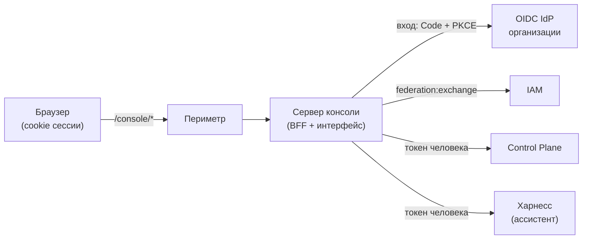
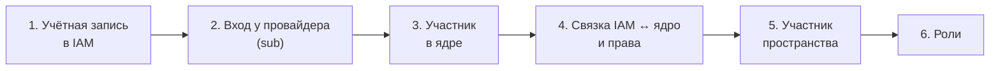

# Консоль

Консоль — веб-приложение платформы. В ней видно, как идёт работа организации, где нужен
человек и чем подтверждён результат. Здесь же человек принимает решения, поручает работу и
настраивает организацию: правила, пакеты, людей. Страница для владельца,
администратора и участников организации. Обоснование решений — TAI-ADR-0058.

## Что это и чего в консоли нет

Своей базы у консоли нет, она показывает объекты платформы. Работа, согласования, правила,
роли и настройки пакетов хранятся в Control Plane, учётные записи — в IAM, знания — в
памяти за ядром, беседу с ассистентом ведёт персональный харнесс человека. Консоль состоит
из интерфейса (SPA) в браузере и сервера консоли (BFF). BFF проводит вход, хранит токены,
пропускает запросы к ядру по allow-list и выполняет многошаговые потоки, например
«Добавить человека».



Чего в консоли нет намеренно:

- **Редактора конфигурации.** Типы работы, правила, процессы, агенты и экраны объявляют
  [пакеты](../control-plane/catalog-packages.md) в git, а устанавливает их `package-sdk`.
  В консоли можно править настройки пакета (если пакет их объявил) и включать или
  выключать правила.
- **Экранов исполнения.** Отдельных списков прогонов, процессов, агентов и узлов нет.
  Попытки исполнителя видны в истории работы, дело процесса — в связанной работе и на экране
  пакета, все записи журнала — в [«Журнале»](#journal). Остальное — в
  [MCP-плагине](mcp-plugin.md) и CLI.
- **Биллинга, тарифов и инвайтов.** Организация — это tenant и principals IAM вместе с
  пространствами (workspaces), ролями и правами ядра.

## Вход { #login }

Консоль входит через OIDC IdP организации. Человек входит один раз и дальше работает без
пароля, пока жива сессия IdP.

1. Адрес под `/console/` без сессии уводит на `/console/_auth/login?next=<адрес>`, а после
   входа возвращает на тот же адрес. Поэтому ссылка на работу из уведомления открывает
   именно её.
2. BFF проводит Authorization Code + PKCE S256 как confidential client (по умолчанию
   `runtime-console`). Незавершённый вход живёт 10 минут в зашифрованной cookie
   `console_login`. Параметр `login_hint` с e-mail BFF передаёт провайдеру, и тот
   подставляет адрес в форму.
3. id token обменивается в IAM (`federation:exchange`) на короткие токены audience
   `control-plane`. По мере надобности BFF получает ещё `human-harness` (scope
   `harness:use`, для ассистента) и `iam` (scope `iam:people`, для управления людьми).
   Каждый запрос идёт от имени вошедшего человека, и в журнале ядра и IAM автором записан
   он.

Токены в браузер не попадают. Браузер хранит только cookie `console_session` с подписанным
случайным id сессии (HttpOnly, SameSite=Lax, `Path=/console`, `Secure` при публичном адресе
по https). Сессия живёт 12 часов (`RUNTIME_CONSOLE_SESSION_TTL_HOURS`), на человека — не
больше 10 сессий: новая вытесняет самую старую.

Сессии переживают перезапуск и выкатку: они хранятся в файле в `CONSOLE_SESSION_STORE_DIR`,
зашифрованном ключом из секрета cookie (токены audience туда не пишутся). Сменили секрет
cookie — все входят заново.

«Выйти» закрывает сессию и ведёт на выход из IdP (refresh token отзывается, если других
сессий консоли с той же сессией IdP нет). Отказы входа показываются страницей с кнопкой
«Войти снова»: «Провайдер входа недоступен», «Попытка входа устарела» (дольше 10 минут),
«Нет доступа к консоли» (IAM отказал в обмене), «Сервис учётных записей недоступен».

!!! note "Какой IdP подходит"
    Подойдёт любой OIDC IdP, заведённый в IAM как identity provider. Консоль знает только
    issuer, client id, секрет и ключ провайдера в IAM. Как завести IdP — в статье
    [Федерация identity](../iam/federation.md), клиент консоли в Keycloak заводит служебный
    скрипт ([Keycloak — внешний IdP](../iam/keycloak.md#scripts)).


## Разделы

У каждого экрана постоянный адрес. Фильтры, раздел и пространство тоже хранятся в адресе,
поэтому ссылку можно отправить коллеге или ассистенту.

| Адрес | Экран | Что показывает |
|---|---|---|
| `/console/` | Сегодня | Итог дня, решения за вами, что сломалось, поток работы, журнал |
| `/console/work` | Работа | Вся работа организации по тому, что ей нужно |
| `/console/work/new?…` | Работа | Форма «Поручить работу», заполненная из ссылки |
| `/console/work/<номер>` | Работа | Одна работа: решение, материалы, сведения, история |
| `/console/documents/<id>` | Документ | Материал работы с просмотром |
| `/console/knowledge` | База знаний | Виды знаний, сроки действия, источники |
| `/console/journal` | Журнал | Все записи журнала ядра: кто, что, когда, над чем; выгрузка |
| `/console/knowledge/entry?kind=…&key=…` | Документ базы знаний | Одна запись: сведения, срок, связи |
| `/console/v/<ключ>`, `/console/v/<ключ>/<id>` | Экраны пакетов | Экраны, объявленные пакетами |
| `/console/settings?section=…` | Настройки | Пакеты, Правила, Люди и роли |
| `/console/settings/people/<id>` | Человек | Доступ, сведения, права, роли, видимость |

Меню слева (☰, на окне шире 1280 px закрепляется): «Сегодня», «Работа» со счётчиком
решений за вами, «База знаний», «Журнал», экраны пакетов, внизу — язык, «Настройки», «Выйти». Чип
над экраном показывает связь с журналом ядра и время последних данных.

### Пространство в шапке и язык

Пространство выбирается в одном месте — в шапке, поиском по дереву. Экраны консоли (кроме
экранов пакетов) показывают только его и вложенные пространства: «Работа» и «Ждёт вас» фильтруются в ядре
(`workspaceId` и `includeDescendants`), «Сегодня» показывает журнал и попытки этого
поддерева, «База знаний» берёт его корень, «Поручить работу» предлагает пространства
внутри него. «Все пространства» снимает ограничение. Выбор читается из адреса (`?ws=<id>`,
`?ws=all`) или из браузера; если человек не выбирал, консоль берёт корень, где его больше
всего ждёт работа, иначе первый.

Интерфейс бывает на английском и русском; набор языков и основной задаёт развёртывание.
Язык — сохранённый выбор человека, иначе язык браузера, иначе основной. Тема — системная.

### Сегодня { #today }

Экран отвечает: работает ли организация, где нужен я, что изменилось и чем это доказано.

| Зона | Что показывает |
|---|---|
| Итог | Сколько работ проверено из сданных сегодня, сколько решений ждёт вас, сколько сломано; полоса «Проверено сегодня» |
| Сломано / застряло | Работа, которая раз за разом не проходит проверку, застряла, остановлена или подошла к сроку не начатой; решения, которые некому принять |
| Поток работы | Возникло → взято → исполняется → сдано → проверено, плюс «снято»; доля людей, агентов и процессов |
| Что произошло | Последние записи журнала ядра за день |
| Ждёт вашей подписи | Согласования и приёмки, назначенные вам или вашей роли: «Согласовать» / «Отклонить», «Принять» / «Вернуть» |
| Сейчас в работе | Идущие попытки агентов и взятая людьми работа |

Числа консоль считает по журналу за день; если он длиннее, чем читается за раз, под итогом
есть пометка.

### Работа

Список всей работы организации — людей, агентов и процессов. Работа попадает ровно в одну
группу, по старшинству:

| Группа | Что в ней |
|---|---|
| Ждёт вас | Ваши решения и приёмки (`GET /me/attention`), действие на месте: «Решить», «Принять» |
| Застряла | Остановленная работа (`blocked`), работа с проваленной проверкой, сигналы о застревании |
| В работе | Активная работа, которую уже брали |
| Не начата | `backlog` и активная работа, которую ни разу не брали |
| Сделано и проверено сегодня | Свёрнута, читается только при раскрытии |

У строки — статус, название, номер, фраза готовности и четыре печати: откуда работа, кто
делает, чем доказано, кто подписывает. Работа без исполнителя получает «Назначить»: оно
открывает страницу работы с формой «Передать» (`?act=handoff`).

Фильтры живут в адресе `/work?q=&mine=&type=&exec=&owner=&due=&sort=`: поиск по названию
или номеру, «Только моё», тип работы, кто выполняет, кто отвечает, срок (`overdue`,
`today`, `week`) и порядок (новые сверху, `dueDate`, `startDate`). «Только моё» значит:
исполнитель — я **или** отвечаю я. Ядро не умеет «или», поэтому у каждой группы два
запроса, и консоль сливает их без повторов. Счётчиков ядро не отдаёт: число у группы —
по показанным строкам, «12+» значит, что прочитаны не все страницы.

#### Поручить работу

Кнопка «Поручить работу» открывает форму с предпросмотром «Будет заведено». Поля: что
сделать, тип работы (только разрешённые в пространстве; тип задаёт критерии приёмки, без
типа — свободная работа), кто выполняет (только те, кто может брать этот тип здесь),
ожидаемый результат, кто отвечает (по умолчанию вы), срок, пространство, основание.
«Завести работу» активна, когда есть название, результат и срок. Работа заводится
`POST /api/v1/tasks` с ключом идемпотентности, после записи открывается её страница.
Результат и основание уходят в описание: отдельных полей у ядра нет.

Форму можно открыть заполненной — **предложением ссылкой**:

```text
/console/work/new?title=…&type=…&exec=…&owner=…&due=…&ws=…&result=…&basis=…
```

| Параметр | Что |
|---|---|
| `title` | Что сделать, обязателен (до 500 знаков) |
| `type` | Ключ типа работы |
| `exec`, `owner`, `ws` | id исполнителя, отвечающего и пространства |
| `due` | `ГГГГ-ММ-ДД` (до 18:00 по часам браузера) или дата-время ISO 8601 |
| `result`, `basis` | Ожидаемый результат и основание (до 2000 знаков) |

Неверное значение отбрасывается, человек дополнит его в форме. В ответе ассистента такая
ссылка — карточка «Будет заведена работа» с «Завести работу» и «Изменить»: заводит работу
человек нажатием, а не ассистент.

### Страница работы

- **Шапка:** статус, название, фраза готовности и действия «Передать», «Снять»,
  «Изменить». Последствия видны до кнопки, после нажатия — строки состояния.
- **Проблема** — когда последняя проверка провалена или работа остановлена: диагноз
  словами и счёт провалов подряд. Пока провалов меньше трёх, исполнитель повторяет сам.
  Остановленную работу можно «Повторить как было»: исполнитель возьмёт её снова.
- **Ждёт вашей подписи** — решение, если оно за вами, с объяснением, почему вы.
- **Шаг процесса** — форма шага, если работу завёл шаг процесса с участием человека.
  «Завершить шаг» записывает ответы и завершает работу.
- **Материалы** — артефакты работы со ссылкой на страницу документа.
- **Сведения:** тип, кто отвечает и выполняет, требуемая роль («никто не занимает», если
  так), пространство, срок, начало.
- **Связанная работа:** дело процесса, которое завело работу, и связи с другой работой.
- **История** в трёх видах: кратко, по времени, полный журнал. У попытки агента
  открывается её протокол: реплики, вызовы инструментов, итог (размышления не хранятся).
  Под историей — комментарий (⌘/Ctrl+Enter).

**Передать и снять.** Пока исполнитель держит работу, ядро не даёт её менять
(`409 task_claimed`). Поэтому консоль просит исполнителя остановить попытку
(`:request-cancel`, протокол сохраняется), отпускает захват (`claims/{id}:release`, право
`claims.manage`) и меняет работу `PATCH` с `If-Match`. «Снять» требует причину и переводит
работу в статус с категорией `terminal_cancelled`. Сделанное во внешних системах не
откатывается.

**Назначить, когда роли нет.** Ядро проверяет роль, когда исполнитель **берёт** работу
(`403 not_eligible`), а не при назначении. Поэтому «Передать» кандидату без роли
предлагает либо **дать роль** в пространстве работы (право `org.manage`), либо **назначить
без роли**: требование роли снимается с работы, а в историю пишется комментарий.

### Документы и просмотр

Страница `/console/documents/<id>` показывает материал: документ, кто и когда его
добавил, источник, что он доказывает, «Скачать», «Открыть в новой вкладке» (у внешнего —
«Открыть в источнике»).

| Формат | Как показан | Предел |
|---|---|---|
| Markdown, текст, CSV, JSON, картинки (кроме SVG) | Текстом или изображением | 1 МБ |
| PDF | Страницами по пять; текст выделяется, «Найти в документе» ищет по 300 страницам | 30 МБ |
| DOCX, XLSX, PPTX | Текстом с таблицами; XLSX — до 500 строк на лист; PPTX — текст слайдов | 15 МБ |

Больший документ или другой формат можно скачать или открыть в новой вкладке. Содержимое
отдаётся с `Content-Security-Policy: sandbox` и `nosniff`: скрипты документа не
исполняются и сессию не видят.

### База знаний

Экран `/console/knowledge` показывает договоры, удостоверяющие документы, контрагентов и
другие виды знаний с источником и сроком действия. Виды и колонки задают пакеты знаний,
включённые для корня пространства.

- **Требует внимания** — записи, у которых срок истекает в ближайшие 30 дней или истёк за
  последние 7, и работа на продление, если правило сроков её завело.
- **Знания** — поиск, переключатель видов и таблица вида. Поиск идёт по названию, ключу и
  текстовым атрибутам среди прочитанного (до 2000 записей).
- **Откуда знания** и **Что изменилось** — сверки с источниками и изменения из журнала.

Строка открывает **документ базы знаний**: все сведения по схеме вида, срок действия,
предупреждение, если срок близок, а работы на продление нет, и **связи** записи по связям
пакета со ссылкой на другой конец.


### Журнал { #journal }

Экран для аудиторов: все записи журнала ядра от новых к старым — когда (до секунды), кто
(человек, агент, процесс или «Система»), что случилось, над каким объектом и в каком
пространстве. Журнал только дописывается: консоль ничего в нём не меняет. Нужно право
`events.read`.

| Фильтр | Как работает |
|---|---|
| Группа событий | «Работа», «Решения», «Люди и доступ», «Правила и процессы», «Агенты и скиллы», «База знаний», «Настройка» — отбирает ядро по префиксам типов |
| Кто | Автор записи — отбирает консоль по прочитанному |
| С / По | Период по дням, включительно — консоль дочитывает журнал назад до начала периода |
| Объект | Все записи об одном объекте: ссылка «всё об объекте» в строке или «В журнале» на странице работы — отбирает ядро |

Фильтры по автору и периоду ядро не принимает, поэтому консоль дочитывает журнал назад сама,
не дальше 10 000 записей, и пишет, докуда прочитано; дальше — «Показать раньше». Строка
раскрывается: id и номер записи, id автора, объекта и пространства, время UTC и полезная
нагрузка целиком. События доступа и прав, ключей (в том числе аварийного), чтения и удаления
содержимого, архивирования и усечения журнала отмечены полосой. Новые записи не сдвигают
ленту: «Показать N новых записей».

«Выгрузить CSV» и «JSON Lines» сохраняют показанное. В CSV — `sequence, occurredAt, type,
actorId, actor, entityType, entityId, workspaceId, payload, id`; ячейка, которая начинается с
`= + - @`, получает апостроф, чтобы табличный редактор не принял её за формулу.

### Экраны пакетов

Пакет может объявить свои экраны (вид `View`, TAI-ADR-0066). Консоль рисует их по
описанию из ядра (`GET /api/v1/views`), данные получает запросом под вид
(`POST /api/v1/views/{key}:query`). Список открывается по `/console/v/<ключ>`, экземпляр
процесса — по `/console/v/<ключ>/<id>`. Пункт меню стоит после «Работы», «Базы знаний» или
в группе «Пакеты», как объявил пакет; экран без пункта открывается по ссылке. Блоки:
метрики, таблица и список с фильтрами, доска по этапам, график, шапка, поля, шаги,
история, материалы, связанные записи базы знаний. Шаг с работой для человека раскрывается
кнопкой «Заполнить шаг». Неизвестный блок показан заглушкой «нужна более новая консоль».

### Настройки

Экран `/console/settings` собирает то, что меняет администратор. Раздел выбирается слева и
хранится в адресе: `package:<ключ>`, `rules`, `people`. По
умолчанию открыт первый пакет с настройками, иначе «Правила».

- **Пакеты** — по разделу на каждый установленный пакет с настройками (TAI-ADR-0067).
  Форма строится по схеме пакета, подписи берутся из словаря пакета. У значения видно, по
  умолчанию оно, сохранено или изменено. «Сохранить» пишет новую версию с вашим именем, в
  «Истории изменений» любую версию можно вернуть. При уходе с несохранёнными изменениями
  консоль переспрашивает. Без права `packages.settings.manage` форма только для чтения.
- **Правила** — правила, которые сами заводят работу (без архивных): включено ли, чем
  запускается, какой пакет поставил. «Включить» и «Выключить» показывают последствия: уже
  заведённая работа остаётся. Права `rules.read` и `rules.write`.
- **Люди и роли** — см. [ниже](#people).

Журнал BFF пишет только шаблон маршрута, тела запросов не пишет никогда.

!!! warning "Возможности ядра"
    Настройки пакетов и профиль человека консоль открывает
    по принятому контракту ядра. Если ядро их ещё не поддерживает, раздел пишет это словами
    («Ядро пока не хранит настройки пакетов»), остальные разделы работают.

## Управляющие действия и права

Права решает ядро токеном вошедшего человека по его связке IAM ↔ ядро. Консоль показывает
последствия до кнопки, отправляет запрос и пересказывает отказ словами («у вас нет права
менять правила»). Заранее консоль скрывает только то, что нельзя по смыслу: менять свои
права и видимость, отключать себя. Форма настроек пакета без права открывается только для
чтения.

| Действие | Где | Право в ядре |
|---|---|---|
| Решить согласование или приёмку | «Сегодня», страница работы | Решает ядро: назначение, роль, `approvals.decide` |
| Поручить, изменить, прокомментировать работу | «Работа», страница работы | `tasks.write` |
| Передать, снять, повторить | Страница работы | `tasks.write`; отпустить чужой захват — `claims.manage` |
| Включить, выключить правило | «Правила» | `rules.write` |
| Изменить настройки пакета | «Пакеты» | `packages.settings.manage` |
| Дать, отозвать, завести роль | «Люди и роли», страница работы | `org.manage` (чтение — `org.read`) |
| Люди: добавить, права, видимость, отключить, включить | «Люди и роли» | См. [Люди и роли](#people) |

Вызовы ядра из браузера ограничивает allow-list BFF: чтение открыто по путям снимка API
ядра, изменения — только действиями экранов, остальное — `404 not_found` даже при праве.
Скиллы вызываются только без побочных эффектов, изменение с чужого origin получает
`403 forbidden_origin`. Повтор после сбоя идёт с тем же `Idempotency-Key`; ответ
`409 version_conflict` значит, что объект успели изменить.

!!! warning "Право `admin` в консоли не действует"
    Консоль по умолчанию просит scope `control-plane:read control-plane:write`
    (`RUNTIME_CONSOLE_CP_SCOPES`). Scope — потолок прав связки, и `admin` без
    `control-plane:admin` через него не проходит (см.
    [Авторизация и права](../control-plane/authorization.md)). Каждому разделу консоли
    нужны явные права в связке.

## Люди и роли { #people }

Раздел «Настройки» → «Люди и роли» (`/console/settings?section=people`):

- **Люди** — люди организации (`GET /api/v1/principals`, вид `human`), отключённые внизу.
  У человека видны роли и где каждая действует: во всей организации или в пространстве.
  Поиск — по имени и по роли. «Дать роль» выдаёт роль организации или пространства (роль
  пространства действует и во вложенных). «×» отзывает роль: новую работу с ней человек
  не возьмёт, взятая остаётся.
- **Роли** — название, ключ, пакет, где действует, сколько людей занимают. «Новая роль»
  заводит роль (ключ по умолчанию — из названия), «Изменить» меняет название и описание.
  Удаления ролей нет.

Роль — правило подбора исполнителя: работа может требовать роль, и без неё работу не
взять. Полномочий роль не даёт, их задают права связки. Чтение — `org.read`, изменения
ролей — `org.manage`. Агентов в разделе нет: их роли задаёт описание в пакете.

Имя человека ведёт на **страницу человека** `/console/settings/people/<id>` (TAI-ADR-0068):

| Зона | Что в ней |
|---|---|
| Доступ | Активен ли человек и есть ли вход («может войти», «вход отозван», «ни разу не входил»); «Отключить» или «Включить» |
| Сведения | Имя, должность, рабочая почта, телефон, заметка; сохраняются с `If-Match` версии |
| Права | Набор «Наблюдает», «Работает» или «Управляет организацией»; «особый», если права выбраны по одному. «Показать права по отдельности» раскрывает их группами; до сохранения видно, что появится и что пропадёт |
| Роли | Роли человека с «Дать роль» и отзывом |
| Видимость | «Вся организация» или «Только свои пространства»; участие в пространствах — «Добавить» и «Убрать» |

Права меняются upsert'ом связки (`POST /api/v1/principals/{id}/iam-bindings`, право
`principals.write`) и действуют со следующего запроса человека. Свои права и видимость
консоль не меняет, чтобы не потерять доступ. `admin` на странице человека консоль не
выдаёт и не снимает, а неизвестные ей права при смене набора сохраняет. «Только свои
пространства» — режим только для людей: человек видит пространства, где участвует, и
вложенные, остальное для него «не найдено». Участие меняется с правом `workspaces.manage`.
Без версии профиля или режима видимости в ответе ядра эти зоны только для чтения.

### Кто может управлять людьми { #people-admin }

Добавлять, отключать и включать людей можно, когда выполнены оба условия:

- **в IAM** — scope `iam:people`. Federation выдаёт его только члену группы IAM
  `people-admins` и только по явному запросу консоли, PAT не приносит его никогда;
- **в ядре** — права на шаги потока: `principals.write`, `workspaces.manage`, `org.manage`.

Кнопка «Добавить человека» видна всем. Без `iam:people` поток не начинается, и консоль
отвечает «вы не администратор людей (группа IAM `people-admins`)». Группу и членство
владельца заводит [bootstrap](../getting-started/bootstrap.md).

### Добавить человека

| Поле | Что вводить |
|---|---|
| Имя | Отображаемое имя |
| E-mail | Адрес, с которым человек входит в IdP |
| Идентификатор у провайдера входа | Если пользователя не заводит консоль — **обязательно.** Значение claim, по которому IAM сверяет вход: обычно `sub` из id token, в консоли администратора IdP — ID пользователя |
| Пространство | Где человек станет участником; по умолчанию — из шапки |
| Права | «Наблюдение», «Работа», «Управление» или «Администратор (всё)» |
| Роли | Роли организации и выбранного пространства |

Человек должен уже существовать у провайдера входа: в открытой поставке консоль
пользователей у провайдера не заводит, их заводит администратор IdP (для Keycloak —
[`deploy/keycloak/keycloak-users.py`](../iam/keycloak.md#scripts)). Идентификатор не
подставляется из e-mail, потому что вход по непроверенному e-mail открывал бы захват
чужой учётки. Больше своих прав выдать нельзя: консоль сверяет права до IAM и отвечает
`permission_escalation` со списком недостающих. «Администратора» выдаёт только
администратор.


Поток идёт шагами от имени вошедшего администратора:



Поток идемпотентен и своего хранилища не имеет. Если он прервался, окно показывает
пройденные шаги и шаг с отказом, а повтор той же формы доводит поток: созданное
помечается «уже было», участие и роли ядро выполняет без дублей. Недоведённые добавления
видны в блоке «Не доведены» с кнопкой «Довести». У администратора людей там же видны люди,
которые есть только в IAM.

На выходе — **ссылка первого входа** (`<публичный адрес>/console/_auth/login?login_hint=<e-mail>`).
Человек входит по ней через IdP и сразу работает с назначенными правами.

Поток останавливается с объяснением, если вход у провайдера уже принадлежит другому
участнику или отключён в IAM, если человек входит под другим идентификатором, если человек
с этим e-mail отключён, если IAM не даёт прочитать связи с IdP или если участников ядра
слишком много, чтобы проверить всех (`lookup_incomplete`). В двух последних случаях
консоль отказывает, а не рискует завести дубль.

!!! note "Отключённого человека не добавляют заново"
    Его возвращают кнопкой «Включить» ([Включить человека](#people-enable)) — с историей.

### Отключить человека { #people-disable }

Кнопки «Отключить» и «Включить» стоят на странице человека в зоне «Доступ»; себя
отключить нельзя. В окне — последствия и необязательное поле «Почему», которое попадает в
журнал. Отключение закрывает вход в IAM и отзывает токены и PAT, отзывает связки и
делегирования, закрывает сессии (в том числе ассистента и плагинов), освобождает взятую
работу и завершает отказом идущие на ней прогоны. Работа остаётся назначенной на
человека — её нужно передать. Сам человек, его роли, история и авторство остаются. Поток идёт через BFF
(`POST /console/api/org/people/{id}:disable`):

1. **Ворота ядра.** Агента не отключают — его выводят из пакета (`use_agent_retire`),
   служебную учётку тоже (`principal_kind_not_disableable`). Затем
   `POST /api/v1/authz:check` с действием `disable`: право `principals.write`, «себя
   нельзя» (`cannot_disable_self`), «администратора отключает только администратор»
   (`permission_escalation`). `admin` ядро видит и в связках цели, и в её неотозванных
   API-ключах. Если ворота отказали, IAM не вызывается.
2. **IAM** — `:disable` учётки IAM закрывает вход и отзывает токены и PAT.
3. **Ядро** — `POST /api/v1/principals/{principal_id}:disable` (CP-ADR-0077): связки,
   делегирования, сессии, захваты и прогоны.

Если ядро отказало после IAM, человек уже не войдёт, а окно пишет, где поток остановился;
повтор доводит отключение. IAM сам отказывает для члена группы `people-admins`
(`people_admin_protected`): такого человека отключает только bootstrap IAM. Без
`iam:people` консоль отключает человека только в ядре и пишет, что учётка в IAM осталась
открытой — без прав в ядре она ничего не даёт.

### Включить человека { #people-enable }

«Включить» возвращает отключённого человека (CP-ADR-0077, амендмент «Включение»). Участник
ядра остаётся прежним, поэтому работа, журнал и решения ссылаются на того же principal'а.
Включает только администратор людей (scope `iam:people`).

| Поле окна | Что вводить |
|---|---|
| Права после включения | «Прежние права» отозванной связки (по умолчанию, если она была) или «Наблюдение», «Работа», «Управление». Больше своих прав выдать нельзя |
| Почему | Необязательно, попадает в журнал |

Поток идёт через BFF (`POST /console/api/org/people/{id}:enable`): после ворот ядра
IAM снова открывает вход, `POST /api/v1/principals/{principal_id}:enable` возвращает участнику статус
`active`, затем ставится новая связка с выбранными правами.

**Связки сами не восстанавливаются.** Ядро возвращает только статус. Связки,
делегирования, сессии, освобождённая работа и прерванные прогоны остаются закрытыми,
прежние токены и PAT не возвращаются — человек входит заново. Живые (не отозванные и не
истёкшие) API-ключи снова работают вместе со статусом: отключение их не отзывает.

До IAM консоль проверяет:

- **ворота ядра** (`authz:check`, действие `enable`): право `principals.write`
  (`permission_denied`), вид цели (`principal_kind_not_enableable`; агента возвращают
  публикацией в пакете — `use_agent_publish`) и эскалацию: права живых API-ключей и
  неотозванных связок цели должны быть у включающего, иначе `permission_escalation` со
  списком `missing`;
- **выбранные права**: связку с правами, которых у вас нет, выдать нельзя.

Новая связка ставится только на учётку IAM из прежних связок человека. Если их нет,
человек ни разу не входил, и включать нечего (`iam_principal_unknown`). IAM может
отказать и сам: человека отключила синхронизация кадров (`principal_provisioned`),
человек приостановлен в IAM (`principal_paused`) или входит в группу привилегий, в
которой вы не состоите (`people_admin_protected`).

**Частичное отключение.** Если вход в IAM уже закрыт, а участник ядра ещё активен (ядро
отказало после IAM), ядро не вызывается, а вход открывает только администратор (`admin`).
Остальным консоль отвечает `iam_login_closed`: иначе не-администратор мог бы открыть вход,
например, администратору.

Повтор после сбоя доводит включение и не выполняет сделанное дважды: ключи
идемпотентности шагов выводятся из ключа подтверждения. Если участник включён, а связка не
выдана, человек не войдёт, пока включение не повторят. Коды отказов — в справочнике
[Коды ошибок](../reference/errors.md#console-people).

## Ассистент

Кнопка «Ассистент» (⌘J / Ctrl+J) открывает панель справа. С вопросом уходят данные экрана:
BFF собирает их из ядра по адресу экрана, текст поиска туда не попадает. Беседа та же, что
в Telegram; действия ассистент выполняет только после «Разрешить». `?assistant=open`
открывает консоль с панелью, туда же ведёт `/harness/`. Подробно — [Ассистент](assistant.md).

## Если сервис недоступен

- **Ядро не отвечает** — зона пишет «нет связи с ядром», чип связи показывает время
  последних данных, остальное работает; не загрузился весь экран — «Ядро недоступно».
- **Нет доступа** — «У вас нет доступа к этому экрану», а не пустая страница.
- **Сервис не принял токен консоли** (`502 upstream_unauthorized`) — перевход не поможет,
  нужно проверить audience и scope в IAM.
- **Истекла сессия** — консоль уводит на вход и возвращает на тот же адрес.
- **Сервер консоли недоступен** — «Консоль недоступна: нет связи с сервером».

## Ограничения текущей версии

- Числа у групп «Работы» приблизительные («12+»): у ядра нет счётчиков. Лимит провалов
  проверки подряд (три) консоль знает сама: ядро его не отдаёт.
- Старые офисные форматы (DOC, XLS) только скачиваются; поиск в PDF не находит
  совпадение через границу страниц.
- В базе знаний нет «Добавить документ», поиск идёт по прочитанному (до 2000 записей),
  истории изменений одной записи нет, профили видов при загрузке таблицы не учитываются,
  названия видов бывают только на языке пакета.
- Экраны пакетов не сужаются пространством из шапки, действия в их шапке не показываются.
- Участие человека в пространствах читается по каждому пространству дерева: на большом
  дереве это медленно.
- Пользователя у провайдера входа консоль не заводит.
- У проактивных сообщений ассистента нет подписи источника. Файл сессий у каждой реплики
  свой: общего хранилища для нескольких реплик нет.

## Установка { #install }

Консоль — сервис compose `console` одноимённого профиля: образ из `apps/console`, uid
10001, лимит памяти 128 МБ. Вход в консоль идёт через Keycloak, поэтому профиль `console`
поднимает и сервисы профиля `idp` ([Keycloak — внешний IdP](../iam/keycloak.md)):

```bash
make secrets
make up PROFILES="core edge console"
make bootstrap
```

Портов наружу нет: периметр отдаёт консоль по `/console/*`, корень сайта ведёт на
`/console/` (см. [Периметр и TLS](../operations/edge-and-tls.md)). Нужны:

1. **OIDC-клиент** `runtime-console` в realm: confidential, Authorization Code + PKCE
   S256, redirect `<публичный адрес>/console/_auth/callback`. Новая инсталляция получает
   его из шаблона realm при первом импорте; в уже живой realm его заводит
   `deploy/keycloak/keycloak-runtime-console-client.py` (см. [Служебные
   скрипты](../iam/keycloak.md#scripts)).
2. **Секреты** в `secrets/`: `runtime-console-oidc-secret` (тот же, что у клиента в IdP) и
   `runtime-console-cookie-secret` (не короче 32 байт). Их создаёт `make secrets`, права
   `0600`, на Linux владелец — uid 10001. Без них compose не создаст контейнер (см.
   [Секреты и ротация](../operations/secrets.md)).
3. **IAM**: identity provider для IdP, audiences `control-plane`, `iam` (scope
   `iam:people`) и `human-harness` (scope `harness:use`), группа `people-admins` — их
   заводит `deploy/bootstrap.py`. В `.env` нужен `IAM_TENANT_ID`, без него консоль не
   стартует.
4. **Том сессий** `console_sessions` в `/data/sessions`: образ задаёт
   `CONSOLE_SESSION_STORE_DIR=/data/sessions`, и на этом томе сессии переживают выкатку.
5. **Люди в Keycloak.** Консоль пользователей у провайдера входа не заводит: их заводит
   `deploy/keycloak/keycloak-users.py`, а в форме «Добавить человека» вводится `sub`
   пользователя (см. [Заведение человека](../iam/keycloak.md#onboarding)).

Ассистент в панели консоли — отдельный профиль `harness` (см. [Ассистент](assistant.md)).

Compose передаёт ключи `.env` в контейнер как `CONSOLE_*`:

| Ключ `.env` | Переменная контейнера | По умолчанию |
|---|---|---|
| `TAIMEN_PUBLIC_URL` | `CONSOLE_PUBLIC_URL` | обязателен; `https://` включает `Secure` у cookie |
| `IAM_TENANT_ID` | `CONSOLE_IAM_TENANT` | обязателен |
| `RUNTIME_CONSOLE_OIDC_ISSUER` | `CONSOLE_OIDC_ISSUER` | `${TAIMEN_PUBLIC_URL}/auth/realms/platform` |
| `RUNTIME_CONSOLE_OIDC_CLIENT_ID` | `CONSOLE_OIDC_CLIENT_ID` | `runtime-console` |
| `RUNTIME_CONSOLE_OIDC_SCOPES` | `CONSOLE_OIDC_SCOPES` | `openid profile email` |
| `RUNTIME_CONSOLE_IDENTITY_PROVIDER` | `CONSOLE_IDENTITY_PROVIDER` | `keycloak` — ключ провайдера в IAM |
| `RUNTIME_CONSOLE_CP_SCOPES` | `CONSOLE_CP_SCOPES` | `control-plane:read control-plane:write` |
| `RUNTIME_CONSOLE_SESSION_TTL_HOURS` | `CONSOLE_SESSION_TTL_HOURS` | `12` |
| `RUNTIME_CONSOLE_PRODUCT_NAME` | `CONSOLE_PRODUCT_NAME` | `Console` — заголовок вкладки и страницы входа |
| `RUNTIME_CONSOLE_ORG_NAME` | `CONSOLE_ORG_NAME` | пусто — название организации, пока ядро его не отдало |
| `RUNTIME_CONSOLE_LOCALES` | `CONSOLE_LOCALES` | `en,ru` |
| `RUNTIME_CONSOLE_DEFAULT_LOCALE` | `CONSOLE_DEFAULT_LOCALE` | `en`; должен входить в `CONSOLE_LOCALES` |

Пути к файлам секретов задают `RUNTIME_CONSOLE_OIDC_SECRET_FILE` и
`RUNTIME_CONSOLE_COOKIE_SECRET_FILE`. Остальное compose задаёт сам: `CONSOLE_BASE_PATH=/console`,
порт `8090`, внутренние адреса IAM, Control Plane и launcher'а харнесса. Бренд и языки BFF
отдаёт интерфейсу при запуске (`GET /console/api/config`), в коде консоли имени продукта
нет. Неверная переменная останавливает запуск с причиной. Проверки: `GET /console/healthz`
(живость, без сессии) и `GET /console/readyz` (`503 idp_unavailable`, если IdP не отвечает
на discovery). Справочник — [Переменные окружения](../reference/environment.md).


!!! danger "Порядок выкатки"
    Версия IAM должна выдавать `iam:people` только членам группы `people-admins`. Сначала
    обновляется IAM, и только потом запускается bootstrap, который дописывает этот scope
    в audience. Иначе federation выдаст привилегированный scope каждому вошедшему.

## Типичные проблемы

| Симптом | Причина | Что делать |
|---|---|---|
| Контейнер `console` не создаётся | Нет файлов `secrets/runtime-console-*-secret` | `make secrets`, `chown 10001:10001`, затем `tools/compose up -d console` |
| Контейнер `console` перезапускается | Пустой `IAM_TENANT_ID`, секрет cookie короче 32 байт или неверная переменная | Причина — в журнале контейнера; поправить `.env` или секрет |
| Ошибка на `/console/_auth/callback` | Redirect URI клиента не совпадает с публичным адресом или секрет в IdP другой | Перезапустить скрипт клиента с верным адресом, сверить секрет |
| «Нет доступа к консоли» после входа | IAM отказал в обмене: IdP не заведён, человек не связан или audience не выдан | Проверить `RUNTIME_CONSOLE_IDENTITY_PROVIDER` и audiences, запустить bootstrap |
| После выкатки все входят заново | Сменился секрет cookie или у контейнера нет тома `console_sessions` | Вернуть секрет и том |
| Раздел пишет «нет права…», хотя у человека `admin` | `admin` не проходит потолок scope консоли | Выдать связке явные права раздела |
| «Добавить человека»: «вы не администратор людей» | Человек не в группе IAM `people-admins` | Добавить в группу и войти заново |
| Добавленный человек не может войти | Идентификатор IdP введён неверно | Сверить `sub` в IdP; связь исправляет администратор IAM |
| «Включить» отвечает `iam_login_closed` | Частичное отключение: участник активен, вход в IAM закрыт | Попросить администратора повторить «Включить» |

## См. также

- [Ассистент](assistant.md)
- [Работа оператора](index.md)
- [Пакеты каталога](../control-plane/catalog-packages.md)
- [Авторизация и права](../control-plane/authorization.md)
- [Keycloak — внешний IdP](../iam/keycloak.md)
- [Коды ошибок](../reference/errors.md#console-people)
