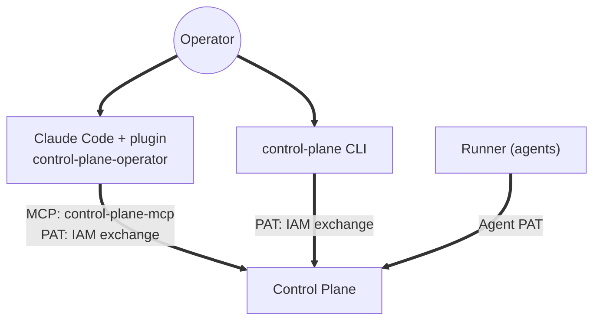

# Operator guide

This section is for the person who manages work in Control Plane: assigns tasks to people
and agents, claims tasks personally, monitors runs, decides approvals, and hands work off
between harnesses. It describes the working surfaces and everyday workflows.

## Who the operator is

An operator is a Control Plane human principal (kind `human`) with a binding that grants
permissions on tasks, claims, runs, approvals, and reading events. Unlike an agent, a person
can hold `approvals.decide` and `admin`: it is a person who decides gates and changes
configuration.

The operator's main rule: **the authoritative state lives in Control Plane**. Tasks, claims,
runs, approvals, checkpoints, artifacts, and events are the single source of truth.
Conversations with an assistant, repository files, and local notes are not. If a transcript
says one thing and Control Plane says another, Control Plane is right.

## Surfaces

| Surface | What it is for | How it talks to Control Plane |
|---|---|---|
| [MCP plugin for Claude Code](mcp-plugin.md) | working on tasks directly from a repository: claim a task, do it in code, record evidence, hand it off | the `control-plane-mcp` MCP server (`cp_*` tools) |
| [`control-plane` CLI](../control-plane/cli-and-mcp.md) | an overview from the terminal and scripts: the work queue, tasks, claims and runs, the list of approvals | the core REST API, the person's PAT |

Both are clients of the same API under the same human identity. You can review
the queue from the CLI, then claim and complete a task in Claude Code and decide
the approval there as well: the server sees one principal and one set of rules.

## Decisions only a person makes

Regardless of the surface, an assistant or an interface must not, without an explicit
decision by a person:

- create or change tasks, or add and remove relations;
- write or edit comments (they speak on the person's behalf);
- claim a task or start a run;
- prepare a handoff;
- approve or reject approvals;
- complete a task or a run.

This is an interface rule, not a security boundary: the server checks permissions, tenant
isolation, versions, and the fencing token on every call regardless. But it is exactly what
distinguishes an operator harness from an autonomous runner, which claims tasks on its own.

## How to get started

1. Get a human principal and a binding from your administrator (see
   [Tenants and principals](../iam/principals.md)).
2. To work from a repository, issue a PAT and set up the
   [MCP plugin](mcp-plugin.md).
3. For an overview from the terminal and scripts, set up the
   [`control-plane` CLI](../control-plane/cli-and-mcp.md).
4. Read [Everyday workflows](workflows.md).

## See also

- [Key concepts](../overview/concepts.md)
- [Work model](../control-plane/work-model.md)
- [Approvals](../control-plane/approvals.md)
- [Agents and runner](../runner/index.md)
