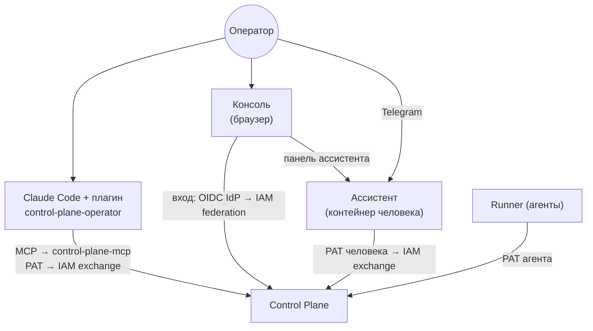

# Работа оператора

Раздел для человека, который управляет работой в Control Plane: ставит задачи людям и
агентам, берёт задачи сам, следит за прогонами, решает approvals и передаёт работу между
харнессами. Здесь описаны рабочие поверхности и повседневные сценарии.

## Кто такой оператор

Оператор — human principal Control Plane (kind `human`) с binding, дающим ему права на
задачи, claims, runs, approvals и чтение событий. В отличие от агента, у человека могут быть
`approvals.decide` и `admin`: именно человек решает gate'ы и меняет конфигурацию.

Главное правило работы оператора: **авторитетное состояние живёт в Control Plane**. Задачи,
claims, runs, approvals, checkpoints, артефакты и события — единственный источник истины.
Переписка с ассистентом, файлы репозитория и локальные заметки — нет. Если транскрипт
говорит одно, а Control Plane другое, прав Control Plane.

## Поверхности

| Поверхность | Для чего | Как говорит с Control Plane |
|---|---|---|
| [MCP-плагин для Claude Code](mcp-plugin.md) | работа с задачами прямо из репозитория: взять задачу, сделать её в коде, записать evidence, передать | MCP-сервер `control-plane-mcp` (инструменты `cp_*`) |
| [Консоль](console.md) | видимость работающей организации: пульс и «Ждёт вас», происхождение работы, процессы, правила, агенты; управляющие действия, пакеты, люди и роли | вход через OIDC IdP организации и IAM federation, в ядро — короткий токен человека |
| [Ассистент](assistant.md) | беседа из панели консоли и из Telegram: вопросы про то, что на экране, поручения, решения по approvals, своя работа | персональный контейнер человека ([рабочее место](../workplace/index.md)); в ядро — PAT человека, каждая мутация — с подтверждением |

Все они — клиенты одного API под одной identity человека. Задачу можно поручить ассистенту,
взять в Claude Code и завершить там же, а approval решить в консоли — сервер видит
один principal и одни правила.

## Решения, которые принимает только человек

Независимо от поверхности, ассистент или интерфейс не должен без явного решения человека:

- создавать и менять задачи, добавлять и удалять связи;
- писать и править комментарии (они говорятся от имени человека);
- захватывать задачу (claim) и начинать run;
- готовить handoff;
- одобрять и отклонять approvals;
- завершать задачу или run.

Это правило интерфейса, а не граница безопасности: сервер в любом случае проверяет права,
изоляцию tenant'а, версии и fencing token на каждом вызове. Но именно оно отличает
операторский харнесс от автономного runner'а, который claim'ит сам.

## Как начать

1. Получите у администратора human principal и binding (см.
   [Tenants и principals](../iam/principals.md)).
2. Для работы из репозитория — выпустите PAT и настройте
   [MCP-плагин](mcp-plugin.md).

3. Чтобы видеть организацию целиком, решать и управлять — откройте [консоль](console.md)
   (`/console/`).
4. Для вопросов и поручений — откройте в консоли [ассистента](assistant.md) (⌘J / Ctrl+J).
   Та же беседа продолжается в Telegram.
5. Прочитайте [Повседневные сценарии](workflows.md).

## См. также

- [Консоль](console.md)
- [Ключевые понятия](../overview/concepts.md)
- [Модель работы](../control-plane/work-model.md)
- [Approvals](../control-plane/approvals.md)
- [Агенты и runner](../runner/index.md)
