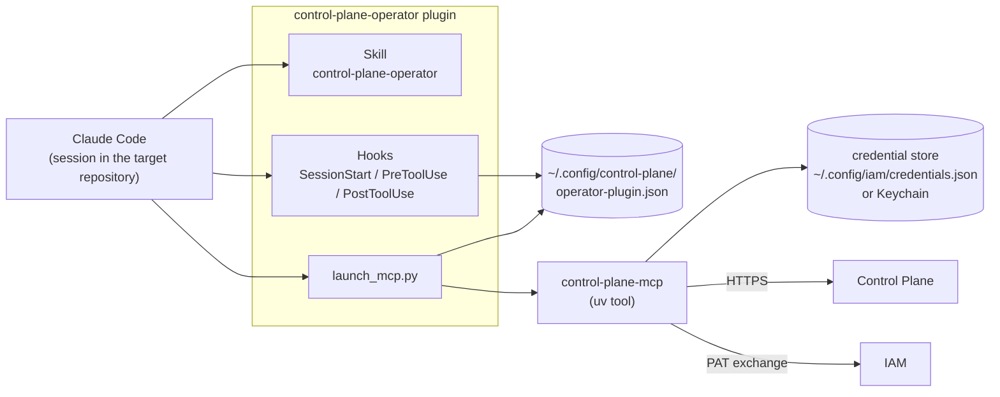

# MCP plugin for Claude Code

The `control-plane-operator` plugin turns Claude Code (and Codex) into an operator harness
for Control Plane: it binds a repository to a project, tells the agent the working contract
when a session starts, and does not let it call `cp_*` tools outside the bound repository.
This article is for operators and for administrators of workstations.

## How it works



| Part | What it does |
|---|---|
| Skill `control-plane-operator` | instructions for the agent: session start, the boundaries of human decisions, task type statuses, comments, execution, handoff |
| Hook `SessionStart` | if the session's cwd is inside a bound repository, adds the binding (Project, Workspace, alias, repository, intent) and the startup order to the context |
| Hook `PreToolUse` | blocks `cp_*` outside a binding, for another Project/Workspace, and mutations under `read-only`; requires focusing on the project first |
| Hook `PostToolUse` | remembers a successful `cp_focus_project` for this session |
| `launch_mcp.py` | starts `control-plane-mcp` from `PATH`, passing it the server address and the IAM coordinates from the config |
| `control-plane-mcp` | the MCP server itself: a stateless adapter over the `control_plane_client` SDK and the REST API |

The plugin is **dual-host**: the same directory contains manifests for Claude Code
(`.claude-plugin/plugin.json`) and Codex (`.codex-plugin/plugin.json`). The harness type is
determined at startup: `codex` in Codex, `claude-code` otherwise.

## Requirements

| What | Why |
|---|---|
| Python 3.12+, `uv` | to install the `control-plane` package |
| `control-plane-mcp` in `PATH` | the MCP server itself; without it the plugin fails with `control-plane-mcp is not installed or not in PATH` |
| Claude Code 2.1+ (or Codex CLI) | the plugin host |
| a human principal with a binding and a PAT | the operator's identity |
| the `iam` CLI (iam-service package) | to store the PAT in the credential store |

## Installation

### 1. MCP server

```bash
git clone <control-plane-repo-url> services/control-plane
git clone <platform-auth-sdk-repo-url> sdk/platform-auth-sdk   # the delivery layout
cd services/control-plane
uv tool install --reinstall .
which control-plane-mcp
```

The package installs `control-plane`, `control-plane-mcp`, `control-plane-agent`, and
`control-plane-opencode`. `platform-auth-sdk` is the path dependency
`../../sdk/platform-auth-sdk` and must sit in the delivery layout (`services/`, `sdk/`),
the same as in a clone of the root repository with its submodules.

### 2. Operator PAT

An IAM administrator issues the PAT for a person (for a person, IAM requires a fresh
authentication context; see [Credentials and PATs](../iam/credentials.md)). Scopes carry the
audience prefix: `control-plane:read`, `control-plane:write`, and, if needed,
`control-plane:admin`.

Store the PAT in the credential store:

```bash
cat > /tmp/iam-binding.json <<'EOF'
{"iamUrl": "https://platform.example.com/iam", "tenantId": "<iam-tenant-id>"}
EOF
IAM_BINDING_FILE=/tmp/iam-binding.json iam auth login      # hidden token input
IAM_BINDING_FILE=/tmp/iam-binding.json iam auth status
```

`iam auth login` validates the token by introspection (tenant and audience) and stores it in
the Keychain (macOS) or in `~/.config/iam/credentials.json` (`0600`). Instead of
`IAM_BINDING_FILE`, you can keep a non-secret `.iam/binding.json` in the directory you run
the command from.

!!! danger "The token never goes into configs"
    Not into `operator-plugin.json`, not into `.mcp.json`, and not into command arguments.
    The plugin config is rejected as a whole if it contains a `token`, `secret`,
    `password`, `apiKey`, or `clientSecret` field, or a value starting with `iam_pat_` or
    `cp_`.

### 3. Plugin configuration

`~/.config/control-plane/operator-plugin.json` (set a different path with the
`CONTROL_PLANE_OPERATOR_CONFIG` variable; if `XDG_CONFIG_HOME` is set, the file lives under it): <!-- drift:external operator-harness-template -->

```json
{
  "version": 1,
  "server": "https://platform.example.com",
  "iam": {
    "url": "https://platform.example.com/iam",
    "tenant": "<iam-tenant-id>",
    "audience": "control-plane",
    "scopes": ["control-plane:read", "control-plane:write"]
  },
  "bindings": [
    {
      "alias": "backend",
      "repository": "git:example/backend",
      "localPath": "/home/alice/src/backend",
      "project": "<project-id>",
      "workspace": "<workspace-id>",
      "intent": "read-write"
    },
    {
      "alias": "docs",
      "repository": "git:example/docs",
      "localPath": "/home/alice/src/docs",
      "project": "<project-id>",
      "workspace": "<workspace-id>",
      "intent": "read-only"
    }
  ]
}
```

| Field | Rule |
|---|---|
| `version` | exactly `1` |
| `server` | an `http(s)://` URL of Control Plane |
| `iam` | optional; without it the MCP server looks for a legacy API key. With it, `tenant` is required: a half-configured IAM block does not silently fall back to the key |
| `iam.audience` | defaults to `control-plane` |
| `bindings[].alias` | unique |
| `bindings[].localPath` | an **absolute** path, unique; used only locally and never sent to Control Plane |
| `bindings[].repository` | a stable repository identifier (not a path) |
| `bindings[].project`, `workspace` | the Project and Workspace ids in Control Plane |
| `bindings[].intent` | `read-write` (default) or `read-only` |

If the cwd matches several bindings, the deepest one wins: a nested repository overrides
the binding of its parent directory. Two bindings of the same depth for one path produce the
error `ambiguous repository binding`.

You can generate the config from a target registry with the plugin's script:

```bash
python3 <plugin-dir>/scripts/configure.py \
  --server https://platform.example.com --targets targets.json
```

The script writes the file atomically with `0600` permissions and validates it immediately.

### 4. Installing into the host

The plugin ships as a marketplace directory (`.claude-plugin/marketplace.json`):

=== "Claude Code"

    ```bash
    claude plugin marketplace add <path-to-marketplace> --scope user
    claude plugin install control-plane-operator@<marketplace-name> --scope user
    ```

=== "Codex"

    ```bash
    codex plugin marketplace add <path-to-marketplace>
    codex plugin add control-plane-operator@<marketplace-name>
    ```

After installing, open a **new** session directly in the target repository. In an unbound
directory the hook adds nothing to the context, and the guard rejects accidental `cp_*`
calls.

## Session start

On `startup`, `resume`, `clear`, and `compact`, the `SessionStart` hook tells the agent:

> Control Plane is active for this repository. Local binding: Project …; Workspace …;
> target alias …; repository …; intent … Call cp_whoami, then cp_context …

Then, following the skill, the agent:

1. calls `cp_whoami`, then `cp_context`;
2. shows the person the principal, the project focus, the alias, and the repository;
3. if `projectFocus.id` does not match the binding's Project, calls `cp_focus_project` with
   exactly that id and then `cp_context` again;
4. never sends an absolute local path to Control Plane.

### The `PreToolUse` guard

| Situation | Guard response |
|---|---|
| the config cannot be read or is invalid | `Control Plane plugin configuration is invalid: …` |
| cwd is outside all bindings | `The current repository has no Control Plane binding; refusing scoped tool access.` |
| `cp_focus_project` with a different Project | `Project focus must match the current repository binding (…)` |
| a `project` / `project_id` / `workspace_id` argument does not match the binding | `… does not match the current repository Project/Workspace.` |
| any tool other than `cp_whoami`, `cp_context`, `cp_focus_project`, `cp_get_project`, `cp_list_projects` before focusing | `Focus this session first with cp_focus_project …` |
| a mutating tool with `intent: read-only` | `The current repository binding is read-only.` |

The guard protects against accidentally working in the wrong repository; it is not
authorization. The server still checks permissions, tenant, versions, leases, and fencing on
every authoritative action.

!!! tip "\"current repository has no Control Plane binding\""
    The binding is determined by the session's cwd. If you worked in another directory and
    `cp_*` started returning this refusal, move the cwd back to the bound repository or open
    a session in it.

## `cp_*` tools

Read-only (call freely):

| Tool | Purpose |
|---|---|
| `cp_whoami` | tenant, principal, permissions, project focus |
| `cp_context` | active sessions, my claims and runs (including suspended ones), roles, skills, pending approvals, the event cursor |
| `cp_get_context` | the task's working context: state plus memory |
| `cp_list_work` | tasks available to me (a hint: the claim may still fail); `assigned_to_me` narrows it |
| `cp_list_tasks` | tasks in any state; filters `status`, `system_status_category`, `type_key`, assignee, dates, `sort` |
| `cp_get_task` | the task, claimability diagnostics, and allowed status transitions |
| `cp_list_task_types`, `cp_get_task_type` | the type registry: statuses, transitions, field schema, approval outcomes |
| `cp_list_goals`, `cp_get_goal` | goals and their work |
| `cp_list_comments` | the task discussion |
| `cp_get_run`, `cp_get_run_context` | a run and its context |
| `cp_list_artifacts`, `cp_list_approvals`, `cp_list_events` | artifacts, approvals, the event log |
| `cp_list_projects`, `cp_get_project`, `cp_project_config`, `cp_workspace_tree` | projects and the Workspace tree |
| `cp_search_tools`, `cp_describe_tool`, `cp_describe_skill` | the catalog of tools and skills |
| `cp_list_child_handles`, `cp_resolve_child`, `cp_list_run_controls` | child runs and control messages |

Mutating (only after an explicit decision by a person):

| Tool | Purpose |
|---|---|
| `cp_create_task`, `cp_update_task` | create a task (`type_key`, `assignee_id`, `workspace_id`, `goal_id`, `acceptance`, …) and change it at an exact `expected_version` |
| `cp_add_task_relation`, `cp_remove_task_relation` | parent/dependency relations (the server checks for cycles) |
| `cp_create_goal`, `cp_update_goal` | goals |
| `cp_comment`, `cp_edit_comment` | a comment on the person's behalf; you can edit only your own, by version, with the revision preserved |
| `cp_claim_task`, `cp_release_task` | claim and release |
| `cp_start_run` | start a run under the current claim |
| `cp_checkpoint`, `cp_record_action`, `cp_create_artifact` | evidence: state for resuming, audit, a result by reference |
| `cp_remember` | a fact or decision into long-term memory |
| `cp_request_approval`, `cp_approve`, `cp_reject` | approvals (`gate=true` blocks the task) |
| `cp_suspend_run`, `cp_prepare_handoff` | pause while waiting; atomic handoff to another harness |
| `cp_complete_run`, `cp_fail_run` | complete a run (and, by default, the task) or report an honest failure |
| `cp_focus_project` | the session's local focus on a project (grants no permissions) |
| `cp_invoke_skill`, `cp_launch_child`, `cp_revoke_child`, `cp_control_run`, `cp_ack_run_control` | skills, child runs, run control |

The full reference is [CLI and MCP server](../control-plane/cli-and-mcp.md).

## Working rules

### An explicit decision by a person

Before creating or changing a task or a relation, commenting, claiming, starting a run,
handing off, deciding an approval, or completing, the agent shows the person exactly what
will change and waits for an explicit "yes". The server's tools carry the same caveat
("call only after the human explicitly confirms"), and the host may additionally ask for
permission to call a tool.

### Statuses belong to the task type

There is no fixed list of statuses: the tenant's task type declares them. Only five system
categories are universal: `backlog`, `active`, `blocked`, `terminal_success`,
`terminal_cancelled`.

- Before changing a status, the agent reads `transitions` from `cp_get_task`: a transition
  with `route: update` goes through `cp_update_task`, and one with `route: complete` only
  through completion (which releases the claim and closes the run).
- When talking to a person, use the tenant's status key; when filtering by meaning, use
  `system_status_category`.

### Comments are coordination, artifacts are work

A decision and its reason, a question to a person, the reason for a block, a note for the
next executor: these go into a comment. The result of the work is an artifact (a commit, PR,
document, report). The comment's author is the session's principal, taken from the
credential, not from the text. You cannot delete a comment, only correct it with an edit.

### Never record

Chain-of-thought, raw prompts, chat transcripts, credentials, terminal history, secrets, and
absolute local paths: not in tasks, not in checkpoints, not in artifacts, not in comments.
The server rejects text that looks like a credential.

### `stale_claim`

If a tool returned `stale_claim`, `task_already_claimed`, or `run_not_active`, ownership of
the task is lost (the lease expired, or someone took over the task). The response contains a
hint:

```json
{
  "error": "stale_claim",
  "message": "…",
  "hint": "Ownership of this task is not (or no longer) yours. Do not retry the write; call cp_context, tell the user, and decide together."
}
```

The correct reaction: immediately stop authoritative writes, call `cp_context`, show the
person the state, and decide together. Do not retry old checkpoints or completions.

The MCP server itself keeps the session lease and the claim alive with a background
heartbeat every 60 seconds while it holds the claim; a failed heartbeat surfaces as an error
on the next tool call.

## Upgrading

The MCP plugin runs the **locally installed** `control-plane-mcp`, not the server's code.
After a Control Plane upgrade, new tools (`cp_*`) exist on the server but not in the harness
until you reinstall the package:

```bash
cd services/control-plane && git pull --ff-only
cd ../../sdk/platform-auth-sdk && git pull --ff-only
cd ../../services/control-plane && uv tool install --reinstall .
```

New tools appear only in a **new** Claude Code session.

!!! warning "Upgrading the plugin itself"
    Do not remove the active plugin version while sessions that loaded its hooks are open:
    the host keeps referring to the old path in the version cache. Install the new version
    alongside, open a new session, and only then clean up the old cache.

Upgrading the Control Plane server interrupts MCP calls for a few seconds; a live claim
survives this thanks to its lease.

## Common problems

| Symptom | Cause and fix |
|---|---|
| The MCP server does not start: `control-plane-mcp is not installed or not in PATH` | install the package with `uv tool install` and check the host's `PATH` |
| `operator plugin config not found` / `config version must be 1` | `operator-plugin.json` is missing or corrupted |
| `… must not contain a credential` | the config contains a token: remove it and use `iam auth login` |
| `iam_not_authenticated` | no PAT is stored for this IAM URL and tenant pair; run `iam auth login` |
| `iam_credential_ambiguous` | the machine has several PATs for the same tenant; set `IAM_PRINCIPAL` in the Claude Code environment |
| `not_configured` / `not_authenticated` without an IAM block | the legacy path: run `control-plane init` and `control-plane login`, or add an `iam` block |
| `cp_*` refuse with "no Control Plane binding" | the session's cwd is outside a bound repository |
| `Focus this session first…` | call `cp_focus_project` with the Project from the binding |
| new `cp_*` are not visible | the uv tool was not reinstalled or the session was not restarted |
| long MCP responses break in a custom client | do not run stdio MCP through a PTY: canonical mode truncates long JSON-RPC lines |

## See also

- [Everyday workflows](workflows.md)
- [CLI and MCP server](../control-plane/cli-and-mcp.md)
- [Harness protocol](../control-plane/harness-protocol.md)
- [Credentials and PATs](../iam/credentials.md)
- [Assistant](assistant.md)
