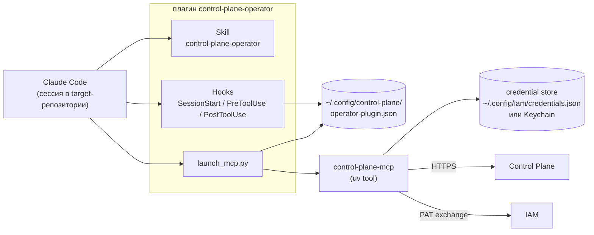

# MCP-плагин для Claude Code

Плагин `control-plane-operator` превращает Claude Code (и Codex) в операторский харнесс
Control Plane: привязывает репозиторий к проекту, при старте сессии подсказывает агенту
контракт работы и не даёт вызывать инструменты `cp_*` вне привязанного репозитория. Статья
для оператора и администратора рабочих мест.

## Устройство



| Часть | Что делает |
|---|---|
| Skill `control-plane-operator` | инструкции агенту: старт сессии, границы решений человека, статусы типа задачи, комментарии, исполнение, handoff |
| Hook `SessionStart` | если cwd сессии внутри привязанного репозитория — добавляет в контекст binding (Project, Workspace, alias, repository, intent) и порядок старта |
| Hook `PreToolUse` | запрещает `cp_*` вне привязки, чужой Project/Workspace и мутации при `read-only`; требует сначала сфокусироваться на проекте |
| Hook `PostToolUse` | запоминает успешный `cp_focus_project` для этой сессии |
| `launch_mcp.py` | запускает `control-plane-mcp` из `PATH`, передав ему адрес сервера и координаты IAM из конфига |
| `control-plane-mcp` | сам MCP-сервер: stateless-адаптер над SDK `control_plane_client` и REST API |

Плагин — **двуххостовый**: тот же каталог содержит манифесты для Claude Code
(`.claude-plugin/plugin.json`) и Codex (`.codex-plugin/plugin.json`). Тип харнесса
определяется при запуске: в Codex — `codex`, иначе `claude-code`.

## Требования

| Что | Зачем |
|---|---|
| Python 3.12+, `uv` | установка пакета `control-plane` |
| `control-plane-mcp` в `PATH` | сам MCP-сервер; без него плагин падает с `control-plane-mcp is not installed or not in PATH` |
| Claude Code 2.1+ (или Codex CLI) | хост плагина |
| human principal с binding и PAT | identity оператора |
| `iam` CLI (пакет iam-service) | записать PAT в credential store |

## Установка

### 1. MCP-сервер

```bash
git clone <control-plane-repo-url> services/control-plane
git clone <platform-auth-sdk-repo-url> sdk/platform-auth-sdk   # раскладка поставки
cd services/control-plane
uv tool install --reinstall .
which control-plane-mcp
```

Пакет ставит `control-plane`, `control-plane-mcp`, `control-plane-agent`,
`control-plane-opencode`. `platform-auth-sdk` подключён path-зависимостью
`../../sdk/platform-auth-sdk` и должен лежать в раскладке поставки (`services/`, `sdk/`) —
так же, как в клоне корневого репозитория с сабмодулями.

### 2. PAT оператора

PAT человеку выпускает администратор IAM (для человека IAM требует свежий authentication
context — см. [Credentials и PAT](../iam/credentials.md)). Scopes — с префиксом audience:
`control-plane:read`, `control-plane:write`, при необходимости `control-plane:admin`.

Запишите PAT в credential store:

```bash
cat > /tmp/iam-binding.json <<'EOF'
{"iamUrl": "https://platform.example.com/iam", "tenantId": "<iam-tenant-id>"}
EOF
IAM_BINDING_FILE=/tmp/iam-binding.json iam auth login      # скрытый ввод токена
IAM_BINDING_FILE=/tmp/iam-binding.json iam auth status
```

`iam auth login` проверяет токен интроспекцией (tenant и audience) и кладёт его в Keychain
(macOS) или `~/.config/iam/credentials.json` (`0600`). Вместо `IAM_BINDING_FILE` можно
держать несекретный `.iam/binding.json` в каталоге, откуда запускается команда.

!!! danger "Токен не кладётся в конфиги"
    Ни в `operator-plugin.json`, ни в `.mcp.json`, ни в аргументы команд. Конфиг плагина
    отклоняется целиком, если в нём есть поле `token`, `secret`, `password`, `apiKey`,
    `clientSecret` или значение, начинающееся с `iam_pat_` или `cp_`.

### 3. Конфигурация плагина

`~/.config/control-plane/operator-plugin.json` (другой путь — переменная
`CONTROL_PLANE_OPERATOR_CONFIG`; при заданном `XDG_CONFIG_HOME` — под ним): <!-- drift:external operator-harness-template -->

```json
{
  "version": 1,
  "server": "https://platform.example.com",
  "iam": {
    "url": "https://platform.example.com/iam",
    "tenant": "<iam-tenant-id>",
    "audience": "control-plane",
    "scopes": ["control-plane:read", "control-plane:write"]
  },
  "bindings": [
    {
      "alias": "backend",
      "repository": "git:example/backend",
      "localPath": "/home/alice/src/backend",
      "project": "<project-id>",
      "workspace": "<workspace-id>",
      "intent": "read-write"
    },
    {
      "alias": "docs",
      "repository": "git:example/docs",
      "localPath": "/home/alice/src/docs",
      "project": "<project-id>",
      "workspace": "<workspace-id>",
      "intent": "read-only"
    }
  ]
}
```

| Поле | Правило |
|---|---|
| `version` | ровно `1` |
| `server` | `http(s)://` URL Control Plane |
| `iam` | необязателен; без него MCP-сервер ищет legacy API-ключ. С ним `tenant` обязателен — наполовину настроенный IAM не откатывается молча на ключ |
| `iam.audience` | по умолчанию `control-plane` |
| `bindings[].alias` | уникален |
| `bindings[].localPath` | **абсолютный** путь, уникален; используется только локально и никогда не отправляется в Control Plane |
| `bindings[].repository` | стабильный идентификатор репозитория (не путь) |
| `bindings[].project`, `workspace` | id Project и Workspace в Control Plane |
| `bindings[].intent` | `read-write` (по умолчанию) или `read-only` |

Если cwd попадает в несколько привязок, выигрывает самая глубокая: вложенный репозиторий
перекрывает привязку родительского каталога. Две привязки одинаковой глубины для одного пути
— ошибка `ambiguous repository binding`.

Конфиг можно сгенерировать из реестра целей скриптом плагина:

```bash
python3 <plugin-dir>/scripts/configure.py \
  --server https://platform.example.com --targets targets.json
```

Скрипт пишет файл атомарно с правами `0600` и сразу проверяет его.

### 4. Установка в хост

Плагин поставляется каталогом-маркетплейсом (`.claude-plugin/marketplace.json`):

=== "Claude Code"

    ```bash
    claude plugin marketplace add <path-to-marketplace> --scope user
    claude plugin install control-plane-operator@<marketplace-name> --scope user
    ```

=== "Codex"

    ```bash
    codex plugin marketplace add <path-to-marketplace>
    codex plugin add control-plane-operator@<marketplace-name>
    ```

После установки откройте **новую** сессию прямо в target-репозитории. В непривязанном
каталоге hook ничего не добавляет в контекст, а guard отклоняет случайные вызовы `cp_*`.

## Старт сессии

При `startup`, `resume`, `clear` и `compact` hook `SessionStart` сообщает агенту:

> Control Plane is active for this repository. Local binding: Project …; Workspace …;
> target alias …; repository …; intent … Call cp_whoami, then cp_context …

Дальше агент по skill:

1. вызывает `cp_whoami`, затем `cp_context`;
2. показывает человеку principal, фокус проекта, alias и репозиторий;
3. если `projectFocus.id` не совпадает с Project привязки — `cp_focus_project` ровно с этим
   id и снова `cp_context`;
4. никогда не отправляет в Control Plane абсолютный локальный путь.

### Guard `PreToolUse`

| Ситуация | Ответ guard'а |
|---|---|
| конфиг не читается или некорректен | `Control Plane plugin configuration is invalid: …` |
| cwd вне привязок | `The current repository has no Control Plane binding; refusing scoped tool access.` |
| `cp_focus_project` с другим Project | `Project focus must match the current repository binding (…)` |
| аргумент `project` / `project_id` / `workspace_id` не совпадает с привязкой | `… does not match the current repository Project/Workspace.` |
| любой инструмент, кроме `cp_whoami`, `cp_context`, `cp_focus_project`, `cp_get_project`, `cp_list_projects`, до фокусировки | `Focus this session first with cp_focus_project …` |
| мутирующий инструмент при `intent: read-only` | `The current repository binding is read-only.` |

Guard — защита от случайной работы не в том репозитории, а не авторизация. Сервер всё равно
проверяет права, tenant, версии, аренды и fencing на каждом авторитетном действии.

!!! tip "«current repository has no Control Plane binding»"
    Binding определяется по cwd сессии. Если вы поработали в другом каталоге и `cp_*` стали
    отвечать этим отказом — верните cwd в привязанный репозиторий или откройте сессию в нём.

## Инструменты `cp_*`

Read-only (вызываются свободно):

| Инструмент | Назначение |
|---|---|
| `cp_whoami` | tenant, principal, права, фокус проекта |
| `cp_context` | активные сессии, мои claims и runs (включая suspended), роли, скиллы, ожидающие approvals, курсор событий |
| `cp_get_context` | рабочий контекст задачи: состояние плюс память |
| `cp_list_work` | доступные мне задачи (подсказка: claim может не удаться); `assigned_to_me` сужает |
| `cp_list_tasks` | задачи в любом состоянии; фильтры `status`, `system_status_category`, `type_key`, исполнитель, даты, `sort` |
| `cp_get_task` | задача, диагностика claimability и допустимые переходы статуса |
| `cp_list_task_types`, `cp_get_task_type` | реестр типов: статусы, переходы, схема полей, исходы approval |
| `cp_list_goals`, `cp_get_goal` | цели и их работа |
| `cp_list_comments` | обсуждение задачи |
| `cp_get_run`, `cp_get_run_context` | run и его контекст |
| `cp_list_artifacts`, `cp_list_approvals`, `cp_list_events` | артефакты, approvals, журнал событий |
| `cp_list_projects`, `cp_get_project`, `cp_project_config`, `cp_workspace_tree` | проекты и дерево Workspace |
| `cp_search_tools`, `cp_describe_tool`, `cp_describe_skill` | каталог инструментов и скиллов |
| `cp_list_child_handles`, `cp_resolve_child`, `cp_list_run_controls` | дочерние run и управляющие сообщения |

Мутирующие (только после явного решения человека):

| Инструмент | Назначение |
|---|---|
| `cp_create_task`, `cp_update_task` | создать задачу (`type_key`, `assignee_id`, `workspace_id`, `goal_id`, `acceptance`, …) и изменить её по точной `expected_version` |
| `cp_add_task_relation`, `cp_remove_task_relation` | связи parent/dependency (сервер проверяет циклы) |
| `cp_create_goal`, `cp_update_goal` | цели |
| `cp_comment`, `cp_edit_comment` | комментарий от имени человека; правка только своего, по версии, с сохранением ревизии |
| `cp_claim_task`, `cp_release_task` | захват и освобождение |
| `cp_start_run` | начать run под текущим claim |
| `cp_checkpoint`, `cp_record_action`, `cp_create_artifact` | evidence: состояние для resume, аудит, результат по ссылке |
| `cp_remember` | факт или решение в долговременную память |
| `cp_request_approval`, `cp_approve`, `cp_reject` | approvals (`gate=true` блокирует задачу) |
| `cp_suspend_run`, `cp_prepare_handoff` | пауза на время ожидания; атомарная передача другому харнессу |
| `cp_complete_run`, `cp_fail_run` | завершение run (по умолчанию и задачи) и честный провал |
| `cp_focus_project` | локальный фокус сессии на проекте (прав не даёт) |
| `cp_invoke_skill`, `cp_launch_child`, `cp_revoke_child`, `cp_control_run`, `cp_ack_run_control` | скиллы, дочерние run, управление run |

Полный справочник — [CLI и MCP-сервер](../control-plane/cli-and-mcp.md).

## Правила работы

### Явное решение человека

Перед созданием или правкой задачи, связи, комментарием, claim, стартом run, handoff,
решением approval и завершением агент показывает человеку, что именно изменится, и ждёт
явного «да». Инструменты сервера описаны с той же оговоркой («call only after the human
explicitly confirms»), а хост может дополнительно спрашивать разрешение на вызов инструмента.

### Статусы принадлежат типу задачи

Фиксированного списка статусов нет: их объявляет тип задачи tenant'а. Универсальны только
пять системных категорий — `backlog`, `active`, `blocked`, `terminal_success`,
`terminal_cancelled`.

- Перед сменой статуса агент читает `transitions` из `cp_get_task`: переход с
  `route: update` идёт через `cp_update_task`, с `route: complete` — только завершением
  (оно снимает claim и закрывает run).
- Человеку называют ключ статуса tenant'а, а в фильтрах по смыслу используют
  `system_status_category`.

### Комментарии — координация, артефакты — работа

Решение и его причина, вопрос человеку, причина блокировки, заметка следующему — в
комментарий. Результат работы — артефакт (коммит, PR, документ, отчёт). Автор комментария —
principal сессии, он берётся из credential, а не из текста. Удалить комментарий нельзя —
только исправить правкой.

### Никогда не записывать

Chain-of-thought, сырые prompts, транскрипты чата, credentials, историю терминала, секреты
и абсолютные локальные пути — ни в задачи, ни в checkpoints, ни в артефакты, ни в
комментарии. Сервер отклоняет текст, похожий на credential.

### `stale_claim`

Если инструмент вернул `stale_claim`, `task_already_claimed` или `run_not_active`, владение
задачей потеряно (аренда истекла, задачу перехватили). Ответ содержит подсказку:

```json
{
  "error": "stale_claim",
  "message": "…",
  "hint": "Ownership of this task is not (or no longer) yours. Do not retry the write; call cp_context, tell the user, and decide together."
}
```

Правильная реакция: немедленно прекратить авторитетные записи, вызвать `cp_context`,
показать человеку состояние и решить вместе. Не повторять старые checkpoint и completion.

MCP-сервер сам держит аренду сессии и claim фоновым heartbeat'ом раз в 60 секунд, пока claim
у него; упавший heartbeat всплывает ошибкой на следующем вызове инструмента.

## Обновление

MCP-плагин запускает **локально установленный** `control-plane-mcp`, а не код сервера. После
обновления Control Plane новые инструменты (`cp_*`) есть на сервере, но не в харнессе, пока
не переустановлен пакет:

```bash
cd services/control-plane && git pull --ff-only
cd ../../sdk/platform-auth-sdk && git pull --ff-only
cd ../../services/control-plane && uv tool install --reinstall .
```

Новые инструменты появляются только в **новой** сессии Claude Code.

!!! warning "Обновление самого плагина"
    Не удаляйте активную версию плагина, пока открыты сессии, загрузившие её hooks: хост
    продолжит обращаться к старому пути в кэше версий. Поставьте новую версию рядом,
    откройте новую сессию и только потом чистите старый кэш.

Апгрейд сервера Control Plane на несколько секунд роняет MCP-вызовы; живой claim переживает
это благодаря аренде.

## Типичные проблемы

| Симптом | Причина и решение |
|---|---|
| MCP-сервер не стартует: `control-plane-mcp is not installed or not in PATH` | поставьте пакет `uv tool install`, проверьте `PATH` хоста |
| `operator plugin config not found` / `config version must be 1` | нет или испорчен `operator-plugin.json` |
| `… must not contain a credential` | в конфиге токен — удалите, используйте `iam auth login` |
| `iam_not_authenticated` | PAT не записан для этой пары IAM URL и tenant; `iam auth login` |
| `iam_credential_ambiguous` | на машине несколько PAT одного tenant'а; задайте `IAM_PRINCIPAL` в окружении Claude Code |
| `not_configured` / `not_authenticated` без IAM-блока | legacy-путь: `control-plane init` и `control-plane login`, либо добавьте блок `iam` |
| `cp_*` отказывают «no Control Plane binding» | cwd сессии вне привязанного репозитория |
| `Focus this session first…` | вызовите `cp_focus_project` с Project из привязки |
| новые `cp_*` не видны | не переустановлен uv-tool или не перезапущена сессия |
| длинные ответы MCP ломаются в самописном клиенте | не запускайте stdio MCP через PTY: canonical-режим обрезает длинные строки JSON-RPC |

## См. также

- [Повседневные сценарии](workflows.md)
- [CLI и MCP-сервер](../control-plane/cli-and-mcp.md)
- [Харнесс-протокол](../control-plane/harness-protocol.md)
- [Credentials и PAT](../iam/credentials.md)
