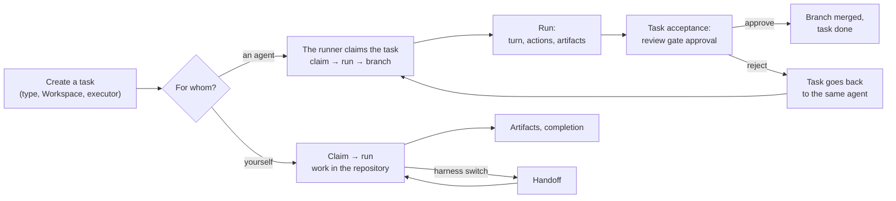

# Everyday workflows

Step-by-step procedures for the operator: create a task, give it to an agent, follow a run,
accept a review, claim a task yourself, hand work off to another harness, and recover after
losing ownership. The workflows are shown for the Claude Code MCP plugin and for the
[assistant](assistant.md) in the console; the `cp_*` calls are what the assistant does on
your command, after your explicit decision.

## The big picture



## Create a task

=== "Personal workspace"

    Describe the task to the assistant: context, definition of done, type (for example
    `coding-task`), Workspace, due date, and assignee. It shows you a draft and creates the
    task (`cp_create_task`, or `cp_delegate` if you assign it right away) only after you
    confirm.

=== "Claude Code"

    Ask the assistant to create a task. It shows you a draft and calls the tool only after
    you say "yes":

    ```text
    cp_list_task_types()                       # which type to choose
    cp_create_task(
      title="Add a due date filter to the task list",
      description="Context… Definition of done: …",
      type_key="coding-task",
      priority="high",
      assignee_id="<cp-principal-id>",
      due_date="2026-10-01"
    )
    ```

    `workspace_id` and the project are filled in from the repository binding; the plugin
    guard does not let you create a task in someone else's project.

!!! tip "A good description for an agent"
    An agent reads the description literally. State **what** to do and how to verify the
    result (which tests, which behavior). Do not repeat **how** the repository is organized
    in every task: that is the job of the runner's conventions file
    ([Adapters](../runner/adapters.md)). A task that cannot be verified gets closed by the
    agent "as it understood it".

## Assign a task to an agent

A runner in `CONTROL_PLANE_AGENT_ONLY_ASSIGNED=1` mode claims only tasks assigned to its
principal. So "give a task to an agent" means making the agent's CP principal the assignee.

1. Get the executor's CP principal id from your administrator or from the personal
   workspace assistant (`cp_agents`).
2. Check that the task is in the Workspace (project) this runner serves
   (`CONTROL_PLANE_AGENT_WORKSPACE`) and that its type is one the runner takes.
3. Assign it:

    === "Personal workspace"

        Ask the assistant to assign the task to the agent (`cp_delegate` or
        `cp_update_task`) and confirm the draft.

    === "Claude Code"

        ```text
        cp_get_task("<publicId>")        # find out the version
        cp_update_task(task="<publicId>", expected_version=4, assignee_id="<agent's cp-principal-id>")
        ```

4. Within the runner's polling interval (5 s by default) the task moves to the type's claim
   status (for example, `in_progress`), and the task gets the agent's claim and a run.

!!! warning "The task is not picked up"
    Check in order: is it assigned to exactly this principal; is it the right Workspace; is
    it free (no one else's claim, not blocked by an unresolved gate approval or a
    dependency: see claimability in `cp_get_task`); is the runner alive (its session in
    Control Plane). If the task type is executed by a skill and the runner's principal lacks
    `task_types.read`, the daemon skips the task.

## Follow an agent's run

1. Find the task's run: `cp_get_task` in Claude Code or `cp_run_progress` in the personal
   workspace.
2. In the run:
    - **Actions** update live: every tool call the agent makes (`tool.Bash`,
      `tool.Read`, `tool.Edit`…) with an input summary and a status;
    - **Checkpoints**: `execution.workspace` (branch, base commit, neighbor revisions),
      `claude-code.session` (session id, phase);
    - when the turn ends: **Run progress** (the transcript) and **Final answer**.
3. After a success the task has artifacts:
    - `report`: the agent's summary of what was done, which tests were run, and what is
      left;
    - `transcript`: a bounded transcript;
    - `commit`: the `task/<publicId>` branch and the commit; `published: true` means the
      branch exists in the forge.

The same through MCP:

```text
cp_get_task("<publicId>")
cp_list_artifacts(task_id="<task-id>")
cp_get_run_context(run_id="<run-id>")
```

| What you see | What it means |
|---|---|
| run `failed`, reason `restart_recovery` | the runner restarted mid-work; the task is back in the queue, and the next attempt continues the same branch and session |
| `failed: lease_lost` / `ownership_lost` | the lease was lost during work; the result was not recorded |
| `failed: workspace_busy` | another runner process holds the working copy |
| `failed: ClaudeCodeError: claude did not finish within …` | the turn hit the timeout; split the task or ask for a higher timeout |
| success, but no `commit` artifact | the agent changed nothing |
| `commit` with `published: false` | the branch is not published, so the review and merge criteria are skipped; tell the runner's engineer |
| `failed: executor_blocked`, task in `blocked` | the agent reported that it cannot do the work; the reason is in a task comment |

To cancel a run in progress, request run cancellation (see
[Execution: claims and runs](../control-plane/execution.md)).

## Accept or reject a review

A code task (`coding-task`) waits for **acceptance** after it is submitted: its type
declares the criteria "human review" and then "branch merge". If you are the installation's
reviewer, after every submitted task with a published branch the core requests a blocking
approval from you on **the task itself**; there is no separate review task.

1. Find the approval: a Telegram notification with buttons, or in Claude Code with
   `cp_list_approvals()`.
2. Read the task and the agent's report (the `report` artifact). The branch, commit, and
   target branch are in the task's `commit` artifact.
3. Look at the changes from the merge base with the target branch:

    ```bash
    git fetch origin
    git diff $(git merge-base origin/<targetBranch> origin/task/<publicId>) origin/task/<publicId>
    ```

4. Decide:

    ```text
    cp_approve(approval_id="<approval-id>", comment="Accepted")
    cp_reject(approval_id="<approval-id>",
              comment="No test for an empty filter; the migration is not reversible")
    ```

5. What happens next:
    - **approve**: the core merges the approved commit into the target branch with the
      `git.merge@1` skill under your authority; the task becomes done and its dependents
      become available. If the merge fails (a conflict, the branch moved), the task goes
      back to the agent with the reason;
    - **reject**: the task goes back to `todo` for the same agent on the same branch; your
      comment reaches the agent in the "Findings from the last check" block. After the
      agent resubmits, you get a new decision request.

!!! tip "A rejection comment is an assignment for the agent"
    Write it like a task statement: what exactly is wrong and how to verify the fix.


## Claim a task yourself in Claude Code

1. Open a Claude Code session in the bound repository. The assistant calls `cp_whoami`,
   `cp_context`, and, if needed, `cp_focus_project` on its own.
2. Ask it to show the work:

    ```text
    cp_list_tasks(system_status_category="active", assignee_id="<my cp-principal-id>")
    cp_list_work(assigned_to_me=true)
    ```

3. Choose a task and say so explicitly: "let's take <publicId>". The assistant runs:

    ```text
    cp_get_task("<publicId>")          # claimability, transitions
    cp_list_comments("<publicId>")     # decisions and blockers are usually in the thread
    cp_claim_task("<publicId>", intent="implement the filter")
    cp_start_run()
    cp_get_run_context()                # checkpoints of past attempts, artifacts, approvals
    ```

4. Work in the repository. Along the way:
    - `cp_checkpoint(kind="progress", data={"branch": "...", "next": "..."})` after
      significant steps and before risky actions;
    - `cp_comment(...)` for a decision, question, or blocker (after you agree with the
      text).
5. The result:

    ```text
    cp_create_artifact(type="commit", name="feature/due-filter@3f1c2a9",
                       uri="git:3f1c2a9…", metadata={"branch": "feature/due-filter"})
    ```

6. Completion happens only on your separate command: `cp_complete_run()` (by default it
   also completes the task; the completion status comes from the task type). If the work
   failed, use `cp_fail_run(reason="…")`; the claim stays with you.

To change the status without completing (for example, to `blocked`), use `cp_update_task`,
and only through a transition with `route: update` from `cp_get_task`.

## Hand work off to another harness (handoff)

You need a handoff when another harness will continue the work on a task: you move from
Claude Code to Codex or to another machine, or you pass the task to a colleague.

1. Make sure everything significant is recorded: artifacts (commits, PRs, documents) and
   checkpoints.
2. Ask the assistant to prepare a handoff. It shows you the summary, the next steps, and
   links to evidence, with no transcript, reasoning, secrets, or local paths.
3. After you confirm:

    ```text
    cp_prepare_handoff(
      summary="Due date filter implemented in the API, UI not done",
      next_steps=["Add the filter to the task table", "Run e2e"],
      evidence_refs=["git:3f1c2a9…"]
    )
    ```

    Atomically: a checkpoint of kind `handoff`, run → `suspended`, claim released.
4. Close the first session.
5. In the second harness: `cp_whoami`, `cp_context`, find the task, and, on your decision,
   a new `cp_claim_task`, a new `cp_start_run`, then `cp_get_run_context`: it returns the
   handoff checkpoint and the artifacts of the previous run.

The second harness **does not continue** the old run and does not read another harness's
transcript: it recovers only from the authoritative state in Control Plane.

## Waiting for a decision (gate) within your own work

If you need someone's decision in the middle of the work (for example, approval of a schema
change):

```text
cp_checkpoint(kind="before-approval", data={"next": "apply the migration after approval"})
cp_request_approval(gate=true, required_role_id="<role-id>",
                    comment="Approve the schema change: …")
cp_suspend_run(reason="waiting_approval", waiting_for_approval_id="<approval-id>")
# the run is archived, the claim is released
```

After the decision, you always continue with a new claim and a new run that reads the
checkpoints.

## Lost ownership (`stale_claim`)

A tool returned `stale_claim`, `task_already_claimed`, or `run_not_active`: your lease
expired or someone else took over the task.

1. Stop all writes on the task: do not retry the checkpoint, the artifact, or the
   completion.
2. Run `cp_context` to see whose claim is current and which run is active.
3. Decide together with the task owner: wait, take over an expired claim with a new
   `cp_claim_task`, or hand the work off through a comment.

## Investigate a failed agent run

1. `cp_get_run_context` gives the failure reason, the latest actions, and checkpoints.
2. If it is an interruption (`restart_recovery`, `lease_lost`), you need to do nothing: the
   task is back in the queue, and the next attempt continues the same working copy and
   agent session.
3. If the agent got stuck on the task itself (a timeout, failing tests, unclear
   requirements), clarify the description or split the task, leave a comment, and reassign
   it if needed.
4. If the cause is in the runner's environment (no access to the forge, missing
   permissions), tell the runner's engineer; see
   [Troubleshooting: execution and runner](../troubleshooting/runner.md).

## Cheat sheet

| I want to | Claude Code |
|---|---|
| See what is waiting for me | `cp_context`, `cp_list_approvals` |
| Create a task | `cp_create_task` |
| Give it to an agent | `cp_update_task(assignee_id=…)` |
| Look at a run | `cp_get_run_context` |
| Decide an approval | `cp_approve` / `cp_reject` |
| Claim a task | `cp_claim_task` → `cp_start_run` |
| Record the result | `cp_create_artifact` |
| Comment | `cp_comment` |
| Hand off to a harness | `cp_prepare_handoff` |
| Complete | `cp_complete_run` |

## See also

- [MCP plugin for Claude Code](mcp-plugin.md)
- [Assistant](assistant.md)
- [Personal workspace](../workplace/index.md)
- [Execution: claims and runs](../control-plane/execution.md)
- [Approvals](../control-plane/approvals.md)
