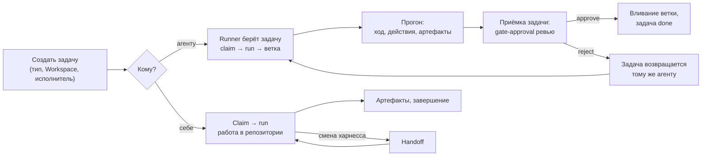

# Повседневные сценарии

Пошаговые процедуры для оператора: поставить задачу, отдать её агенту, проследить прогон,
принять ревью, взять задачу самому, передать работу другому харнессу и восстановиться после
потери владения. Сценарии показаны для MCP-плагина Claude Code и для
[ассистента](assistant.md) в консоли; вызовы `cp_*` — это то, что ассистент
делает по вашей команде после вашего явного решения.

## Общая картина



## Создать задачу

=== "Рабочее место"

    Опишите ассистенту задачу: контекст, критерии готовности, тип (например `coding-task`),
    Workspace, срок и исполнителя. Он покажет черновик и создаст задачу (`cp_create_task`
    или `cp_delegate`, если сразу поручаете) только после вашего подтверждения.

=== "Claude Code"

    Попросите ассистента завести задачу. Он покажет черновик и вызовет инструмент только
    после вашего «да»:

    ```text
    cp_list_task_types()                       # какой тип выбрать
    cp_create_task(
      title="Добавить фильтр по сроку в список задач",
      description="Контекст… Критерии готовности: …",
      type_key="coding-task",
      priority="high",
      assignee_id="<cp-principal-id>",
      due_date="2026-10-01"
    )
    ```

    `workspace_id` и проект подставляются из привязки репозитория; guard плагина не даст
    завести задачу в чужом проекте.

!!! tip "Хорошее описание для агента"
    Агент читает описание буквально. Укажите, **что** сделать и как проверить результат
    (какие тесты, какое поведение). **Как** устроен репозиторий — не повторяйте в каждой
    задаче, это дело файла соглашений runner'а
    ([Адаптеры](../runner/adapters.md)). Задачу, которую нельзя проверить, агент закроет
    «как понял».

## Назначить задачу агенту

Runner в режиме `CONTROL_PLANE_AGENT_ONLY_ASSIGNED=1` берёт только задачи, назначенные его
principal'у. Поэтому «поставить задачу агенту» = назначить исполнителем CP principal
агента.

1. Узнайте CP principal id исполнителя — у администратора или у ассистента рабочего места
   (`cp_agents`).
2. Проверьте, что задача в том Workspace (проекте), который обслуживает этот runner
   (`CONTROL_PLANE_AGENT_WORKSPACE`), и что её тип — тот, который он берёт.
3. Назначьте:

    === "Рабочее место"

        Попросите ассистента поручить задачу агенту (`cp_delegate` или `cp_update_task`) и
        подтвердите черновик.

    === "Claude Code"

        ```text
        cp_get_task("<publicId>")        # узнать version
        cp_update_task(task="<publicId>", expected_version=4, assignee_id="<cp-principal-id агента>")
        ```

4. В течение интервала опроса runner'а (по умолчанию 5 с) задача перейдёт в статус захвата
   типа (например `in_progress`), у задачи появятся захват агента и прогон.

!!! warning "Задача не берётся"
    Проверьте по порядку: назначена ли она именно этому principal'у; тот ли Workspace;
    свободна ли (нет чужого захвата, не блокирует ли её неразрешённый gate-approval или
    зависимость — claimability в `cp_get_task`); жив ли runner (его сессия в Control Plane).
    Если тип задачи исполняется скиллом, а principal runner'а не имеет `task_types.read`,
    демон такую задачу пропускает.

## Проследить прогон агента

1. Найдите прогон задачи: `cp_get_task` в Claude Code или `cp_run_progress` в рабочем месте.
2. В прогоне:
    - **Действия** обновляются вживую: каждый вызов инструмента агента (`tool.Bash`,
      `tool.Read`, `tool.Edit`…) со сводкой входа и статусом;
    - **Контрольные точки**: `execution.workspace` (ветка, базовый коммит, ревизии соседей),
      `claude-code.session` (id сессии, фаза);
    - по завершении хода — **Ход прогона** (транскрипт) и **Итоговый ответ**.
3. После успеха у задачи появляются артефакты:
    - `report` — summary агента: что сделано, какие тесты прогнаны, что осталось;
    - `transcript` — ограниченный транскрипт;
    - `commit` — ветка `task/<publicId>` и коммит; `published: true` значит, что ветка
      есть в forge.

Через MCP то же самое:

```text
cp_get_task("<publicId>")
cp_list_artifacts(task_id="<task-id>")
cp_get_run_context(run_id="<run-id>")
```

| Что видите | Что это значит |
|---|---|
| прогон `failed`, причина `restart_recovery` | runner перезапускался посреди работы; задача вернулась в очередь, следующая попытка продолжит ту же ветку и сессию |
| `failed: lease_lost` / `ownership_lost` | аренда потеряна во время работы; результат не записан |
| `failed: workspace_busy` | рабочую копию держит другой процесс runner'а |
| `failed: ClaudeCodeError: claude did not finish within …` | ход упёрся в таймаут; разбейте задачу или попросите поднять таймаут |
| успех, но нет артефакта `commit` | агент ничего не изменил |
| `commit` с `published: false` | ветка не опубликована — критерии ревью и вливания пропущены, сообщите инженеру runner'а |
| `failed: executor_blocked`, задача в `blocked` | агент сообщил, что не может сделать работу; причина — в комментарии задачи |

Отменить идущий прогон — запросом отмены run (см.
[Исполнение — claims и runs](../control-plane/execution.md)).

## Принять или отклонить ревью

Задача на код (`coding-task`) после сдачи ждёт **приёмки**: её тип объявляет критерии
«ревью человеком», затем «вливание ветки». Если вы — ревьюер установки, после каждой
сданной задачи с опубликованной веткой ядро запрашивает у вас блокирующий approval на
**самой задаче** — отдельной задачи ревью нет.

1. Найдите approval: уведомление в Telegram с кнопками или в Claude Code —
   `cp_list_approvals()`.
2. Прочитайте задачу и отчёт агента (артефакт `report`). Ветка, коммит и целевая ветка —
   в артефакте `commit` задачи.
3. Посмотрите изменения от merge-base с целевой веткой:

    ```bash
    git fetch origin
    git diff $(git merge-base origin/<targetBranch> origin/task/<publicId>) origin/task/<publicId>
    ```

4. Решите:

    ```text
    cp_approve(approval_id="<approval-id>", comment="Принято")
    cp_reject(approval_id="<approval-id>",
              comment="Нет теста на пустой фильтр; миграция не обратима")
    ```

5. Что происходит дальше:
    - **approve** — ядро вливает одобренный коммит в целевую ветку скиллом `git.merge@1`
      вашими полномочиями; задача становится выполненной, её зависимые — доступными.
      Если вливание не удалось (конфликт, ветка сдвинулась), задача возвращается агенту
      с причиной;
    - **reject** — задача возвращается в `todo` тому же агенту на ту же ветку; ваш
      комментарий придёт ему в блоке «Замечания последней проверки». После повторной
      сдачи вы получите новый запрос решения.


!!! tip "Комментарий при отклонении — это задание агенту"
    Пишите его как постановку: что именно не так и как проверить исправление.


## Взять задачу самому в Claude Code

1. Откройте сессию Claude Code в привязанном репозитории. Ассистент сам вызовет
   `cp_whoami`, `cp_context` и при необходимости `cp_focus_project`.
2. Попросите показать работу:

    ```text
    cp_list_tasks(system_status_category="active", assignee_id="<мой cp-principal-id>")
    cp_list_work(assigned_to_me=true)
    ```

3. Выберите задачу и скажите явно: «берём <publicId>». Ассистент:

    ```text
    cp_get_task("<publicId>")          # claimability, переходы
    cp_list_comments("<publicId>")     # решения и блокеры обычно в треде
    cp_claim_task("<publicId>", intent="реализация фильтра")
    cp_start_run()
    cp_get_run_context()                # checkpoints прошлых попыток, артефакты, approvals
    ```

4. Работа в репозитории. По ходу:
    - `cp_checkpoint(kind="progress", data={"branch": "...", "next": "..."})` после значимых
      шагов и перед рискованными действиями;
    - `cp_comment(...)` — решение, вопрос, блокер (после вашего согласия с текстом).
5. Результат:

    ```text
    cp_create_artifact(type="commit", name="feature/due-filter@3f1c2a9",
                       uri="git:3f1c2a9…", metadata={"branch": "feature/due-filter"})
    ```

6. Завершение — только по вашей отдельной команде: `cp_complete_run()` (по умолчанию
   завершает и задачу; статус завершения берётся из типа задачи). Если работа не удалась —
   `cp_fail_run(reason="…")`, claim остаётся за вами.

Смена статуса без завершения (например `blocked`) — через `cp_update_task` и только по
переходу с `route: update` из `cp_get_task`.

## Передать работу другому харнессу (handoff)

Handoff нужен, когда работу по задаче продолжит другой харнесс: вы переходите из Claude Code
в Codex, на другую машину или передаёте задачу коллеге.

1. Убедитесь, что всё значимое записано: артефакты (коммиты, PR, документы), checkpoints.
2. Попросите ассистента подготовить handoff. Он покажет summary, следующие шаги и ссылки на
   evidence — без транскрипта, рассуждений, секретов и локальных путей.
3. После вашего подтверждения:

    ```text
    cp_prepare_handoff(
      summary="Фильтр по сроку реализован в API, не сделан UI",
      next_steps=["Добавить фильтр в таблицу задач", "Прогнать e2e"],
      evidence_refs=["git:3f1c2a9…"]
    )
    ```

    Атомарно: checkpoint вида `handoff`, run → `suspended`, claim освобождён.
4. Закройте первую сессию.
5. Во втором харнессе: `cp_whoami`, `cp_context`, найти задачу, по вашему решению — новый
   `cp_claim_task`, новый `cp_start_run`, затем `cp_get_run_context`: он вернёт handoff-
   checkpoint и артефакты предыдущего run.

Второй харнесс **не продолжает** старый run и не читает чужой транскрипт: он восстанавливается
только из авторитетного состояния Control Plane.

## Ожидание решения (gate) внутри своей работы

Если посреди работы нужно чьё-то решение (например согласование схемы):

```text
cp_checkpoint(kind="before-approval", data={"next": "применить миграцию после согласования"})
cp_request_approval(gate=true, required_role_id="<role-id>",
                    comment="Согласовать изменение схемы: …")
cp_suspend_run(reason="waiting_approval", waiting_for_approval_id="<approval-id>")
# run архивируется, claim освобождается
```

После решения продолжение — всегда новый claim и новый run, читающий checkpoints.

## Потеря владения (`stale_claim`)

Инструмент вернул `stale_claim`, `task_already_claimed` или `run_not_active`: ваша аренда
истекла или задачу перехватили.

1. Прекратите любые записи по задаче — не повторяйте checkpoint, артефакт или завершение.
2. `cp_context` — посмотрите, чей сейчас claim и какой run активен.
3. Решите вместе с владельцем задачи: дождаться, перехватить истёкший захват новым
   `cp_claim_task` или передать работу через комментарий.

## Разобрать упавший прогон агента

1. `cp_get_run_context` → причина провала, последние действия и checkpoints.
2. Если это обрыв (`restart_recovery`, `lease_lost`) — ничего делать не нужно: задача
   вернулась в очередь, следующая попытка продолжит ту же рабочую копию и сессию агента.
3. Если агент упёрся в задачу (таймаут, красные тесты, непонятные требования) — уточните
   описание или разбейте задачу, оставьте комментарий и при необходимости переназначьте.
4. Если причина в окружении runner'а (нет доступа к forge, нет прав) — сообщите инженеру
   runner'а; см. [Диагностика: исполнение и runner](../troubleshooting/runner.md).

## Шпаргалка

| Хочу | Claude Code |
|---|---|
| Увидеть, что ждёт меня | `cp_context`, `cp_list_approvals` |
| Создать задачу | `cp_create_task` |
| Отдать агенту | `cp_update_task(assignee_id=…)` |
| Посмотреть прогон | `cp_get_run_context` |
| Решить approval | `cp_approve` / `cp_reject` |
| Взять задачу | `cp_claim_task` → `cp_start_run` |
| Записать результат | `cp_create_artifact` |
| Прокомментировать | `cp_comment` |
| Передать харнессу | `cp_prepare_handoff` |
| Завершить | `cp_complete_run` |


## См. также

- [MCP-плагин для Claude Code](mcp-plugin.md)
- [Ассистент](assistant.md)
- [Рабочее место человека](../workplace/index.md)
- [Исполнение — claims и runs](../control-plane/execution.md)
- [Approvals](../control-plane/approvals.md)
