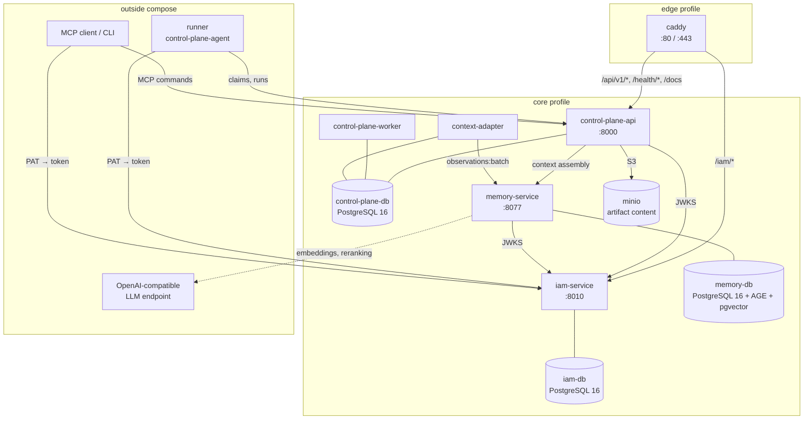
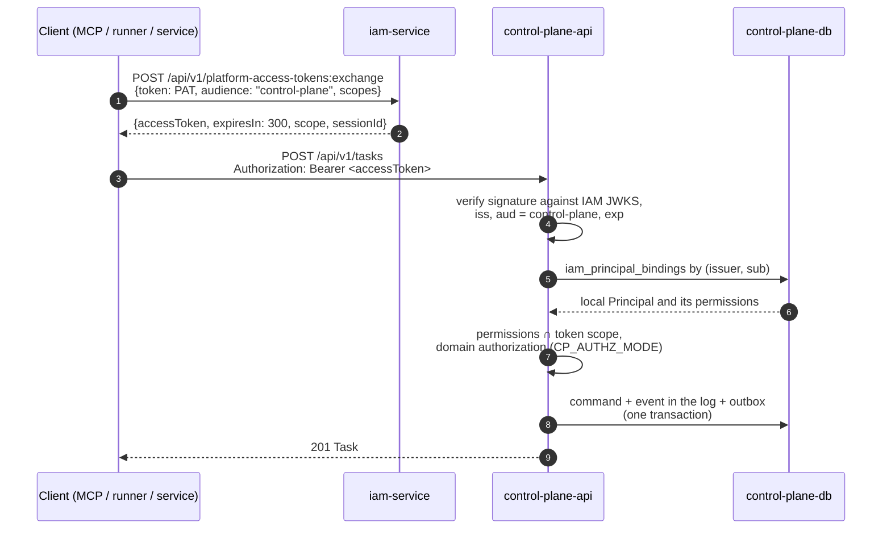
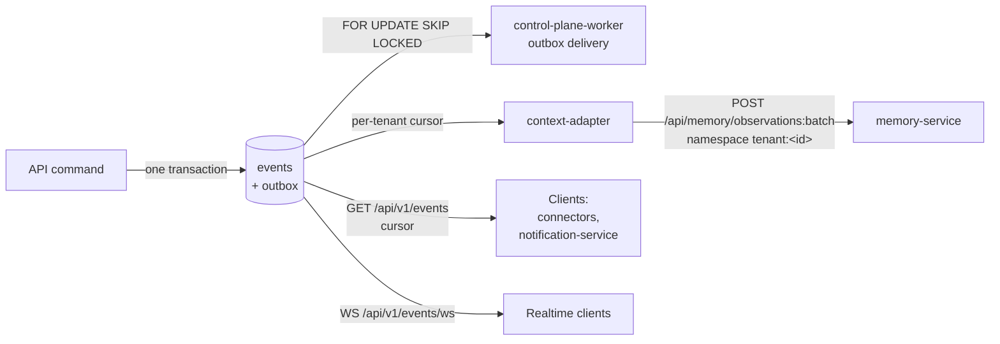
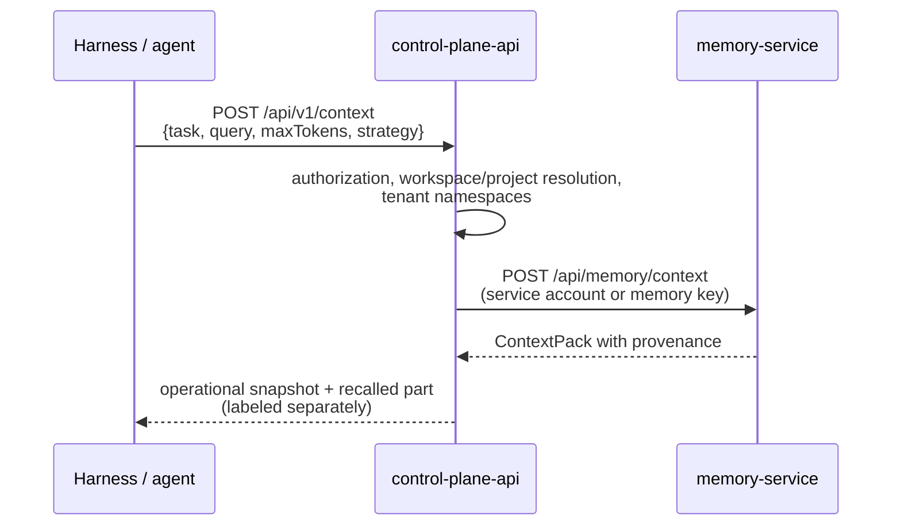
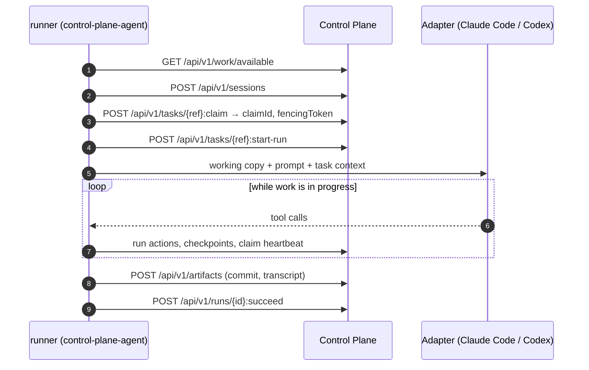

# Architecture

This page describes the processes that make up a deployed Taimen platform, how
they connect, which paths requests and events follow, and where the
authoritative state lives. Use it to choose the right component for a new
feature, to understand behavior during failures, and to read the logs.

## Architectural principles

1. **One fact, one authoritative home.** The same state is never edited in Git,
   Control Plane, and memory at the same time.
2. **Components are independent.** Services talk through versioned HTTP and
   event contracts, not shared databases or code imports. The only shared piece
   is the token verification library `platform-auth-sdk`.
3. **Memory does not manage work.** Retrieved context never replaces a check in
   Control Plane.
4. **Identity ≠ license ≠ domain permission.** IAM confirms the subject,
   Entitlement (if enabled) confirms the right to use the product, and the
   service that owns the resource authorizes the specific action.
5. **Failures degrade locally.** If memory is unavailable, Control Plane
   operations continue, and events accumulate and are delivered later.

## Components of the deployed stack

| Process | Start command | Role |
|---|---|---|
| `iam-service` | `alembic upgrade head && uvicorn iam_service.app:app` | Tenants, principals, audiences, PAT, service accounts, federation, token issuance, JWKS |
| `control-plane-api` | `alembic upgrade head && uvicorn control_plane.main:app` | HTTP API `/api/v1/*`, WebSocket `/api/v1/events/ws`, health, metrics |
| `control-plane-worker` | `python -m control_plane.worker` | Outbox delivery, expiry of claim and session leases, GC of idempotency keys, execution of approval outcomes |
| `context-adapter` | `python -m control_plane.worker.context_adapter` | Replays the event log into memory: at-least-once, per tenant, with durable cursors |
| `memory-service` | `memory-service` image | Knowledge graph, documents, hybrid search, Context Compiler |
| `caddy` | `caddy:2-alpine` | The only external entry point; routes paths to services |

All three Control Plane processes use **one image**, `control-plane`, with
different commands. The database schema is applied by Alembic migrations when
`control-plane-api` and `iam-service` start.

!!! note "The runner is outside compose"
    The autonomous executor daemon `control-plane-agent` is not part of
    `deploy/local/compose.yml`: you install it on a separate host (or a developer machine),
    and it reaches Control Plane and IAM over the network like any other
    client. See [Agents and runner](../runner/index.md).

## Path routing at the edge

Only Caddy is visible from outside. The local `deploy/caddy/Caddyfile.local`
and the production Caddyfile use the same path layout; they differ in TLS and
host name.

| Path | Service | Note |
|---|---|---|
| `/iam/*` | `iam-service:8010` | the prefix is stripped; the IAM issuer is `${TAIMEN_PUBLIC_URL}/iam` |
| `/api/v1/*`, `/health/*`, `/docs`, `/redoc`, `/openapi.json` | `control-plane-api:8000` | `/metrics` is not exposed externally |
| `/auth/*` | `keycloak:8080` | `idp` profile; Keycloak itself lives under `/auth` |
| `/harness/*` | `harness-launcher:8080` | `harness` profile; human workplaces |
| `/console/*` | `console:8090` | `core` profile (in the open delivery, `console`); [console](../operator/console.md), the server itself lives under `/console` |
| `/notify/*`, `/fleet/*` | `notification-service:8000`, `fleet-controller:8040` | `notify`, `fleet` profiles |
| `/guide/*` | `guide:8080` | `edge` profile; this guide |
| `/memory/*` | `memory-service:8077` | **local Caddyfile only**; in the production layout memory is not exposed |
| `/` (everything else) | — | `302` redirect to `/console/` |

In addition, each service publishes a port on the host's `127.0.0.1` (for
example, Control Plane on `18000`, IAM on `18010`, memory on `18001`) for local
work, bootstrap, and `make smoke`. The full table is in
[Services and ports](../reference/services-and-ports.md).

## Sources of truth

| Data | Authoritative home |
|---|---|
| Tasks (Work Items), their types, statuses, relations, fields, comments | Control Plane |
| Claims, fencing tokens, sessions, runs, checkpoints, run actions | Control Plane |
| Approvals and their outcomes, artifacts, goals, the observations journal | Control Plane |
| Workspaces, Project Profiles, roles, capabilities, skills, delegations | Control Plane |
| Local principals and their permissions (bindings to IAM) | Control Plane |
| Tenants, identity principals, credentials (PAT, service accounts), audiences | IAM Service |
| Observations, facts, documents, provenance, knowledge graph | Memory Service |
| Licenses, plans, quotas (if an external license check is connected) | external licensing service |
| Code, deployment configuration, catalog packages, ADRs | Git |
| Secrets | `.env`, `secrets/`, or an external Secret Manager |

Derived views, such as the operator queue, the event feed at a workstation, or
an agent's Context Pack, are not sources of truth and are rebuilt.

## Flow: an authenticated request

Every client (a human through MCP, a runner, a service) calls Control Plane the
same way: the long-lived secret is presented **only to IAM**, and Control Plane
sees only a short-lived token for its own audience.

A service account (no human and no PAT) replaces step 1 with a call to
`POST /api/v1/tokens/exchange` using `clientId`/`clientSecret`. For details, see
the [Security model](security-model.md).

## Flow: events and memory

Control Plane writes every change to an append-only event log in the same
transaction as the command itself. From there, events fan out to independent
consumers:

Properties of delivery to memory:

- **At-least-once, lossless, per tenant.** A tenant's cursor advances only after
  memory confirms receipt; a retry after a failure is deduplicated by the
  observation's identity.
- **Failure isolation.** A persistent memory failure for one tenant parks only
  that tenant's cursor, with increasing backoff; other tenants keep flowing.
  Resuming is an explicit operator action
  (`POST /api/v1/operations/context-adapter/{tenant_id}:redrive`).
- **Singleton.** There is one consumer per cluster (a PostgreSQL advisory lock);
  a second replica waits instead of reading twice.
- **Memory namespace.** A tenant's namespace is `tenant:<tenant_id>`; a
  workspace subtree is `tenant:<tenant_id>:ws:<workspace_id>`.

## Flow: context assembly

Context for a human or an agent is assembled through Control Plane, not by
going to memory directly: Control Plane first authorizes the call and resolves
the scope within the caller's tenant, and only then queries memory.

If memory is unavailable, the operational part of the response is still
produced, and the degradation is visible to the caller. For more, see
[Task context and memory](../control-plane/context.md).

## Flow: an agent executes a task

A claim is an exclusive lease on a task with a TTL and a monotonic fencing
token: if an executor loses its lease, its subsequent writes are rejected as
`stale_claim`. See [Execution — claims and runs](../control-plane/execution.md).

## Integration invariants

- Control Plane does not call memory inside a domain transaction.
- No service reads the databases of IAM or other services directly.
- Each audience gets its own short-lived token (default TTL 300 s,
  `IAM_TOKEN_TTL_SECONDS`).
- An IAM token carries no domain permissions: Control Plane permissions live in
  its own `iam_principal_bindings` table.
- Events are delivered to memory at least once and are deduplicated.
- In a context response, the operational and recalled parts are never mixed
  without labels.
- Secrets, full tool payloads, and model reasoning do not reach events or
  memory: the run transcript is published as a redacted artifact, without
  thinking.

## See also

- [Key concepts](concepts.md)
- [Delivery contents](components.md)
- [Security model](security-model.md)
- [Events](../control-plane/events.md)
- [Services and ports](../reference/services-and-ports.md)
