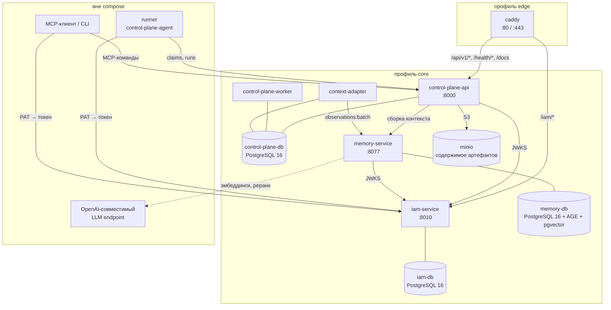
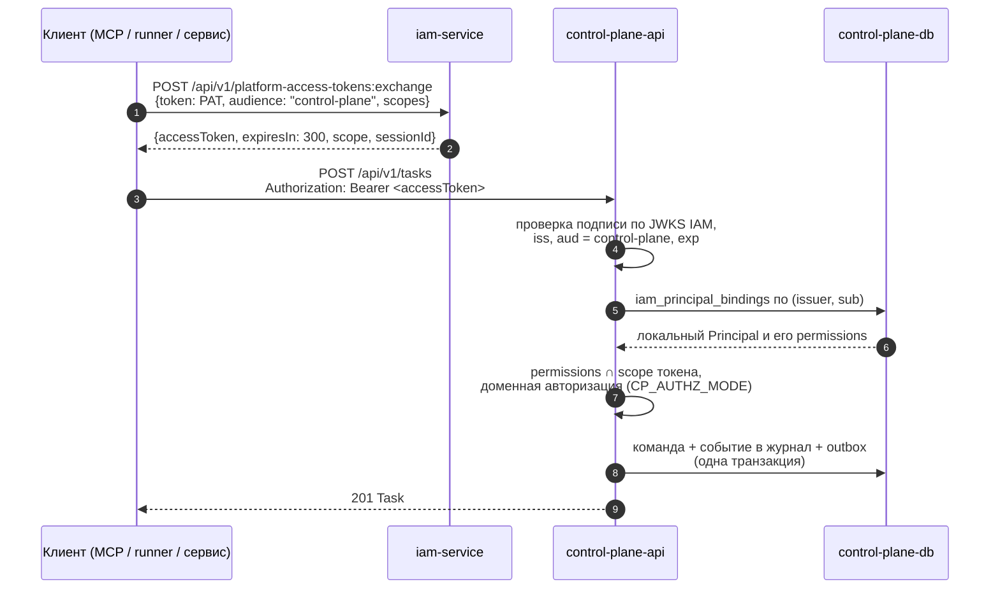
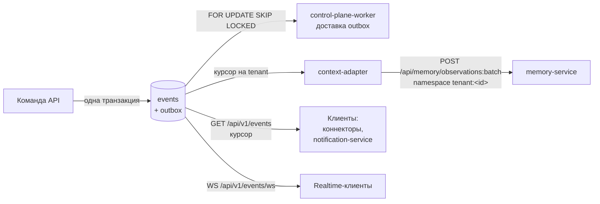
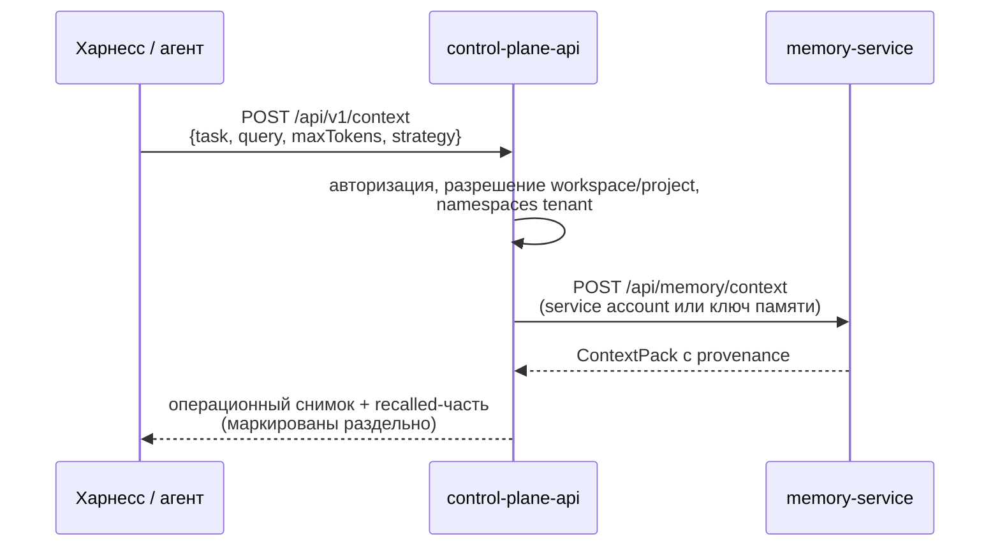
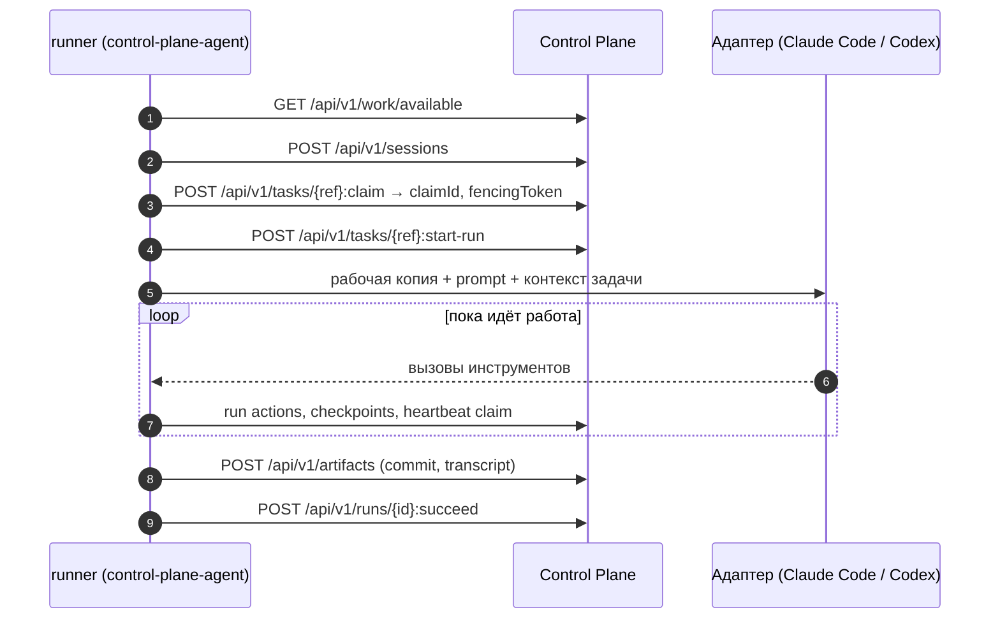

# Архитектура

Статья описывает, из каких процессов состоит развёрнутая платформа Taimen, как
они связаны, по каким путям идут запросы и события и где живёт авторитетное
состояние. Она нужна, чтобы правильно выбрать компонент для новой функции,
понимать поведение при сбоях и читать логи.

## Архитектурные принципы

1. **Один факт — один авторитетный дом.** Одно и то же состояние не
   редактируется одновременно в Git, Control Plane и памяти.
2. **Компоненты независимы.** Между сервисами — версионируемые HTTP- и
   event-контракты, а не общие базы данных и не импорты кода. Общая только
   библиотека проверки токенов `platform-auth-sdk`.
3. **Память не управляет работой.** Извлечённый контекст никогда не заменяет
   проверку в Control Plane.
4. **Identity ≠ лицензия ≠ доменное право.** IAM подтверждает субъекта,
   Entitlement (если включён) — право на продукт, сервис-владелец ресурса —
   конкретное действие.
5. **Сбои деградируют локально.** Память недоступна — операции Control Plane
   продолжаются, события копятся и доставляются позже.

## Компоненты развёрнутого стека

| Процесс | Команда запуска | Роль |
|---|---|---|
| `iam-service` | `alembic upgrade head && uvicorn iam_service.app:app` | Tenants, principals, audiences, PAT, service accounts, федерация, выпуск токенов, JWKS |
| `control-plane-api` | `alembic upgrade head && uvicorn control_plane.main:app` | HTTP API `/api/v1/*`, WebSocket `/api/v1/events/ws`, health, метрики |
| `control-plane-worker` | `python -m control_plane.worker` | Доставка outbox, истечение lease claims и сессий, GC ключей идемпотентности, исполнение исходов approval |
| `context-adapter` | `python -m control_plane.worker.context_adapter` | Переигрывает журнал событий в память: at-least-once, по tenant, с durable-курсорами |
| `memory-service` | образ `memory-service` | Граф знаний, документы, гибридный поиск, Context Compiler |
| `caddy` | `caddy:2-alpine` | Единственная точка входа снаружи, раскладка путей по сервисам |

Все три процесса Control Plane используют **один образ** `control-plane` с
разными командами. Схема БД применяется миграциями Alembic при старте
`control-plane-api` и `iam-service`.

!!! note "Runner вне compose"
    Демон автономного исполнителя `control-plane-agent` не входит в
    `deploy/local/compose.yml`: он ставится на отдельный хост (или машину разработчика) и
    ходит в Control Plane и IAM по сети, как любой другой клиент. См.
    [Агенты и runner](../runner/index.md).

## Раскладка путей на периметре

Снаружи виден только Caddy. Локальный `deploy/caddy/Caddyfile.local` и
промышленный Caddyfile используют одинаковую раскладку путей, различаются TLS и
именем хоста.

| Путь | Сервис | Примечание |
|---|---|---|
| `/iam/*` | `iam-service:8010` | префикс срезается; issuer IAM = `${TAIMEN_PUBLIC_URL}/iam` |
| `/api/v1/*`, `/health/*`, `/docs`, `/redoc`, `/openapi.json` | `control-plane-api:8000` | `/metrics` наружу не выводится |
| `/auth/*` | `keycloak:8080` | профиль `idp`; Keycloak сам живёт под `/auth` |
| `/harness/*` | `harness-launcher:8080` | профиль `harness`; рабочие места людей |
| `/console/*` | `console:8090` | профиль `core` (в открытой поставке — `console`); [консоль](../operator/console.md), сервер сам живёт под `/console` |
| `/notify/*`, `/fleet/*` | `notification-service:8000`, `fleet-controller:8040` | профили `notify`, `fleet` |
| `/guide/*` | `guide:8080` | профиль `edge`; это руководство |
| `/memory/*` | `memory-service:8077` | **только в локальном Caddyfile**; в промышленной раскладке память наружу не публикуется |
| `/` (всё остальное) | — | редирект `302` на `/console/` |

Кроме того, каждый сервис публикует порт на `127.0.0.1` хоста (например,
Control Plane — `18000`, IAM — `18010`, память — `18001`) для локальной работы,
bootstrap и `make smoke`. Полная таблица — в
[Сервисах и портах](../reference/services-and-ports.md).

## Источники истины

| Данные | Авторитетный дом |
|---|---|
| Tasks (Work Items), их типы, статусы, связи, поля, комментарии | Control Plane |
| Claims, fencing tokens, sessions, runs, checkpoints, run actions | Control Plane |
| Approvals и их исходы, artifacts, goals, observations journal | Control Plane |
| Workspaces, Project Profiles, роли, capabilities, skills, делегации | Control Plane |
| Локальные principals и их права (bindings к IAM) | Control Plane |
| Tenants, principals identity, credentials (PAT, service accounts), audiences | IAM Service |
| Наблюдения, факты, документы, provenance, граф знаний | Memory Service |
| Лицензии, планы, квоты (если подключена внешняя проверка лицензии) | внешний сервис лицензирования |
| Код, конфигурация стенда, пакеты каталога, ADR | Git |
| Секреты | `.env`, `secrets/` или внешний Secret Manager |

Производные представления — очередь оператора, лента событий в рабочем месте,
Context Pack для агента — не являются источниками истины и пересобираются.

## Поток: аутентифицированный запрос

Любой клиент — человек через MCP, runner, сервис — идёт в Control Plane по
одной схеме: долгоживущий секрет предъявляется **только IAM**, Control Plane
видит лишь короткоживущий токен своего audience.

Service account (без человека и без PAT) вместо шага 1 вызывает
`POST /api/v1/tokens/exchange` с `clientId`/`clientSecret`. Детали — в
[Модели безопасности](security-model.md).

## Поток: события и память

Control Plane пишет каждое изменение в append-only журнал событий в той же
транзакции, что и саму команду. Дальше события расходятся по независимым
потребителям:

Свойства доставки в память:

- **at-least-once, без потерь, по tenant.** Курсор tenant сдвигается только после
  подтверждения памятью; повтор после сбоя дедуплицируется по идентичности
  наблюдения.
- **Изоляция сбоев.** Постоянный отказ памяти на одном tenant паркует только его
  курсор с нарастающим backoff; остальные tenant продолжают течь. Снятие с паузы —
  явное действие оператора (`POST /api/v1/operations/context-adapter/{tenant_id}:redrive`).
- **Singleton.** Один потребитель на кластер (advisory lock PostgreSQL); вторая
  реплика ждёт, а не читает дважды.
- **Namespace памяти** tenant — `tenant:<tenant_id>`, поддерево workspace —
  `tenant:<tenant_id>:ws:<workspace_id>`.

## Поток: сборка контекста

Контекст для человека или агента собирается через Control Plane, а не прямым
походом в память: Control Plane сначала авторизует и разрешает scope внутри
tenant вызывающего, потом спрашивает память.

Если память недоступна, операционная часть ответа всё равно формируется —
деградация видна вызывающему. Подробнее — [Контекст задачи и
память](../control-plane/context.md).

## Поток: исполнение задачи агентом

Claim — эксклюзивная аренда задачи с TTL и монотонным fencing token: если
исполнитель потерял lease, его последующие записи отвергаются как
`stale_claim`. См. [Исполнение — claims и runs](../control-plane/execution.md).

## Инварианты интеграции

- Control Plane не вызывает память внутри доменной транзакции.
- Ни один сервис не читает базы IAM или других сервисов напрямую.
- Каждый audience получает отдельный короткоживущий токен (по умолчанию TTL
  300 с, `IAM_TOKEN_TTL_SECONDS`).
- Токен IAM не несёт доменных прав: права Control Plane — в его собственной
  таблице `iam_principal_bindings`.
- События доставляются в память как минимум один раз и дедуплицируются.
- В ответе контекста операционная и recalled-части не смешиваются без
  маркировки.
- Секреты, полные payload инструментов и рассуждения модели не попадают в
  события и память: транскрипт прогона публикуется артефактом с редакцией, без
  thinking.

## См. также

- [Ключевые понятия](concepts.md)
- [Состав поставки](components.md)
- [Модель безопасности](security-model.md)
- [События](../control-plane/events.md)
- [Сервисы и порты](../reference/services-and-ports.md)
