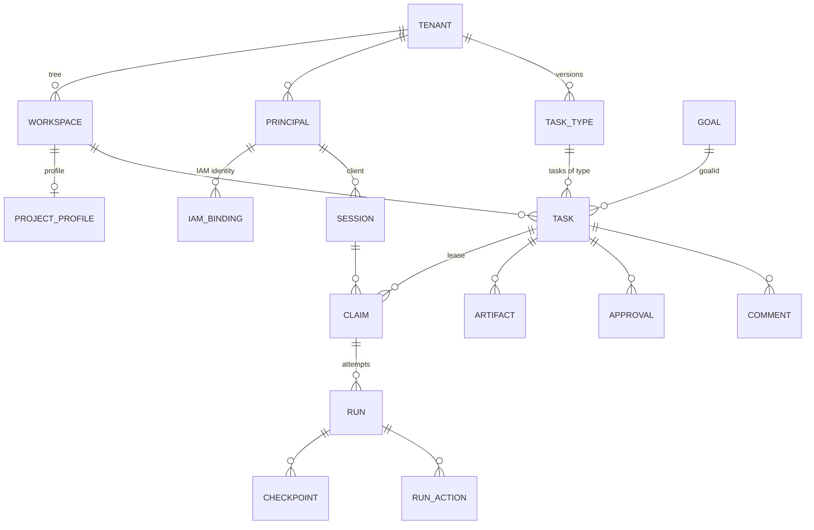

# Key concepts

This page is a dictionary of platform entities as they exist in the code: in
the tables and APIs of Control Plane, IAM, and Memory Service. For each entity
it states which component owns it, what it consists of, and how it differs from
related concepts. Detailed contracts are in the component sections; links are
given at the end of each block.

## Entity map

## Organizational scope

### Tenant

The tenant organization: the boundary of data isolation. A tenant has a record
both in IAM (`/api/v1/tenants`) and in Control Plane (the `tenants` table). In a
new installation, bootstrap creates the Control Plane tenant **with the same
UUID** as the IAM tenant, so the organization has one identifier across the
whole platform. Every Control Plane request runs in the tenant of the principal
whose token is presented; the `tenant_id` field comes from the token, not from
the request body.

### Workspace

A node in the **single tree** of organizational scope within a tenant:
portfolio, program, project, team, and workstream are all workspaces of
different types. A workspace is at once:

- a node in the hierarchy (`parent`, `GET /api/v1/workspaces/tree`);
- a permission scope (members in `workspace_members` with roles);
- the scope for tasks, artifacts, approvals, and memory (namespace
  `tenant:<tenant-id>:ws:<workspace-id>`).

The node type is set by a **Workspace Type** (`/api/v1/workspace-types`): a
field schema and the allowed child types. The system type is `generic`.
Workspace statuses are `active` and `archived`.

### Project Profile and Project Template

A **Project** is not a second tree but a configurable profile attached to a
workspace (`/api/v1/projects`). The project hierarchy is derived from the
workspace tree and is not stored separately anywhere; a task's `projectId` field
is computed on read.

A profile is created from a **Project Template** (`/api/v1/project-templates`),
a versioned template with a field schema, a project lifecycle, default
configuration, views, governance, and memory settings. Changes to a profile's
configuration are recorded as **config revisions**, and
`GET /api/v1/projects/{id}/effective-config` shows the resulting configuration
with the origin of each value.

See [Work model](../control-plane/work-model.md).

## Participants

### Principal

A participant in work in Control Plane: a human, an agent, or a service.

| Field | Values |
|---|---|
| `kind` | `human`, `agent`, `service` |
| `status` | `active`, `paused`, `disabled` |

A Control Plane principal is a local record to which permissions are attached.
The identity itself lives in IAM, where principals have the kinds `human`,
`agent`, `service_account`, and `workload` (the last two map to `service` in
Control Plane).

### IAM binding

The link between an IAM identity and a local Control Plane principal: a row in
`iam_principal_bindings`, addressed by the pair **(issuer, IAM principal id)**.
The same row holds the principal's **permissions** in Control Plane (for
example, `tasks.read`, `tasks.claim`, `admin`). Binding statuses are `active`,
`disabled`, and `revoked`. It is managed through the API
`POST /api/v1/principals/{id}/iam-bindings`.

!!! warning "Changing the issuer"
    Bindings are looked up by issuer. If you change the platform's public
    address (`TAIMEN_PUBLIC_URL`), the token issuer changes and none of the
    bindings will be found anymore; you must migrate them in the same step. See
    the [Security model](security-model.md).

### Delegation

Permission from a human for an agent to act on their behalf with a subset of
permissions and a validity window (`humanPrincipalId`, `agentPrincipalId`,
`permissions`, `startsAt`, `expiresAt`). The agent's session is opened with
`onBehalfOf`, and Control Plane checks that a valid delegation exists.

### Role, Capability, Skill

Three ways to describe **who can** take on work:

| Concept | What it is | API |
|---|---|---|
| **Role** | an organizational role (slug), assigned to a principal in a tenant or workspace | `/api/v1/roles`, `/api/v1/principals/{id}/roles` |
| **Capability** | a named ability of an executor ("can do X") | `/api/v1/capabilities`, `/api/v1/principals/{id}/capabilities` |
| **Skill** | a versioned callable contract: `protocol` (`http`, `local`, `mcp`), `inputSchema`/`outputSchema`, `sideEffects` (`none`, `external_read`, `external_write`), `riskLevel` (`low`, `medium`, `high`), status `active`/`deprecated`/`disabled` | `/api/v1/skills`, `/api/v1/principals/{id}/skills` |

A task declares **requirements**: lists of roles, capabilities, and skills. Only
a principal that satisfies them sees the task in available work and can claim
it. A skill call made by the core is a **Skill Invocation**
(`/api/v1/skill-invocations`, statuses `pending`, `running`, `succeeded`,
`failed`, `cancelled`); the right to request an invocation (`skills.invoke`) and
the right to execute invocations (`skills.execute`) are separate.

Do not confuse a principal's capabilities with **harness capabilities**. They
are different things: the latter describe what the client program can do (see
Session below).

## Work

### Task (Work Item)

A typed unit of work and the central entity of the platform.

| Field | Meaning |
|---|---|
| `id`, `publicId` | UUID and a human-readable number such as `TASK-000123` (a tenant-wide counter) |
| `typeId`, `typeKey`, `typeVersion` | the task type; a task is pinned to a specific version of its type |
| `status`, `systemStatusCategory` | the status key from the type's vocabulary and its system category |
| `priority` | `critical`, `high`, `medium`, `low` |
| `ownerId`, `assigneeId` | the owner and the assigned executor |
| `workspaceId`, `projectId` | scope; `projectId` is computed from the tree |
| `customFields`, `startDate`, `dueDate` | fields defined by the type's schema, and planned dates |
| `goalId`, `origin`, `acceptance`, `evidence` | the link to a goal and the Work Graph documents (see below) |
| `version`, `claimEpoch`, `activeClaimId` | the optimistic version (for `If-Match`) and lease state |

Tasks are connected by **relations** of directed types:

| Type | Meaning (`from → to`) |
|---|---|
| `parent` | `from` is a subtask of `to` |
| `blocks` | `from` must finish before `to` can be claimed |
| `depends_on` | `from` cannot be claimed until `to` is finished |
| `spawned_by` | `from` was created as a consequence of `to` |
| `related_to` | a free-form link with no execution semantics |

`blocks` and `depends_on` form a prerequisite graph and affect whether a task is
ready.

### Task Type and statuses

The status vocabulary belongs to the tenant's **task type**, not to the
platform. A type (`/api/v1/task-types`) is versioned and immutable once
published: a change is a new version, and the previous one becomes
`deprecated`. A task always remembers the version it was created with.

A type consists of:

- `lifecycleSchema`: statuses (key + category + display name), transitions,
  `initialStatus`, `claimStatus` (the status a task moves to on claim),
  `releaseStatus`, `completionStatus`;
- `fieldSchema`: a JSON Schema for `customFields`;
- `approvalSchema`: gates and declarative approval **outcomes** (for example,
  "approved → `completeTask`", "rejected → `ensureWork` for a rework task");
- `execution`: binds the type to an executor skill.

The core makes decisions **only by status category**:

| Category | Meaning |
|---|---|
| `backlog` | work has not started and is not ready |
| `active` | work is queued or in progress |
| `blocked` | work is stalled |
| `terminal_success` | work is done |
| `terminal_cancelled` | work is cancelled |

If no type is given, the system type `task` is used, with the statuses
`backlog`, `todo`, `in_progress`, `blocked`, `done`, `cancelled` (initial:
`todo`; on claim: `in_progress`). Types and other catalog objects ship as YAML
**catalog packages** (`packages/`), which bootstrap applies to the deployment.
See [Task types and statuses](../control-plane/task-types.md) and
[Catalog packages](../control-plane/catalog-packages.md).

### Goal, origin, acceptance, evidence

Work Graph documents that answer "why does this work exist" and "how do we know
it is done":

| Concept | Where | Contents |
|---|---|---|
| **Goal** | `/api/v1/goals` | `title`, `desiredState`, `criteria`, `ownerId`, `workspaceId`, `parentGoalId`, status `active` / `achieved` / `abandoned` |
| **origin** | a task field (on a goal: `createdFrom`) | `{kind, ref?, ruleId?, evidence[]}`; `kind`: `human`, `harness`, `rule`, `parent`, `process`, `external`. Immutable after creation |
| **acceptance** | a task field (on a goal: `criteria`) | a list of checks `{key, kind, description, spec?}`; `kind`: `deterministic`, `external_state`, `human`, `llm_judge` |
| **evidence** | a task field | references to facts `{kind: observation\|artifact\|external, …, check?, note?}`: a pointer, not a copy |

If `origin` is not supplied, the core derives it: `parent` for a subtask,
otherwise based on the kind of the writing principal. `acceptance` checks are
currently declared and stored; evaluating them automatically is a separate
stage. See [Goals, acceptance, and evidence](../control-plane/goals-and-evidence.md).

### Observation

An explicitly recorded fact: the result of a "remember" from a harness, or an
observation from an external system that arrives through a connector
(`POST /api/v1/observations`). An external observation has a `source`, a
`dedupKey` (a repeat returns `200` with the existing observation instead of
`201`), and `observedAt`. Observations go into the Control Plane log and from
there into memory; you can reference them as evidence.

## Execution

### Session and Harness

A **Session** is an open client connection on behalf of a principal
(`POST /api/v1/sessions`): `clientName`, `clientVersion`, a TTL (default 300 s,
from 10 to 3600), heartbeat, and statuses `active` / `stale` / `closed`. A
claim is always taken within a session.

A **Harness** is the client program through which an executor works (the MCP
server in Claude Code, the runner daemon, Human Harness). When opening a
session, the harness can declare itself with a `harness` block: `type`,
`version`, `protocolVersion` (versions `1` and `2` of the `control-harness`
protocol are supported), and `capabilities`, for example `tasks.interactive`,
`checkpoints`, `events.realtime`, `active_turn_control.v1`,
`child_run_handle.v1`, `skills.protocol.http`.

The session gets an observed `controlLevel`: `human_operated` for a human,
`connected` for an agent or a service. This describes the mode; it is **not**
an authorization input. See [Harness protocol](../control-plane/harness-protocol.md).

### Claim and fencing token

A **Claim** is an exclusive lease on a task by one principal within a session
(`POST /api/v1/tasks/{ref}:claim`):

- the lease has a TTL (default 300 s, from 10 to 3600) and a heartbeat
  (`POST /api/v1/claims/{id}:heartbeat`);
- statuses: `active`, `released`, `stale` (expired);
- release is `:release`; taking over an expired lease is `:reclaim`;
- on claim, the task moves to its type's `claimStatus`.

A **fencing token** is a monotonically increasing number issued with every claim
(tied to the task's `claimEpoch`). Every write that changes state under a claim
(starting a run, completing a task, a change with an active claim) must present
`claimId` and `fencingToken`. If the lease has been taken over, the previous
executor holds an outdated token, and its writes are rejected (`stale_claim`).
This way a "stuck" agent that wakes up after its lease expired cannot overwrite
someone else's work.

### Run

A **Run** is one attempt to execute a task under a live claim
(`POST /api/v1/tasks/{ref}:start-run` with `claimId` and `fencingToken`).

| Status | Meaning |
|---|---|
| `running` | in progress |
| `succeeded` | succeeded (`:succeed`; by default it completes the task atomically) |
| `failed` | an honest failure (`:fail` with `failureReason`); the claim is kept |
| `cancelled` | cancelled |
| `suspended` | paused (waiting for approval, handed off to a human); continuing means a new claim and a new run that reads the checkpoints |

A run contains:

- **Checkpoint**: an ordered (`seq`) state record for resumption
  (`POST /api/v1/runs/{id}/checkpoints`), for example `handoff` during a
  handoff;
- **Run action**: an audit record of an executor action (a tool call, an
  external action) with statuses `started` / `completed` / `failed`;
- **Control messages**: durable control of the active turn: `queue`, `steer`,
  `redirect`, `request_cancel`, `force_cancel`;
- **Child handles**: child runs launched from the parent run.

The limits `maxDurationSeconds` and `maxActions` are set at start. See
[Execution — claims and runs](../control-plane/execution.md).

### Approval

A request for a human decision on a task or an artifact
(`POST /api/v1/approvals`). It is assigned to a specific principal
(`assignedPrincipalId`) or to a role (`requiredRoleId`), with statuses
`pending`, `approved`, `rejected`, `cancelled`. The decision is `:approve` /
`:reject` and requires the `approvals.decide` permission (agents never get it).

A **gate approval** (`gate: true`) blocks task completion until it is decided.
A task type can declare **outcomes**: the actions the core performs after the
decision (complete the task, create a rework task, and so on). They are
executed by `control-plane-worker`, and the result is visible in
`GET /api/v1/approvals/{id}/outcome`. See [Approvals](../control-plane/approvals.md).

### Artifact and Comment

An **Artifact** is a registered result of work (`POST /api/v1/artifacts`):
`type`, `name`, a `uri` reference or inline `content`, `metadata`, a link to a
task, run, or workspace, and `supersedesArtifactId` for a new version. Examples:
a commit with a branch, an agent run transcript, a document.

A **Comment** is a comment on a task with an append-only edit history; the
author is taken from the credential, not from the request body. See
[Artifacts and comments](../control-plane/artifacts.md).

## Log and knowledge

### Event

Every change is written to the Control Plane **append-only event log** in the
same transaction as the command: `type`, `entityType`, `entityId`, `actorId`,
`iamActorId`, `sessionId`, `correlationId`, `payload`, `occurredAt`. You read it
with `GET /api/v1/events` using an opaque cursor (`nextCursor`, `hasMore`) or
through the WebSocket stream `/api/v1/events/ws`. `sequence` is an identifier
for audit, not a cursor. See [Events](../control-plane/events.md).

### Namespace

The unit of isolation in Memory Service. Control Plane maps a tenant to the
namespace `tenant:<tenant-id>`, and a workspace to the subtree
`tenant:<tenant-id>:ws:<workspace-id>`. Access to a namespace is determined by
the caller's credential (scopes `memory:read`, `memory:write`, `memory:pii`,
and so on). See [Namespaces and access](../memory/namespaces.md).

### Context Pack

A token-bounded package of context with provenance, assembled by memory for a
human or an agent. You request it through Control Plane
(`POST /api/v1/context`) with the strategy `semantic`, `exact`, `graph`,
`hybrid`, `context`, or `briefing` and, if needed, `asOf`: the state of
knowledge at a point in time. See
[Retrieval and context assembly](../memory/retrieval.md).

## Identity and access

| Concept | In brief | Details |
|---|---|---|
| **Audience** | the service a token is issued for (`control-plane`, `memory-service`, …); each audience has an `allowedScopes` registry | [Tokens, audiences, scopes](../iam/tokens.md) |
| **Scope** | the token's permission ceiling (`control-plane:read`, `control-plane:write`, `control-plane:admin`) | [Permissions and scopes](../reference/permissions.md) |
| **Permission** | a Control Plane domain permission (`tasks.claim`, `approvals.decide`, `admin`, …), stored in the binding | [Authorization and permissions](../control-plane/authorization.md) |
| **PAT** | Platform Access Token: a long-lived secret of a human or agent, presented only to IAM | [Credentials and PAT](../iam/credentials.md) |
| **Service account** | a service's `clientId` + `clientSecret`, exchanged for an audience token | [Service accounts](../iam/service-accounts.md) |

## Idempotency and versions

- You can send any mutating Control Plane request with an `Idempotency-Key`
  header (1–200 characters): a repeat with the same key and the same body
  returns the stored response with the header `Idempotency-Replayed: true`.
  Some operations (run control messages, PAT issuance in IAM) require the key.
- A task update accepts `If-Match` with the expected version (ETag), which
  protects against lost updates.

## See also

- [Glossary](../reference/glossary.md)
- [Architecture](architecture.md)
- [Security model](security-model.md)
- [Work model](../control-plane/work-model.md)
