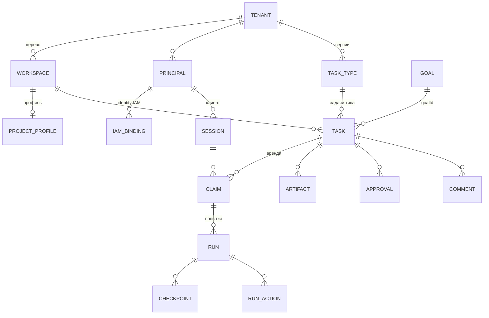

# Ключевые понятия

Статья — словарь сущностей платформы в том виде, в каком они существуют в коде:
в таблицах и API Control Plane, IAM и Memory Service. Для каждой сущности указано,
какой компонент ею владеет, из чего она состоит и чем отличается от соседних
понятий. Подробные контракты — в разделах компонентов, ссылки даны в конце
каждого блока.

## Карта сущностей

## Организационный scope

### Tenant

Организация-арендатор: граница изоляции данных. У tenant есть запись и в IAM
(`/api/v1/tenants`), и в Control Plane (таблица `tenants`). В новой инсталляции
bootstrap создаёт tenant Control Plane **с тем же UUID**, что и tenant IAM, —
один идентификатор организации на всю платформу. Все запросы Control Plane
выполняются в tenant того principal, чей токен предъявлен; поле `tenant_id`
приходит из токена, а не из тела запроса.

### Workspace

Узел **единственного дерева** организационного scope внутри tenant: портфель,
программа, проект, команда, поток работ — всё это workspace разных типов.
Workspace одновременно:

- узел иерархии (`parent`, `GET /api/v1/workspaces/tree`);
- область прав (участники `workspace_members` с ролями);
- scope для задач, артефактов, approvals и памяти (namespace
  `tenant:<tenant-id>:ws:<workspace-id>`).

Тип узла задаёт **Workspace Type** (`/api/v1/workspace-types`): схема полей и
допустимые дочерние типы. Системный тип — `generic`. Статусы workspace —
`active`, `archived`.

### Project Profile и Project Template

**Project** — не второе дерево, а конфигурируемый профиль, прикреплённый к
workspace (`/api/v1/projects`). Иерархия проектов выводится из дерева workspace
и нигде не хранится отдельно; поле `projectId` у задачи вычисляется при чтении.

Профиль создаётся из **Project Template** (`/api/v1/project-templates`) —
версионированного шаблона со схемой полей, жизненным циклом проекта, конфигурацией
по умолчанию, представлениями, governance и настройками памяти. Изменения
конфигурации профиля записываются как **config revisions**, а
`GET /api/v1/projects/{id}/effective-config` показывает итоговую конфигурацию с
происхождением каждого значения.

См. [Модель работы](../control-plane/work-model.md).

## Участники

### Principal

Участник работы в Control Plane: человек, агент или сервис.

| Поле | Значения |
|---|---|
| `kind` | `human`, `agent`, `service` |
| `status` | `active`, `paused`, `disabled` |

Principal Control Plane — локальная запись, к которой привязываются права. Сама
identity живёт в IAM: там у principal виды `human`, `agent`, `service_account`,
`workload` (последние два в Control Plane отображаются в `service`).

### IAM binding

Связь identity IAM с локальным principal Control Plane — строка
`iam_principal_bindings`, адресуемая парой **(issuer, IAM principal id)**. В ней
же лежат **permissions** principal в Control Plane (например, `tasks.read`,
`tasks.claim`, `admin`). Статусы binding: `active`, `disabled`, `revoked`.
Управляется API `POST /api/v1/principals/{id}/iam-bindings`.

!!! warning "Смена issuer"
    Binding ищется по issuer. Если сменить публичный адрес платформы
    (`TAIMEN_PUBLIC_URL`), issuer токенов изменится, и все bindings перестанут
    находиться — их нужно перенести тем же действием. См.
    [Модель безопасности](security-model.md).

### Delegation

Разрешение человека агенту действовать от его имени с подмножеством прав и
окном действия (`humanPrincipalId`, `agentPrincipalId`, `permissions`,
`startsAt`, `expiresAt`). Сессия агента открывается с `onBehalfOf`, и Control
Plane проверяет наличие действующей делегации.

### Role, Capability, Skill

Три способа описать, **кто может** взять работу:

| Понятие | Что это | API |
|---|---|---|
| **Role** | организационная роль (slug), назначается principal в tenant или workspace | `/api/v1/roles`, `/api/v1/principals/{id}/roles` |
| **Capability** | именованная способность исполнителя («умеет X») | `/api/v1/capabilities`, `/api/v1/principals/{id}/capabilities` |
| **Skill** | версионированный вызываемый контракт: `protocol` (`http`, `local`, `mcp`), `inputSchema`/`outputSchema`, `sideEffects` (`none`, `external_read`, `external_write`), `riskLevel` (`low`, `medium`, `high`), статус `active`/`deprecated`/`disabled` | `/api/v1/skills`, `/api/v1/principals/{id}/skills` |

Задача объявляет **requirements** — списки ролей, capabilities и skills; только
principal, удовлетворяющий им, увидит её в доступной работе и сможет взять.
Вызов скилла ядром — **Skill Invocation** (`/api/v1/skill-invocations`, статусы
`pending`, `running`, `succeeded`, `failed`, `cancelled`); право просить вызов
(`skills.invoke`) и право исполнять вызовы (`skills.execute`) разделены.

Не путайте capability principal с **capabilities харнесса** — это разное: второе
описывает, что умеет клиентская программа (см. Session ниже).

## Работа

### Task (Work Item)

Типизированная единица работы — центральная сущность платформы.

| Поле | Смысл |
|---|---|
| `id`, `publicId` | UUID и человекочитаемый номер вида `TASK-000123` (сквозной счётчик tenant) |
| `typeId`, `typeKey`, `typeVersion` | тип задачи; задача закреплена за конкретной версией типа |
| `status`, `systemStatusCategory` | ключ статуса из словаря типа и его системная категория |
| `priority` | `critical`, `high`, `medium`, `low` |
| `ownerId`, `assigneeId` | владелец и назначенный исполнитель |
| `workspaceId`, `projectId` | scope; `projectId` вычисляется из дерева |
| `customFields`, `startDate`, `dueDate` | поля по схеме типа и плановые даты |
| `goalId`, `origin`, `acceptance`, `evidence` | связь с целью и документы Work Graph (см. ниже) |
| `version`, `claimEpoch`, `activeClaimId` | оптимистическая версия (для `If-Match`) и состояние аренды |

Задачи связываются **relations** направленных типов:

| Тип | Смысл (`from → to`) |
|---|---|
| `parent` | `from` — подзадача `to` |
| `blocks` | `from` должна завершиться, прежде чем `to` можно взять |
| `depends_on` | `from` нельзя взять, пока `to` не завершена |
| `spawned_by` | `from` создана как следствие `to` |
| `related_to` | свободная связь без семантики исполнения |

`blocks` и `depends_on` образуют граф предпосылок и влияют на готовность задачи.

### Task Type и статусы

Словарь статусов принадлежит **типу задачи** tenant, а не платформе. Тип
(`/api/v1/task-types`) версионирован и неизменяем после публикации: изменение —
это новая версия, прежняя переходит в `deprecated`. Задача всегда помнит версию,
по которой создана.

Тип состоит из:

- `lifecycleSchema` — статусы (ключ + категория + отображаемое имя), переходы,
  `initialStatus`, `claimStatus` (куда задача переходит при claim),
  `releaseStatus`, `completionStatus`;
- `fieldSchema` — JSON Schema для `customFields`;
- `approvalSchema` — gates и декларативные **исходы** approval (например,
  «одобрено → `completeTask`», «отклонено → `ensureWork` задачи правок»);
- `execution` — привязка типа к скиллу-исполнителю.

Ядро принимает решения **только по категории** статуса:

| Категория | Смысл |
|---|---|
| `backlog` | работа не начата и не готова |
| `active` | работа в очереди или в процессе |
| `blocked` | работа стоит |
| `terminal_success` | работа сделана |
| `terminal_cancelled` | работа отменена |

Если тип не указан, используется системный тип `task` со статусами `backlog`,
`todo`, `in_progress`, `blocked`, `done`, `cancelled` (начальный — `todo`, при
claim — `in_progress`). Типы и другие объекты каталога поставляются как YAML-
**пакеты каталога** (`packages/`), которые bootstrap приводит к стенду. См.
[Типы задач и статусы](../control-plane/task-types.md) и
[Пакеты каталога](../control-plane/catalog-packages.md).

### Goal, origin, acceptance, evidence

Документы Work Graph, которые отвечают на вопросы «зачем эта работа» и «как
понять, что она сделана»:

| Понятие | Где | Содержимое |
|---|---|---|
| **Goal** | `/api/v1/goals` | `title`, `desiredState`, `criteria`, `ownerId`, `workspaceId`, `parentGoalId`, статус `active` / `achieved` / `abandoned` |
| **origin** | поле задачи (у цели — `createdFrom`) | `{kind, ref?, ruleId?, evidence[]}`; `kind`: `human`, `harness`, `rule`, `parent`, `process`, `external`. Неизменяем после создания |
| **acceptance** | поле задачи (у цели — `criteria`) | список проверок `{key, kind, description, spec?}`; `kind`: `deterministic`, `external_state`, `human`, `llm_judge` |
| **evidence** | поле задачи | ссылки на факты `{kind: observation\|artifact\|external, …, check?, note?}` — указатель, а не копия |

Если `origin` не передан, ядро выводит его само: `parent` для подзадачи, иначе по
виду пишущего principal. Проверки `acceptance` сейчас объявляются и хранятся;
их автоматическая оценка — отдельный этап. См.
[Цели, приёмка и evidence](../control-plane/goals-and-evidence.md).

### Observation

Явно зафиксированный факт: результат «запомни» от харнесса или наблюдение
внешней системы, пришедшее через коннектор (`POST /api/v1/observations`). У
внешнего наблюдения есть `source`, `dedupKey` (повтор возвращает `200` с
существующим наблюдением вместо `201`) и `observedAt`. Наблюдения попадают в
журнал Control Plane и оттуда — в память; на них можно ссылаться как на evidence.

## Исполнение

### Session и Harness

**Session** — открытое подключение клиента от имени principal
(`POST /api/v1/sessions`): `clientName`, `clientVersion`, TTL (по умолчанию
300 с, от 10 до 3600), heartbeat, статусы `active` / `stale` / `closed`.
Claim всегда берётся в рамках сессии.

**Harness** — клиентская программа, через которую работает исполнитель (MCP-
сервер в Claude Code, runner-демон, Human Harness). При открытии сессии харнесс
может объявить себя блоком `harness`: `type`, `version`, `protocolVersion`
(поддерживаются `1` и `2` протокола `control-harness`), `capabilities` —
например `tasks.interactive`, `checkpoints`, `events.realtime`,
`active_turn_control.v1`, `child_run_handle.v1`, `skills.protocol.http`.

Сессия получает наблюдаемый `controlLevel` — `human_operated` для человека,
`connected` для агента или сервиса. Это описание режима, **не** вход
авторизации. См. [Харнесс-протокол](../control-plane/harness-protocol.md).

### Claim и fencing token

**Claim** — эксклюзивная аренда задачи одним principal в рамках сессии
(`POST /api/v1/tasks/{ref}:claim`):

- у аренды есть TTL (по умолчанию 300 с, от 10 до 3600) и heartbeat
  (`POST /api/v1/claims/{id}:heartbeat`);
- статусы: `active`, `released`, `stale` (истёк);
- освобождение — `:release`, перехват истёкшей аренды — `:reclaim`;
- при claim задача переходит в `claimStatus` своего типа.

**Fencing token** — монотонно растущее число, выдаваемое при каждом claim
(связано с `claimEpoch` задачи). Все записи, меняющие состояние под claim
(старт run, завершение задачи, изменение с активным claim), обязаны предъявить
`claimId` и `fencingToken`. Если аренда перехвачена, у старого исполнителя
устаревший токен, и его записи отвергаются (`stale_claim`). Так «зависший»
агент, очнувшийся после истечения lease, не может перетереть чужую работу.

### Run

**Run** — одна попытка исполнения задачи под живым claim
(`POST /api/v1/tasks/{ref}:start-run` с `claimId` и `fencingToken`).

| Статус | Смысл |
|---|---|
| `running` | идёт |
| `succeeded` | успешно (`:succeed`; по умолчанию атомарно завершает задачу) |
| `failed` | честный провал (`:fail` с `failureReason`), claim сохраняется |
| `cancelled` | отменён |
| `suspended` | приостановлен (ожидание approval, передача человеку); продолжение — новый claim и новый run, читающий checkpoints |

Внутри run живут:

- **Checkpoint** — упорядоченная (`seq`) запись состояния для возобновления
  (`POST /api/v1/runs/{id}/checkpoints`), например `handoff` при передаче;
- **Run action** — аудит действий исполнителя (вызов инструмента, внешнее
  действие) со статусами `started` / `completed` / `failed`;
- **Control messages** — durable-управление активным ходом: `queue`, `steer`,
  `redirect`, `request_cancel`, `force_cancel`;
- **Child handles** — дочерние runs, запущенные из родительского.

Ограничители `maxDurationSeconds` и `maxActions` задаются при старте. См.
[Исполнение — claims и runs](../control-plane/execution.md).

### Approval

Запрос решения человека по задаче или артефакту (`POST /api/v1/approvals`):
назначается конкретному principal (`assignedPrincipalId`) или роли
(`requiredRoleId`), статусы `pending`, `approved`, `rejected`, `cancelled`.
Решение — `:approve` / `:reject`, для него нужно право `approvals.decide`
(агентам его не выдают).

**Gate-approval** (`gate: true`) блокирует завершение задачи, пока не решён.
Тип задачи может объявить **исходы**: какие действия ядро выполнит после
решения (завершить задачу, завести задачу правок и т.п.); исполняет их
`control-plane-worker`, результат виден в `GET /api/v1/approvals/{id}/outcome`.
См. [Approvals](../control-plane/approvals.md).

### Artifact и Comment

**Artifact** — зарегистрированный результат работы (`POST /api/v1/artifacts`):
`type`, `name`, ссылка `uri` или встроенный `content`, `metadata`, привязка к
задаче, run или workspace, `supersedesArtifactId` для новой версии. Примеры:
коммит с веткой, транскрипт прогона агента, документ.

**Comment** — комментарий к задаче с append-only историей правок; автор берётся
из credential, а не из тела запроса. См.
[Артефакты и комментарии](../control-plane/artifacts.md).

## Журнал и знание

### Event

Каждое изменение пишется в **append-only журнал событий** Control Plane в той
же транзакции, что и команда: `type`, `entityType`, `entityId`, `actorId`,
`iamActorId`, `sessionId`, `correlationId`, `payload`, `occurredAt`.
Чтение — `GET /api/v1/events` с непрозрачным курсором (`nextCursor`,
`hasMore`) или поток WebSocket `/api/v1/events/ws`. `sequence` — идентификатор
для аудита, а не курсор. См. [События](../control-plane/events.md).

### Namespace

Единица изоляции в Memory Service. Control Plane отображает tenant в namespace
`tenant:<tenant-id>`, а workspace — в поддерево
`tenant:<tenant-id>:ws:<workspace-id>`. Доступ к namespace определяется
credential вызывающего (scopes `memory:read`, `memory:write`, `memory:pii` и
т.д.). См. [Namespaces и доступ](../memory/namespaces.md).

### Context Pack

Ограниченный по токенам пакет контекста с provenance, собранный памятью для
человека или агента. Запрашивается через Control Plane
(`POST /api/v1/context`) со стратегией `semantic`, `exact`, `graph`, `hybrid`,
`context` или `briefing` и, при необходимости, `asOf` — состоянием знаний на
момент времени. См. [Поиск и сборка контекста](../memory/retrieval.md).

## Identity и доступ

| Понятие | Кратко | Подробно |
|---|---|---|
| **Audience** | сервис, для которого выпущен токен (`control-plane`, `memory-service`, …); у audience есть реестр `allowedScopes` | [Токены, audiences, scopes](../iam/tokens.md) |
| **Scope** | потолок прав токена (`control-plane:read`, `control-plane:write`, `control-plane:admin`) | [Права и scopes](../reference/permissions.md) |
| **Permission** | доменное право Control Plane (`tasks.claim`, `approvals.decide`, `admin`, …), хранится в binding | [Авторизация и права](../control-plane/authorization.md) |
| **PAT** | Platform Access Token — долгоживущий секрет human/agent, предъявляется только IAM | [Credentials и PAT](../iam/credentials.md) |
| **Service account** | `clientId` + `clientSecret` сервиса, обмениваются на токен audience | [Service accounts](../iam/service-accounts.md) |

## Идемпотентность и версии

- Любой изменяющий запрос Control Plane можно послать с заголовком
  `Idempotency-Key` (1–200 символов): повтор с тем же ключом и тем же телом
  вернёт сохранённый ответ с заголовком `Idempotency-Replayed: true`.
  Некоторые операции (управляющие сообщения run, выпуск PAT в IAM) требуют
  ключ обязательно.
- Изменение задачи принимает `If-Match` с ожидаемой версией (ETag) — защита от
  потерянных обновлений.

## См. также

- [Глоссарий](../reference/glossary.md)
- [Архитектура](architecture.md)
- [Модель безопасности](security-model.md)
- [Модель работы](../control-plane/work-model.md)
