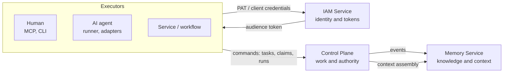

# Overview

This section explains what the Taimen platform is, what it is built from, and
how its components divide responsibility. Read it before you install anything:
without the "work — identity — knowledge" model, the rest of the guide reads
like a collection of unrelated APIs.

## Pages in this section

| Page | What it covers |
|---|---|
| [What is Taimen](what-is-taimen.md) | Organizational Runtime: people, agents, workflows, and services over a shared Work model; the organizational loop; what the platform is not |
| [Architecture](architecture.md) | Components, how they connect, request and event flows, sources of truth, integration invariants |
| [Key concepts](concepts.md) | Tenant, Workspace, Project, Principal, Task, Task Type, Claim, fencing token, Run, Approval, Artifact, Goal, Evidence, Session, Harness, Capability, Skill, Namespace, and more, as defined in the code |
| [Delivery contents](components.md) | Component repositories, `deploy/local/compose.yml` profiles (`core`, `edge`, `notify`), and the status of each |
| [Security model](security-model.md) | IAM tokens, audience, scopes, PAT, service accounts, bindings in Control Plane, `platform-auth-sdk`, revocation |

## In brief

- **Control Plane** holds the authoritative operational state: tasks, their
  types and statuses, claims with fencing tokens, runs, approvals, artifacts,
  and the event log.
- **IAM Service** manages tenants, principals, and credentials, and issues
  short-lived tokens for a single audience.
- **Memory Service** holds long-term knowledge with provenance and assembles
  bounded context. It does not manage work.
- Everything else is peripheral: notifications (`notify`), the edge (`edge`),
  clients, and executors.

## See also

- [Getting started](../getting-started/index.md)
- [Glossary](../reference/glossary.md)
