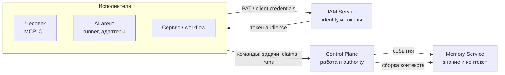

# Обзор

Раздел объясняет, что такое платформа Taimen, из чего она собрана и по каким
правилам компоненты делят ответственность. Читать его стоит до установки: без
модели «работа — identity — знание» остальные разделы руководства воспринимаются
как набор разрозненных API.

## Статьи раздела

| Статья | О чём |
|---|---|
| [Что такое Taimen](what-is-taimen.md) | Organizational Runtime: люди, агенты, workflows и сервисы над общей моделью Work; организационный цикл; чем платформа не является |
| [Архитектура](architecture.md) | Компоненты, их связи, потоки запросов и событий, источники истины, инварианты интеграции |
| [Ключевые понятия](concepts.md) | Tenant, Workspace, Project, Principal, Task, Task Type, Claim, fencing token, Run, Approval, Artifact, Goal, Evidence, Session, Harness, Capability, Skill, Namespace и другие — по коду |
| [Состав поставки](components.md) | Репозитории компонентов, профили `deploy/local/compose.yml` (`core`, `edge`, `notify`) и статус каждого |
| [Модель безопасности](security-model.md) | IAM-токены, audience, scopes, PAT, service accounts, bindings в Control Plane, `platform-auth-sdk`, отзыв |

## Коротко

- **Control Plane** — авторитетное операционное состояние: задачи, их типы и
  статусы, claims с fencing token, runs, approvals, артефакты, журнал событий.
- **IAM Service** — tenants, principals, credentials; выдаёт короткоживущие
  токены одного audience.
- **Memory Service** — долговременное знание с provenance и сборка ограниченного
  контекста; работой не управляет.
- Всё остальное — периферия: уведомления (`notify`), периметр (`edge`), клиенты
  и исполнители.

## См. также

- [Быстрый старт](../getting-started/index.md)
- [Глоссарий](../reference/glossary.md)
