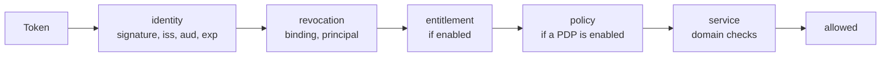
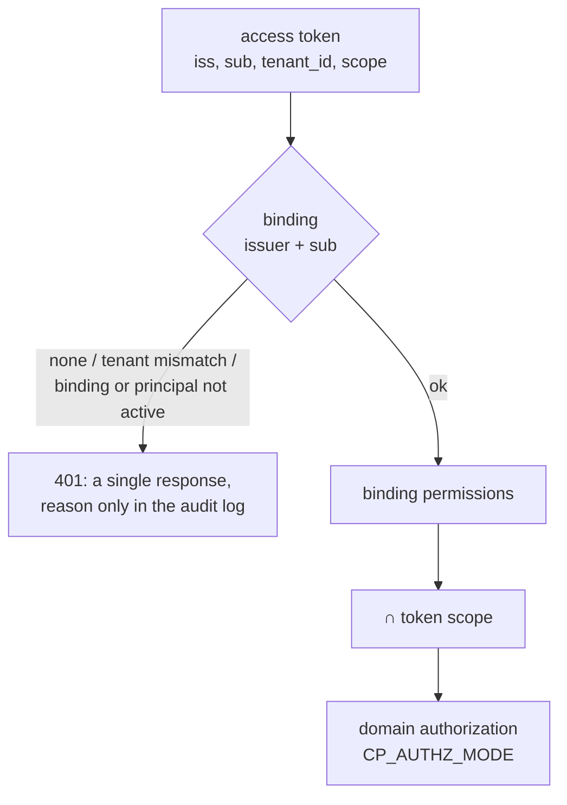

# Security model

This page describes how identity, credentials, and authorization work in
Taimen: who issues tokens, what they contain, how a service decides whether an
action is allowed, and how access is revoked. It is intended for security
engineers and for anyone connecting new services, agents, or harnesses to the
platform.

## Three questions, three owners

The decision on any request is split into independent questions, each with its
own owner:

| Question | Who answers | With what |
|---|---|---|
| **Who is this?** | IAM Service | a signed RS256 access token for a single audience |
| **May they use the product at all?** | an external license check (optional, if connected) | a license decision; disabled by default (`CP_ENTITLEMENT_ENABLED=false`) |
| **May they perform this action on this resource?** | the service that owns the resource (Control Plane, Memory Service, …) | the principal's own permissions and domain invariants |

An IAM token **carries no domain permissions**. The right to create a task
belongs to Control Plane, not to the identity provider: IAM only limits the
token with scopes, and the service intersects them with its own permissions.

The order of checks in the shared Policy Enforcement Point
(`platform-auth-sdk`) is fixed and not configurable:



Each step is more expensive than the previous one and only makes sense after
it. A denial at any step produces a stable code for the client and the exact
reason in the audit log.

## IAM: subjects and credentials

IAM owns tenants, principals, and their credentials:

| Principal kind in IAM | Who | Credential |
|---|---|---|
| `human` | a person | PAT (issued only after fresh authentication) or federation through an external IdP |
| `agent` | an autonomous executor | PAT issued by a bootstrap operation |
| `service_account` | a service | `clientId` + `clientSecret` |
| `workload` | a workload without interactive login | maps to `service` in Control Plane |

### Platform Access Token (PAT)

A PAT is a long-lived secret of a human or an agent. Its key property: **it is
presented only to IAM and only in the request body**. No resource service ever
sees a PAT.

- Issuance: `POST /api/v1/tenants/{t}/principals/{p}/platform-access-tokens`
  (the bootstrap header `X-IAM-Bootstrap-Token` and a required
  `Idempotency-Key`), with a list of `audiences`, a `scopeCeiling`, and a
  lifetime `expiresInSeconds`.
- For a human, issuance requires a **fresh authentication context**, no older
  than `IAM_PAT_MAX_AUTHENTICATION_AGE_SECONDS` (300 s); otherwise you get
  `authentication_context_required` / `authentication_context_expired`.
- For an agent, the provenance snapshot explicitly records the bootstrap
  operation (`agent_bootstrap`), and the agent's issued access tokens have no
  `auth_time` and `acr`. This, together with `principal_type`, is how its
  sessions are distinguished from human ones.
- A service account cannot get a PAT: `422 principal_kind_not_allowed`.
- Lifetime: 30 days by default (`IAM_PAT_DEFAULT_TTL_SECONDS`), 365 days
  maximum (`IAM_PAT_MAX_TTL_SECONDS`). **Rotation** (`:rotate`) changes the
  secret but does not extend the lifetime window; to extend it, issue a new
  PAT.

### Exchanging a PAT for an access token

```bash
curl -s -X POST http://127.0.0.1:18010/api/v1/platform-access-tokens:exchange \
  -H 'Content-Type: application/json' \
  -d '{"token": "'"$PAT"'", "audience": "control-plane",
       "scopes": ["control-plane:read", "control-plane:write"]}'
```

```json
{
  "accessToken": "eyJhbGciOiJSUzI1NiIsImtpZCI6...",
  "tokenType": "Bearer",
  "expiresIn": 300,
  "audience": "control-plane",
  "scope": ["control-plane:read", "control-plane:write"],
  "sessionId": "<session-id>"
}
```

Exchange rules:

1. The `audience` must be in the PAT's list of audiences and active in the
   tenant; otherwise you get `403 audience_not_allowed`.
2. The requested `scopes` must fall within the intersection of the PAT ceiling
   and the audience's `allowedScopes`; otherwise you get
   `403 scope_not_allowed`.
3. An empty `scopes` list means "the whole ceiling" (intersected with what the
   audience allows).
4. A scope is written **with the audience prefix**: `control-plane:read`, not
   `read`.

### Service accounts

Services (the Control Plane core when it calls memory, notification-service)
get tokens with client credentials:

```bash
curl -s -X POST http://127.0.0.1:18010/api/v1/tokens/exchange \
  -H 'Content-Type: application/json' \
  -d '{"clientId": "<client-id>", "clientSecret": "<client-secret>",
       "audience": "memory-service", "scopes": ["memory:read"]}'
```

A service account is created with a set of `audiences` and a `scopeCeiling`
(`POST /api/v1/tenants/{t}/service-accounts`) and revoked with
`POST …/service-accounts/{clientId}:revoke`. There is no separate operation to
change a service account's ceiling: to widen the ceiling, you issue a new
account and revoke the old one. Bootstrap does this automatically. See
[Service accounts](../iam/service-accounts.md).

### Access token

An access token is an RS256 JWT (`typ: at+jwt`, `kid` from
`IAM_SIGNING_KEY_ID`) with a default TTL of 300 s (`IAM_TOKEN_TTL_SECONDS`):

| Claim | Contents |
|---|---|
| `iss` | the IAM issuer, `${TAIMEN_PUBLIC_URL}/iam` |
| `sub` | the IAM principal id |
| `tenant_id` | the IAM tenant id |
| `aud` | exactly one audience |
| `scope` | the granted scopes |
| `scope_ceiling` | the credential's ceiling |
| `principal_type` | the principal kind (`human`, `agent`, `service_account`, …) |
| `credential_id` | the id of the credential the token was issued from |
| `session_id` | the id of the exchange session |
| `auth_time`, `acr` | only for a human with a confirmed login |
| `iat`, `nbf`, `exp`, `jti` | lifetime and uniqueness |

Public keys are served at IAM's `GET /.well-known/jwks.json`. Services read JWKS
from the **internal** address (`http://iam-service:8010/.well-known/jwks.json`)
and check the issuer against the **public** one, so signature verification does
not depend on the external proxy or TLS.

## Audiences and scopes

Each service is a separate audience with its own registry of allowed scopes.
Bootstrap registers them and keeps them in line with the registry:

| Audience | Scopes |
|---|---|
| `control-plane` | `control-plane:read`, `control-plane:write`, `control-plane:admin` |
| `memory-service` | `memory:read`, `memory:write`, `memory:pii`, `memory:tenants`, `memory:on-behalf`, `memory:service` |

One token, one service: a token for Control Plane is not accepted by memory and
vice versa (a service requires an exact `aud` match).

## Control Plane: bindings and permissions

Control Plane is a resource server: it verifies tokens but does not issue them.



1. **Binding.** An external identity maps to a local principal through a row in
   `iam_principal_bindings` keyed by the pair `(issuer, iam_principal_id)`. An
   unknown identity, a foreign tenant, a disabled binding, or an inactive
   principal all produce the same `401` response, so the response code does not
   reveal another tenant's directory; the exact reason (`binding_not_found`,
   `tenant_mismatch`, `binding_disabled`, `principal_not_active`) stays in the
   audit log.
2. **Scope narrowing.** Binding permissions are intersected with the token's
   ceiling by a simple rule:
    - `control-plane:admin`: binding permissions without narrowing;
    - the `admin` permission never applies without the admin scope;
    - `*.read` permissions require `control-plane:read`;
    - all others require `control-plane:write`.

    Scope only narrows and never widens: a binding with write permission cannot
    write with a read-only token.
3. **Domain authorization.** The `CP_AUTHZ_MODE` mode:
    - `local` (default): permissions from the binding and Control Plane roles;
    - `shadow`: the decision is still local, but an external PDP (if connected)
      is queried in parallel, and discrepancies are logged;
    - `policy`: an external PDP makes the decision (experimental).

### Agent permissions

By default, bootstrap grants agents `sessions.open`, `tasks.read`,
`tasks.write`, `tasks.claim`, `events.read`, `artifacts.read`,
`artifacts.write`, `projects.read`, `task_types.read`, and **refuses** to grant
an agent `admin` or `approvals.decide`: an approval decision is always made by a
human. For the full list of permissions, see
[Permissions and scopes](../reference/permissions.md).

### Legacy API keys

Control Plane has historically supported static keys `cp_<prefix>_<secret>`. In
the delivery they are disabled: `CP_LEGACY_API_KEYS_ENABLED=false`, and a
presented key returns `invalid_credentials`. The administrator key returned by
the initial Control Plane bootstrap is revoked immediately by the bootstrap
script.

!!! danger "Emergency access"
    If IAM is unavailable, the host owner issues an emergency key: with a
    command in the `control-plane-api` container, for an active human, with
    `admin` permissions, a lifetime of no more than 4 hours, and a reason
    recorded in the log (CP-ADR-0065). Such a key is accepted even when the
    legacy key window is closed; the trust boundary is a shell on the host. You
    disable it with `CP_BREAK_GLASS_ENABLED=false`. See
    [Emergency procedures](../operations/emergency.md).

## Memory Service

Memory accepts two kinds of credentials in parallel:

- **a static key** `MEMORY_API_KEY` (`CB_SERVER_API_KEY`): full access to all
  namespaces; in the delivery it is needed before bootstrap and by demo
  services;
- **IAM tokens** for the `memory-service` audience (`MEMORY_IAM_ENABLED=true`):
  `memory:read`/`memory:write` for reading and writing, `memory:pii` for full
  access to personal data, `memory:service` for registering domain kind
  packages, `memory:tenants` for the memory of all tenants (only the core's
  service account). A token grants access to the namespace `tenant:<tenant_id>`
  and its subtree.

Control Plane calls memory **with a service account** from
`secrets/control-plane-iam.env` (the `CP_CONTEXT_AUTH=auto` mode switches to it
automatically once the file exists and the core has been restarted); until
then, it uses the static key. Any token defect returns `401`, and an
unavailable JWKS returns `503` (fail closed).

## Revoking access

| What to revoke | How | When it stops working |
|---|---|---|
| PAT | `POST /api/v1/tenants/{t}/platform-access-tokens/{id}:revoke` (bootstrap) or `POST /api/v1/platform-access-tokens:revoke-self` | new exchanges: immediately; access tokens already issued: at expiry (≤ TTL, 300 s) |
| Service account | `POST /api/v1/tenants/{t}/service-accounts/{clientId}:revoke` | same as above |
| An entire IAM principal | `POST /api/v1/tenants/{t}/principals/{p}:disable` | same as above |
| Access to Control Plane | revoke the binding (`POST /api/v1/iam-bindings/{binding_id}:revoke`) or disable the local principal | within the binding cache: `CP_IAM_BINDING_CACHE_TTL_SECONDS` (30 s); a negative response lives no longer than `CP_IAM_BINDING_STALE_AFTER_SECONDS` (120 s) |

A short access token TTL narrows the window but does not close it: what closes
it is the service's **local revocation policy**. In Control Plane this is a
projection of the binding and the principal: if the source cannot answer,
access is not granted (fail closed).

!!! tip "Order for adding a new principal"
    Create the binding in Control Plane first, then make the first request with
    the token. A negative "binding not found" response is cached by the
    `control-plane-api` process for no longer than
    `CP_IAM_BINDING_STALE_AFTER_SECONDS`. Creating a binding through the API
    (`POST /api/v1/principals/{id}/iam-bindings`) clears the cache for that
    identity immediately; if the binding was created bypassing the API, the new
    access starts working only after that window expires.

## Platform secrets

| Secret | Where | Purpose |
|---|---|---|
| IAM signing key | `secrets/iam-signing.pem` (RSA 3072, 0600), mounted as a Docker secret | signs all access tokens |
| `IAM_BOOTSTRAP_TOKEN` | `.env` | IAM administrative operations via the `X-IAM-Bootstrap-Token` header |
| `CP_BOOTSTRAP_TOKEN` | `.env` | the one-time Control Plane `POST /api/v1/bootstrap` (`Authorization: Bearer`); after the first tenant, a repeat returns `409 already_bootstrapped` |
| `MEMORY_API_KEY` | `.env` | the static memory key |
| Operator PAT | `secrets/harness-pat` (0600) | human login |
| Service client credentials | `secrets/*-iam.env` (0600) | service accounts of the core and optional services |
| Database, Keycloak, and MinIO passwords | `.env` | infrastructure |

`.env`, `secrets/`, and `deploy/state/` are excluded from git. The bootstrap
script does not print secrets, and secrets do not reach the event log: Control
Plane rejects secret-like text in task fields and Work Graph documents
(`secret_material_rejected`). The client's local PAT store
(`~/.config/iam/credentials.json`) must have `600` permissions; otherwise the
client refuses to read it (`iam_credentials_file_permissions`).

For rotation and storage, see [Secrets and rotation](../operations/secrets.md).

## Harness trust boundary

The harness's local checks (MCP server, runner) protect the client; they are not
an enforcement boundary: a person with access to the machine can bypass them.
The strong boundary is on the server: Control Plane checks the claim, fencing
token, binding permissions, and gate approvals on every write. For the runner
daemon, the perimeter is set by an unprivileged OS user and systemd
restrictions, not by the coding agent's permission mode. See
[Agent identity](../runner/agent-identity.md).

### Human workplaces

The assistant in a person's workplace runs shell commands and may follow instructions
that arrive with data (prompt injection), so its container is untrusted. The Docker API
(the proxy for the launcher) sits in a separate internal network, and people's containers
are in their own network without databases, secret stores, or the proxy; the launcher
creates a container only from its own specification — without privileges, with limits,
with mounts of that person only. See [Workplace isolation](../workplace/index.md#isolation).

## See also

- [Tokens, audiences, scopes](../iam/tokens.md)
- [Credentials and PAT](../iam/credentials.md)
- [Authorization and permissions](../control-plane/authorization.md)
- [platform-auth-sdk](../sdk/platform-auth-sdk.md)
- [Troubleshooting: authentication and access](../troubleshooting/auth.md)
