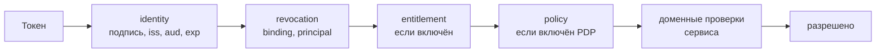
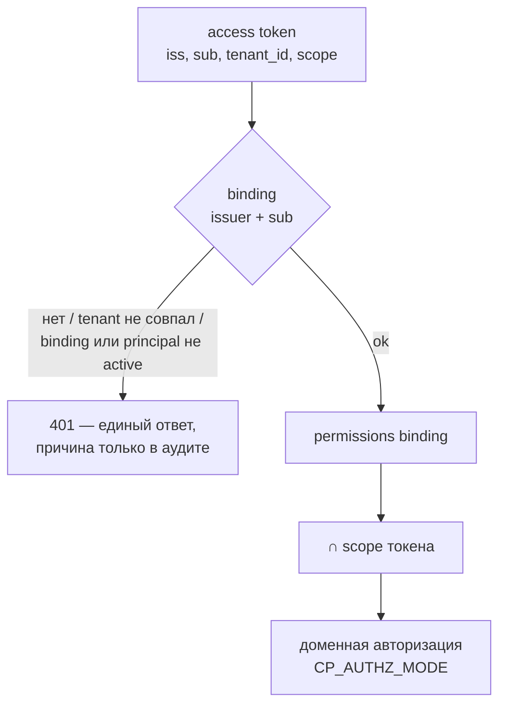

# Модель безопасности

Статья описывает, как в Taimen устроены identity, credentials и авторизация:
кто выпускает токены, что в них лежит, как сервис решает, разрешено ли действие,
и как отзывается доступ. Она адресована инженерам безопасности и тем, кто
подключает к платформе новые сервисы, агентов и харнессы.

## Три вопроса — три ответчика

Решение о любом запросе разложено на независимые вопросы, у каждого свой
владелец:

| Вопрос | Кто отвечает | Чем |
|---|---|---|
| **Кто это?** | IAM Service | подписанный RS256 access token одного audience |
| **Может ли он вообще пользоваться продуктом?** | внешняя проверка лицензии (опционально, если подключена) | решение по лицензии; по умолчанию выключено (`CP_ENTITLEMENT_ENABLED=false`) |
| **Можно ли ему это действие над этим ресурсом?** | сервис-владелец ресурса (Control Plane, Memory Service, …) | собственные права principal и доменные инварианты |

Токен IAM **не несёт доменных прав**. Право создать задачу принадлежит Control
Plane, а не провайдеру identity: IAM лишь ограничивает токен scope'ами, а
сервис пересекает их со своими правами.

Порядок проверок в общем Policy Enforcement Point (`platform-auth-sdk`) фиксирован
и не настраивается:



Каждый следующий шаг дороже предыдущего и имеет смысл только после него.
Отказ на любом шаге — стабильный код для клиента и точная причина в аудите.

## IAM: субъекты и credentials

IAM владеет tenants, principals и их credentials:

| Вид principal в IAM | Кто | Credential |
|---|---|---|
| `human` | человек | PAT (выпуск только после свежей аутентификации) или федерация через внешний IdP |
| `agent` | автономный исполнитель | PAT, выпускаемый bootstrap-операцией |
| `service_account` | сервис | `clientId` + `clientSecret` |
| `workload` | нагрузка без интерактивного входа | в Control Plane отображается в `service` |

### Platform Access Token (PAT)

PAT — долгоживущий секрет human или agent. Главное свойство: **он
предъявляется только IAM и только в теле запроса**. Ни один resource service
PAT не видит.

- Выпуск: `POST /api/v1/tenants/{t}/principals/{p}/platform-access-tokens`
  (bootstrap-заголовок `X-IAM-Bootstrap-Token`, обязательный `Idempotency-Key`),
  с перечнем `audiences`, потолком `scopeCeiling` и сроком `expiresInSeconds`.
- Для человека выпуск требует **свежего authentication context** — не старше
  `IAM_PAT_MAX_AUTHENTICATION_AGE_SECONDS` (300 с); иначе
  `authentication_context_required` / `authentication_context_expired`.
- Для агента снимок происхождения честно фиксирует bootstrap-операцию
  (`agent_bootstrap`), и в выданных access token у агента нет `auth_time` и
  `acr` — по этому признаку и по `principal_type` его сессии отличаются от
  человеческих.
- Service account PAT получить не может: `422 principal_kind_not_allowed`.
- Срок: по умолчанию 30 дней (`IAM_PAT_DEFAULT_TTL_SECONDS`), максимум 365
  дней (`IAM_PAT_MAX_TTL_SECONDS`). **Ротация** (`:rotate`) меняет секрет, но
  не продлевает окно жизни — для продления нужен новый выпуск.

### Обмен PAT на access token

```bash
curl -s -X POST http://127.0.0.1:18010/api/v1/platform-access-tokens:exchange \
  -H 'Content-Type: application/json' \
  -d '{"token": "'"$PAT"'", "audience": "control-plane",
       "scopes": ["control-plane:read", "control-plane:write"]}'
```

```json
{
  "accessToken": "eyJhbGciOiJSUzI1NiIsImtpZCI6...",
  "tokenType": "Bearer",
  "expiresIn": 300,
  "audience": "control-plane",
  "scope": ["control-plane:read", "control-plane:write"],
  "sessionId": "<session-id>"
}
```

Правила обмена:

1. `audience` должен быть в списке audiences PAT и активен в tenant — иначе
   `403 audience_not_allowed`.
2. Запрошенные `scopes` должны входить в пересечение потолка PAT и
   `allowedScopes` audience — иначе `403 scope_not_allowed`.
3. Пустой список `scopes` означает «весь потолок» (пересечённый с тем, что
   разрешено audience).
4. Scope пишется **с префиксом audience**: `control-plane:read`, а не `read`.

### Service accounts

Сервисы (ядро Control Plane при походе в память, notification-service) получают
токены по client credentials:

```bash
curl -s -X POST http://127.0.0.1:18010/api/v1/tokens/exchange \
  -H 'Content-Type: application/json' \
  -d '{"clientId": "<client-id>", "clientSecret": "<client-secret>",
       "audience": "memory-service", "scopes": ["memory:read"]}'
```

Service account создаётся с набором `audiences` и `scopeCeiling`
(`POST /api/v1/tenants/{t}/service-accounts`), отзывается
`POST …/service-accounts/{clientId}:revoke`. Отдельного изменения потолка у
service account нет: при расширении потолка выпускается новый, прежний
отзывается. Bootstrap делает это автоматически. См.
[Service accounts](../iam/service-accounts.md).

### Access token

Access token — JWT RS256 (`typ: at+jwt`, `kid` из `IAM_SIGNING_KEY_ID`),
TTL по умолчанию 300 с (`IAM_TOKEN_TTL_SECONDS`):

| Claim | Содержимое |
|---|---|
| `iss` | issuer IAM — `${TAIMEN_PUBLIC_URL}/iam` |
| `sub` | IAM principal id |
| `tenant_id` | IAM tenant id |
| `aud` | ровно один audience |
| `scope` | выданные scopes |
| `scope_ceiling` | потолок credential |
| `principal_type` | вид principal (`human`, `agent`, `service_account`, …) |
| `credential_id` | id credential, по которому выпущен токен |
| `session_id` | id сессии обмена |
| `auth_time`, `acr` | только у человека с подтверждённым входом |
| `iat`, `nbf`, `exp`, `jti` | время жизни и уникальность |

Публичные ключи — `GET /.well-known/jwks.json` IAM. Сервисы читают JWKS по
**внутреннему** адресу (`http://iam-service:8010/.well-known/jwks.json`), а
issuer сверяют с **публичным**: проверка подписи не зависит от внешнего прокси и
TLS.

## Audiences и scopes

Каждый сервис — отдельный audience со своим реестром допустимых scopes.
Bootstrap регистрирует и приводит к реестру:

| Audience | Scopes |
|---|---|
| `control-plane` | `control-plane:read`, `control-plane:write`, `control-plane:admin` |
| `memory-service` | `memory:read`, `memory:write`, `memory:pii`, `memory:tenants`, `memory:on-behalf`, `memory:service` |

Один токен — один сервис: токен для Control Plane не принимается памятью и
наоборот (сервис требует точного совпадения `aud`).

## Control Plane: bindings и права

Control Plane — resource server: токены проверяет, но не выпускает.



1. **Binding.** Внешняя identity отображается на локальный principal строкой
   `iam_principal_bindings` по паре `(issuer, iam_principal_id)`. Неизвестная
   identity, чужой tenant, отключённый binding или неактивный principal дают
   один и тот же ответ `401` — код ответа не раскрывает чужой каталог; точная
   причина (`binding_not_found`, `tenant_mismatch`, `binding_disabled`,
   `principal_not_active`) остаётся в аудите.
2. **Сужение scope.** Права binding пересекаются с потолком токена по простому
   правилу:
    - `control-plane:admin` — права binding без сужения;
    - право `admin` без admin-scope не действует никогда;
    - права вида `*.read` требуют `control-plane:read`;
    - все остальные — `control-plane:write`.

    Scope только сужает, никогда не расширяет: binding с правом записи при
    токене «только чтение» писать не сможет.
3. **Доменная авторизация.** Режим `CP_AUTHZ_MODE`:
    - `local` (по умолчанию) — права из binding и ролей Control Plane;
    - `shadow` — решение по-прежнему локальное, но параллельно спрашивается
      внешний PDP (если подключён), расхождения пишутся в журнал;
    - `policy` — решение принимает внешний PDP (experimental).

### Права агентов

Bootstrap выдаёт агентам по умолчанию `sessions.open`, `tasks.read`,
`tasks.write`, `tasks.claim`, `events.read`, `artifacts.read`,
`artifacts.write`, `projects.read`, `task_types.read` и **отказывается**
выдавать агенту `admin` или `approvals.decide`: решение по approval — всегда
человек. Полный перечень прав — [Права и scopes](../reference/permissions.md).

### Legacy API-ключи

Control Plane исторически поддерживает статические ключи `cp_<prefix>_<secret>`.
В поставке они выключены: `CP_LEGACY_API_KEYS_ENABLED=false`, предъявленный
ключ даёт `invalid_credentials`. Ключ администратора, который возвращает
первичный bootstrap Control Plane, bootstrap-скрипт сразу отзывает.

!!! danger "Аварийный вход"
    Если IAM недоступен, владелец хоста выпускает аварийный ключ: командой
    в контейнере `control-plane-api`, для активного человека, с правами
    `admin`, сроком не больше 4 часов и причиной в журнале (CP-ADR-0065).
    Такой ключ принимается и при закрытом окне legacy-ключей; граница
    доверия — shell на хосте. Выключается `CP_BREAK_GLASS_ENABLED=false`. См.
    [Аварийные процедуры](../operations/emergency.md).

## Memory Service

Память принимает два вида credential параллельно:

- **статический ключ** `MEMORY_API_KEY` (`CB_SERVER_API_KEY`) — полный доступ ко
  всем namespace; в поставке нужен до bootstrap и демо-сервисам;
- **токены IAM** audience `memory-service` (`MEMORY_IAM_ENABLED=true`):
  `memory:read`/`memory:write` — чтение и запись, `memory:pii` — полный доступ к
  персональным данным, `memory:service` — регистрация доменных пакетов видов,
  `memory:tenants` — память всех tenant (только service account ядра). Токен
  даёт доступ к namespace `tenant:<tenant_id>` и его поддереву.

Control Plane ходит в память **service account'ом** из
`secrets/control-plane-iam.env` (режим `CP_CONTEXT_AUTH=auto` переключается на
него сам, как только файл появился и ядро перезапущено); до этого — статическим
ключом. Любой дефект токена — `401`, недоступный JWKS — `503` (fail closed).

## Отзыв доступа

| Что отозвать | Как | Когда перестанет работать |
|---|---|---|
| PAT | `POST /api/v1/tenants/{t}/platform-access-tokens/{id}:revoke` (bootstrap) или `POST /api/v1/platform-access-tokens:revoke-self` | новые обмены — сразу; уже выданные access token — до истечения (≤ TTL, 300 с) |
| Service account | `POST /api/v1/tenants/{t}/service-accounts/{clientId}:revoke` | то же |
| Principal IAM целиком | `POST /api/v1/tenants/{t}/principals/{p}:disable` | то же |
| Доступ к Control Plane | отозвать binding (`POST /api/v1/iam-bindings/{binding_id}:revoke`) или отключить локальный principal | в пределах кэша binding: `CP_IAM_BINDING_CACHE_TTL_SECONDS` (30 с); отрицательный ответ живёт не дольше `CP_IAM_BINDING_STALE_AFTER_SECONDS` (120 с) |

Короткий TTL access token ограничивает окно, но не закрывает его: закрывает
**локальная revocation policy** сервиса. В Control Plane это проекция binding и
principal: если источник не смог ответить, доступ не выдаётся (fail closed).

!!! tip "Порядок заведения нового principal"
    Сначала создайте binding в Control Plane, потом делайте первый запрос
    токеном. Отрицательный ответ «binding не найден» кэшируется процессом
    `control-plane-api` не дольше `CP_IAM_BINDING_STALE_AFTER_SECONDS`.
    Создание binding через API (`POST /api/v1/principals/{id}/iam-bindings`)
    сбрасывает кэш этой identity сразу; если же binding появился в обход API,
    новый доступ заработает только после истечения этого окна.

## Секреты платформы

| Секрет | Где | Назначение |
|---|---|---|
| Ключ подписи IAM | `secrets/iam-signing.pem` (RSA 3072, 0600), монтируется docker-секретом | подпись всех access token |
| `IAM_BOOTSTRAP_TOKEN` | `.env` | административные операции IAM заголовком `X-IAM-Bootstrap-Token` |
| `CP_BOOTSTRAP_TOKEN` | `.env` | однократный `POST /api/v1/bootstrap` Control Plane (`Authorization: Bearer`); после первого tenant повтор даёт `409 already_bootstrapped` |
| `MEMORY_API_KEY` | `.env` | статический ключ памяти |
| PAT оператора | `secrets/harness-pat` (0600) | вход человека |
| Client credentials сервисов | `secrets/*-iam.env` (0600) | service accounts ядра и опциональных сервисов |
| Пароли БД, Keycloak, MinIO | `.env` | инфраструктура |

`.env`, `secrets/` и `deploy/state/` исключены из git. Секреты не печатаются
bootstrap-скриптом и не попадают в журнал событий: Control Plane отвергает
текст, похожий на секрет, в полях задач и документах Work Graph
(`secret_material_rejected`). Локальное хранилище PAT клиента
(`~/.config/iam/credentials.json`) должно иметь права `600`, иначе клиент
откажется его читать (`iam_credentials_file_permissions`).

Ротация и хранение — [Секреты и ротация](../operations/secrets.md).

## Граница доверия харнесса

Локальные проверки харнесса (MCP-сервер, runner) — защита клиента, а не
enforcement boundary: человек с доступом к машине может обойти их. Сильная
граница — на сервере: claim, fencing token, права binding и gate-approvals
проверяются Control Plane при каждой записи. У runner-демона периметр задают
непривилегированный пользователь ОС и ограничения systemd, а не режим
разрешений кодового агента. См. [Identity агента](../runner/agent-identity.md).

### Рабочие места людей

Ассистент в рабочем месте человека исполняет команды в shell и может следовать
инструкциям, пришедшим с данными (prompt injection), поэтому его контейнер — недоверенный.
Docker API (прокси для launcher'а) стоит в отдельной внутренней сети, контейнеры людей —
в своей сети без баз, хранилищ секретов и прокси; launcher создаёт контейнер только по
своей спецификации — без привилегий, с лимитами, с монтированиями только этого человека.
См. [Изоляция рабочих мест](../workplace/index.md#isolation).

## См. также

- [Токены, audiences, scopes](../iam/tokens.md)
- [Credentials и PAT](../iam/credentials.md)
- [Авторизация и права](../control-plane/authorization.md)
- [platform-auth-sdk](../sdk/platform-auth-sdk.md)
- [Аутентификация и доступ — диагностика](../troubleshooting/auth.md)
