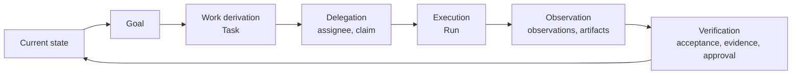

# What is Taimen

Taimen is an Organizational Runtime: an environment in which an organization's
work is carried out by people, AI agents, deterministic processes, and software
services under shared governance. This page explains the product idea and the
organizational loop the platform is built on, and it clearly separates what is
already implemented from what is a target direction.

## The central entity is Work

Most AI systems are built around an agent, a chat, or a model. In Taimen the
central entity is **work** (Work): an organizational commitment that exists
independently of who carries it out and with what tools.

- Work is described by a typed task, `Task` in Control Plane. There is no
  separate, parallel "work item" entity: a Work Item is a `Task` with a
  versioned type (`Task Type`), statuses, fields, and rules.
- An attempt to carry out the work is a `Run`. A task can be executed several
  times, each time as a new `Run` under a new `Claim`.
- The executor is replaceable. A person at a workstation, Claude Code or Codex
  through the runner daemon, a service over HTTP: all of them use the same
  Control Plane commands. They claim the task, start a run, record checkpoints
  and artifacts, and complete the run.

This gives the main architectural principle: **the Work Graph and authority
live in Control Plane, while the harness, the model, and the executor are
replaceable.**

## Who carries out the work

| Executor | How it connects | Identity |
|---|---|---|
| Human | a workplace in the browser, MCP plugin in Claude Code / Codex, Human Harness, the `control-plane` CLI | a principal of kind `human` in IAM and in Control Plane |
| AI agent | the `control-plane-agent` daemon (runner) with Claude Code and Codex adapters | a principal of kind `agent`; permissions are restricted: no `admin` and no `approvals.decide` |
| Service, connector | an HTTP client with an IAM service account or an agent PAT | a principal of kind `service` in Control Plane |
| Deterministic process | a [process](../processes/index.md) from a catalog package, executed by the core itself; approval outcome rules in the task type | acts as the process identity, an agent description of kind `service` or `agent` |

Every executor presents Control Plane with an IAM token for a single audience
(`control-plane`), and Control Plane itself decides what the executor is allowed
to do. For details, see the [Security model](security-model.md).

## The organizational loop

The platform is designed around a closed loop:

How each link of the loop is expressed in the code today:

| Link | What exists in Control Plane | State |
|---|---|---|
| Goal | `Goal` with `desiredState`, `criteria`, and a goal hierarchy (CP-ADR-0062) | implemented |
| Work | `Task` with `origin` (why it exists), `acceptance` (how to verify it), `evidence` (references to facts), and a link to `goalId` | implemented; `acceptance` checks are only declared for now |
| Deriving work from facts | intake of external observations via `POST /api/v1/observations` with deduplication (CP-ADR-0057); declarative `ensureWork` actions in approval outcomes | partial: there is no general "observation → work" rule engine yet |
| Delegation | `assigneeId`, role/capability/skill requirements, `GET /api/v1/work/available`, claim with a lease and a fencing token | implemented |
| Execution | `Run`, checkpoints, run actions, control of the active turn, child runs, skill invocation | implemented |
| Verification | approvals with outcomes declared by the task type (CP-ADR-0061); code review by a second executor | implemented; automatic evaluation of `acceptance` is a target direction |
| Memory | Control Plane events are delivered to Memory Service; task context is assembled from memory | implemented |

!!! note "Current status"
    The platform perimeter (identity, authorization, execution, memory) works.
    The center of the loop (automatically deriving work from state and
    automatically verifying results) is under construction: the entities and
    contracts exist, while the rule engines and acceptance evaluation are in
    development. This guide describes what exists in the code and marks
    everything else.

## Principles

1. **One fact, one authoritative home.** Work lives in Control Plane, identity
   in IAM, knowledge in Memory Service, code and configuration in Git.
2. **Memory does not manage work.** Context from memory can be stale and never
   replaces a check in Control Plane: the claim, fencing token, status, and
   permissions are verified there.
3. **Identity is not permission.** IAM confirms *who* is calling and limits the
   token with scopes; the service that owns the resource decides *what* the
   caller may do.
4. **An external action starts with permission.** An executor writes to Control
   Plane only under a live claim with a current fencing token; risky steps go
   through approval.
5. **Deterministic-first.** An LLM resolves semantic uncertainty, but it does
   not become a source of truth and does not replace a cheap deterministic
   check.
6. **Product-neutral core.** Core components do not know the name of the
   product, the customer, or the industry; domain specifics arrive as data:
   task types, project templates, skills, catalog packages.
7. **Local degradation.** Memory being unavailable does not block authoritative
   Control Plane operations; an external system being unavailable does not
   corrupt the log.

## What Taimen is not

- **Not a chatbot or an agent framework.** The agent loop lives in the harness
  (Claude Code, Codex, Human Harness); the platform gives it work, permissions,
  context, and a log.
- **Not a task tracker.** Tasks here are operational commitments with leases,
  fencing, and audit, not cards on a board. The human interface is one of
  several surfaces, not the center of the system.
- **Not a secret store or a CI system.** Secrets live in `.env`/`secrets/` or an
  external Secret Manager; builds and deployments happen in external systems
  that executors work with under a claim.
- **Not an LLM provider.** Memory and skills use any OpenAI-compatible
  endpoint; memory can also run offline on stubs.

## How the product is assembled

Taimen is the name of the build. The components are separate product-neutral
repositories, attached to the superproject as git submodules, and they run from
a single `deploy/local/compose.yml` with profiles:

- the core (`core`): IAM Service, Control Plane (API, worker, context adapter),
  Memory Service, and their PostgreSQL databases;
- the edge (`edge`): Caddy, the only container exposed to the outside;
- optional profiles: notifications (`notify`), the console with human sign-in
  through Keycloak (`console`, `idp`), the assistant (`harness`), and placement of
  executors on nodes (`fleet`).

For contents and statuses, see [Delivery contents](components.md); for how the
parts connect, see [Architecture](architecture.md).

## See also

- [Key concepts](concepts.md)
- [Work model](../control-plane/work-model.md)
- [Goals, acceptance, and evidence](../control-plane/goals-and-evidence.md)
- [Getting started](../getting-started/index.md)
