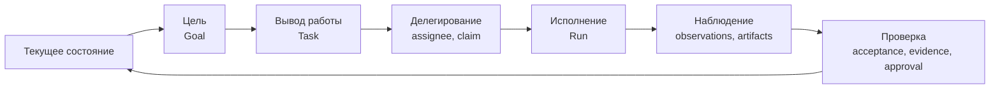

# Что такое Taimen

Taimen — Organizational Runtime: среда, в которой работа организации
исполняется людьми, AI-агентами, детерминированными процессами и программными
сервисами под общим управлением. Статья объясняет продуктовую идею, организационный
цикл, на который опирается платформа, и честно разделяет то, что уже реализовано,
и то, что является целевым направлением.

## Главная сущность — Work

Большинство систем с AI строятся вокруг агента, чата или модели. В Taimen
центральная сущность — **работа** (Work): организационное обязательство,
которое существует независимо от того, кто и чем его исполняет.

- Работа описывается типизированной задачей — `Task` в Control Plane. Отдельной
  параллельной сущности «work item» нет: Work Item — это и есть `Task` с
  версионированным типом (`Task Type`), статусами, полями и правилами.
- Попытка исполнения — `Run`. Задачу можно исполнять несколько раз, каждый раз
  новым `Run` под новым `Claim`.
- Исполнитель заменяем. Человек в рабочем месте, Claude Code или Codex через
  runner-демон, сервис через HTTP — все работают через одни и те же команды
  Control Plane: взять задачу (claim), начать run, записать checkpoints и
  артефакты, завершить.

Отсюда главный архитектурный принцип: **Work Graph и authority живут в Control
Plane, а harness, модель и исполнитель — сменные.**

## Кто исполняет работу

| Исполнитель | Как подключается | Identity |
|---|---|---|
| Человек | MCP-плагин в Claude Code / Codex, CLI `control-plane`, собственный клиент харнесс-протокола | principal вида `human` в IAM и в Control Plane |
| AI-агент | демон `control-plane-agent` (runner) с адаптерами Claude Code и Codex | principal вида `agent`; права урезаны: без `admin` и `approvals.decide` |
| Сервис, коннектор | HTTP-клиент с service account IAM или PAT агента | principal вида `service` в Control Plane |
| Детерминированный процесс | [процесс](../processes/index.md) пакета каталога, который исполняет само ядро; правила исхода approval в типе задачи | действует от личности процесса — описания агента вида `service` или `agent` |

Все исполнители предъявляют Control Plane токен IAM одного audience
(`control-plane`), а Control Plane сам решает, что им разрешено. Подробности —
в [Модели безопасности](security-model.md).

## Организационный цикл

Платформа проектируется вокруг замкнутого цикла:

Как звенья цикла выражены в коде сегодня:

| Звено | Что есть в Control Plane | Состояние |
|---|---|---|
| Цель | `Goal` с `desiredState`, `criteria`, иерархией целей (CP-ADR-0062) | реализовано |
| Работа | `Task` с `origin` (почему существует), `acceptance` (как проверить), `evidence` (ссылки на факты), связью с `goalId` | реализовано; проверки `acceptance` пока только объявляются |
| Вывод работы из фактов | приём внешних наблюдений `POST /api/v1/observations` с дедупликацией (CP-ADR-0057); декларативные действия `ensureWork` в исходах approval | частично: общего движка правил «наблюдение → работа» пока нет |
| Делегирование | `assigneeId`, требования ролей/capabilities/skills, `GET /api/v1/work/available`, claim с lease и fencing token | реализовано |
| Исполнение | `Run`, checkpoints, run actions, управление активным ходом, дочерние runs, вызов скиллов | реализовано |
| Проверка | approvals с исходами, объявленными типом задачи (CP-ADR-0061); ревью кода вторым исполнителем | реализовано; автоматическая оценка `acceptance` — целевое направление |
| Память | события Control Plane доставляются в Memory Service; контекст задачи собирается из памяти | реализовано |

!!! note "Честный статус"
    Периметр платформы — identity, авторизация, исполнение, память — работает.
    Центр цикла (автоматический вывод работы из состояния и автоматическая
    проверка результата) строится: сущности и контракты уже есть, движки правил
    и оценки acceptance — в разработке. Руководство описывает то, что есть в
    коде, и помечает остальное.

## Принципы

1. **Один факт — один авторитетный дом.** Работа — в Control Plane, identity —
   в IAM, знание — в Memory Service, код и конфигурация — в Git.
2. **Память не управляет работой.** Контекст из памяти может быть устаревшим и
   никогда не заменяет проверку в Control Plane: claim, fencing token, статус и
   права проверяются там.
3. **Identity не равна праву.** IAM подтверждает, *кто* пришёл, и ограничивает
   токен scope'ами; *что* ему можно, решает сервис-владелец ресурса.
4. **Внешнее действие начинается с разрешения.** Исполнитель пишет в Control
   Plane только под живым claim с актуальным fencing token; рискованные шаги
   проходят через approval.
5. **Deterministic-first.** LLM закрывает семантическую неопределённость, но не
   становится источником истины и не заменяет дешёвую детерминированную
   проверку.
6. **Product-neutral core.** Компоненты ядра не знают имени продукта, клиента
   или отрасли; предметная специфика приходит данными — типами задач, шаблонами
   проектов, скиллами, пакетами каталога.
7. **Локальная деградация.** Недоступность памяти не блокирует авторитетные
   операции Control Plane; недоступность внешней системы не повреждает журнал.

## Чем Taimen не является

- **Не чат-бот и не агентный фреймворк.** Агентный цикл живёт в харнессе
  (Claude Code, Codex); платформа даёт ему работу, права, контекст и журнал.
- **Не трекер задач.** Задачи здесь — операционные обязательства с lease,
  fencing и аудитом, а не карточки на доске; интерфейс человека — одна из
  поверхностей, а не центр системы.
- **Не хранилище секретов и не CI.** Секреты живут в `.env`/`secrets/` или
  внешнем Secret Manager; сборка и выкладка — во внешних системах, с которыми
  исполнители работают под claim.
- **Не LLM-провайдер.** Память и скиллы используют любой OpenAI-совместимый
  endpoint; память умеет работать офлайн на заглушках.

## Из чего собирается продукт

Taimen — имя сборки. Компоненты — отдельные product-neutral репозитории,
подключённые к суперпроекту git-сабмодулями, и запускаются одним `deploy/local/compose.yml`
с профилями:

- ядро (`core`): IAM Service, Control Plane (API, worker, context adapter),
  Memory Service и их PostgreSQL;
- периметр (`edge`): Caddy — единственный контейнер, смотрящий наружу;
- опциональный профиль уведомлений (`notify`).

Состав и статусы — в [Составе поставки](components.md), связи — в
[Архитектуре](architecture.md).

## См. также

- [Ключевые понятия](concepts.md)
- [Модель работы Control Plane](../control-plane/work-model.md)
- [Цели, приёмка и evidence](../control-plane/goals-and-evidence.md)
- [Быстрый старт](../getting-started/index.md)
