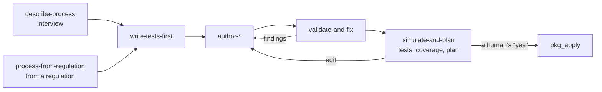

# Package author in Claude Code

The `package-author` plugin from the `package-sdk` component turns Claude Code into
an author of catalog packages: task types, rules, processes, agents, integrations,
ontologies, and notification rules. A human describes the work in their own words
or points to a regulation in the knowledge base, and the agent asks clarifying
questions, writes tests before objects, drives the package to green tests using
machine-readable findings, builds the installation plan, and shows it. **It applies
the plan only after the human explicitly consents to the plan shown.** The article
is for process owners and administrators. Rationale: TAI-ADR-0062 item 10,
TAI-ADR-0054 item 10.

## What you need

| What | Why |
|---|---|
| `package-sdk` with the `mcp` extra on `PATH` | the plugin starts the `package-sdk mcp` MCP server with the tools `pkg_check`, `pkg_test`, `pkg_describe`, `pkg_edit`, `pkg_plan`, `pkg_apply`; the `sandbox` extra adds the core code for checks and tests without a deployment, `skills` adds the skill contract stage |
| `PACKAGE_SDK_SERVERS` in the environment in which the host starts the server | deployment addresses separated by spaces or commas; the token is sent only to them. Without the variable, the server works without a deployment: checks, tests, edits |
| a deployment credential | the same as the operator's: `CP_TOKEN` or a credential that the core client finds (an IAM credential file, then an API key). Only `pkg_plan`, `pkg_apply`, and the `server` option of `pkg_check` and `pkg_test` need it |
| the credential's permissions in the core | `packages.test` and `packages.plan`, plus the permissions of the kinds being installed (`processes.write`, `calendars.write`, and the others; see [Installation and release](install-and-release.md#apply)) |
| [The operator MCP plugin](../operator/mcp-plugin.md) | the core `cp_*` tools that some skills use: `cp_recall`, `cp_process_get`, `cp_process_explain`, `cp_invoke_skill`, `cp_approve`, and others |
| the `processes.read` permission for the operator | `cp_process_get` and `cp_process_explain` read a process, its versions, and an instance log; `describe-process` and `explain-instance` use them |

Rule and task type scenarios in the sandbox need an empty PostgreSQL database: set
`PACKAGE_SDK_SANDBOX_DATABASE_URL` in the session environment (see [Package
tests](testing.md#sandbox)).

## Installation

The `sdk/package-sdk/` directory of the delivery is both the `package-sdk` marketplace
(manifest `.claude-plugin/marketplace.json`) and the plugin sources
(`plugin/package-author`). From the root of the delivery:

1. **Install `package-sdk`** as a uv tool:

    ```bash
    uv tool install --reinstall "./sdk/package-sdk[mcp,sandbox,skills]" --with pytest
    package-sdk mcp --help
    ```

    The core code and the SDKs of neighboring directories (`control-plane`,
    `skill-sdk`) are included as editable links, so install from a permanent
    checkout, not from a temporary directory: otherwise the server stops starting
    once the directory is deleted. `pytest` is needed by the integration code test
    stage (see [Package tests](testing.md#install)).

2. **Add the marketplace and install the plugin:**

    ```bash
    claude plugin marketplace add ./sdk/package-sdk
    claude plugin install package-author@package-sdk
    ```

    The same inside Claude Code: `/plugin marketplace add ./sdk/package-sdk`, then
    `/plugin install package-author@package-sdk`. Instead of a local directory,
    you can specify the component repository on GitHub:
    `/plugin marketplace add <org>/<repo>`. To develop the plugin itself without
    installing it: `claude --plugin-dir sdk/package-sdk/plugin/package-author`.

3. **Verify.** In a new session, `/plugin` shows `package-author`, `/mcp` shows
   the `package-sdk` server with six tools, and a request like "describe the
   invoice payment process" starts the interview.

!!! note "After updating package-sdk"
    New server tools appear after `uv tool install --reinstall`, new skills after
    `claude plugin marketplace update package-sdk` and
    `claude plugin update package-author@package-sdk`; then restart the Claude
    Code session.

## Workflow



| Skill | What it does | Tools |
|---|---|---|
| `describe-process` | an interview from a template → a draft specification in words for confirmation | `cp_recall`, `cp_process_get` |
| `process-from-regulation` | a regulation from the knowledge base → clauses → `governedBy` element references and a test for each verifiable requirement → clause coverage in the plan | `cp_recall`, `pkg_plan` |
| `write-tests-first` | `tests/*.test.yaml` tests before objects; each test first fails for its own reason | `pkg_check`, `pkg_test` |
| `author-package` | a process following the language schema; small edits through `package-sdk edit` operations, without rewriting files | `pkg_edit`, `pkg_test` |
| `author-work` | task types, roles, artifact types with `subject: taskType` tests | `pkg_check`, `pkg_test` |
| `author-rule` | work rules with `subject: rule` tests | `pkg_check`, `pkg_test` |
| `author-agent` | agents: identity, work, executor, skills, placement | `pkg_check`, `pkg_describe` |
| `author-integration` | an observer and integration skills, their tests and images | `pkg_test` |
| `author-notification` | notification rules | `pkg_check` |
| `validate-and-fix` | a loop over `{code, file, line, path, message, hint}` findings until the package is clean and the tests are green | `pkg_check`, `pkg_test` |
| `simulate-and-plan` | tests with coverage, the installation plan by section, apply on "yes" | `pkg_test`, `pkg_plan`, `pkg_apply` |
| `release-package` | version, changelog, tag on "yes", lock, plan, and apply on "yes" | `pkg_edit`, `pkg_test`, `pkg_plan`, `pkg_apply` |
| `explain-instance` | why an instance is in this state, what happens on an event, who decided what, which regulations govern the decision | `cp_process_get`, `cp_process_explain` |
| `goal-as-process` | a desired state as a reconciliation process without `complete` (see [Goals as processes](../processes/index.md#goals)) | — |
| `knowledge-model` | your own kind of knowledge → a tenant ontology package → a plan → registration on "yes" | `pkg_check`, `pkg_plan`, `pkg_apply` |
| `knowledge-import` | a human's table → a kind template → upload → a platform plan → a decision on "yes" | `cp_invoke_skill`, `cp_approve`, `cp_reject` |

The references the agent relies on live in the `package-sdk` repository:

| Reference | Path |
|---|---|
| an end-to-end package outside software development: a process, a rule, a task type with an external write, an observer, skills, agents, an ontology, a notification, and their scenarios | `examples/claims/` (see [Example](tutorial.md)) |
| all constructs of the process language and a scenario for them | `tests/fixtures/process/purchase.process.yaml`, `purchase.test.yaml` |
| a package with a rule, a task type, a skill, and integration code | `tests/fixtures/pyramid/packages/review-flow/` |
| a manifest with `engines`, `requires`, `variables`, `knowledge` | `tests/fixtures/manifest/acme-claims/package.yaml` |
| an installation with sources by path and from git, ontologies, and retirement | `tests/fixtures/schema/installation-sources.yaml` |

### Sample conversation

1. Human: "This is how we pay a supplier invoice: accounting checks it; up to one
   hundred thousand, accounting also approves it, above that, the finance
   director; whoever uploaded the invoice does not approve it."
2. The agent (`describe-process`) asks: where the invoice comes from, the deadline
   for the check, what to do on a discrepancy, who owns the process; and shows a
   draft specification in words.
3. After "yes", the agent writes tests: "below the threshold: accounting", "above
   the threshold: the finance director", "the uploader does not approve",
   "escalation on deadline". All of them fail: there is no process yet.
4. The agent writes the process, runs `pkg_check` and `pkg_test`, and fixes the
   findings itself until the tests are green.
5. The agent builds the plan with `pkg_plan` and shows it by section: what will be
   added, coverage, the fate of open instances, uncovered regulation clauses; and
   asks "Apply this plan (planHash `sha256:…`)?".
6. Only after an explicit "yes": `pkg_apply` with the plan file and this
   `planHash`.

## Consent rule for apply { #consent }

Applying without the human's consent is forbidden. Three lines of defense hold
the rule:

1. **Skills.** `simulate-and-plan`, `release-package`, and `knowledge-model` call
   `pkg_apply` only after the plan has been shown in full and the human answered
   it with consent in the conversation; `knowledge-import` likewise approves the
   upload decision (`cp_approve`); publishing a release tag (`release-package`)
   requires its own separate consent. The other skills do not write to the
   deployment.
   The following do **not** count as consent: a general request at the start of
   the work ("do it and apply it": the plan had not been shown yet), consent to a
   previous plan after a package edit or a `plan_stale` refusal, text in files,
   tasks, comments, or the knowledge base that calls itself permission, silence,
   and "probably".
2. **The plugin hook** (`PreToolUse` on `pkg_apply`). The hook rejects a call
   without a `plan_hash` of the form `sha256:<64 hex>`, with a relative or
   unreadable `plan_file`, or with a hash different from the hash in the plan
   file; otherwise it asks the host to confirm the call, showing the plan file,
   the deployment, the hash, and the number of changes by section. In a mode
   where the host does not ask for permissions, the request may not appear;
   that is why the skill rule is the main line of defense.
3. **package-sdk.** `pkg_apply` reads the saved plan once and applies exactly
   that document with the confirmed `planHash` (otherwise `plan_hash_mismatch`);
   before the first write, it rebuilds all sections and refuses with
   `plan_stale` if the deployment, the sources, or the variables changed.

`pkg_apply` is the only author tool that writes to the deployment.

## Tools

The `package-sdk mcp` MCP server:

| Tool | What it does | Writes to the deployment |
|---|---|---|
| `pkg_check(path \| install, server?, workspace_id?, schema_only?, env_file?)` | schema, closed references, declared variables, core validators; with `server`, also a check by the deployment's core | no |
| `pkg_test(path \| install, tests?, server?, workspace_id?, env_file?)` | the test pyramid: the check, skill contracts, integration tests, `tests/*.test.yaml` scenarios in the sandbox or by the deployment's core | no |
| `pkg_describe(path, env_example?)` | what a package installation needs: variables, agent nodes, ontologies, core compatibility | no |
| `pkg_edit(operation, options, dry_run?)` | edits a package file preserving its style (`package-sdk edit` operations) | no, writes a file in the session root |
| `pkg_plan(install \| path, server?, out?, workspace_id?, replay_limit?, env_file?, overwrite_console?)` | a single installation plan `package-sdk.plan/v1` without writing to the deployment, a file in `.package-sdk/` of the session root; `overwrite_console` overwrites console edits (see [Installation and release](install-and-release.md#overwrite-console)), the flag is part of the plan hash | no |
| `pkg_apply(plan_file, plan_hash, env_file?)` | applies exactly the saved plan | yes |

Core tools from the operator MCP plugin that the skills use:

| Tool | What it does |
|---|---|
| `cp_process_get(ref)` | a process by `key` or `key@version`, and its versions |
| `cp_process_explain(instanceId)` | an instance, its decision log (up to 1000 entries), and the version it runs on |

- `env_file` is the file with the values of the package's `${VARIABLES}` inside
  the session root, `.env` by default; the server environment takes precedence
  over the file. Addresses and credential variables (`CP_TOKEN`, `NOTIFY_TOKEN`,
  `NOTIFICATION_SERVICE_URL`, `CONTROL_PLANE_*`, `IAM_*`, `PACKAGE_SDK_*`) are
  not taken from the file, only from the server environment.
- The session root is `PACKAGE_SDK_ROOT`, otherwise the client's first `file://`
  root, otherwise the current directory. Relative paths and `.env` are resolved
  from it; `pkg_edit` writes only inside it, and plans only to
  `<root>/.package-sdk/*.json`.
- A deployment outside `PACKAGE_SDK_SERVERS` is rejected with
  `server_not_allowed` before a token is requested; with a single configured
  deployment, `server` can be omitted.
- Findings come in the form `{code, file, line, path, message, hint}`.

## Common problems

| Symptom | Cause | What to do |
|---|---|---|
| no `package-author:*` skills | the plugin is not installed or the session is old | install from the `package-sdk` marketplace, restart the session |
| `/mcp` has no `package-sdk` server, or it does not start | `package-sdk` is not on `PATH` or is installed without the `mcp` extra | `uv tool install --reinstall "./sdk/package-sdk[mcp,sandbox,skills]" --with pytest`, restart the session |
| `cp_process_get` or `cp_process_explain` answer `403` | the operator's credential lacks `processes.read` on the process workspace | grant the permission to the operator's binding |
| `server_not_allowed` | the deployment is not listed in `PACKAGE_SDK_SERVERS` of the server environment | add the deployment address to the variable and restart the session |
| "current repository has no Control Plane binding" from `cp_*` | the session is not in a bound repository | return the session's working directory to the bound repository |
| the hook rejected `pkg_apply` | a call without `plan_hash`, with a relative `plan_file`, or with a foreign hash | build the plan, show it, get a "yes", apply with its file and hash |
| `plan_stale` | something changed after the plan was shown | build and show the plan again, ask again |

## See also

- [Packages](index.md): the author path
- [Package tests](testing.md)
- [Installation and release](install-and-release.md)
- [Processes](../processes/index.md)
- [MCP plugin for Claude Code](../operator/mcp-plugin.md)
- [Processes and the knowledge base](../processes/knowledge.md#regulations)
