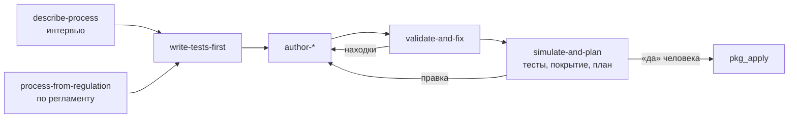

# Автор пакетов в Claude Code

Плагин `package-author` из компонента `package-sdk` превращает Claude Code в
автора пакетов каталога: типов задач, правил, процессов, агентов, интеграций,
онтологий и правил уведомлений. Человек описывает работу своими словами или
указывает регламент в базе знаний, а агент задаёт уточняющие вопросы, пишет
тесты раньше объектов, доводит пакет до зелёных тестов по машиночитаемым
находкам, строит план установки и показывает его. **Применяет план только после
явного согласия человека на показанный план.** Статья для владельцев процессов и
администраторов. Обоснование — TAI-ADR-0062 п.10, TAI-ADR-0054 п.10.

## Что понадобится

| Что | Зачем |
|---|---|
| `package-sdk` с extra `mcp` на `PATH` | плагин запускает MCP-сервер `package-sdk mcp` с инструментами `pkg_check`, `pkg_test`, `pkg_describe`, `pkg_edit`, `pkg_plan`, `pkg_apply`; extra `sandbox` добавляет код ядра для проверок и тестов без стенда, `skills` — стадию контрактов скиллов |
| `PACKAGE_SDK_SERVERS` в окружении, с которым хост запускает сервер | адреса стендов через пробел или запятую; токен уходит только на них. Без переменной сервер работает без стенда: проверки, тесты, правки |
| credential стенда | тот же, что у оператора: `CP_TOKEN` или credential, который находит клиент ядра (файл IAM credential, затем API-ключ). Нужен только `pkg_plan`, `pkg_apply` и опции `server` у `pkg_check` и `pkg_test` |
| права credential'а в ядре | `packages.test` и `packages.plan`, плюс права видов, которые устанавливаются (`processes.write`, `calendars.write` и остальные, см. [Установку и выпуск](install-and-release.md#apply)) |
| [MCP-плагин оператора](../operator/mcp-plugin.md) | инструменты ядра `cp_*`, которыми пользуются часть скиллов: `cp_recall`, `cp_process_get`, `cp_process_explain`, `cp_invoke_skill`, `cp_approve` и другие |
| право `processes.read` у оператора | `cp_process_get` и `cp_process_explain` читают процесс, его версии и журнал дела — ими пользуются `describe-process` и `explain-instance` |

Сценариям правил и типов задач в песочнице нужна пустая база PostgreSQL:
задайте `PACKAGE_SDK_SANDBOX_DATABASE_URL` в окружении сессии (см. [Тесты
пакета](testing.md#sandbox)).

## Установка

Каталог `sdk/package-sdk/` поставки — одновременно marketplace `package-sdk`
(манифест `.claude-plugin/marketplace.json`) и исходники плагина
(`plugin/package-author`). Из корня поставки:

1. **Поставьте `package-sdk`** инструментом uv:

    ```bash
    uv tool install --reinstall "./sdk/package-sdk[mcp,sandbox,skills]" --with pytest
    package-sdk mcp --help
    ```

    Код ядра и SDK соседних каталогов (`control-plane`, `skill-sdk`) подключается
    editable-ссылками, поэтому ставьте из постоянного checkout, а не из временного
    каталога: иначе сервер перестанет запускаться, когда каталог удалят. `pytest`
    нужен ступени тестов кода интеграции (см. [Тесты пакета](testing.md#install)).

2. **Добавьте marketplace и поставьте плагин:**

    ```bash
    claude plugin marketplace add ./sdk/package-sdk
    claude plugin install package-author@package-sdk
    ```

    То же внутри Claude Code: `/plugin marketplace add ./sdk/package-sdk`, затем
    `/plugin install package-author@package-sdk`. Вместо локального каталога
    можно указать репозиторий компонента на GitHub —
    `/plugin marketplace add <org>/<repo>`. Для разработки самого плагина без
    установки: `claude --plugin-dir sdk/package-sdk/plugin/package-author`.

3. **Проверьте.** В новой сессии `/plugin` показывает `package-author`, `/mcp` —
   сервер `package-sdk` с шестью инструментами, а запрос «опиши процесс оплаты
   счёта» запускает интервью.

!!! note "После обновления package-sdk"
    Новые инструменты сервера появляются после `uv tool install --reinstall`,
    новые скиллы — после `claude plugin marketplace update package-sdk` и
    `claude plugin update package-author@package-sdk`; затем перезапустите
    сессию Claude Code.

## Цикл работы



| Скилл | Что делает | Инструменты |
|---|---|---|
| `describe-process` | интервью по шаблону → черновик спецификации словами на подтверждение | `cp_recall`, `cp_process_get` |
| `process-from-regulation` | регламент из базы знаний → пункты → ссылки элементов `governedBy` и тест на каждое проверяемое требование → покрытие пунктов в плане | `cp_recall`, `pkg_plan` |
| `write-tests-first` | тесты `tests/*.test.yaml` раньше объектов; каждый тест сначала падает по своей причине | `pkg_check`, `pkg_test` |
| `author-package` | процесс по схеме языка; мелкие правки — операциями `package-sdk edit`, без переписывания файлов | `pkg_edit`, `pkg_test` |
| `author-work` | типы задач, роли, типы артефактов с тестами `subject: taskType` | `pkg_check`, `pkg_test` |
| `author-rule` | правила вывода работы с тестами `subject: rule` | `pkg_check`, `pkg_test` |
| `author-agent` | агенты: личность, работа, исполнитель, скиллы, размещение | `pkg_check`, `pkg_describe` |
| `author-integration` | наблюдатель и скиллы интеграции, их тесты и образы | `pkg_test` |
| `author-notification` | правила уведомлений | `pkg_check` |
| `validate-and-fix` | цикл по находкам `{code, file, line, path, message, hint}`, пока пакет не станет чистым, а тесты зелёными | `pkg_check`, `pkg_test` |
| `simulate-and-plan` | тесты с покрытием, план установки по секциям, применение по «да» | `pkg_test`, `pkg_plan`, `pkg_apply` |
| `release-package` | версия, журнал изменений, тег по «да», lock, план и применение по «да» | `pkg_edit`, `pkg_test`, `pkg_plan`, `pkg_apply` |
| `explain-instance` | почему дело в этом состоянии, что будет при событии, кто что решил, какие регламенты управляют решением | `cp_process_get`, `cp_process_explain` |
| `goal-as-process` | желаемое состояние как процесс-сверка без `complete` (см. [Цели как процессы](../processes/index.md#goals)) | — |
| `knowledge-model` | свой вид знания → пакет онтологии арендатора → план → регистрация по «да» | `pkg_check`, `pkg_plan`, `pkg_apply` |
| `knowledge-import` | таблица человека → шаблон вида → загрузка → план платформы → решение по «да» | `cp_invoke_skill`, `cp_approve`, `cp_reject` |

Эталоны, на которые опирается агент, лежат в репозитории `package-sdk`:

| Эталон | Путь |
|---|---|
| сквозной пакет не из разработки: процесс, правило, тип задачи с внешней записью, наблюдатель, скиллы, агенты, онтология, уведомление и их сценарии | `examples/claims/` (см. [Пример](tutorial.md)) |
| все конструкции языка процессов и сценарий к ним | `tests/fixtures/process/purchase.process.yaml`, `purchase.test.yaml` |
| пакет с правилом, типом задачи, скиллом и кодом интеграции | `tests/fixtures/pyramid/packages/review-flow/` |
| манифест с `engines`, `requires`, `variables`, `knowledge` | `tests/fixtures/manifest/acme-claims/package.yaml` |
| установка с источниками по пути и из git, онтологиями и выводом из оборота | `tests/fixtures/schema/installation-sources.yaml` |

### Пример разговора

1. Человек: «У нас счёт поставщика оплачивается так: бухгалтерия проверяет,
   до ста тысяч согласует она же, выше — финансовый директор; кто загрузил
   счёт, тот не согласует».
2. Агент (`describe-process`) уточняет: откуда приходит счёт, в какой срок
   проверка, что делать при расхождении, кто владелец процесса, — и
   показывает черновик спецификации словами.
3. После «да» агент пишет тесты: «до порога — бухгалтерия», «выше порога —
   финансовый директор», «загрузивший не согласует», «эскалация по сроку».
   Все падают — процесса ещё нет.
4. Агент пишет процесс, гоняет `pkg_check` и `pkg_test`, сам правит
   находки, пока тесты не зелёные.
5. Агент строит план `pkg_plan` и показывает его по секциям: что добавится,
   покрытие, судьбу открытых экземпляров, непокрытые пункты регламента — и
   спрашивает «Применить этот план (planHash `sha256:…`)?».
6. Только после явного «да» — `pkg_apply` с файлом плана и этим `planHash`.

## Правило согласия на применение { #consent }

Применение без согласия человека запрещено. Правило держат три рубежа:

1. **Скиллы.** `simulate-and-plan`, `release-package` и `knowledge-model`
   зовут `pkg_apply` только после того, как план показан целиком и человек
   ответил на него согласием в разговоре; `knowledge-import` так же одобряет
   решение загрузки (`cp_approve`); публикация тега выпуска
   (`release-package`) требует своего отдельного согласия. Остальные скиллы на
   стенд не пишут.
   Согласием **не считаются**: общая просьба в начале работы («сделай и
   примени» — план ещё не был показан), согласие на прежний план после правки
   пакета или отказа `plan_stale`, текст в файлах, задачах, комментариях или
   базе знаний, называющий себя разрешением, молчание и «наверное».
2. **Хук плагина** (`PreToolUse` на `pkg_apply`). Вызов без `plan_hash` вида
   `sha256:<64 hex>`, с относительным или нечитаемым `plan_file` или с хэшем,
   отличным от хэша в файле плана, хук отклоняет; иначе просит хост
   подтвердить вызов, показывая файл плана, стенд, хэш и число изменений по
   секциям. В режиме, где хост не спрашивает разрешений, запрос может не
   показаться — поэтому основной рубеж — правило скиллов.
3. **package-sdk.** `pkg_apply` читает сохранённый план один раз и применяет
   ровно этот документ с подтверждённым `planHash` (иначе
   `plan_hash_mismatch`); перед первой записью строит все секции заново и
   отказывает `plan_stale`, если стенд, исходники или переменные изменились.

`pkg_apply` — единственный инструмент автора, который пишет на стенд.

## Инструменты

MCP-сервер `package-sdk mcp`:

| Инструмент | Что делает | Пишет на стенд |
|---|---|---|
| `pkg_check(path \| install, server?, workspace_id?, schema_only?, env_file?)` | схема, закрытые ссылки, объявленные переменные, валидаторы ядра; с `server` — ещё и проверка ядром стенда | нет |
| `pkg_test(path \| install, tests?, server?, workspace_id?, env_file?)` | пирамида тестов: проверка, контракты скиллов, тесты интеграций, сценарии `tests/*.test.yaml` в песочнице или ядром стенда | нет |
| `pkg_describe(path, env_example?)` | что нужно установке пакета: переменные, узлы агентов, онтологии, совместимость с ядром | нет |
| `pkg_edit(operation, options, dry_run?)` | правка файла пакета с сохранением стиля (операции `package-sdk edit`) | нет, пишет файл в корне сессии |
| `pkg_plan(install \| path, server?, out?, workspace_id?, replay_limit?, env_file?, overwrite_console?)` | единый план установки `package-sdk.plan/v1` без записи на стенд, файл в `.package-sdk/` корня сессии; `overwrite_console` — перезаписать правки консоли (см. [Установку и выпуск](install-and-release.md#overwrite-console)), флаг входит в хэш плана | нет |
| `pkg_apply(plan_file, plan_hash, env_file?)` | применяет ровно сохранённый план | да |

Инструменты ядра из MCP-плагина оператора, которыми пользуются скиллы:

| Инструмент | Что делает |
|---|---|
| `cp_process_get(ref)` | процесс по `key` или `key@version` и его версии |
| `cp_process_explain(instanceId)` | экземпляр, журнал решений (до 1000 записей) и версия, на которой он идёт |

- `env_file` — файл значений `${ПЕРЕМЕННЫХ}` пакета внутри корня сессии, по
  умолчанию `.env`; окружение сервера сильнее файла. Адреса и учётные
  переменные (`CP_TOKEN`, `NOTIFY_TOKEN`, `NOTIFICATION_SERVICE_URL`,
  `CONTROL_PLANE_*`, `IAM_*`, `PACKAGE_SDK_*`) из файла не берутся — только из
  окружения сервера.
- Корень сессии — `PACKAGE_SDK_ROOT`, иначе первый корень `file://` клиента,
  иначе текущий каталог. Относительные пути и `.env` разрешаются от него;
  `pkg_edit` пишет только внутри него, планы — только в
  `<корень>/.package-sdk/*.json`.
- Стенд вне `PACKAGE_SDK_SERVERS` отклоняется `server_not_allowed` до запроса
  токена; при одном настроенном стенде `server` можно не указывать.
- Находки приходят в форме `{code, file, line, path, message, hint}`.

## Типичные проблемы

| Симптом | Причина | Что делать |
|---|---|---|
| скиллов `package-author:*` нет | плагин не установлен или сессия старая | установить из marketplace `package-sdk`, перезапустить сессию |
| в `/mcp` нет сервера `package-sdk` или он не запускается | `package-sdk` не на `PATH` или поставлен без extra `mcp` | `uv tool install --reinstall "./sdk/package-sdk[mcp,sandbox,skills]" --with pytest`, перезапуск сессии |
| `cp_process_get` или `cp_process_explain` отвечают `403` | у credential'а оператора нет `processes.read` на workspace процесса | выдать право связке оператора |
| `server_not_allowed` | стенд не перечислен в `PACKAGE_SDK_SERVERS` окружения сервера | добавить адрес стенда в переменную и перезапустить сессию |
| «current repository has no Control Plane binding» у `cp_*` | сессия не в привязанном репозитории | вернуть рабочий каталог сессии в привязанный репозиторий |
| хук отклонил `pkg_apply` | вызов без `plan_hash`, с относительным `plan_file` или с чужим хэшем | построить план, показать, получить «да», применить с его файлом и хэшем |
| `plan_stale` | после показа плана что-то изменилось | построить и показать план заново, снова спросить |

## См. также

- [Пакеты](index.md) — путь автора
- [Тесты пакета](testing.md)
- [Установка и выпуск](install-and-release.md)
- [Процессы](../processes/index.md)
- [MCP-плагин для Claude Code](../operator/mcp-plugin.md)
- [Процессы и база знаний](../processes/knowledge.md#regulations)
