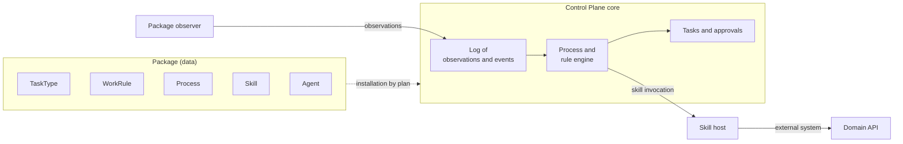
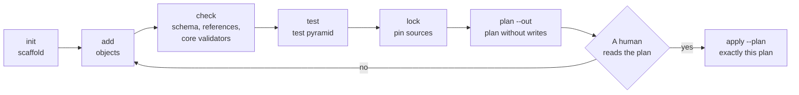

# Packages

A package is an organization's rules of the game written as data: task types,
work rules, processes, roles, agents, skills, an ontology, and notifications.
This section is for package authors: people who build a vertical or an
integration without touching the platform code. The author's tool is
`package-sdk`: it creates scaffolds, checks and tests a package without a
deployment, and installs it on a deployment according to a plan that a
human has approved. Rationale: TAI-ADR-0062; package format: TAI-ADR-0044.

## What a package is

A package is a directory in the author's git. The root holds the `package.yaml`
manifest, and next to it there is one YAML file for each catalog object:

```text
access-requests/
├── package.yaml              # kind: Package — key, version, compatibility, variables
├── task-types/               # kind: TaskType
├── rules/                    # kind: WorkRule
├── processes/                # kind: Process
├── roles/                    # kind: Role
├── agents/                   # kind: Agent
└── tests/                    # *.test.yaml — scenarios for processes, rules, and task types
```

Each object file is a single wrapper `apiVersion` + `kind` + `key` + `spec`,
where `spec` is exactly the API request body of the service that stores the
object. So a package introduces no language of its own: the object fields in
the file are the same as in the API, and an object created through the API is
exported to a package file with the `package-sdk export` command. Details are
in [Package anatomy](anatomy.md).

The source of truth is distributed as follows:

| What | Where it lives |
|---|---|
| The package: files and their history | the author's git |
| Published object versions | the Control Plane core (notification rules: the notification service; ontologies: memory, through the core) |
| Cases, tasks, decisions, the log | the Control Plane core |
| The installation: which packages with which variable values are installed on a deployment | the installation file and `packages.lock` in the installation's git |

`package-sdk` stores no facts: it reads files, queries the core, and writes to
the core only according to an approved plan.

## A vertical is a package without a runtime { #vertical }

A vertical (for example "access requests", "customer claims", "invoice
payment") is a package, not a service. A reference vertical has no database,
orchestrator, or daemon of its own:

- **work** is regular core tasks of the package's task types; humans see them
  in the workplace, and agent executors see them without any extra work;
- **the course of a case** is the package's process, executed by the core's
  process engine;
- **reactions to facts** are work rules, evaluated by the core;
- **human decisions** are core approvals with outcomes declared by the task
  type;
- **actions in the outside world** are skills: the contract is declared in the
  package, and the skill host executes the code;
- **facts from the outside world** are observations written by the package's
  observer.



### When you need a skill rather than your own service

If a vertical needs to compute, read, or write something in an external
system, that is a **skill** with a contract: inputs and outputs as JSON
Schema, a side-effect class (`none`, `external_read`, `external_write`), and a
risk level. The implementation is `local` (a Python function on skill-sdk),
`http` (an endpoint of a domain service), or `mcp` (a tool of an MCP server).
The core invokes the skill from a process, a rule, or an approval outcome,
validates the input and output against the contract, and records the
invocation in the log. A rule interpretation cannot invoke a skill with an
external write (`external_write`), and in task type acceptance such a skill
runs only after a human decision.

A service of your own with a database is justified only if the domain has its
own data that the external system does not have. Even then, it exposes HTTP
skills rather than managing the work itself: orchestration is done by a core
process. A vertical with its own orchestrator and manually created executor
accounts is a path the platform does not recommend (TAI-ADR-0062, "Rejected").

### The human interface { #ui }

A package needs no interface of its own. The package's tasks, approvals, and
cases are regular core objects, and humans see them wherever they see any
work:
in the [operator MCP plugin](../operator/mcp-plugin.md), the CLI, and
[notifications](notifications.md).
An approval is decided in the core, so decisions need no separate interface
either: the task type sets the decision form, and the package's notification
rule sets the buttons in a notification. Package objects (task types,
processes, rules) are visible in the console together with the package that
installed them. By default, a package does not overwrite fields that people
edit there after installation (see [Console edits](install-and-release.md#overwrite-console)).

## Map of kinds { #kinds }

| `kind` | Folder | What it defines | Who executes it | Details |
|---|---|---|---|---|
| `Package` | `package.yaml` | key, version, compatibility, dependencies, variables | — | [Anatomy](anatomy.md) |
| `TaskType` | `task-types/` | statuses, fields, instructions, decision outcomes, acceptance, inputs and outputs | core | [Work](work.md) |
| `Role` | `roles/` | whom tasks and approvals are addressed to | core | [Work](work.md#roles) |
| `ArtifactType` | `artifact-types/` | the shape of the result a task delivers | core | [Work](work.md#artifact-types) |
| `Capability` | `capabilities/` | an ability a task requires | core | [Work](work.md#capabilities) |
| `ProjectTemplate` | `project-templates/` | project fields and statuses | core | [Work](work.md#project-templates) |
| `WorkspaceType` | `workspace-types/` | node kinds of the workspace tree | core | [Work](work.md#workspace-types) |
| `WorkRule` | `rules/` | fact → condition → action on work | core | [Rules](rules.md) |
| `Process` | `processes/` | stages, steps, deadlines, and decisions of a case | core process engine | [Processes](processes.md) |
| `Calendar` | `calendars/` | working and non-working days for deadlines | core process engine | [Processes](processes.md) |
| `Skill` | `skills/` | the contract of an action in the outside world | skill host | [Package skills](skills.md) |
| `Agent` | `agents/` | identity, permissions, executor, and its placement | core and executor node | [Package agents](agents.md) |
| `KnowledgePack` | `knowledge-packs/` | ontology: the package's knowledge kinds and relations | memory, through the core | [Knowledge and ontology](knowledge.md) |
| `NotificationRule` | `notification-rules/` | whom to notify and about what | notification service | [Package notifications](notifications.md) |

Besides objects, a package holds tests (`tests/*.test.yaml`), process data
schemas (`schemas/`), and, for an integration, the observer and skill code
(`integration/`). Values an administrator changes without a new package
version are declared by the manifest as [settings](settings.md)
(`spec.settings`).

## The author's path { #author-path }



| Step | Command | Deployment needed |
|---|---|---|
| Package scaffold | `package-sdk init <directory>` | no |
| Scaffold of an object of any kind | `package-sdk add <kind> <key>` | no |
| Check | `package-sdk check --package <directory>` | no (with `--server`, also by the deployment's core) |
| Tests | `package-sdk test <directory>` | no: a sandbox built from the core code; with `--server`, the deployment's core ([Package tests](testing.md)) |
| What installation requires | `package-sdk describe <directory>` | no |
| README sections | `package-sdk docs <directory> --write` | no |
| Pinning sources | `package-sdk lock --install <installation>` | no ([Installation and release](install-and-release.md)) |
| Plan | `package-sdk plan --install <installation> --server <address> --out plan.json` | yes |
| Apply | `package-sdk apply --plan plan.json --server <address>` | yes |

The whole path step by step is in [A package in 10 minutes](quickstart.md), a
real vertical with an integration is in the [Example](tutorial.md), and
release readiness is in the [Checklist](checklist.md). An author can walk the
whole path in Claude Code with the [`package-author`](author-plugin.md)
plugin.

!!! note "Apply only after a human says yes"
    `plan` writes nothing. `apply` applies exactly the saved plan and asks for
    confirmation in the terminal; without a terminal, the apply is cancelled.
    If the deployment has changed since the plan was built, the apply stops
    with `plan_stale` before the first write.

## Rule or process, package or core { #rule-or-process }

- **A one-off reaction to a fact** ("a repeated request: open an
  investigation") is a work rule. **A case with stages, deadlines, and
  decisions** is a process. How to choose: see [Rules](rules.md#rule-or-process).
- **Everything domain-specific belongs in the package.** The core knows no
  domain words: status names, task fields, steps, and decision tables belong
  to the package. If a vertical seems to need a core change, first check
  whether it can be expressed as a task type, a rule, a process, or a skill.

## See also

- [A package in 10 minutes](quickstart.md)
- [Package anatomy](anatomy.md)
- [Work: task types and roles](work.md)
- [Rules in a package](rules.md)
- [Processes in a package](processes.md)
- [Package settings](settings.md)
- [Package tests](testing.md)
- [Installation and release](install-and-release.md)
- [Example: customer claims](tutorial.md)
- [Package readiness checklist](checklist.md)
- [Catalog packages](../control-plane/catalog-packages.md): a reference of kinds and how they are applied
- [skill-sdk](../sdk/skill-sdk.md)
- [Key concepts](../overview/concepts.md)
