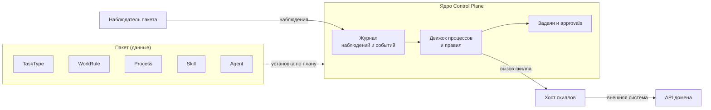
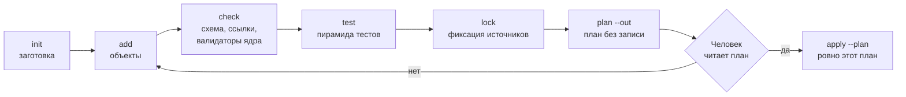

# Пакеты

Пакет — это правила игры организации, записанные данными: типы задач, правила
вывода работы, процессы, роли, агенты, скиллы, онтология и уведомления. Раздел
для авторов пакетов — тех, кто собирает вертикаль или интеграцию, не трогая код
платформы. Инструмент автора — `package-sdk`: он создаёт заготовки, проверяет и
тестирует пакет без стенда и ставит его на стенд по плану, который утвердил
человек. Обоснование — TAI-ADR-0062; формат пакета — TAI-ADR-0044.

## Что такое пакет

Пакет — каталог в git автора. В корне лежит манифест `package.yaml`, рядом —
по файлу YAML на каждый объект каталога:

```text
access-requests/
├── package.yaml              # kind: Package — ключ, версия, совместимость, переменные
├── task-types/               # kind: TaskType
├── rules/                    # kind: WorkRule
├── processes/                # kind: Process
├── roles/                    # kind: Role
├── agents/                   # kind: Agent
└── tests/                    # *.test.yaml — сценарии процессов, правил и типов задач
```

Каждый файл объекта — одна обёртка `apiVersion` + `kind` + `key` + `spec`, где
`spec` — ровно тело запроса API сервиса, который этот объект хранит. Поэтому
пакет не вводит своего языка: поля объекта в файле те же, что в API, а объект,
заведённый через API, выгружается в файл пакета командой `package-sdk export`.
Подробно — в [Анатомии пакета](anatomy.md).

Источник истины распределён так:

| Что | Где живёт |
|---|---|
| Пакет — файлы и их история | git автора |
| Опубликованные версии объектов | ядро Control Plane (правила уведомлений — сервис уведомлений, онтологии — память через ядро) |
| Дела, задачи, решения, журнал | ядро Control Plane |
| Установка: какие пакеты и с какими значениями переменных стоят на стенде | файл установки и `packages.lock` в git установки |

`package-sdk` фактов не хранит: он читает файлы, спрашивает ядро и пишет в ядро
только по утверждённому плану.

## Вертикаль — пакет без runtime { #vertical }

Вертикаль (например «заявки на доступ», «претензии клиентов», «оплата счетов»)
— это пакет, а не сервис. У эталонной вертикали нет своей базы данных, своего
оркестратора и своего демона:

- **работа** — обычные задачи ядра по типам задач пакета; их видят люди в
  рабочем месте и исполнители-агенты без доработок;
- **ход дела** — процесс пакета, его исполняет движок процессов ядра;
- **реакция на факты** — правила вывода работы, их оценивает ядро;
- **решения людей** — approvals ядра с исходами, объявленными типом задачи;
- **действия во внешнем мире** — скиллы: контракт объявлен в пакете, код
  исполняет хост скиллов;
- **факты из внешнего мира** — наблюдения, которые пишет наблюдатель пакета.



### Когда нужен скилл, а не свой сервис

Если вертикали нужно что-то посчитать, прочитать или записать во внешней
системе, это **скилл** с контрактом: входы и выходы по JSON Schema, класс
побочных эффектов (`none`, `external_read`, `external_write`), уровень риска.
Реализация — `local` (функция Python на skill-sdk), `http` (эндпоинт сервиса
домена) или `mcp` (инструмент MCP-сервера). Ядро вызывает скилл из процесса,
правила или исхода approval, проверяет вход и выход по контракту и пишет вызов
в журнал. Скилл с внешней записью (`external_write`) интерпретация правила
вызвать не может, а в приёмке типа задачи он исполняется только после решения
человека.

Свой сервис с базой оправдан, только если у домена есть собственные данные,
которых нет во внешней системе. И тогда он выставляет наружу HTTP-скиллы, а не
управляет работой сам: оркестрацию делает процесс ядра. Вертикаль со своим
оркестратором и ручными учётками исполнителей — путь, который платформа не
рекомендует (TAI-ADR-0062, «Не принято»).

### Интерфейс людей { #ui }

Собственного интерфейса пакету не нужно. Задачи, согласования и дела пакета —
обычные объекты ядра, и люди видят их там же, где любую работу:
в [MCP-плагине оператора](../operator/mcp-plugin.md), CLI и
[уведомлениях](notifications.md).
Решение по согласованию принимается в ядре, поэтому и для решений отдельный
интерфейс не нужен: форму решения задаёт тип задачи, кнопки в уведомлении — правило
уведомления пакета. Объекты пакета — типы задач, процессы, правила — видны в консоли
вместе с пакетом, который их поставил. Поля, которые люди правят там после
установки, пакет по умолчанию не перетирает (см. [Правки
консоли](install-and-release.md#overwrite-console)).

## Карта видов { #kinds }

| `kind` | Папка | Что задаёт | Кто исполняет | Где подробно |
|---|---|---|---|---|
| `Package` | `package.yaml` | ключ, версия, совместимость, зависимости, переменные | — | [Анатомия](anatomy.md) |
| `TaskType` | `task-types/` | статусы, поля, инструкции, исходы решений, приёмка, входы и выходы | ядро | [Работа](work.md) |
| `Role` | `roles/` | кому адресуются задачи и согласования | ядро | [Работа](work.md#roles) |
| `ArtifactType` | `artifact-types/` | форма результата, который сдаёт задача | ядро | [Работа](work.md#artifact-types) |
| `Capability` | `capabilities/` | способность, которую требует задача | ядро | [Работа](work.md#capabilities) |
| `ProjectTemplate` | `project-templates/` | поля и статусы проектов | ядро | [Работа](work.md#project-templates) |
| `WorkspaceType` | `workspace-types/` | виды узлов дерева пространств работы | ядро | [Работа](work.md#workspace-types) |
| `WorkRule` | `rules/` | факт → условие → действие над работой | ядро | [Правила](rules.md) |
| `Process` | `processes/` | стадии, шаги, сроки, решения дела | движок процессов ядра | [Процессы](processes.md) |
| `Calendar` | `calendars/` | рабочие и нерабочие дни для сроков | движок процессов ядра | [Процессы](processes.md) |
| `Skill` | `skills/` | контракт действия во внешнем мире | хост скиллов | [Скиллы пакета](skills.md) |
| `Agent` | `agents/` | личность, права, исполнитель и его размещение | ядро и узел исполнителей | [Агенты пакета](agents.md) |
| `KnowledgePack` | `knowledge-packs/` | онтология: виды и связи знаний пакета | память через ядро | [Знания и онтология](knowledge.md) |
| `NotificationRule` | `notification-rules/` | кому и о чём сообщать | сервис уведомлений | [Уведомления пакета](notifications.md) |

Кроме объектов, в пакете лежат тесты (`tests/*.test.yaml`), схемы данных
процессов (`schemas/`) и, у интеграции, код наблюдателя и скиллов
(`integration/`). Значения, которые администратор меняет без новой версии
пакета, манифест объявляет [настройками](settings.md) (`spec.settings`).

## Путь автора { #author-path }



| Шаг | Команда | Нужен стенд |
|---|---|---|
| Заготовка пакета | `package-sdk init <каталог>` | нет |
| Заготовка объекта любого вида | `package-sdk add <вид> <ключ>` | нет |
| Проверка | `package-sdk check --package <каталог>` | нет (с `--server` — ещё и ядром стенда) |
| Тесты | `package-sdk test <каталог>` | нет: песочница из кода ядра; с `--server` — ядро стенда ([Тесты пакета](testing.md)) |
| Что нужно для установки | `package-sdk describe <каталог>` | нет |
| Разделы README | `package-sdk docs <каталог> --write` | нет |
| Фиксация источников | `package-sdk lock --install <установка>` | нет ([Установка и выпуск](install-and-release.md)) |
| План | `package-sdk plan --install <установка> --server <адрес> --out plan.json` | да |
| Применение | `package-sdk apply --plan plan.json --server <адрес>` | да |

Весь путь по шагам — в [Пакете за 10 минут](quickstart.md), настоящая вертикаль
с интеграцией — в [Примере](tutorial.md), готовность к выпуску — в
[Чек-листе](checklist.md). Автор может вести весь путь в Claude Code плагином
[`package-author`](author-plugin.md).

!!! note "Применение — только после «да» человека"
    `plan` ничего не пишет. `apply` применяет ровно сохранённый план и
    спрашивает подтверждение в терминале; без терминала применение отменяется.
    Если после построения плана стенд изменился, применение останавливается с
    `plan_stale` до первой записи.

## Правило или процесс, пакет или ядро { #rule-or-process }

- **Разовая реакция на факт** («повторное обращение — завести разбор») —
  правило вывода работы. **Дело со стадиями, сроками и решениями** — процесс.
  Как выбрать — в [Правилах](rules.md#rule-or-process).
- **Всё предметное — в пакете.** Ядро не знает доменных слов: названия
  статусов, поля задач, шаги и таблицы решений принадлежат пакету. Если для
  вертикали кажется нужным изменить ядро, сначала проверьте, не выражается ли
  это типом задачи, правилом, процессом или скиллом.

## См. также

- [Пакет за 10 минут](quickstart.md)
- [Анатомия пакета](anatomy.md)
- [Работа: типы задач и роли](work.md)
- [Правила в пакете](rules.md)
- [Процессы в пакете](processes.md)
- [Настройки пакета](settings.md)
- [Тесты пакета](testing.md)
- [Установка и выпуск](install-and-release.md)
- [Пример: претензии клиентов](tutorial.md)
- [Чек-лист готовности пакета](checklist.md)
- [Пакеты каталога](../control-plane/catalog-packages.md) — справочник видов и их применения
- [skill-sdk](../sdk/skill-sdk.md)
- [Ключевые понятия](../overview/concepts.md)
