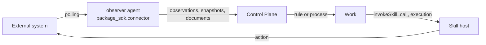

# Integrations

An integration connects the platform to an external system: a CRM, a tracker, an
accounting system, a mailbox. In the platform it is not a separate service but
**catalog packages and the code next to them**: an observer writes facts of the
external system into the core as observations, skills perform actions in it, and
rules and processes decide which work to derive from this. This article is for
integration authors: how to split a package into a class and a provider, write an
observer on `package_sdk.connector`, build images, and check everything without a
deployment. Rationale: TAI-ADR-0036 (connector = observer + skills), TAI-ADR-0061
(class, provider, connections), TAI-ADR-0062 (items 8–9).

## The three roles of an integration

| Role | What it is made of | Where it writes |
|---|---|---|
| **Source** | an agent of the `observer` kind: a long-running process polls the system in a loop | observations (`POST /api/v1/observations`), knowledge snapshots, document artifacts |
| **Actions** | skills: read, prepare, write to the external system | the call result; an external write goes through an approval (see [Package skills](skills.md#external-write)) |
| **Work surface** | a two-way projection of tasks into the external system | planned as part of the connections feature, see [below](#surface) |



The core, IAM, and memory contain no names of external systems: everything that
knows about a specific system lives in the integration packages and their code.

## Class and provider { #class-and-provider }

A process written for one CRM should not have to be rewritten when the company
moves to another. That is why an integration is split into packages of two kinds:

| Package | What it contains | Key example |
|---|---|---|
| **Class**: neutral | the class ontology (`KnowledgePack`), observation kinds `<class>.*`, the class skill contracts (`Skill`), the class task types and rules | `helpdesk` |
| **Provider**: one system | `requires: [helpdesk]`, the observer agent, the agent hosting the class skills, the code for the specific system, and images | `helpdesk-alpha`, `helpdesk-beta` |

```yaml
# helpdesk-alpha/package.yaml
apiVersion: taimen.ai/v1
kind: Package
key: helpdesk-alpha
spec:
  version: 0.1.0
  displayName: Helpdesk — Alpha provider
  requires:
    - {package: helpdesk, version: ">=0.1.0,<0.2.0"}
```

The rules of the game:

- **Vertical processes and rules refer only to the class**: to the `helpdesk.*`
  observation kinds, the `helpdesk.*@version` skills, the class task types.
  Changing the provider means changing the provider package in the installation,
  not editing the vertical.
- **The class declares the skill contract**, and the provider hosts it: its agent
  of the `skills` kind lists the module with the implementation in
  `skills.local`. A skill has no separate "implements" field.
- **Knowledge is not duplicated.** The class ontology extends the base one
  (`extends`) and adds only its own; an entity from the external system that
  already exists in the company knowledge base is merged with it by a natural key
  (see [Knowledge and ontology](knowledge.md)).
- A class contract is considered proven when a second provider has implemented it
  without changes.

## Integration secrets { #secrets }

An integration secret is a name in `placement.secrets` of the integration's agents.
The value is a file with the same name in the fleet node's secrets directory (see
[Node secrets](../runner/fleet.md#node-secrets)); before the agent starts, it is placed
at `/run/secrets/<name>`.

Both agents of the integration read the secret by the same rule:

- **the observer**: `ctx.secret(<name>)` of the `package_sdk.connector`
  environment, on every cycle (see [below](#observer));
- **the skill host**: `ctx.secret(<name>)` of skill-sdk; a host outside a node can
  receive the same secret through an environment variable with the same name, which
  takes precedence over the file.

The file reading rule is the canon in `skill_sdk.secrets`; the observer repeats it
(the match is pinned by shared tests):

- the name matches the pattern `[a-z0-9][a-z0-9-]{0,62}`; `agent-pat` is
  reserved: it is the agent's own PAT, which the node puts next to it;
- an empty file or a file of whitespace only means there is no secret;
- only trailing `\r` and `\n` are trimmed from a non-empty value; spaces inside
  and at the edges are part of the value;
- no more than 64 KiB, UTF-8, a regular file only; symbolic links only inside the
  secrets directory.

## Layout of a package with an integration

```bash
package-sdk init helpdesk-alpha --integration --image
```

```text
helpdesk-alpha/
├── package.yaml
├── processes/helpdesk-alpha.yaml            # example process
├── tests/helpdesk-alpha.test.yaml           # its scenario
├── agents/
│   ├── helpdesk-alpha-process.yaml          # process identity
│   └── helpdesk-alpha-observer.yaml         # observer agent, state: stopped
├── roles/helpdesk-alpha-owner.yaml          # process owner role
├── integration/
│   ├── pyproject.toml                       # helpdesk-alpha-integration project
│   └── src/helpdesk_alpha/
│       ├── __init__.py
│       └── observer.py                      # observer on package_sdk.connector
├── Dockerfile                               # observer image
├── .dockerignore                            # only the integration code goes into the build context
└── .github/workflows/package.yml            # CI: check and test
```

- The integration code is a regular Python project in `integration/` (`src/` and
  `tests/`). Its dependencies include neither `package-sdk` nor the core client:
  they come from the delivery's base image or a pinned source, not from a public
  package index.
- `--image` requires `--integration`.

## Observer on `package_sdk.connector` { #observer }

An observer is a function marked with `@observer`. The environment takes care of
the loop, the agent revision, publishing, and state:

```python
# integration/src/helpdesk_alpha/observer.py
from package_sdk.connector import Observation, ObserveContext, observer, run


@observer(kind="helpdesk-alpha-observer", entrypoint="helpdesk_alpha.observer:observe")
def observe(ctx: ObserveContext) -> None:
    cursor = ctx.state.get("cursor")
    token = ctx.secret("helpdesk-alpha-token")        # node secret file, read anew on every cycle
    for ticket in fetch(ctx.config["baseUrl"], token, since=cursor):
        ctx.emit(Observation(
            kind="helpdesk.ticket_changed",
            dedup_key=f"helpdesk-alpha:{ticket['id']}:{ticket['version']}",
            data=ticket,
            external_ref={"system": "helpdesk-alpha", "id": ticket["id"], "url": ticket["url"]},
            observed_at=ticket["updatedAt"],
        ))
        cursor = ticket["cursor"]
    ctx.state["cursor"] = cursor                        # saved after a cycle without errors


if __name__ == "__main__":
    run(observe)
```

The agent that executes it:

```yaml
# agents/helpdesk-alpha-observer.yaml
apiVersion: taimen.ai/v1
kind: Agent
key: helpdesk-alpha-observer
spec:
  displayName: Helpdesk Alpha observer
  identity:
    kind: agent
    permissions: [observations.write, artifacts.write]
  work:
    workspace: ${HELPDESK_WORKSPACE_ID}
  executor:
    kind: observer
    image: registry.example.com/helpdesk-alpha/observer:0.1.0
    params:
      entrypoint: helpdesk_alpha.observer:observe
      intervalSeconds: 300
      config:
        baseUrl: https://helpdesk.example.com/api
  placement:
    requires: [helpdesk-alpha-access]
    secrets: [helpdesk-alpha-token]
    resources: {cpus: 1, memoryMb: 256}
  state: running
```

### What the environment does

- **Check at startup.** The process reads its revision (`GET /api/v1/agents/me`)
  and checks the executor kind and the entry point. If the principal is not an
  agent, the kind is wrong, or `params.entrypoint` does not match
  `@observer(entrypoint=…)`, it exits with code **2** before the first cycle.
- **Cycle**: a call of the function, then a pause of `params.intervalSeconds`
  (60–86400, 900 by default).
- **Between cycles**: `GET /agents/me` again: on a new revision, or if the
  principal is no longer bound to the agent, it exits with code **75** (the node
  starts the process again); if the agent is stopped or retired, it exits with
  **0**. A failure to read the revision does not stop the loop.
- **Cycle failure.** An exception from the function is written to the log and, no
  more than once an hour, as a `connector.cycle_failed` observation; the process
  does not crash.
- **No secret.** If there is no secret file, or it is empty or whitespace only,
  the cycle is skipped, with a `connector.secret_missing` observation no more than
  once a day.
- **Unusable secret.** If the file exists but the reading rule rejected it
  (`SecretRejected`: a link outside the directory, a path swap, not a regular
  file, size, encoding, permissions), the cycle is skipped as a failure:
  `connector.cycle_failed` with `code` and `reason`. The secret value does not get
  into the log, the observations, or the state.

### `ObserveContext`

| Member | What it is |
|---|---|
| `ctx.config` | `executor.params.config` of the revision: package data, with no secrets in it |
| `ctx.params` | `executor.params` in full, for a custom executor kind |
| `ctx.state` | the observer state (a cursor and the like), JSON; saved atomically only after a cycle without errors |
| `ctx.secret(name)` | the value of the file `/run/secrets/<name>` by the rule [above](#secrets). No file, or it is empty or whitespace only: `SecretMissing`; the cycle is skipped, and a `connector.secret_missing` observation is written once a day. The file exists but is unusable: `SecretRejected` with a code (`secret_name_invalid`, `secret_file_rejected`, `secret_unreadable`) and a `reason` (`outside_secrets_dir`, `symlink_swapped`, `not_regular_file`, `too_large`, `not_utf8`, `unreadable`); this is a `connector.cycle_failed` cycle failure. The value does not get into the log, the observations, or the state |
| `ctx.secret_file(name)` | the path to the secret file, for tools that read the file themselves; before that the file is checked by the same rule (`SecretMissing`, `SecretRejected`) |
| `ctx.data_dir` | the replica volume: working files that survive a restart |
| `ctx.workspace_id` | the workspace from the `work` section of the agent description |
| `ctx.emit(Observation)` | an observation sent to the core immediately; the response is the log record (`id`, `deduplicated`) |
| `ctx.snapshot(Snapshot)` | a knowledge snapshot of the source (`POST /api/v1/knowledge/snapshots`); requires a workspace in the agent's `work` section |
| `ctx.document(Document)` | an artifact with content or a `uri` reference; the response is the artifact (`id`) |
| `ctx.log` | the log |

`emit`, `snapshot`, and `document` publish immediately and return the core's
response: an artifact id can be put into the observation data, and an observation
id into `supersedes` of the next one.

### Observation and deduplication

| `Observation` field | Meaning |
|---|---|
| `kind` | the observation kind, `helpdesk.*` for the class; rules and process starts trigger on it |
| `dedup_key` | the fact key: the core recognizes a repeat of `(source, dedup_key)` and does not create a second record (`deduplicated: true`) |
| `data` | the body of the fact: what rules and processes read |
| `content` | text for people; `<kind>: <dedup_key>` by default |
| `external_ref` | the object in the external system: `system`, `id`, `url` |
| `observed_at` | when the fact happened in the external system |
| `source` | the source; by default the `kind` from `@observer` |
| `supersedes` | the id of the observation this one replaces (a new version of the same fact) |

Build the deduplication key from what makes a fact the same fact: the object id
and its version or modification time. Then a repeated cycle after a failure, a
restart, and a new agent revision do not produce duplicates.

### Publishing failures

| What happened | What the environment does |
|---|---|
| network, `408`, `425`, `429`, `500`, `502`, `503`, `504`, code `idempotency_in_flight` | the cycle is interrupted, `state` is not saved, the next cycle repeats the work |
| other error responses | a substantive refusal by the core is a cycle failure: `connector.cycle_failed` |
| a document with content | the upload is reused while it is alive (with a 10-minute margin); after that it is uploaded again, and on `content_ref_not_found` once more within the same cycle |

The default idempotency key of a document is `doc:` and the sha256 of the agent,
workspace, observer, type, name, `metadata`, and the fingerprint of the content or
the reference. A custom `idempotency_key` is no longer than 200 characters. The
observer remembers created documents by key and does not upload them again.

### Process environment

| Variable | Default | Meaning |
|---|---|---|
| `CONTROL_PLANE_SERVER` | — (required) | the core address; without it the process exits with 2 |
| `CONNECTOR_DATA_DIR` | `/data` | the replica volume: the state file `connector-state.json` |
| `CONNECTOR_SECRETS_DIR` | `/run/secrets` | the secrets directory; the agent PAT is the `agent-pat` file in it |
| `CONNECTOR_ENTRYPOINT` | — | the image entry point for a custom executor kind without `params.entrypoint` |
| `CONTROL_PLANE_IAM_SCOPES` | `control-plane:read control-plane:write` | scopes for exchanging the agent PAT |

The single image entry point is `python -m package_sdk.connector`: it reads the
revision, finds the observer by `executor.params.entrypoint`, and runs its loop.
An integration does not need a `docker-entrypoint.sh` of its own.

### Custom executor kind

If an observer has required parameters of its own that the format schema must
check, it can be a separate executor kind: `@observer(…,
executor="<kind>", interval=…)`. Such a kind has no `params.entrypoint`: the entry
point is set by the image variable `CONNECTOR_ENTRYPOINT`, and the observer
description is in `ctx.params`. The git observer (`git-connector`) works this way.
A new kind requires editing the format schema, so for a package integration
`observer` and `config` are usually enough.

## Tests without a deployment { #tests }

```python
# integration/tests/test_observer.py
from package_sdk.connector.testing import FakeCore, run_once

from helpdesk_alpha import observer

TICKET = {"id": "T-1", "version": 3, "url": "https://helpdesk.example.com/t/T-1",
          "updatedAt": "2026-01-15T10:00:00Z", "cursor": "c-1"}


def test_a_changed_ticket_is_observed_once(monkeypatch) -> None:
    monkeypatch.setattr(observer, "fetch", lambda base_url, token, since: [TICKET])
    core = FakeCore()
    config = {"baseUrl": "https://helpdesk.example.com/api"}
    secrets = {"helpdesk-alpha-token": "test-token"}

    first = run_once(observer.observe, config=config, secrets=secrets, core=core)
    again = run_once(observer.observe, config=config, secrets=secrets, core=core)

    assert [o["kind"] for o in first.observations] == ["helpdesk.ticket_changed"]
    assert first.state == {"cursor": "c-1"}
    assert len(again.observations) == 1        # same dedup_key: not a second observation
```

- `run_once` is one cycle on a fake core: secrets are files in a temporary
  directory, and the `GET /agents/me` response is built from `config` or
  `params`.
- `FakeCore` behaves according to the core contract: a repeat of
  `(source, dedupKey)` is a duplicate, the artifact idempotency key is shared by
  all principals of the tenant, and a content upload expires. Failures are set
  by instance attributes, not constructor arguments:

    ```python
    core = FakeCore()
    core.fail_after = 0           # how many writes pass before the failure: 0 fails the first
    core.lose_next_response = True  # the next create_artifact is written, but the response is lost
    ```

    After a publishing failure, the cycle ends without moving the state:
    `Result.state` is the previous one (`{}` for the first cycle), and
    `observations` lack what was not written; the next cycle repeats the
    same.
- `Result` is what went to the core (`observations`, `snapshots`, `artifacts`) and
  what `state` became. The `Result` lists are the lists of `FakeCore` itself: on a
  shared `FakeCore` they accumulate across all runs, so in the example above
  `again.observations` also contains the observation from the first run.
- The runtime's own observations, `connector.secret_missing` (no secret, the
  cycle is skipped) and `connector.cycle_failed` (a cycle failure), also end
  up in `Result.observations`, and `state` does not change. Filter by `kind`
  when you check only your own observations.

`package-sdk test` runs these tests as the integration code stage, and the package
scenarios check what rules and processes do with the observations.

## Images { #images }

An integration agent runs on an image with its code. `package-sdk image`
generates a Dockerfile, and the author's CI builds the image:

```bash
# observer: from the delivery's base observer image
package-sdk image observer --package . --entrypoint helpdesk_alpha.observer:observe \
    --base <observer-base-image> --out Dockerfile
docker build -t registry.example.com/helpdesk-alpha/observer:0.1.0 .

# skill host: from the delivery's executor image in skills mode
package-sdk image skills --package . --modules helpdesk_alpha.skills \
    --base <executor-image> --out Dockerfile.skills
docker build -f Dockerfile.skills -t registry.example.com/helpdesk-alpha/skills:0.1.0 .
```

In the commands above, `<observer-base-image>` is the base observer image and
`<executor-image>` is the executor image.

| Image | Base | What is inside |
|---|---|---|
| `observer` | the base observer image: it already contains `package-sdk[connector]` and the core client | the integration code, user `10001`, volume `/data`, entry point `python -m package_sdk.connector` |
| `skills` | the delivery's executor image with `skill-sdk` and the core client | the integration code, `RUNNER_MODE=skills`, `CONTROL_PLANE_SKILLS_LOCAL_PACKAGES` from `--modules` |

Build security:

- platform components are taken **only from the base image**, not from a public
  index: those names do not exist there, and someone else's package with the same
  name would replace them. The build checks that the base image contains them and
  fails if it does not;
- the versions of platform components from the base image are constraints for
  installing the integration code (`--constraint`): an integration that needs
  another version will not build;
- there is no default base image: `--base` at generation or `--build-arg
  BASE_IMAGE=…` (`RUNNER_IMAGE` for `skills`) at build time. There are no
  published base images of a release yet: build them yourself from the recipes
  of the end-to-end example in the `package-sdk` repository,
  `examples/claims/stand/observer-base.Dockerfile` (Python, the core client,
  and `package-sdk[connector]`) and `examples/claims/stand/runner-base.Dockerfile`
  (the executor daemon, `skill-sdk`, and the core client). Both are built from
  clones of the components at the release tags (`--build-context`; the
  commands are in the header of each file), not from the public index;
- only `pyproject.toml`, `README.md`, and `src/` of the integration are copied into
  the image, and the `.dockerignore` next to them lets only these into the build
  context: `.env`, `.git`, and `.venv` do not get into the image;
- `--entrypoint` adds a check at build time: an image without this observer will
  not build.

The agent names the built image in `executor.image` with a reference that has a
tag or a digest (see [Package agents](agents.md#image)). When releasing a new
version of the code, raise the tag and edit `executor.image`: this is a new agent
revision, and the executor switches to it by itself.

On a node, the named image starts only if the node's `executors.<kind>.images` list
allows it; otherwise the agent waits with the reason `image_not_allowed`. The image
must already be on the machine: the node does not pull images. See [Nodes and
fleet](../runner/fleet.md#images).

## Work surface { #surface }

!!! warning "Planned"
    Under TAI-ADR-0061, an external system can be not only a source but also the
    place where an employee takes and submits work: the provider connector
    projects core tasks of selected types into the external system, and their
    closing there is observed and closes the work through a rule with evidence.
    The core remains the source of truth. This requires connections, mapping
    people to external identities, and closing work on a task bound by an
    observation; all of this is the connections feature, which package tooling
    does not have yet.

## Common problems

| Symptom | Cause and fix |
|---|---|
| the observer process exits with code 2 immediately | `params.entrypoint` does not match `@observer(entrypoint=…)`, the module is not in the image, or the principal is not bound to the agent; the reason is in the container log |
| observations are duplicated | `dedup_key` lacks the object's version or modification time, or it changes from cycle to cycle |
| the cursor does not move, observations repeat | the cycle fails before it ends (a publishing failure or an exception); `state` is saved only after a cycle without errors; look at `connector.cycle_failed` |
| a `connector.secret_missing` observation | the secret file from `placement.secrets` is missing, empty, or whitespace only |
| `connector.cycle_failed` with `error: SecretRejected` | the secret file exists but is unusable: `reason` names the cause (`outside_secrets_dir`, `not_regular_file`, `too_large`, `not_utf8`, …); `secret_unreadable` means the process user has no permission on the file |
| `ValueError`: `снимку знаний нужен workspace агента` ("a knowledge snapshot needs the agent's workspace") | the agent's `work` section has no `workspace` |
| image build: `в базовом образе нет package-sdk[connector] и клиента ядра` ("the base image lacks package-sdk[connector] and the core client") | `--base` does not point to the delivery's base observer image |
| `check` rejects `config` | a key ends with `token`, `secret`, or `password`: a secret is passed only by name in `placement.secrets` |

## See also

- [Package agents](agents.md): the observer, the skill host, the image
- [Package skills](skills.md): integration actions
- [Knowledge and ontology](knowledge.md): the class ontology and snapshots
- [Work rules](../control-plane/work-rules.md): work from observations
- [Processes](../processes/index.md): starting a process on an observation
- [Declarative agents](../runner/declarative-agents.md): the `observer` executor kind
- [Nodes and fleet](../runner/fleet.md): nodes, secrets, images
