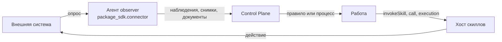

# Интеграции

Интеграция связывает платформу с внешней системой — CRM, трекером, учётной
системой, почтовым ящиком. В платформе она не отдельный сервис, а **пакеты
каталога и код рядом с ними**: наблюдатель пишет факты внешней системы в ядро
наблюдениями, скиллы выполняют действия в ней, правила и процессы решают, какую
работу из этого вывести. Статья для автора интеграции: как разделить пакет на
класс и провайдера, написать наблюдателя на `package_sdk.connector`, собрать образы
и проверить всё без стенда. Обоснование — TAI-ADR-0036 (коннектор = наблюдатель +
скиллы), TAI-ADR-0061 (класс, провайдер, подключения), TAI-ADR-0062 (п.8–9).

## Три роли интеграции

| Роль | Чем сделана | Куда пишет |
|---|---|---|
| **Источник** | агент вида `observer`: долгоживущий процесс опрашивает систему по циклу | наблюдения (`POST /api/v1/observations`), снимки знаний, документы-артефакты |
| **Действия** | скиллы: прочитать, подготовить, записать во внешнюю систему | результат вызова; внешняя запись — через согласование (см. [Скиллы пакета](skills.md#external-write)) |
| **Поверхность работы** | двусторонняя проекция задач во внешнюю систему | планируется фичей подключений, см. [ниже](#surface) |



В ядре, IAM и памяти имён внешних систем нет: всё, что знает о конкретной системе,
живёт в пакетах интеграции и их коде.

## Класс и провайдер { #class-and-provider }

Процесс, написанный под одну CRM, не должен переписываться, когда компания
переходит на другую. Поэтому интеграция делится на пакеты двух видов:

| Пакет | Что в нём | Пример ключа |
|---|---|---|
| **Класс** — нейтральный | онтология класса (`KnowledgePack`), виды наблюдений `<класс>.*`, контракты скиллов класса (`Skill`), типы задач и правила класса | `helpdesk` |
| **Провайдер** — одна система | `requires: [helpdesk]`, агент-наблюдатель, агент — хост скиллов класса, код работы с конкретной системой и образы | `helpdesk-alpha`, `helpdesk-beta` |

```yaml
# helpdesk-alpha/package.yaml
apiVersion: taimen.ai/v1
kind: Package
key: helpdesk-alpha
spec:
  version: 0.1.0
  displayName: Helpdesk — Alpha provider
  requires:
    - {package: helpdesk, version: ">=0.1.0,<0.2.0"}
```

Правила игры:

- **Процессы и правила вертикали ссылаются только на класс**: на виды наблюдений
  `helpdesk.*`, скиллы `helpdesk.*@версия`, типы задач класса. Смена провайдера —
  смена пакета провайдера в установке, а не правка вертикали.
- **Контракт скилла объявляет класс**, хостит его провайдер: его агент вида
  `skills` перечисляет модуль с реализацией в `skills.local`. Отдельного поля
  «реализует» у скилла нет.
- **Знание не дублируется.** Онтология класса расширяет базовую (`extends`) и
  добавляет только своё; сущность, которая уже есть в базе знаний компании, из
  внешней системы сводится с ней по естественному ключу (см. [Знания и
  онтология](knowledge.md)).
- Контракт класса считается доказанным, когда его без изменений реализовал второй
  провайдер.

## Подключения { #connections }

Учётка внешней системы — это [подключение](../control-plane/connections.md), а не
секрет в описании агента. Провайдерский пакет приносит вид каталога
`ConnectionType`: способы подключения (`oauth2`, `token`), адреса OAuth, поле
учётки и схему несекретных настроек. Администратор заводит подключение и
подключает его; материал доступа живёт в хранилище секретов, ядро хранит только
сведения.

- **Агент называет подключение** ключом в `spec.connections`; по умолчанию —
  `defaultKey` типа.
- **Код интеграции получает его** через `ctx.connection(<ключ>)` skill-sdk (хост
  скиллов) или `skill_sdk.ConnectionClient` (наблюдатель): `type`, `account`,
  `settings` и `await access_token()`. Токены обновляет хранилище, код их не хранит.
- **Потерю доступа** — отказ внешней системы после обновления токена —
  наблюдатель сообщает ядру (`PUT /connections/{key}/status` → `expired`), и пакет
  `connections` заводит задачу переподключения.
- **Настройки** (`settings`) — несекретный JSON по `settingsSchema` типа: роли
  этапов, поля внешней системы. Код читает их из того же `ctx.connection`.

## Секреты интеграции { #secrets }

Секрет, который не является учёткой внешней системы, — имя в `placement.secrets`
агентов интеграции. Значение задаётся через ядро (`PUT /agents/{key}/secrets/{name}`,
см. [Подключения](../control-plane/connections.md#agent-secrets)) и хранится в
хранилище секретов; перед запуском агента он оказывается в `/run/secrets/<имя>`.


Оба агента интеграции читают секрет одним правилом:

- **наблюдатель** — `ctx.secret(<имя>)` среды `package_sdk.connector`, на каждом
  цикле (см. [ниже](#observer));
- **хост скиллов** — `ctx.secret(<имя>)` skill-sdk; хосту вне узла тот же секрет
  можно дать переменной окружения с тем же именем, она сильнее файла.

Правило чтения файла — канон `skill_sdk.secrets`, наблюдатель повторяет его
(совпадение закреплено общими тестами):

- имя — по шаблону `[a-z0-9][a-z0-9-]{0,62}`; `agent-pat` зарезервировано: это
  PAT самого агента, который узел кладёт рядом;
- файл пустой или из одних пробельных символов — секрета нет;
- у непустого значения обрезаются только хвостовые `\r` и `\n`; пробелы внутри и
  по краям — часть значения;
- не больше 64 КиБ, UTF-8, только обычный файл; символические ссылки — только
  внутри каталога секретов.

## Раскладка пакета с интеграцией

```bash
package-sdk init helpdesk-alpha --integration --image
```

```text
helpdesk-alpha/
├── package.yaml
├── processes/helpdesk-alpha.yaml            # процесс-пример
├── tests/helpdesk-alpha.test.yaml           # его сценарий
├── agents/
│   ├── helpdesk-alpha-process.yaml          # личность процесса
│   └── helpdesk-alpha-observer.yaml         # агент наблюдателя, state: stopped
├── roles/helpdesk-alpha-owner.yaml          # роль владельца процесса
├── integration/
│   ├── pyproject.toml                       # проект helpdesk-alpha-integration
│   └── src/helpdesk_alpha/
│       ├── __init__.py
│       └── observer.py                      # наблюдатель на package_sdk.connector
├── Dockerfile                               # образ наблюдателя
├── .dockerignore                            # в контекст сборки — только код интеграции
└── .github/workflows/package.yml            # CI: check и test
```

- Код интеграции — обычный python-проект в `integration/` (`src/` и `tests/`).
  В его зависимостях нет `package-sdk` и клиента ядра: их даёт базовый образ
  поставки или закреплённый источник, а не публичный индекс пакетов.
- `--image` требует `--integration`.

## Наблюдатель на `package_sdk.connector` { #observer }

Наблюдатель — функция, помеченная `@observer`. Цикл, ревизию агента, публикацию и
состояние берёт на себя среда:

```python
# integration/src/helpdesk_alpha/observer.py
from package_sdk.connector import Observation, ObserveContext, observer, run


@observer(kind="helpdesk-alpha-observer", entrypoint="helpdesk_alpha.observer:observe")
def observe(ctx: ObserveContext) -> None:
    cursor = ctx.state.get("cursor")
    token = ctx.secret("helpdesk-alpha-token")        # файл секрета узла, каждый цикл заново
    for ticket in fetch(ctx.config["baseUrl"], token, since=cursor):
        ctx.emit(Observation(
            kind="helpdesk.ticket_changed",
            dedup_key=f"helpdesk-alpha:{ticket['id']}:{ticket['version']}",
            data=ticket,
            external_ref={"system": "helpdesk-alpha", "id": ticket["id"], "url": ticket["url"]},
            observed_at=ticket["updatedAt"],
        ))
        cursor = ticket["cursor"]
    ctx.state["cursor"] = cursor                        # сохранится после цикла без ошибок


if __name__ == "__main__":
    run(observe)
```

Агент, который его исполняет:

```yaml
# agents/helpdesk-alpha-observer.yaml
apiVersion: taimen.ai/v1
kind: Agent
key: helpdesk-alpha-observer
spec:
  displayName: Helpdesk Alpha observer
  identity:
    kind: agent
    permissions: [observations.write, artifacts.write]
  work:
    workspace: ${HELPDESK_WORKSPACE_ID}
  executor:
    kind: observer
    image: registry.example.com/helpdesk-alpha/observer:0.1.0
    params:
      entrypoint: helpdesk_alpha.observer:observe
      intervalSeconds: 300
      config:
        baseUrl: https://helpdesk.example.com/api
  placement:
    requires: [helpdesk-alpha-access]
    secrets: [helpdesk-alpha-token]
    resources: {cpus: 1, memoryMb: 256}
  state: running
```

### Что делает среда

- **Сверка при старте.** Процесс читает свою ревизию (`GET /api/v1/agents/me`) и
  проверяет вид исполнителя и точку входа. Principal не агент, вид не тот или
  `params.entrypoint` не совпадает с `@observer(entrypoint=…)` — выход с кодом
  **2** до первого цикла.
- **Цикл** — вызов функции, затем пауза `params.intervalSeconds` (60–86400, по
  умолчанию 900).
- **Между циклами** — снова `GET /agents/me`: новая ревизия или principal больше
  не связан с агентом — выход с кодом **75** (узел поднимет процесс заново), агент
  остановлен или выведен из оборота — выход **0**. Сбой чтения ревизии цикл не
  останавливает.
- **Сбой цикла.** Исключение функции пишется в журнал и наблюдением
  `connector.cycle_failed` не чаще раза в час; процесс не падает.
- **Нет секрета.** Нет файла секрета, он пуст или из одних пробелов — цикл
  пропускается, наблюдение `connector.secret_missing` не чаще раза в сутки.
- **Секрет негоден.** Файл есть, но правило чтения его отвергло (`SecretRejected`:
  ссылка за пределы каталога, подмена пути, не обычный файл, размер, кодировка,
  права) — цикл пропускается как сбой: `connector.cycle_failed` с `code` и
  `reason`. Значение секрета не попадает ни в журнал, ни в наблюдения, ни в
  состояние.

### `ObserveContext`

| Член | Что это |
|---|---|
| `ctx.config` | `executor.params.config` ревизии — данные пакета, секретов в них нет |
| `ctx.params` | `executor.params` целиком — для собственного вида исполнителя |
| `ctx.state` | состояние наблюдателя (курсор и т. п.), JSON; сохраняется атомарно только после цикла без ошибок |
| `ctx.secret(name)` | значение файла `/run/secrets/<name>` по правилу [выше](#secrets). Нет файла, пуст или из одних пробелов — `SecretMissing`: цикл пропускается, а наблюдение `connector.secret_missing` пишется раз в сутки. Файл есть, но негоден — `SecretRejected` с кодом (`secret_name_invalid`, `secret_file_rejected`, `secret_unreadable`) и причиной `reason` (`outside_secrets_dir`, `symlink_swapped`, `not_regular_file`, `too_large`, `not_utf8`, `unreadable`): это сбой цикла `connector.cycle_failed`. Значение не попадает ни в журнал, ни в наблюдения, ни в состояние |
| `ctx.secret_file(name)` | путь к файлу секрета — для инструментов, которые читают файл сами; перед этим файл проверяется тем же правилом (`SecretMissing`, `SecretRejected`) |
| `ctx.data_dir` | том реплики: рабочие файлы, которые переживают перезапуск |
| `ctx.workspace_id` | workspace из раздела `work` описания агента |
| `ctx.emit(Observation)` | наблюдение сразу в ядро; ответ — запись журнала (`id`, `deduplicated`) |
| `ctx.snapshot(Snapshot)` | снимок знаний источника (`POST /api/v1/knowledge/snapshots`); нужен workspace в разделе `work` агента |
| `ctx.document(Document)` | артефакт с содержимым или ссылкой `uri`; ответ — артефакт (`id`) |
| `ctx.log` | журнал |

`emit`, `snapshot` и `document` публикуют сразу и возвращают ответ ядра: id
артефакта можно положить в данные наблюдения, id наблюдения — в `supersedes`
следующего.

### Наблюдение и дедупликация

| Поле `Observation` | Смысл |
|---|---|
| `kind` | вид наблюдения — у класса `helpdesk.*`; на него срабатывают правила и старты процессов |
| `dedup_key` | ключ факта: повтор `(source, dedup_key)` ядро узнаёт и второй записи не заводит (`deduplicated: true`) |
| `data` | тело факта — то, что читают правила и процессы |
| `content` | текст для людей; по умолчанию `<kind>: <dedup_key>` |
| `external_ref` | объект во внешней системе: `system`, `id`, `url` |
| `observed_at` | когда факт случился во внешней системе |
| `source` | источник; по умолчанию — `kind` из `@observer` |
| `supersedes` | id наблюдения, которое это заменяет (новая версия того же факта) |

Ключ дедупликации строят из того, что делает факт тем же фактом: id объекта и его
версии или времени изменения. Тогда повтор цикла после сбоя, перезапуск и новая
ревизия агента не дают дублей.

### Сбои публикации

| Что случилось | Что делает среда |
|---|---|
| сеть, `408`, `425`, `429`, `500`, `502`, `503`, `504`, код `idempotency_in_flight` | цикл прерывается, `state` не сохраняется, следующий цикл повторит работу |
| прочие ответы с ошибкой | отказ ядра по сути — сбой цикла: `connector.cycle_failed` |
| документ с содержимым | загрузка переиспользуется, пока живёт (с запасом 10 минут); после — загружается заново, на `content_ref_not_found` — один раз в том же цикле |

Ключ идемпотентности документа по умолчанию — `doc:` и sha256 от агента,
workspace, наблюдателя, типа, имени, `metadata` и отпечатка содержимого или ссылки.
Свой `idempotency_key` — не длиннее 200 символов. Заведённые документы наблюдатель
помнит по ключу и не загружает снова.

### Окружение процесса

| Переменная | По умолчанию | Смысл |
|---|---|---|
| `CONTROL_PLANE_SERVER` | — (обязательно) | адрес ядра; без него — выход 2 |
| `CONNECTOR_DATA_DIR` | `/data` | том реплики: файл состояния `connector-state.json` |
| `CONNECTOR_SECRETS_DIR` | `/run/secrets` | каталог секретов; PAT агента — файл `agent-pat` в нём |
| `CONNECTOR_ENTRYPOINT` | — | точка входа образа для собственного вида исполнителя без `params.entrypoint` |
| `CONTROL_PLANE_IAM_SCOPES` | `control-plane:read control-plane:write` | scopes обмена PAT агента |

Единая точка входа образа — `python -m package_sdk.connector`: она читает ревизию,
находит наблюдателя по `executor.params.entrypoint` и крутит его цикл. Своего
`docker-entrypoint.sh` интеграции не нужно.

### Собственный вид исполнителя

Если у наблюдателя свои обязательные параметры, которые должна проверять схема
формата, он может быть отдельным видом исполнителя: `@observer(…,
executor="<вид>", interval=…)`. У такого вида нет `params.entrypoint` — точку
входа задаёт переменная образа `CONNECTOR_ENTRYPOINT`, а описание наблюдателя
лежит в `ctx.params`. Так устроен наблюдатель git (`git-connector`). Новый вид
требует правки схемы формата, поэтому для интеграции пакета обычно достаточно
`observer` и `config`.

## Тесты без стенда { #tests }

```python
# integration/tests/test_observer.py
from package_sdk.connector.testing import FakeCore, run_once

from helpdesk_alpha import observer

TICKET = {"id": "T-1", "version": 3, "url": "https://helpdesk.example.com/t/T-1",
          "updatedAt": "2026-01-15T10:00:00Z", "cursor": "c-1"}


def test_a_changed_ticket_is_observed_once(monkeypatch) -> None:
    monkeypatch.setattr(observer, "fetch", lambda base_url, token, since: [TICKET])
    core = FakeCore()
    config = {"baseUrl": "https://helpdesk.example.com/api"}
    secrets = {"helpdesk-alpha-token": "test-token"}

    first = run_once(observer.observe, config=config, secrets=secrets, core=core)
    again = run_once(observer.observe, config=config, secrets=secrets, core=core)

    assert [o["kind"] for o in first.observations] == ["helpdesk.ticket_changed"]
    assert first.state == {"cursor": "c-1"}
    assert len(again.observations) == 1        # тот же dedup_key — не второе наблюдение
```

- `run_once` — один цикл на поддельном ядре: секреты — файлы во временном
  каталоге, ответ `GET /agents/me` собирается из `config` или `params`.
- `FakeCore` ведёт себя по контракту ядра: повтор `(source, dedupKey)` — дубль,
  ключ идемпотентности артефакта общий для всех principal'ов tenant'а, загрузка
  содержимого истекает. Сбои задаются атрибутами экземпляра, а не аргументами
  конструктора:

    ```python
    core = FakeCore()
    core.fail_after = 0           # сколько записей пройдёт до отказа: 0 — падает первая
    core.lose_next_response = True  # следующий create_artifact запишется, а ответ потеряется
    ```

    После отказа публикации цикл завершается без сдвига состояния:
    `Result.state` — прежнее (у первого цикла `{}`), а в `observations` нет
    того, что не записалось, — следующий цикл повторит то же.
- `Result` — что ушло в ядро (`observations`, `snapshots`, `artifacts`) и каким
  стало `state`. Списки `Result` — это списки самого `FakeCore`: на общем
  `FakeCore` они копятся за все прогоны, поэтому в примере выше `again.observations`
  содержит и наблюдение первого прогона.
- Служебные наблюдения среды — `connector.secret_missing` (нет секрета, цикл
  пропущен) и `connector.cycle_failed` (сбой цикла) — тоже попадают в
  `Result.observations`; `state` при этом не меняется. Фильтруйте по `kind`,
  когда проверяете только свои наблюдения.

`package-sdk test` запускает эти тесты ступенью кода интеграции, а сценарии пакета
проверяют, что правила и процессы делают с наблюдениями.

## Образы { #images }

Агент интеграции работает на образе с её кодом. `package-sdk image` генерирует
Dockerfile, а собирает образ CI автора:

```bash
# наблюдатель: от базового образа наблюдателя поставки
package-sdk image observer --package . --entrypoint helpdesk_alpha.observer:observe \
    --base <базовый образ наблюдателя> --out Dockerfile
docker build -t registry.example.com/helpdesk-alpha/observer:0.1.0 .

# хост скиллов: от образа исполнителя поставки в режиме skills
package-sdk image skills --package . --modules helpdesk_alpha.skills \
    --base <образ исполнителя> --out Dockerfile.skills
docker build -f Dockerfile.skills -t registry.example.com/helpdesk-alpha/skills:0.1.0 .
```

| Образ | Основа | Что внутри |
|---|---|---|
| `observer` | базовый образ наблюдателя: в нём уже есть `package-sdk[connector]` и клиент ядра | код интеграции, пользователь `10001`, том `/data`, точка входа `python -m package_sdk.connector` |
| `skills` | образ исполнителя поставки со `skill-sdk` и клиентом ядра | код интеграции, `RUNNER_MODE=skills`, `CONTROL_PLANE_SKILLS_LOCAL_PACKAGES` из `--modules` |

Безопасность сборки:

- компоненты платформы берутся **только из базового образа**, не из публичного
  индекса: там таких имён нет, и чужой пакет с тем же именем подменил бы их. Сборка
  проверяет, что базовый образ их содержит, и падает, если нет;
- версии компонентов платформы из базового образа — ограничения установки кода
  интеграции (`--constraint`): интеграция, которой нужна другая версия, не
  соберётся;
- базового образа по умолчанию нет: `--base` при генерации или `--build-arg
  BASE_IMAGE=…` (`RUNNER_IMAGE` для `skills`) при сборке. Опубликованных
  базовых образов выпуска пока нет — соберите их сами по рецептам сквозного
  примера в репозитории `package-sdk`: `examples/claims/stand/observer-base.Dockerfile`
  (Python, клиент ядра и `package-sdk[connector]`) и
  `examples/claims/stand/runner-base.Dockerfile` (демон исполнителя, `skill-sdk` и
  клиент ядра). Оба собираются из клонов компонентов на тегах выпуска
  (`--build-context`, команды — в шапке каждого файла), а не из публичного индекса;
- в образ копируются только `pyproject.toml`, `README.md` и `src/` интеграции, а
  `.dockerignore` рядом пропускает в контекст сборки только их: `.env`, `.git` и
  `.venv` в образ не попадают;
- `--entrypoint` добавляет проверку при сборке: образ без этого наблюдателя не
  соберётся.

Собранный образ агент называет в `executor.image` — ссылкой с тегом или дайджестом
(см. [Агенты пакета](agents.md#image)). Выпуская новую версию кода, поднимайте тег
и правьте `executor.image`: это новая ревизия агента, и исполнитель перейдёт на неё
сам.


## Поверхность работы { #surface }

!!! warning "Планируется"
    По TAI-ADR-0061 внешняя система может быть не только источником, но и местом,
    где сотрудник берёт и сдаёт работу: коннектор провайдера проецирует задачи
    ядра выбранных типов во внешнюю систему, её закрытие наблюдается и закрывает
    работу правилом с evidence. Ядро при этом остаётся источником истины. Для этого
    нужны подключения, сопоставление людей с внешними identity и закрытие работы по
    задаче, привязанной наблюдением, — всё это фича подключений, в
    инструментарии пакетов её ещё нет.

## Типичные проблемы

| Симптом | Причина и решение |
|---|---|
| процесс наблюдателя выходит с кодом 2 сразу | `params.entrypoint` не совпадает с `@observer(entrypoint=…)`, модуля нет в образе или principal не связан с агентом — причина в журнале контейнера |
| наблюдения задваиваются | в `dedup_key` нет версии или времени изменения объекта, либо он меняется от цикла к циклу |
| курсор не двигается, наблюдения повторяются | цикл падает до конца (сбой публикации или исключение) — `state` сохраняется только после цикла без ошибок; смотреть `connector.cycle_failed` |
| наблюдение `connector.secret_missing` | нет файла секрета из `placement.secrets`, он пуст или из одних пробелов |
| `connector.cycle_failed` с `error: SecretRejected` | файл секрета есть, но негоден: `reason` называет причину (`outside_secrets_dir`, `not_regular_file`, `too_large`, `not_utf8`, …); `secret_unreadable` — у пользователя процесса нет прав на файл |
| `ValueError`: «снимку знаний нужен workspace агента» | в разделе `work` агента нет `workspace` |
| сборка образа: «в базовом образе нет package-sdk[connector] и клиента ядра» | `--base` указывает не на базовый образ наблюдателя поставки |
| `check` отвергает `config` | ключ оканчивается на `token`, `secret` или `password` — секрет только именем в `placement.secrets` |

## См. также

- [Подключения](../control-plane/connections.md) — тип подключения, OAuth, доступ агентов
- [Агенты пакета](agents.md) — наблюдатель, хост скиллов, образ
- [Скиллы пакета](skills.md) — действия интеграции
- [Знания и онтология](knowledge.md) — онтология класса и снимки
- [Правила вывода работы](../control-plane/work-rules.md) — работа из наблюдений
- [Процессы](../processes/index.md) — старт процесса по наблюдению
