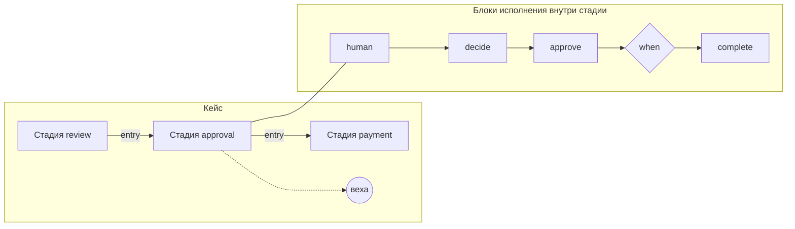

# Процессы

Процесс — описание того, как организация доводит дело до результата: какие
стадии проходит дело, кто и в какие сроки делает работу, кто согласует, что
происходит при внешних событиях и как откатывается сделанное при отмене.
Процесс пишется данными — YAML-файлом пакета каталога вида `Process`, — а
исполняет его само ядро Control Plane. Статья для авторов пакетов и
архитекторов: язык процессов целиком, с короткими примерами. Обоснование —
TAI-ADR-0054, CP-ADR-0074; поля — в [справочнике схемы](../reference/package-schema.md#process).

## Главное

- **Процесс исполняет ядро.** Отдельного движка нет: задачи и согласования
  экземпляра — обычные задачи и approvals Control Plane. Их видят рабочее место
  (список «Важное»), MCP-плагин и исполнители — без доработок.
- **Экземпляр процесса — дело.** У него есть данные по схеме, текущие стадии,
  таймеры, журнал решений и исход. Один ключ — один экземпляр.
- **Движок детерминирован.** Решение — чистая функция «состояние + вход →
  решения + намерения». Время, ответы скиллов и ответы памяти приходят в
  движок только входами журнала. Поэтому тест пакета, replay по журналу и
  живой прогон принимают одни и те же решения.
- **Каждое решение оставляет след.** Переход, срабатывание таймера, голос,
  компенсация, миграция записываются в журнал экземпляра с причиной и
  автором.
- **Выражения — один язык.** Условия, ключи, сроки, назначения и вычисляемые
  поля пишутся на CEL (см. [Выражения](expressions.md)).
- **Проверка без стенда.** Пакет проверяется, тестируется и сравнивается с
  живыми экземплярами до применения (см. [Тесты пакета](package-tests.md)).

## Где лежит процесс

Процесс — файл `processes/<ключ>.yaml` в пакете каталога. Рядом лежат типы
задач шагов, роли, описание агента-личности, скиллы и тесты:

```text
packages/<пакет>/
├── package.yaml               # манифест; renames — явные переименования объектов
├── processes/<ключ>.yaml      # kind: Process
├── calendars/<ключ>.yaml      # kind: Calendar — если пакет несёт свой календарь
├── schemas/<имя>.yaml         # схема данных экземпляра: data: {$ref: ../schemas/<имя>.yaml}
├── task-types/                # типы задач человеческих шагов
├── roles/                     # роли, на которые назначаются шаги
├── agents/<личность>.yaml     # от чьего имени действует процесс
├── tests/<имя>.test.yaml      # тесты сценариев
└── .layout/<ключ>.json        # раскладка схемы для визуального редактора; ядро её не читает
```

Каркас процесса:

```yaml
# yaml-language-server: $schema=https://github.com/taimen-ai/package-sdk/raw/<тег>/schema/v1/object.schema.json
apiVersion: taimen.ai/v1
kind: Process
key: supplier-invoice
spec:
  version: 1
  displayName: Оплата счёта поставщика
  workspaceId: ${WORKSPACE_ID}            # переменная установки
  identity: {agent: invoice-process}       # личность процесса
  owner: [{role: finance-director}]        # владелец процесса
  calendar: ru                             # календарь по умолчанию для cal.* и сроков
  due: {workdays: 5, warnBefore: {workdays: 1}}   # срок процесса целиком (SLA)
  data: {…}                                # JSON Schema данных экземпляра
  start: {…}                               # событие старта и ключ экземпляра
  correlate: […]                           # какие ещё события доходят до экземпляра
  memory: {…}                              # проекция дела в базу знаний
  decisions: […]                           # таблицы решений
  stages: […]                              # стадии кейса
  onEvent: […]                             # реакции на события сквозь стадии
  timers: […]                              # таймеры процесса
  migrations: […]                          # перевод открытых экземпляров на новую версию
```

Строку `$schema` пишет `package-sdk init`: адрес схемы того выпуска SDK, с тега которого он поставлен (в рабочей копии без тега — относительный путь к схеме установленного SDK).

!!! note "YAML 1.2"
    Язык пакетов — YAML 1.2: булевы значения только `true`/`false`, а ключи
    `on`, `off`, `yes`, `no` — строки. Инструменты платформы читают файлы
    именно так. Если файл читает ещё и инструмент на YAML 1.1 (например
    PyYAML), берите ключ `on` в кавычки: `"on": {observation: …}`.

## Два уровня языка

Процесс описывается на двух уровнях.



- **Кейс** (по мотивам CMMN) — стадии, вехи, сторожа входа и выхода,
  необязательная работа, граничные таймеры. Здесь живут задачи людей и
  агентов.
- **Блоки исполнения** (по мотивам Open Workflow DSL) — последовательность
  шагов, параллель, ожидание события, повтор с паузой, попытка с обработкой
  ошибки, компенсация. Здесь живёт автоматическая работа между задачами.

Переходы только структурные: `goto` нет, шаг нельзя «перепрыгнуть» на
произвольный другой. У каждого элемента — стадии, шага, вехи, таймера, ветви,
таблицы — стабильный `id` (`^[a-z][a-z0-9-]{0,62}$`). На него ссылаются
журнал, карты миграции, раскладка схемы и граф памяти. Id уникальны в
процессе.

### Стадии и вехи

```yaml
stages:
  - id: review
    displayName: Проверка счёта
    steps: [ … ]
  - id: approval
    displayName: Согласование оплаты
    entry: stage.review.completed && data.review == 'ok'
    milestones:
      - {id: routed, when: "has(data.approverRole)"}
    steps: [ … ]
```

| Поле стадии | Что делает |
|---|---|
| `entry` | сторож входа. Стадия без `entry` открывается при старте экземпляра, с `entry` — когда сторож истинен |
| `exit` | сторож выхода. Стадия с `exit` закрывается, когда он истинен, и отменяет свою открытую работу (задачи, approvals, таймеры). Без `exit` стадия закрывается, когда закончились её шаги |
| `repeatable` | стадия с `entry` открывается снова на следующем входе после выхода |
| `milestones` | вехи: `{id, when}`. Веха достигается, когда её сторож истинен, и снимается, когда перестаёт быть истинным, пока стадия активна (`process.milestone_reached`, `process.milestone_lost`) |
| `timers` | граничные таймеры стадии: срабатывают, пока она открыта |
| `discretionary` | необязательная работа: шаги, которые человек добавляет по решению |
| `governedBy` | регламенты, которым подчиняется стадия (см. [Процессы и база знаний](knowledge.md#regulations)) |

В сторожах доступны данные экземпляра (`data`), состояние стадий
(`stage.<id>.completed`, `stage.<id>.active`) и вехи (`milestone.<id>`).

Экземпляр завершается шагом `complete` с исходом или сам — с исходом
`completed`, когда все стадии закрыты и работающих потоков нет.

!!! tip "Сторож, который никогда не станет истинным"
    Проверка пакета находит сторожей, которые читают только поля, которые
    нигде не пишутся, или постоянно ложны: для `entry` это недостижимая стадия
    (`unreachable_stage`), для `exit` — тупик (`dead_end`), для вехи —
    предупреждение `unreachable_milestone`.

## Шаги

Шаг — элемент блока. У шага есть `id`, ровно один **вид** и общие поля:

| Общее поле | Что делает |
|---|---|
| `when` | сторож: шаг выполняется, только если выражение истинно; иначе пропускается |
| `input.from` | вход шага (выражение); у человеческого шага — попадает в описание задачи |
| `output.as` | запись результата шага (`step.result`) в данные: путь в данных → выражение |
| `export.as` | то же, что `output.as`, для экспорта результата |
| `onCompensate` | блок компенсации сделанного шага (см. [Компенсации](#compensation)) |
| `governedBy` | регламенты, которым подчиняется шаг |
| `displayName` | имя шага для людей |

Писать в данные можно только поля, объявленные в схеме данных процесса:
запись в неизвестное поле — ошибка проверки `unknown_data_field`.

### Виды шагов

| Вид | Что делает | Пример |
|---|---|---|
| `human` | задача человеку или агенту: тип задачи, форма, назначение, срок, эскалации, профиль контекста | [ниже](#human) |
| `approve` | согласование: несколько согласующих, кворум, порядок, разделение обязанностей | [ниже](#approve) |
| `call` | вызов скилла (`skill: name@version`), агента (`agent: <ключ>`) или вложенного процесса (`process: <ключ>`) | `call: {skill: notify.send@1, input: {…}, timeout: PT1H}` |
| `decide` | таблица решений по данным | `decide: {table: approval-route}` |
| `recall` | запрос к базе знаний через ядро | см. [Процессы и база знаний](knowledge.md#recall) |
| `remember` | запись факта или сущности в базу знаний | см. [Процессы и база знаний](knowledge.md#remember) |
| `listen` | ожидание первого из нескольких событий с таймаутом | [ниже](#listen) |
| `wait` | пауза: длительность или момент | `wait: P1D` или `wait: {at: "data.startDate"}` |
| `set` | вычислить и записать поля данных | `set: {total: "data.amount * 1.2"}` |
| `raise` | поднять ошибку | `raise: {type: not-ready, detail: "'не готово'"}` |
| `compensate` | выполнить компенсации сделанных шагов | `compensate: all` |
| `fork` | параллельные ветви: `all` — ждать все, `compete` — первую | [ниже](#fork) |
| `try` | попытка с повтором и обработчиками ошибок | [ниже](#try) |
| `do` | вложенная последовательность шагов | `do: [ … ]` |
| `suspend` / `resume` | приостановить или возобновить экземпляр | [ниже](#suspend) |
| `complete` | закрыть экземпляр с исходом | `complete: {outcome: paid}` |

### Задача человеку — `human` { #human }

```yaml
- id: check-invoice
  human:
    taskType: invoice-review
    title: "'Проверить счёт ' + data.number + ': ' + data.supplier"
    assign: [{role: accounting}]
    due: P2D
    escalations:
      - {after: due, action: remind}
      - {after: P1D, action: notify, to: [{role: finance-director}]}
    form:
      schema:
        type: object
        required: [verdict]
        properties:
          verdict: {type: string, enum: [ok, mismatch], title: Итог проверки}
          note: {type: string, title: Комментарий}
  output:
    as:
      review: step.result.verdict
      reviewNote: step.result.?note.orValue('')
```

- **Задача** — обычная задача ядра в workspace экземпляра, с типом
  `taskType` и внешней ссылкой на элемент процесса. Результат — поля задачи
  (`customFields`) при завершении, проверенные по форме шага; в данные они
  попадают через `output.as`. Там же видна задача шага `task`: кто её исполнил —
  `task.assigneeId` (пример — в [Выражениях](expressions.md#variables)).
- **Поля задачи заполняет исполнитель.** Шаг `human` не задаёт `customFields`
  новой задачи: данные дела доходят до исполнителя только текстом описания
  (`input.from`). Если исход гейта типа задачи читает поле (`$.task.customFields.requestId!`),
  инструкция типа должна попросить исполнителя его заполнить — как в
  [Примере](../packages/tutorial.md#work). Предзаполнения полей задачи из шага
  пока нет.
- **Форма** — JSON Schema данных и `uischema` JSON Forms для представления.
  Без `form.schema` результат проверяется по `fieldSchema` типа задачи.
- **Назначение** `assign` — цепочка кандидатов по порядку, берётся первый
  разрешимый: `{principal: <uuid или ${ПЕРЕМЕННАЯ}>}`, `{role: <slug>}`,
  `{agent: <ключ>}` или `{expr: <CEL>}`. Выражение даёт id principal'а,
  `agent:<ключ>` или `role:<slug>`. Роль означает задачу роли без конкретного
  исполнителя: её берёт любой, у кого роль.
- **Срок** `due` — SLA шага: длительность от создания задачи (`P2D`),
  момент `{at: <CEL>}` или срок в рабочих днях и часах по календарю с
  порогом предупреждения (см. [Сроки и SLA](#sla)).
- **Эскалации** — до пяти уровней. `after: due` — в момент срока,
  длительность — после срока. Действия: `remind` (напомнить исполнителю),
  `reassign` (переназначить на `to`), `notify` (уведомить `to`), `raise`
  (поднять ошибку `error`). Каждый уровень публикует событие
  `process.escalated`; доставку делает сервис уведомлений по своим правилам
  (см. [Правила уведомлений](../notifications/notification-rules.md)).
- **Контекст** `context` — какой контекст из базы знаний получит исполнитель
  (см. [Процессы и база знаний](knowledge.md#step-context)).

Агентский шаг — тот же `human` с назначением `{agent: <ключ>}` или
`call: {agent: <ключ>}`: это задача на агента реестра, и исполнитель получает
её как любую задачу (см. [Пакеты каталога](../control-plane/catalog-packages.md#agent)).

### Согласование — `approve` { #approve }

```yaml
- id: approve-payment
  approve:
    approvers: [{expr: "'role:' + data.approverRole"}]
    mode: parallel
    quorum: any
    separationOfDuties: "[data.uploadedBy]"
    due: P2D
    onDue: escalate
    escalations:
      - {after: due, action: notify, to: [{role: finance-director}]}
  output:
    as:
      approval: step.result.outcome
      approvedBy: step.result.approvedBy
      rejectedBy: step.result.rejectedBy
```

Шаг заводит по approval ядра на каждого согласующего из `approvers`.
Обязательны `approvers` и `quorum`: умолчания у кворума нет.

| Поле | Значения | Что значит |
|---|---|---|
| `mode` | `parallel` (по умолчанию), `sequential` | все сразу или по очереди: в `sequential` открыт один approval — первого в порядке, кто ещё не голосовал |
| `quorum` | `all`, `any`, `{atLeast: n}`, `{percent: p}`; **обязательно** | сколько одобрений нужно: все оставшиеся, одно, `n`, или ⌈p·N/100⌉ (не меньше одного) от оставшихся согласующих |
| `earlyDecision` | `true` (по умолчанию) | решить, как только кворум набран или стал недостижим; `false` — ждать голосов всех оставшихся |
| `separationOfDuties` | CEL → список principal'ов | кому голосовать нельзя |
| `due`, `onDue` | срок (см. [Сроки и SLA](#sla)); `approve`, `reject`, `escalate` | что делать, если к сроку решения нет |
| `escalations` | уровни, как у `human` | эскалации по сроку |

**Кворум «двое из трёх»** — `quorum: {atLeast: 2}`: два одобрения — решение
принято, оставшийся approval закрывается; два отказа — решение отклонено
сразу, без ожидания третьего. Если согласующий ушёл (его approval отменён),
кворум пересчитывается по оставшимся: `all` перестаёт его ждать, `percent`
берёт долю от меньшего числа, недостижимый `atLeast` — отказ
(`quorum_unreachable`); ушли все — отказ (`no_approvers`).

**Разделение обязанностей проверяет ядро, а не движок.** Список из
`separationOfDuties` становится полем `excludedPrincipals` каждого approval.
Кого исключить, процесс знает из своих данных: например, того, кто разбирал
дело, сохраняет `output.as` предыдущего шага `human` —
`reviewedBy: string(task.assigneeId)` (полный пример — в
[Выражениях](expressions.md#variables)). Автора входа берите из события, а не
из его данных: `event.actorId` ставит ядро по аутентифицированному отправителю,
а `event.payload` пишет сам отправитель — подставленный туда чужой id снял бы
исключение. Поэтому оплата счёта исключает и автора наблюдения
(`uploadedBy: string(event.actorId)`, см. [Старт и корреляция](#start)), и
названного в данных загрузившего, если он назван.
Голос исключённого principal'а отвергается `403
separation_of_duties_violation` при любом пути — из рабочего места, канала, MCP или
API, — даже если у него есть роль согласующего. В списке «Важное» такой
approval ему не показывается.

Результат шага: `step.result.outcome` (`approved` или `rejected`),
`approvedBy`, `rejectedBy`.

### Ожидание события — `listen` { #listen }

```yaml
- id: await-answer
  listen:
    any:
      - "on": {observation: supplier.answered, where: "event.payload.data.ok == true"}
        do:
          - {id: store-answer, set: {answer: "string(event.payload.data.text)"}}
      - "on": {observation: supplier.declined}
        do:
          - {id: declined, complete: {outcome: declined}}
    timeout: P5D
    onTimeout:
      - {id: no-answer, set: {answer: "''"}}
```

`listen` ждёт первое подошедшее событие из `any` (отложенный выбор) и
выполняет его блок `do`; `step.result` — `{option, event}`. Таймаут —
длительность или момент `{at: …}`; без `onTimeout` поток просто идёт дальше.
Таймаут и срок — разные вещи: таймаут закрывает ожидание, а срок `due`
только фиксирует, что ожидание затянулось (см. [Сроки и SLA](#sla)).

!!! warning "Событие должно дойти до экземпляра"
    `listen` и `onEvent` слышат только события, которые дошли до экземпляра
    по ключу через `correlate` (см. [Старт и корреляция](#start)). Событие
    вида, не объявленного в `correlate`, экземпляр не услышит.

### Параллель — `fork` { #fork }

```yaml
- id: prepare
  fork:
    mode: all
    branches:
      - id: documents-branch
        do: [ {id: prepare-documents, human: {…}} ]
      - id: guarantee-branch
        do: [ {id: provide-guarantee, human: {…}} ]
```

`all` ждёт все ветви, `compete` завершается первой закончившейся ветвью, а
остальные закрывает.

### Попытка, повтор, ошибки — `try` и `raise` { #try }

```yaml
- id: price-round
  try:
    retry: {limit: 2, "on": [price-rejected]}
    do:
      - id: calculate-price
        human: {…}
      - id: approve-price
        approve: {…}
      - id: price-rejected
        when: data.priceApproval.outcome != 'approved'
        raise: {type: price-rejected, detail: "'цена не согласована'"}
    catch:
      - errors: {type: price-rejected}
        do: [{id: price-not-approved, complete: {outcome: price-not-approved}}]
```

- Ошибки — в форме RFC 7807: `type`, `status`, `detail`. Их поднимает `raise`
  процесса, скилл, таймаут вызова (`timeout`), отказ задачи или команды ядра.
- `retry` повторяет блок `do` до `limit` раз с паузой `delay`; `backoff:
  exponential` удваивает паузу до `maxDelay`; `on` — типы ошибок для повтора
  (по умолчанию все). Затем — `catch`.
- `catch[]` ловит ошибки по `errors.type` и `errors.status`; `as` даёт имя
  ошибки в выражениях обработчика.
- Необработанная ошибка поднимается до ближайшего `try` (в том числе сквозь
  `fork`), а если его нет — экземпляр переходит в `failed` с событием
  `process.failed`.

Повтор блока `try` — единственный способ «вернуться назад»: цикла «пока» в
языке нет.

### Ошибки движка

| `type` | Когда |
|---|---|
| `expression_error` | выражение упало при вычислении: `null`, отсутствующее поле, нет календаря |
| `expression_cost_exceeded` | выражение превысило лимит стоимости |
| `decision_no_match`, `decision_ambiguous` | таблица `first` без совпадения; `unique` без ровно одного совпадения |
| `form_invalid` | результат задачи не проходит форму шага |
| `task_cancelled` | задачу шага отменили |
| `timeout` | вызов `call` не ответил в `timeout` |
| `intent_failed` | ядро отказало команде процесса (например, нет права у личности); `detail` — код отказа |
| `child_failed` | вложенный процесс закончился ошибкой |
| `step_limit_exceeded` | больше 10 000 действий движка на один вход |

## Данные экземпляра и схема

`data` — JSON Schema данных экземпляра. Её можно вынести в файл пакета:
`data: {$ref: ../schemas/case.yaml}` (путь от файла процесса, не выходя из
пакета).

```yaml
data:
  type: object
  required: [number, supplier, amount, currency, uploadedBy]
  properties:
    number: {type: string}
    supplier: {type: string}
    amount: {type: number}
    currency: {type: string}
    uploadedBy: {type: string, format: uuid, minLength: 1, description: "Principal, загрузивший счёт"}
    dueDate: {type: string, format: date-time}
    review: {type: string, enum: [ok, mismatch]}
```

Схема задаёт типы выражений: `data.amount` — `double`, `data.dueDate` —
`timestamp`, обращение к необъявленному полю — ошибка проверки при
публикации, а не на живом событии. Подробно — [Выражения](expressions.md#types).

Шаги пишут в данные через `set`, `output.as`, `export.as`, а старт и
корреляция — через `start.set` и `correlate[].set`. Путь записи — через точку:
`decision.value`, `price.amount`.

## Старт и корреляция { #start }

```yaml
start:
  "on": {observation: invoice.received}
  key: "'invoice:' + string(event.payload.data.invoice)"
  set:
    number: string(event.payload.data.invoice)
    amount: double(event.payload.data.amount)
    uploadedBy: string(event.actorId)   # автор наблюдения, а не поле payload
correlate:
  - "on": {observation: invoice.corrected}
    key: "'invoice:' + string(event.payload.data.invoice)"
    set: {amount: double(event.payload.data.amount)}
```

- **Источник** `on` — событие журнала ядра (`event: task.completed`) или
  наблюдение (`observation: invoice.received`, при необходимости `source`).
  `where` — фильтр на CEL над `event`.
- **Ключ экземпляра** `key` — выражение от события. Ядро держит ровно один
  экземпляр на ключ: событие старта с ключом существующего экземпляра
  становится входом этого экземпляра (`process.correlated`), а не вторым
  экземпляром.
- **Корреляция** `correlate` — какие ещё события и по какому ключу доходят до
  экземпляра. Её `set` меняет данные, а `do` — блок, который выполняется при
  таком событии. Только события, дошедшие до экземпляра, слышат `onEvent` и
  `listen`.
- **Явный старт** без события — `POST /api/v1/process-instances` с правом
  `processes.operate`:

  ```bash
  curl -sS -X POST https://platform.example.com/api/v1/process-instances \
    -H "Authorization: Bearer $TOKEN" -H "Content-Type: application/json" \
    -d '{"process": "invoices-on-time", "key": "invoices-on-time", "workspaceId": "<workspace-id>"}'
  ```

  `data` запроса проверяется по схеме данных (`422 invalid_process_data`),
  `start.set` не исполняется. Повтор с тем же ключом — `409
  process_instance_exists` с `details.instanceId`.

Экземпляр идёт по последней опубликованной версии на момент старта и
остаётся на ней до конца или до миграции. Задачи и approvals экземпляра
заводятся в workspace процесса.

### Реакции сквозь стадии — `onEvent`

```yaml
onEvent:
  - "on": {observation: invoice.withdrawn}
    do:
      - {id: hold, suspend: {reason: "'счёт отозван: компенсации'"}}
      - {id: undo, compensate: all}
      - {id: withdrawn, complete: {outcome: withdrawn}}
```

`onEvent` выполняется при событии, дошедшем до экземпляра, в какой бы стадии
тот ни был, — в том числе когда экземпляр приостановлен.

## Таймеры, сроки и календарь

Время в процессе задаётся тремя способами:

| Форма | Пример | Когда срабатывает |
|---|---|---|
| длительность ISO 8601 | `P3D`, `PT4H` | через столько после начала шага или открытия стадии |
| момент из данных | `{at: "data.submissionEnd"}` | в этот момент |
| сдвиг по календарю | `{at: "cal.addWorkdays(data.submissionEnd, -3)"}` | за три рабочих дня до даты |

Граничные таймеры — у стадии (`stages[].timers`) и у процесса (`timers`):
они срабатывают, пока стадия (процесс) открыта, и выполняют свой блок `do`.
С `interrupting: true` таймер сначала прерывает работу стадии (процесса);
по умолчанию (`false`) блок идёт параллельно с ней.

```yaml
timers:
  - id: submission-deadline
    at: {at: data.submissionEnd}
    interrupting: true
    do: [{id: missed-deadline, complete: {outcome: missed-deadline}}]
```

- **Пересчёт.** Ядро знает, какие поля данных читает выражение срока. Когда
  шаг меняет эти поля (например, корреляция перенесла дату), несработавшие
  таймеры пересчитываются — событие `process.timer_rescheduled` со старым и
  новым временем. Сработавший таймер не откатывается.
- **Приостановка** замораживает таймеры: хранится остаток. После
  возобновления срок — время возобновления плюс остаток. Таймер от даты в
  данных остатка не хранит и считается от данных.
- **Нет текущего времени.** В выражениях нет `now()`: время входит только как
  `instance.clock` (время текущего входа) и `event.time`.

### Производственный календарь

Календарь — отдельный вид каталога `Calendar`: часовой пояс, выходные дни
недели, по годам — праздники, перенесённые рабочие дни, сокращённые дни и
признак «предварительный». Он обновляется отдельно от процессов.

```yaml
apiVersion: taimen.ai/v1
kind: Calendar
key: ru
spec:
  displayName: Производственный календарь РФ
  timezone: Europe/Moscow
  weekend: [6, 7]
  years:
    - year: 2026
      source: постановление о переносе выходных дней
      holidays: ["2026-01-01", "2026-01-02", …]
      workdays: []
      shortDays: ["2026-02-20"]
    - year: 2027
      provisional: true
      holidays: ["2027-01-01", …]
```

- Функции `cal.addWorkdays`, `cal.isWorkday`, `cal.workdaysBetween`,
  `cal.addWorkingTime`, `cal.workingTimeBetween` считают по календарю
  процесса (`spec.calendar`) или по названному ключу
  (см. [Выражения](expressions.md#calendar)).
- Если вычисление задело год с `provisional: true` или год, которого в
  календаре нет (тогда известны только выходные дни недели), срок помечается
  **«предварительно»**: таймер и экземпляр показывают `provisional: true`.
- Новая версия календаря пересчитывает несработавшие таймеры экземпляров,
  которые им пользуются (`cause: calendar_changed`), — так утверждённый год
  снимает пометку.
- Каждое вычисление записывает в журнал версию календаря; replay берёт её, а
  не текущую.
- Календари читает любой аутентифицированный вызов (`GET /api/v1/calendars`),
  публикует — право `calendars.write`. Готовых календарей в поставке нет:
  календарь публикуется пакетом (вид `Calendar`).

### Рабочие часы календаря { #working-hours }

Календарь может описать не только рабочие дни, но и рабочие часы. По ним
считаются сроки в рабочих часах (`due: {workhours: n}`) и функции
`cal.addWorkingTime` и `cal.workingTimeBetween`. Поле `workingHours`
необязательно (CP-ADR-0078 §2):

```yaml
spec:
  timezone: Europe/Moscow
  weekend: [6, 7]
  workingHours:
    intervals: [{from: "09:00", to: "13:00"}, {from: "14:00", to: "18:00"}]
    weekdays: {5: [{from: "09:00", to: "16:45"}]}   # пятница короче
    shortDayReduction: PT1H                         # предпраздничный день — на час короче
  years: […]
```

| Поле | Что задаёт |
|---|---|
| `intervals` | интервалы обычного рабочего дня по местному времени календаря (`timezone`), по порядку и без пересечений, не больше десяти; `24:00` — конец суток |
| `weekdays` | интервалы для дня недели ISO (1 — понедельник) вместо `intervals`; `[]` — в этот день рабочих часов нет |
| `shortDayReduction` | на сколько короче сокращённый день (`shortDays` года): вычитается с конца последнего интервала, а если он короче — и с предыдущих |

- Рабочее время — интервалы рабочих дней календаря. Перенесённый рабочий
  день (`workdays` года) берёт обычные `intervals`, праздник и выходной
  рабочих часов не имеют.
- Отсчёт от момента вне рабочих часов начинается с ближайшего рабочего
  интервала. Срок, который выбрал интервал целиком, — конец интервала
  (18:00), а не начало следующего.
- День года, которого в календаре нет, знает только выходные дни недели: его
  интервалы — интервалы дня недели, сокращённых дней нет, ответ помечен
  «предварительно».
- Календарь без `workingHours` ведёт себя как прежде и считает только
  рабочие дни. Поле входит в каноническую форму календаря, только если оно
  есть, поэтому хэш прежних версий календаря не меняется.
- Публикация проверяет часы: время `HH:MM` до `24:00`, `from` раньше `to`,
  интервалы по порядку и без пересечений, `shortDayReduction` — целое число
  минут без лет и месяцев. Нарушение — `422 invalid_calendar` с
  `details.code = invalid_working_hours`.

!!! warning "Время — строкой в кавычках"
    Пишите `from: "09:00"`, а не `from: 09:00`. Загрузчики YAML 1.1 читают
    `18:00` без кавычек как шестидесятеричное число `1080`, и календарь не
    проходит схему.

## Сроки и SLA { #sla }

SLA шага и процесса — его срок `due`, второго понятия срока нет
(TAI-ADR-0059, CP-ADR-0078). Срок не закрывает ожидание, как таймаут, а
фиксирует факт: ядро пишет в журнал, что срок близок или нарушен, показывает
состояние срока в экземпляре и умеет отфильтровать экземпляры с нарушенным
сроком. Уведомить людей и завести работу на нарушение — дело правил
уведомлений и правил вывода работы, а не процесса.

### Где объявляется срок

| Где | Поле | От какого момента |
|---|---|---|
| шаги `human`, `approve` | `human.due`, `approve.due` | от входа в шаг (открытия задачи или согласования) |
| шаги `call`, `recall`, `listen` | `call.due`, `recall.due`, `listen.due` | от входа в шаг; срок вложенного процесса — `call.due` шага `call: {process: …}` |
| процесс целиком | `spec.due` | от старта экземпляра |

У паузы `wait` срока нет — она сама задаёт время. SLA стадии тоже нет:
срок стадии выражает её граничный таймер.

### Формы срока

```yaml
due: P2D                                  # астрономическое время
due: {at: "cal.addWorkdays(data.receivedAt, 3)"}   # момент от данных
due: {duration: PT4H, warnBefore: PT1H}   # астрономическое время с порогом
due: {workdays: 2}                        # рабочие дни по календарю процесса
due: {workhours: 8, calendar: ru}         # рабочие часы по названному календарю
due: {workhours: 8, warnBefore: {workhours: 2}}
```

| Форма | Что значит |
|---|---|
| `P2D`, `{duration: …}` | длительность ISO 8601 подряд, без учёта календаря |
| `{at: <CEL>}` | момент (или длительность) из выражения над данными экземпляра |
| `{workdays: n}` | то же время суток через `n` рабочих дней (как `cal.addWorkdays`); если у календаря есть рабочие часы и вход вне них, отсчёт идёт от начала следующего рабочего интервала; `n` — целое от 1 до 1000 |
| `{workhours: n}` | `n` часов рабочего времени от входа (как `cal.addWorkingTime`); нужен календарь с [рабочими часами](#working-hours); `n` — число больше 0, до 10000 |
| `calendar` | ключ календаря рабочих единиц; по умолчанию `spec.calendar` процесса |
| `warnBefore` | порог предупреждения до срока: длительность, `{workdays: n}` или `{workhours: n}`; по умолчанию порога нет |

`warnBefore` и `calendar` пишутся только в объектной форме — рядом с
`duration`, `workdays` или `workhours`. В объекте ровно одно из этих трёх
полей. Прежние формы (`P2D`, `{at: …}`) действуют как раньше. Эскалации
`after: due` и `onDue` согласования отсчитываются от того же срока.

Проверка определения отвергает срок, который нельзя посчитать, — `422
invalid_process` с находками в `details.problems`. Путь находки — поле
единицы (`…/due/workhours`, `…/due/warnBefore/workdays`):

| Находка | Причина |
|---|---|
| `sla_calendar_missing` | рабочие единицы (`workdays`, `workhours` в сроке или в `warnBefore`) без `calendar` и без `spec.calendar` |
| `sla_calendar_without_hours` | `workhours` по календарю, последняя версия которого не объявляет `workingHours` |
| `unknown_calendar` | названного календаря нет |

Проверка и тесты пакета находят то же и берут календарь из пакета, а не из
каталога. Опубликованную версию эта проверка не перепроверяет: если
календарь позже потерял рабочие часы, срок не вычисляется (`process.sla_failed`),
а версия продолжает работать.

### Факты срока

Срок ставит экземпляру таймер срока, а `warnBefore` — ещё и таймер
предупреждения. Когда таймер срабатывает, а шаг (процесс) ещё открыт, ядро
пишет событие журнала — независимо от того, объявлены ли эскалации:

| Событие | Когда |
|---|---|
| `process.sla_warning` | наступил порог `warnBefore`, шаг (процесс) не закрыт |
| `process.sla_breached` | наступил срок, шаг (процесс) не закрыт |
| `process.sla_failed` | срок не вычислен (`calendar_missing`, ошибка выражения); экземпляр продолжает работу, состояние срока — `unknown` |

| Поле payload | Что значит |
|---|---|
| `scope` | `step` — срок шага, `process` — срок процесса; у `process` поля `element`, `attempt`, `activityId` пусты |
| `element`, `attempt`, `activityId` | шаг, номер его попытки и открытая работа попытки |
| `dueAt` | объявленный момент срока |
| `warnAt` | момент порога (у `process.sla_warning`) |
| `detectedAt`, `overdueSeconds` | когда ядро обработало нарушение и на сколько секунд позже срока (у `process.sla_breached`) |
| `detectedBy` | `timer` — сработал таймер, `migration` — срок оказался прошедшим при миграции |
| `provisional` | срок посчитан по предварительному году календаря |
| `owner`, `assignee` | адресаты — владелец процесса и исполнитель шага (ниже) |
| `error` | причина сбоя (у `process.sla_failed`) |

- **Один факт на попытку.** Каждый таймер срабатывает один раз, поэтому на
  попытку шага приходится не больше одного `process.sla_warning` и одного
  `process.sla_breached`.
- **Закрытие шага снимает его таймеры срока.** Событие выхода из шага
  `process.step_exited` несёт `breached` и `overdueSeconds`: закрыт ли шаг
  позже срока и на сколько (см. [События шагов](#step-events)).
- **Повторный вход — новый срок.** Каждый вход в шаг — новая попытка со
  своим сроком от момента входа. Переназначение эскалацией попытку не
  пересоздаёт и срок не сбрасывает. Срок процесса считается от старта
  экземпляра и повторными входами не сбрасывается.
- **Новая версия календаря** пересчитывает несработавшие таймеры срока, как
  и остальные таймеры, зовущие календарь (`process.timer_rescheduled`,
  `cause: calendar_changed`).

### Адресаты событий срока { #sla-recipients }

`owner` и `assignee` — адресаты в той форме, которую понимают
[правила уведомлений](../notifications/notification-rules.md#process-recipients):
`{principalId, roleId, workspaceId}`, заполнено одно из `principalId` и
`roleId`.

- `owner` — первый разрешимый кандидат цепочки `spec.owner` (см. [Владелец и
  личность процесса](#owner)). Роль `role:<slug>` ядро разрешает в id роли в
  workspace процесса; у процесса уровня tenant — в workspace экземпляра.
- `assignee` — исполнитель шага; у срока процесса и у шага без исполнителя
  поле пусто.
- Ни один кандидат не разрешился (роль не заведена) — поле пусто, событие
  всё равно пишется.

Поэтому правилу уведомлений не нужен id конкретного человека в переменной
установки: адресат приходит в событии.

### Приостановка и сроки

Приостановка экземпляра останавливает SLA-часы его шагов и процесса: таймеры
срока замораживаются вместе с остальными. Остаток хранится в единице срока:

| Срок | Единица остатка | После возобновления |
|---|---|---|
| `workhours`; `workdays` по календарю с рабочими часами | секунды рабочего времени | момент возобновления плюс остаток рабочего времени |
| `workdays` по календарю без рабочих часов | рабочие дни и время суток | остаток рабочих дней досчитывается по календарю от возобновления |
| длительность | секунды подряд | момент возобновления плюс остаток |
| `{at: …}` | не хранится | срок считается от данных, как прежде, и паузой не сдвигается |

Пока экземпляр приостановлен, состояние срока — `paused`.

### Состояние срока в экземпляре { #sla-state }

`GET /api/v1/process-instances/{id}` показывает срок у каждого открытого
элемента и у экземпляра:

- у открытого элемента — `attempt`, `due` (`dueAt`, `warnAt`, `provisional`,
  `remainingSeconds`), `slaState` и `overdueSeconds`;
- у экземпляра — `sla` той же формы для срока процесса и `slaState` —
  худшее из состояний срока процесса и открытых шагов.

| `slaState` | Что значит |
|---|---|
| `ok` | срок впереди, порог не наступил |
| `warning` | наступил порог `warnBefore`, срок ещё впереди |
| `breached` | срок прошёл |
| `paused` | экземпляр приостановлен |
| `unknown` | срок не вычислен (`process.sla_failed`) |
| `none` | срока нет |

Состояние вычисляется при чтении по `dueAt`, `warnAt` и текущему времени.
Оно не зависит от того, успел ли воркер обработать таймер: прошедший срок
показывается как `breached` сразу.

Список экземпляров фильтруется по состоянию срока с правом `processes.read`:

```bash
curl -sS "https://platform.example.com/api/v1/process-instances?slaState=breached" \
  -H "Authorization: Bearer $TOKEN"
```

Фильтр `slaState` принимает только `breached` и `warning`; другое значение —
`400 invalid_request`. Приостановленные экземпляры в фильтр не попадают.
MCP-плагин показывает срок и `slaState` в `cp_process_get` и
`cp_process_explain`.

### Какие версии получают сроки { #engine-revision }

Сроки SLA — таймеры срока, события `process.sla_*`, срок у шагов кроме
`human` и `approve` и срок процесса — действуют только у версий процесса,
опубликованных ядром с этой возможностью. Ядро помечает такие версии
ревизией семантики движка 2 (`engine_revision`), прежние версии остаются на
ревизии 1.

- Экземпляры версии ревизии 1 исполняются и переигрываются как прежде и
  фактов срока не получают, пока их не мигрируют на новую версию. События
  шагов при этом пишутся для всех экземпляров.
- **Переиздание без изменений ревизию не поднимает.** Публикация той же
  версии с тем же содержимым возвращает уже опубликованную версию — с её
  прежней ревизией. Чтобы процесс получил сроки, нужна новая версия
  (`spec.version: N+1`) и, для открытых экземпляров, карта миграции с
  `policy: migrate` (см. [Версии и миграции](#versions)).
- Процесс с `due: P2D` после переиздания получает факты срока по тому же,
  астрономическому, сроку. Перевод на рабочее время — отдельная правка
  пакета.

## Таблицы решений

```yaml
decisions:
  - id: approval-route
    displayName: Кто согласует оплату
    hitPolicy: first
    inputs:
      - {id: amount, expr: data.amount, type: number}
      - {id: currency, expr: data.currency, type: string}
    outputs: [{id: approver, type: string}]
    rules:
      - when: {currency: RUB, amount: "[0..100000)"}
        then: {approver: accounting}
        note: До 100 000 ₽ согласует бухгалтерия
      - when: {currency: "-", amount: "-"}
        then: {approver: finance-director}
```

- **Политика**: `first` — первая совпавшая строка; `unique` — ровно одна
  (иначе ошибка); `collect` — все совпавшие (`step.result.items`).
- **Ячейка условия**: `-` (любое), литерал, список `a,b`, диапазон `[a..b)`
  (открытый конец пустой: `[10..)`) или сравнение `<`, `<=`, `>`, `>=`.
  Диапазоны — у `number`, `date`, `timestamp`.
- **Проверка** находит перекрытия строк у `unique` (ошибка), строки `first`,
  которые покрывают предыдущие (предупреждение), и пробелы — с примером
  входа, на котором ни одна строка не сработает.
- Таблица читает **только данные экземпляра**. Знание из базы знаний попадает
  в неё через предшествующий шаг `recall` и `output.as`.
- Вызов — шаг `decide: {table: <id>}`; результат — выходы строки в
  `step.result`.

## Согласования и роли

Назначение согласующих — та же цепочка, что у задач. Роль из таблицы
решений подставляется выражением:

```yaml
- id: route
  decide: {table: approval-route}
  output: {as: {approverRole: step.result.approver}}
- id: approve-payment
  approve:
    approvers: [{expr: "'role:' + data.approverRole"}]
    quorum: any
    separationOfDuties: "[data.uploadedBy]"
```

Роли (`role: <slug>`) — объекты каталога вида `Role` того же пакета или
tenant'а; роль ищется сначала в workspace экземпляра, затем в tenant'е.

## Компенсации { #compensation }

У сделанного шага может быть блок `onCompensate` — как откатить сделанное.
Шаг `compensate: all` (или список id шагов) выполняет компенсации сделанных
шагов **в обратном порядке**.

```yaml
- id: reserve
  call: {skill: slot.reserve@1, input: {number: data.number}}
  output: {as: {slot: step.result.slot}}
  onCompensate:
    - id: release
      call: {skill: slot.release@1, input: {slot: compensated.result.slot}}
      output: {as: {released: step.result.released}}
```

- Внутри `onCompensate` `step` значит то же, что в любом блоке: результат
  текущего шага. Компенсируемый шаг доступен как `compensated` (`id`,
  `status`, `result`).
- Компенсацией может быть и задача человеку: например, «освободить
  обеспечение» после отмены сделки.
- **Ошибка компенсации** не закрывает экземпляр как отменённый: он
  переходит в `failed` с пометкой `attention: compensation_failed` и требует
  внимания человека.
- Отмена экземпляра оператором (`:cancel`) выполняет компенсации сделанных
  шагов, если не передано `compensate: false`.

## Приостановка { #suspend }

Экземпляр приостанавливается шагом `suspend` или командой оператора и
возобновляется шагом `resume` или командой:

```yaml
onEvent:
  - "on": {observation: case.suspended}
    do: [{id: pause, suspend: {reason: "'приостановлено: ' + string(event.payload.data.reason)"}}]
  - "on": {observation: case.resumed}
    do: [{id: unpause, resume: {reason: "'возобновлено'"}}]
```

На время приостановки таймеры стоят, ответы на работу стадий откладываются и
подаются после возобновления по порядку. События (`correlate`, `onEvent`)
исполняются — поэтому `resume` из `onEvent` работает. SLA-часы шагов и
процесса тоже стоят: после возобновления сроки сдвигаются на длительность
паузы в единицах срока (см. [Приостановка и сроки](#sla)).

Команды оператора — с правом `processes.operate` на workspace экземпляра:

| Маршрут | Что делает |
|---|---|
| `POST /api/v1/process-instances/{id}:suspend` | `{reason}`; приостановить можно только `running` |
| `POST /api/v1/process-instances/{id}:resume` | `{reason?}`; возобновить можно только `suspended` |
| `POST /api/v1/process-instances/{id}:cancel` | `{reason, compensate=true}`; открытая работа закрывается, компенсации — в обратном порядке |

Команда в неподходящем статусе — `409 invalid_process_instance_state`.

## Исходы и статусы { #outcomes }

Статус экземпляра — `running`, `suspended`, `completed`, `failed` или
`cancelled`. Исход (`outcome`) задаёт шаг `complete: {outcome: <имя>}`
(`^[a-z][a-z0-9-]*$`): `paid`, `rejected`, `declined`, `contract-signed`.
Исход виден в экземпляре, в событии `process.completed` и в базе знаний.

Экземпляр и его журнал читаются с правом `processes.read`:

```bash
curl -sS "https://platform.example.com/api/v1/process-instances?definitionKey=supplier-invoice&status=running" \
  -H "Authorization: Bearer $TOKEN"
curl -sS "https://platform.example.com/api/v1/process-instances/<instance-id>/journal" \
  -H "Authorization: Bearer $TOKEN"
```

`GET /process-instances/{id}` отдаёт данные, стадии, открытые элементы (с
задачей и approvals ожидания), ожидающие и замороженные таймеры. Журнал —
записи по шагам: вход (что пришло, `actorId`, `eventId`), каждое решение с
`reason` и каждое намерение.

### События процессов { #process-events }

| Событие | Когда |
|---|---|
| `process.definition_published` | опубликована новая версия процесса |
| `process.started`, `process.correlated` | старт экземпляра; событие попало в существующий экземпляр |
| `process.data_changed` | изменились данные |
| `process.stage_entered`, `process.stage_exited` | вход и выход стадии |
| `process.step_entered`, `process.step_exited` | вход в ожидающий шаг и выход из него (см. [ниже](#step-events)) |
| `process.milestone_reached`, `process.milestone_lost` | веха достигнута; веха перестала выполняться |
| `process.timer_fired`, `process.timer_rescheduled` | таймер сработал; срок сдвинулся (`cause`: `data_changed`, `calendar_changed`, `resumed`, `migrated`) |
| `process.sla_warning`, `process.sla_breached`, `process.sla_failed` | срок близок, нарушен, не вычислен (см. [Сроки и SLA](#sla)) |
| `process.escalated` | уровень эскалации |
| `process.suspended`, `process.resumed` | приостановка и возобновление |
| `process.compensated` | компенсации выполнены |
| `process.recall_completed`, `process.recall_timed_out` | ответ базы знаний или его отсутствие |
| `process.migrated` | экземпляр перенесён на новую версию |
| `process.completed`, `process.cancelled`, `process.failed` | исход, отмена оператором, ошибка без обработчика |
| `calendar.published` | новая версия календаря |

Автор событий экземпляра (`actorId`) — личность процесса; на события можно
подписываться, как на любые события ядра (см. [События](../control-plane/events.md)).
Читаются они с правом `events.read` на workspace процесса; данных экземпляра
события не несут — для данных нужен `processes.read` и проекция экземпляра.

### События шагов { #step-events }

Вход экземпляра в ожидающий шаг и выход из него — `process.step_entered` и
`process.step_exited` в общем журнале. По ним консоль, правила
уведомлений, правила вывода работы и другие процессы видят, где стоит дело,
не читая журнал экземпляра (амендмент CP-ADR-0074 §13).

- **Ожидающий шаг** — тот, что открывает работу и ждёт ответа: `human`,
  `approve`, `call`, `recall`, `listen`, `wait` (поле `stepKind`).
  Мгновенные шаги — `set`, `decide`, `remember`, `do`, `complete`, `raise` —
  событий шага не дают.
- **Чего ждёт шаг** — поле `waitsFor`: `task`, `approval`, `skill`, `agent`,
  `child`, `event`, `time` или `memory`. Вход несёт ссылку на открытую
  работу: `taskId`, `approvalIds`, `skillInvocationId`, `childInstanceId`.
- **Попытка** `attempt` — номер входа в этот элемент в экземпляре, с 1. Она
  одна и та же во входе и выходе, даже если у элемента открыто несколько
  работ сразу (`onEvent`, `correlate`). `activityId` — открытая работа
  попытки.
- **Срок** — вход несёт `due`, `warnAt` и `provisional`, выход — `breached`
  и `overdueSeconds`, если срок объявлен (см. [Сроки и SLA](#sla)).
  Длительность на шаге — `durationSeconds` выхода, астрономическое время.
- **Ровно одно событие.** Повторная доставка входа, перезапуск воркера и
  повтор шага не дают ни дублей, ни пропусков: на ожидающий шаг приходится
  одна пара событий на попытку.

Исход выхода — поле `outcome`:

| `outcome` | Когда |
|---|---|
| `completed` | шаг получил свой ответ: задача завершена, согласование решено (одобрено или отклонено), скилл ответил, база знаний ответила, пришло событие `listen`, дочерний процесс завершился |
| `cancelled` | процесс сам снял работу шага (решение `activity_cancelled`); эскалация с `action: raise`, ошибку которой поймал `try` |
| `withdrawn` | работу шага отменил участник вне процесса: задача шага ушла в категорию `terminal_cancelled` или согласование шага отменено |
| `interrupted` | прерывающий граничный таймер закрыл поток |
| `failed` | экземпляр ушёл в `failed`, в том числе эскалация с `action: raise` без обработчика |
| `timed_out` | сработал таймаут шага |
| `migrated` | у элемента нет пары в новой версии при миграции |

- Автор (`actorId`) выхода `withdrawn` — участник, закрывший работу шага; у
  остальных событий шага — личность процесса.
- Шаг `approve` следует кворуму: если после отзыва голоса согласование
  решилось кворумом, исход — `completed`; `withdrawn` — только когда
  голосовать стало некому (`no_approvers`).
- События шагов — проекция журнала экземпляра, а не новые решения движка,
  поэтому replay старых и новых журналов они не меняют. Шаг, открытый до
  появления событий шагов, закрывается с попыткой 1.

## Версии и миграции { #versions }

- **Версия неизменяема.** Пара `(key, version)` публикуется один раз. Повтор
  той же версии с тем же содержимым — без записи; то же число с другим
  содержимым или версия не больше последней — `409
  process_version_conflict`. Правка процесса — это `spec.version: N+1`.
- **Экземпляр закреплён за версией.** Без карты миграции открытые экземпляры
  дорабатывают по своей версии, новые идут по новой.
- **Карта миграции** переводит открытые экземпляры явно:

  ```yaml
  version: 2
  migrations:
    - from: 1
      to: 2
      policy: migrate          # pin — оставить на версии 1
      map: {check-invoice: review-invoice}   # старый id → новый
  ```

  Состояние переносится по карте: не названные элементы остаются под своими
  id, позиция потока — «после того же элемента». У каждого перенесённого
  экземпляра — запись журнала и событие `process.migrated`.
- **Миграция пересчитывает сроки** по новой версии: сроки открытых шагов —
  от момента входа в шаг, срок процесса — от старта экземпляра. Новый срок —
  событие `process.timer_rescheduled` с `cause: migrated`, срок задачи шага
  обновляется. Срок, который по новому правилу уже прошёл, даёт одно
  `process.sla_breached` с `detectedBy: migration`. Уровни эскалации, чей
  момент прошёл, отменяются без срабатывания, будущие ставятся. Срок,
  появившийся у шага впервые, считается так же — от входа. Экземпляры,
  закреплённые за старой версией (`pin`), сохраняют прежние сроки. Какие
  сроки изменит миграция, план пакета показывает заранее — раздел `deadlines`
  (см. [Тесты пакета](package-tests.md#plan)).
- **Удалённый элемент с открытыми экземплярами без карты** — ошибка плана
  `migration_required`: применение отказывает, пока не выбрана политика.
- **Id не меняет вид**: шаг `human` не может стать `approve` под тем же id
  (`element_kind_changed`).
- **Переименование объекта целиком** — `renames` в `package.yaml`:
  `[{kind: Process, from: old-key, to: new-key}]`. План переносит объект, а не
  удаляет и создаёт; старый ключ выводится и новых экземпляров не заводит
  (`409 process_retired`).

Переименование элемента удобнее делать командой
`package-sdk edit rename --file <процесс> --from <id> --to <id>`: она меняет id,
ссылки и тесты и сама дописывает карту `migrations`
(см. [Пакеты каталога](../control-plane/catalog-packages.md#pkg)). Как план
показывает судьбу экземпляров — в [Тестах пакета](package-tests.md#plan).

## Владелец и личность процесса { #owner }

- **Личность** `identity: {agent: <ключ>}` — описание агента вида `service`
  или `agent` (см. [Пакеты каталога](../control-plane/catalog-packages.md#agent)). От
  его principal'а экземпляры заводят задачи и approvals, вызывают скиллы,
  пишут наблюдения и события `process.*` — а не от имени того, кто применил
  пакет. Процесс без личности не публикуется (`process_identity_required`),
  неизвестный или выведенный агент — `unknown_agent`, права агента шире прав
  публикующего — `403 permission_escalation`.
- Права личности — ровно то, что исполняют намерения процесса. Типичный
  набор: `tasks.read`, `tasks.write` (задачи шагов), `approvals.manage`
  (согласования), `skills.invoke` (скиллы), `observations.write` (запись в
  базу знаний), `events.read` (корреляция событий).
- **Владелец** `owner` — цепочка назначения, как у `human.assign`. Ему
  адресуются задачи о самом процессе: расхождение с регламентом, ошибки
  экземпляров. Владелец — адресат `owner` событий срока `process.sla_*`
  (см. [Адресаты событий срока](#sla-recipients)). Поле необязательно, но
  без него проверка даёт предупреждение `process_owner_missing`.
- **Автор процесса и оператор дела — разные роли**: право описать процесс
  (`processes.write`) не даёт права остановить или отменить чужое дело
  (`processes.operate`).

| Право | Где | Что даёт |
|---|---|---|
| `processes.read` | workspace процесса (без него — tenant) | определения, экземпляры, журнал |
| `processes.write` | workspace процесса | публикация версии процесса |
| `processes.operate` | workspace процесса | явный старт, `:suspend`, `:resume`, `:cancel` |
| `packages.test` | tenant | проверка и тесты пакета, replay |
| `packages.plan` | tenant | план и применение пакета (плюс права видов) |
| `calendars.write` | tenant | публикация календаря |

## Цели как процессы { #goals }

Желаемое состояние описывается процессом, а не отдельной сущностью
(TAI-ADR-0055):

| Что нужно | Форма |
|---|---|
| цель дела («оплатить этот счёт», «выиграть эту закупку») | экземпляр процесса и его исход `complete: {outcome: …}` |
| постоянная цель («все счета оплачены в срок») | **процесс-сверка без `complete`**: один экземпляр, `onEvent` и `listen` на наблюдения, вехи «достигнуто / нарушено», задачи на восстановление |
| сводная цель поверх дел («10 заявок за квартал») | процесс, который слушает `process.completed` других процессов и считает итог в своих данных |
| цель из подцелей | вложенные процессы `call: {process: …}` и связи дел в базе знаний |

Фрагмент процесса-сверки:

```yaml
spec:
  version: 1
  displayName: Счета оплачиваются в срок
  identity: {agent: finance-process}
  owner: [{role: finance-director}]
  data:
    type: object
    properties:
      overdue: {type: array, items: {type: string}}
  start:
    "on": {event: process.completed, where: "event.payload.definitionKey == 'supplier-invoice'"}
    key: "'invoices-on-time'"
  stages:
    - id: watch
      milestones:
        - {id: on-track, when: "size(data.overdue) == 0"}
        - {id: breached, when: "size(data.overdue) > 0"}
      steps: [ … ]
```

- Экземпляр постоянной цели заводит человек или установка пакета явным
  стартом (`POST /process-instances`) — ключ задаётся один раз.
- Веха следует своему сторожу: снимается, когда состояние нарушено, и
  достигается снова (`process.milestone_lost`, `process.milestone_reached`).
- У процесса-сверки нет `complete`, и проверка может сообщить `dead_end`:
  для такого процесса это ожидаемо.
- Процесс-цель — узел базы знаний, как любой процесс: вопрос «какие дела
  работали на эту цель и чем кончились» — обход графа.

!!! warning "`goalId` в новых описаниях не использовать"
    Сущность Goal выводится из ядра (TAI-ADR-0055). Задачам экземпляров
    `goalId` не выставляется; в новых правилах и процессах на него не
    ссылайтесь. Происхождение работы (origin), приёмка и evidence остаются
    (см. [Цели, приёмка и evidence](../control-plane/goals-and-evidence.md)).

## Нейтральность ядра

В движке, профиле выражений и схеме вида `Process` нет понятий предметных
областей — это проверяет страж-тест ядра. Предметная область приходит только
пакетом: данными, таблицами, ролями, типами задач и скиллами. Процессы разных
доменов пишутся на одном языке, а доменные пакеты в поставку не входят.

## Типичные проблемы

| Симптом | Причина | Что делать |
|---|---|---|
| `422 invalid_process` при публикации | находки проверки: неизвестное поле, ошибка типа выражения, недостижимый шаг | прогнать `package-sdk check --server` и исправить по `file`, `line`, `hint` |
| `process_identity_required` | нет `identity` | описать агента-личность и сослаться на него |
| экземпляр не слышит событие в `listen` | событие не объявлено в `correlate` | добавить `correlate` с тем же ключом |
| второй экземпляр на то же дело не появился | так и задумано: ключ совпал, событие ушло в существующий экземпляр (`process.correlated`) | — |
| задача шага не появилась, экземпляр в `failed` с `intent_failed` | ядро отказало команде от личности процесса (права, неизвестная роль) | выдать личности нужное право; проверить роли назначения |
| срок помечен «предварительно» | вычисление задело год календаря с `provisional: true` или год вне календаря | опубликовать утверждённый год календаря — таймеры пересчитаются сами |
| `409 process_version_conflict` | версия уже опубликована с другим содержимым | поднять `spec.version` |
| у шага объявлен `due`, но событий `process.sla_*` нет | экземпляр идёт по версии, опубликованной до появления сроков SLA (ревизия 1); переиздание без изменений вернуло ту же версию | опубликовать `spec.version: N+1` и мигрировать открытые экземпляры (см. [Какие версии получают сроки](#engine-revision)) |
| `sla_calendar_missing` или `sla_calendar_without_hours` при публикации | срок в рабочих единицах без календаря или `workhours` по календарю без рабочих часов | указать `spec.calendar` или `due.calendar`; добавить календарю `workingHours` |
| календарь не проходит схему на `workingHours` | время без кавычек прочитано как число | писать `from: "09:00"` в кавычках |
| `slaState: unknown`, событие `process.sla_failed` | срок не вычислен: нет календаря, ошибка выражения, у календаря пропали рабочие часы | исправить календарь или выражение срока; экземпляр продолжает работать |
| `422 migration_required` при применении | открытые экземпляры стоят на удалённом элементе | добавить `migrations` с `pin` или `migrate` и картой |

## См. также

- [Процессы и база знаний](knowledge.md)
- [Выражения](expressions.md)
- [Тесты пакета](package-tests.md)
- [Схема пакета: процесс](../reference/package-schema.md#process)
- [Пакеты каталога](../control-plane/catalog-packages.md#processes)
- [Approvals](../control-plane/approvals.md)
- [Агенты описанием](../runner/declarative-agents.md)
