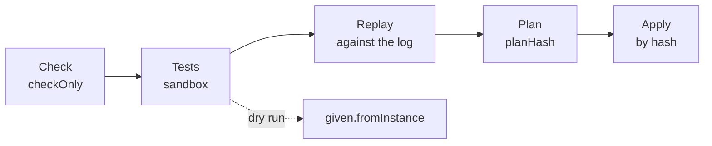

# Scenarios and the core plan

How the core verifies a package with processes: check findings, the format
of `tests/*.test.yaml` scenarios (process, rule, task type), stubs, coverage,
replay of a new version against the logs of live instances, dry runs, and the
core plan. This article is for package authors and installation
administrators; the whole test pyramid in one command is described in
[Package tests](../packages/testing.md), installation in [Installation and
release](../packages/install-and-release.md). Rationale: TAI-ADR-0054 item 8,
CP-ADR-0074 §10–11.



All steps before applying **write nothing**: the core transaction is
read-only, and the sandbox makes no outgoing calls.

## Check { #check }

Two stages:

1. **Form and references, locally**, without a deployment:
   `package-sdk check --package <package>` checks the files against the
   `sdk/package-sdk/schema/v1` schema and the references between the package's
   objects, and runs the core's domain validators (task types, rules, skills,
   agents).
2. **The language, by core code**: before the scenarios of `package-sdk test`
   (in the sandbox) and on `check --server`, by a
   `POST /api/v1/packages:test?checkOnly=true` request to the deployment's
   core. The core checks the types of
   all expressions, unknown data fields, step inputs and outputs against the
   data schema, skill inputs against their schemas, reachability of steps
   and stages, dead ends, references to task types, skills, calendars, and
   the identity agent, overlaps and gaps in decision tables, and
   `governedBy` regulations through the knowledge base.

```bash
package-sdk check --package packages/<package> \
    --server https://platform.example.com --json
```

Every finding is machine-readable, with the location in the file and a hint:

```json
{"code": "unknown_data_field", "severity": "error",
 "path": "/spec/stages/1/steps/0/output/as/decison",
 "file": "processes/purchase.yaml", "line": 42,
 "message": "data has no field decison", "hint": "did you mean decision?"}
```

| Group | Codes (examples) |
|---|---|
| form | `schema_violation`, `invalid_yaml`, `invalid_document`, `unresolved_install_variable`, `unresolved_data_ref` |
| expressions | `expression_syntax_error`, `expression_type_error`, `expression_too_complex` |
| data | `unknown_data_field`, `data_type_mismatch` |
| references | `unknown_skill`, `unknown_task_type`, `unknown_agent`, `unknown_calendar`, `unknown_decision_table`, `skill_input_missing` |
| structure | `duplicate_element_id`, `element_kind_changed`, `unreachable_step`, `unreachable_stage`, `dead_end` |
| decision tables | `invalid_table_cell`, `table_overlap`; warnings `table_gap`, `table_rule_unreachable` |
| deadlines | `sla_calendar_missing`, `sla_calendar_without_hours` (see [Deadlines and SLA](index.md#sla)) |
| warnings | `process_owner_missing`, `element_removed`, `unwritten_data_field`, `unreachable_milestone`, `governed_by_unknown_document`, `governed_by_unchecked` |

An error blocks tests and applying; warnings do not.

## Test format

A test is a package file `tests/<name>.test.yaml` following the schema
`sdk/package-sdk/schema/v1/test.schema.json`. One file is one scenario for one
object of the package. The `subject` field sets what is tested:

| `subject` | Object | How it runs | Format |
|---|---|---|---|
| `process` (the default; the field can be omitted) | the process `process: <key>` | the core's process engine in memory: virtual time, stubs | below on this page |
| `rule` | the work rule `rule: <key>` | the core's application code in a transaction that is rolled back; the input is `given.observation` or `given.event`, the steps are `expect` only | [Rules in a package](../packages/rules.md#tests) |
| `taskType` | the task type `taskType: <key>` | the same application code: a task of the type, a gate decision, completion, acceptance; steps `approve`, `verify`, `complete`, `expect` | [Work](../packages/work.md#tests) |

Rule and task type scenarios need an empty PostgreSQL database in the
sandbox (see [Package tests](../packages/testing.md#sandbox)); process
scenarios do not. The rest of the page describes the process scenario
format.

```yaml
# yaml-language-server: $schema=https://github.com/taimen-ai/package-sdk/raw/<tag>/schema/v1/test.schema.json
process: supplier-invoice
name: the invoice uploader does not approve its payment
given:
  clock: "2026-10-01T09:00:00+03:00"
  principals:                       # role → fictitious test principals
    accounting: [1a000000-0000-4000-8000-000000000001, 1a000000-0000-4000-8000-000000000002]
    finance-director: [1f000000-0000-4000-8000-000000000001]
mocks:
  skills:
    notify.send@1:
      - output: {notificationId: 0e000000-0000-4000-8000-000000000001, deliveries: []}
steps:
  - emit:
      observation: invoice.received
      by: 1a000000-0000-4000-8000-000000000001   # the author of the event, event.actorId
      payload:
        data: {invoice: "INV-1", supplier: "Supplier LLC", supplierInn: "7701234567",
               amount: 45000, currency: RUB, uploadedBy: 1a000000-0000-4000-8000-000000000001}
  - complete: {step: check-invoice, by: 1a000000-0000-4000-8000-000000000002, output: {verdict: ok}}
  - approve:
      step: approve-payment
      by: 1a000000-0000-4000-8000-000000000001
      decision: approve
      expectRefused: separation_of_duties_violation
  - approve: {step: approve-payment, by: 1a000000-0000-4000-8000-000000000002, decision: approve}
  - expect:
      stages: {approval: completed, payment: open}
      data: {approval: approved}
coverage: {minimum: 60}
```

`package-sdk init` writes the `$schema` line: the address of the schema of the SDK release whose tag it was installed from (in a working copy without a tag, a relative path to the installed SDK's schema).

### `given`: the initial state

| Field | What it sets |
|---|---|
| `clock` | the initial virtual time; without it, `2026-01-05T09:00:00Z`, so the test always gives the same answer |
| `data` | initial data: an explicit instance start with the key `test` without a start event |
| `stage` | start from this open stage |
| `principals` | role → fictitious test principals: who receives the role's tasks and who holds the role when voting |
| `calendar` | a calendar key instead of the process calendar |
| `settings` | the saved values of the [package settings](../packages/settings.md) at the start of the scenario; without it, the schema `default` values are in effect (see [Settings in scenarios](../packages/testing.md#settings)) |
| `fromInstance` | a dry run: the state is copied from a live instance (see [below](#dry-run)) |

### `mocks`: stubs { #mocks }

Skills, agents, and the knowledge base are stubs in a test. Responses are
taken in call order; after the last one, the last one repeats. `step` and
`when` (CEL over the call input) select a response for a specific step or
input.

```yaml
mocks:
  skills:
    docs.analyze@1:
      - output: {status: ok, summary: ok, risks: [], requirements: [], questions: [], stopFactors: []}
  agents:
    reviewer: [{output: {verdict: approve}}]
  recall:
    - step: recall-history
      when: input.anchors[0].key == '7700000001'
      output:
        nodes:
          - {kind: lesson, key: "lesson:purchase:0000000000025000007/1", text: The customer lowers the price at the rebidding round}
        edges: []
    - {output: {nodes: []}}           # for every other recall
```

| Response | Meaning |
|---|---|
| `output` | the response. A skill stub's output **is validated against the skill's output schema** from the catalog: if it does not match, the test fails rather than passes. A `recall` response is validated against the memory response form |
| `error: {type, status, detail}` | the skill responded with an error; for `recall`, a step timeout with this reason |
| `timeout: true` | no response: the step waits for its timeout |

A call without a matching stub stays unanswered, like a skill that has not
responded yet. A stub response arrives as the next input, after the current
one.

### `steps`: the scenario

| Step | What it does |
|---|---|
| `emit: {event or observation, source?, by?, payload}` | feeds an event the same way as the live loop: a start or correlation of open instances; `by` is the author of the event (`event.actorId`), without it there is no author |
| `advance: P3D` | moves virtual time forward; pending timers fire in order, each at its own moment |
| `advance: until:<id>` | moves time until the timer with this id (or the timer of this element) fires |
| `complete: {step, by, output, cancel?}` | completes the step's task on behalf of the executor or a role holder; `by` becomes the task's assignee, which is `task.assigneeId` in the step's `output.as`; `output` is validated against the step form and the task type's `fieldSchema`; `cancel: true` cancels it. The task is closed directly, past its type's gate: the `approvalSchema` outcomes are checked by a task type scenario |
| `approve: {step, by, decision, expectRefused?}` | a vote in an approval; `expectRefused` is the expected core refusal code: `separation_of_duties_violation`, `not_eligible` |
| `settings: {…}` | an administrator saves new values of the package settings as a whole: subsequent computations read them, decisions already made keep the values they read |
| `expect: {…}` | expectations (below) |

`expect` checks the state after the previous steps:

| Field | What is compared |
|---|---|
| `stages` | stage → `open`, `completed`, `skipped`, `not_started` |
| `milestones` | milestones reached |
| `tasks` | tasks: `step`, `status`, `assignee` (the executor or `role:<slug>`), `due` |
| `timers` | timers: `id`, `at`, `provisional` |
| `data` | a data path (`a.b` or `/a/b`) → value |
| `sla` | deadline state: step id → the state of its open attempt, the `process` key is the process deadline (`spec.due`); values `ok`, `warning`, `breached`, `paused` (see [below](#sla)) |
| `events` | `process.*` event types that occurred since the previous `expect` (extra ones do not matter), including the step events `process.step_*` and deadline events `process.sla_*` |
| `memory` | `recalled` for `recall` steps, `remembered` for `remember` writes (partial match) |
| `status`, `outcome`, `error` | instance status, outcome, error type |
| `noSideEffects: true` | the run made no writes to the database |

A step that cannot be performed (no task, a vote unexpectedly refused)
stops the test; an unmet expectation fails the step, but the test continues
and shows `expected` and `actual`.

### Deadlines in tests { #sla }

A test computes SLA deadlines with the same computation as a live run: from
the test clock (`given.clock`, `advance`) and by the calendar from the package
(or `given.calendar`). So weekends, holidays, short days, and suspension are
taken into account in a test exactly as on a deployment.

The process step `review` declares `due: {workdays: 2, warnBefore: {workhours: 4}}`,
and the calendar has working hours 09:00–18:00:

```yaml
given:
  clock: "2026-10-02T09:00:00+03:00"   # Friday
steps:
  - emit: {observation: request.received, payload: {data: {…}}}
  - expect:
      sla: {review: ok}                # due Tuesday 09:00, warning at Monday 14:00
      events: [process.started, process.step_entered]
  - advance: P3D                       # Monday 09:00: the weekend does not count
  - expect:
      sla: {review: ok}
  - advance: PT6H                      # Monday 15:00
  - expect:
      sla: {review: warning}
      events: [process.sla_warning]
  - advance: P1D                       # Tuesday 15:00
  - expect:
      sla: {review: breached}
      events: [process.sla_breached]
  - complete: {step: review, by: 1a000000-0000-4000-8000-000000000001, output: {verdict: ok}}
  - expect:
      events: [process.step_exited]  # step_exited with breached: true
```

- `expect.sla` takes the state from the instance projection (see [Deadline
  state in an instance](index.md#sla-state)). A step without a deadline is not
  written in `expect.sla`: its state is `none`.
- A mismatch names the step, the expected state, and the actual one.
- `expect.events` checks that each listed event occurred since the previous
  `expect`; extra events do not matter. So step events do not break existing
  tests, and new ones can wait for `process.step_entered` and
  `process.step_exited` at every waiting step.

### Coverage

The run computes coverage across all tests of a process together and lists
what was not exercised:

| Counter | What is counted |
|---|---|
| `elements` | stages, steps, milestones, timers |
| `transitions` | stage entry and exit, step `when`/`skip`, `listen` branches and timeouts, `recall` responses and timeouts, `approved`/`rejected`, `fork` branches, `correlate`, `onEvent` |
| `decisionRows` | decision table rows |
| `handlers` | `catch`, `retry`, `onTimeout`, `onCompensate`, escalation levels, `onDue` |

A test's `coverage.minimum` is the threshold, in percent, for the share of
process elements that this test exercises.

## How to run

=== "Sandbox (`package-sdk test`)"

    ```bash
    package-sdk test <package> [--test <name or file>] [--database-url <url>] [--json]
    ```

    The core code of the version installed next to the tool (the `sandbox`
    extra), in-process, without a deployment. The catalog contains only the
    package's objects and its `requires`; `governedBy` is not checked against
    the knowledge base; `${…}` variables are taken from `--env` (`.env` by
    default) and the environment. Scenarios are the last level of the
    pyramid: they are preceded by the check, skill contracts, and integration
    code tests (see [Package tests](../packages/testing.md)). To run only the
    scenario level without the others, use `package-sdk sandbox <package>`;
    without arguments, it runs all packages with tests.

=== "Deployment core (`package-sdk test --server`)"

    ```bash
    CP_TOKEN=<access token audience control-plane> \
    package-sdk test <package> \
        --server https://platform.example.com [--test <name or file>] [--workspace <workspace-id>]
    ```

    The package goes to `POST /api/v1/packages:test` (the `packages.test`
    permission). The core assembles the package's definitions in memory on
    top of the tenant's catalog, so the package's own objects (task types,
    skills, agents, calendars) are known to its processes before applying.
    `--workspace` sets whose roles, calendars, and instances the run reads
    (it needs `processes.read` on it).

=== "From Claude Code"

    The tool `pkg_test(path | install, tests?, server?, workspace_id?, env_file?)`
    of the `package-sdk mcp` MCP server runs the same pyramid as
    `package-sdk test` and returns its report as a document. See [Package
    author in Claude Code](../packages/author-plugin.md).

Output:

```text
== supplier-invoice (in-process core sandbox, 136 ms)
ok   tests/above-threshold.test.yaml: an invoice above the threshold is approved by the finance director [supplier-invoice] (13 ms)
ok   tests/escalation.test.yaml: an overdue approval is escalated [supplier-invoice] (7 ms)
ok   tests/separation-of-duties.test.yaml: the invoice uploader does not approve its payment [supplier-invoice] (7 ms)
…
coverage supplier-invoice v1: elements 13/13, transitions 12/12, decisionRows 2/2, handlers 2/2
ok (passed): tests 7, green 7
```

A failed test prints as `FAIL <file>: <name>` with the lines
`step N: <message>` and `expected: …; actual: …`; unexercised coverage
prints as `not exercised (<counter>): …` lines. The core's response has
`status` `passed`, `failed`, or `invalid` (there is an error finding, and
the tests did not run).

## Replay against the log

Replay runs a **candidate** (a new version of the process) against the logs
of real instances and shows where its decisions would diverge from the
recorded ones:

```bash
curl -sS -X POST "https://platform.example.com/api/v1/process-definitions/supplier-invoice:replay" \
  -H "Authorization: Bearer $TOKEN" -H "Content-Type: application/json" \
  -d '{"spec": { … }, "limit": 50}'
```

- Instances are `instanceIds` or the last `limit` (50 by default, at most
  200) instances of the current version from the workspaces where the caller
  has `processes.read`. The `packages.test` permission is also required.
- The candidate runs under the instance's version number: a version number
  is not behavior.
- Knowledge base responses to `recall` and calendar versions are taken from
  the log; memory is not called.
- An instance has one discrepancy, the first one: `journalSeq`, `kind`
  (`decision`, `intent`, `input`, `data`, `timer`, `state`), `element`,
  `recorded`, and `replayed`. After that the paths diverge, and there is
  nothing to compare.
- Replaying the current version on its own log gives zero discrepancies; a
  changed decision table row gives a `decision` discrepancy exactly for the
  instances whose inputs it decides differently.

## Dry run on a live instance { #dry-run }

A test with the scenario `given.fromInstance: <instance id>` continues a
**copy** of a live instance's state on the process version from the
package:

```yaml
process: supplier-invoice
name: dry run — what happens to this invoice under the new version
given: {fromInstance: <instance-id>}
steps:
  - approve: {step: approve-payment, by: <principal-id>, decision: approve}
  - expect: {stages: {payment: open}}
```

The instance's open tasks and approvals become sandbox objects; pending
skill calls and `recall` stay unanswered. The clock is `given.clock` or the
time of the instance's last input. The live instance does not change; you
need `processes.read` on its workspace. `given.data` is incompatible with
`fromInstance`. A dry run works only through the core: the local sandbox
has no live instances.

## Plan and apply { #plan }

The core builds the plan of a package with processes or calendars:
`POST /api/v1/packages:plan` (the `packages.plan` permission). For such a
package the core itself plans and installs task types, agents, calendars,
processes, and work rules; this response is the `core` section of the single
installation plan built by `package-sdk plan` (see [Installation and
release](../packages/install-and-release.md#plan)).

```bash
package-sdk plan --install installation.yaml \
    --server https://platform.example.com --out plan.json [--workspace <workspace-id>] [--replay-limit 50]
package-sdk apply --plan plan.json --server https://platform.example.com
```

Sample output (abridged):

```text
plan supplier-invoice 0.3.0: sha256:3f… (catalog sha256:9a…)
  ~ Process/supplier-invoice: /spec/stages; /spec/version
process supplier-invoice: v1 → v2
  behavior (replay): instances 12, discrepancies 2: <instance-id>, <instance-id>
  open instances v1: 3 → migrate
regulation regulation:payments: sections with elements 4, without elements: 5.1
```

| Plan section | What it shows |
|---|---|
| `changes` | a structural diff by object: `create` (`+`), `update` (`~`), `rename` (`→`), `unchanged`; for a field, the old value, the new value, and the owner: `package` or `console` |
| `processes[].behaviour` | replay of the new version on `replayLimit` recent instances: how many would decide differently |
| `processes[].instances` | the fate of open instances by version: `pin`, `migrate`, `unaffected`; `migrationRequired` |
| `deadlines`, `deadlinesTotal` | instances whose deadline the migration changes, adds, or removes, and those whose deadline under the new rule has already passed: `instanceId`, `element`, `previousDueAt`, `dueAt`, `breached`; a capped list, the full count is `deadlinesTotal` |
| `regulationCoverage` | regulation sections and the elements that carry them out; uncovered sections |
| `problems` | check findings |
| `planHash`, `catalogEtag` | the plan hash and the fingerprint of the catalog it was built on |

- **A field that a person edited in the console** after the last apply is
  owned by `console`. The package does not overwrite it: the published
  version takes the value from the console. To overwrite, use a plan with
  `overwriteConsole: true` (`package-sdk plan --overwrite-console`; the flag
  is part of the plan hash, see
  [Console edits](../packages/install-and-release.md#overwrite-console)).
- **Applying means applying exactly the plan shown.**
  `POST /packages:apply {package, planHash}` rebuilds the plan under a lock
  and compares the hashes: if the deployment, open instances, or files
  changed after the plan was shown, you get `409 plan_stale` and need a new
  plan. `package-sdk` does not apply a plan file that was modified after it
  was built.
- **Deadlines on migration** are computed by the plan on a copy of the state
  with the same step as applying, and nothing is written to the database: the
  `deadlines` section matches what applying will do (see [Versions and
  migrations](index.md#versions)). The `plan` output prints the section under
  the process: a `сроки: экземпляров N` ("deadlines: N instances") line and one
  line per instance, `<instance-id>, шаг <id>: before → after` (for the deadline
  of the whole case, `всё дело` ("the whole case"); a removed deadline is `снят`
  ("removed"); marked `уже просрочен` ("already breached") where applicable).
  The core returns a capped list and the full count in `deadlinesTotal`; when
  the list is cut, the header says `показано N из M` ("shown N of M"). With
  `--json`, the section comes as is. A plan with no deadline changes prints no
  section.
- **Open instances on a removed element** without a migration map are a
  `migration_required` plan error; such a plan is not saved, and applying
  refuses with `422 migration_required`. Other errors give
  `422 invalid_package`.
- Applying is one transaction: calendars, processes, moving instances per
  `migrate` with a `process.migrated` event, retiring a renamed key. Each
  change passes the permission of its kind (`processes.write`,
  `calendars.write`).

### Renames and migrations

- **A whole object**: `renames` in `package.yaml`:

  ```yaml
  spec:
    version: 0.4.0
    renames:
      - {kind: Process, from: invoice-intake, to: supplier-invoice}
  ```

  The plan shows `rename`, the object moves with its version history, and
  the old key is retired: it does not start new instances
  (`409 process_retired`), and its open instances run to completion. The
  command
  `package-sdk edit rename --package <directory> --kind Process --from <key> --to <key>`
  renames the file and adds `renames` itself.
- **A process element**: the `migrations` map of the new version
  (see [Processes](index.md#versions)). The command
  `package-sdk edit rename --file <process> --from <id> --to <id>` changes the
  id, the references, and the tests and adds the map.

## Common problems

| Symptom | Cause | What to do |
|---|---|---|
| a test fails on a skill stub | the stub output does not pass the skill's output schema | bring `output` in line with the skill contract; this is by design |
| the step's task did not appear in the test, `intent_failed unknown_role` | the role has no holders in `given.principals` and is not declared in the package | add the role to `given.principals` or the package |
| `recall` in a test times out | there is no `mocks.recall` stub for the step | add a response (a generic one without `step` works) |
| `status: invalid`, the tests did not run | an error finding from the check | fix it using `file`, `line`, `hint` |
| `plan_stale` when applying | the catalog, instances, or files changed after the plan | build the plan again |
| "the core does not support process checks … only the schema was checked" | the core has no process package routes | upgrade Control Plane or run `package-sdk sandbox` |

## See also

- [Processes](index.md)
- [Expressions](expressions.md)
- [Package tests](../packages/testing.md): the pyramid in one command
- [Installation and release](../packages/install-and-release.md)
- [Package author in Claude Code](../packages/author-plugin.md)
- [Package schema](../reference/package-schema.md#schema-test)
- [Catalog packages](../control-plane/catalog-packages.md#processes)
