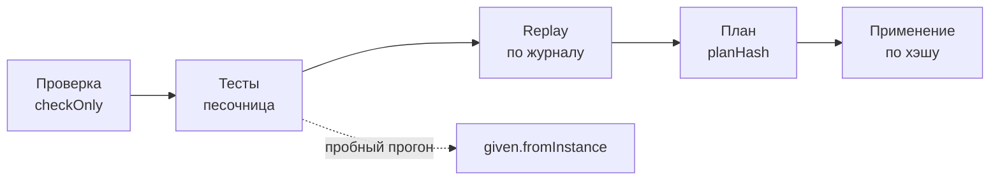

# Сценарии и план ядра

Как ядро проверяет пакет с процессами: находки проверки, формат сценариев
`tests/*.test.yaml` (процесс, правило, тип задачи), заглушки, покрытие, replay
новой версии по журналам живых экземпляров, пробный прогон и план ядра. Статья
для авторов пакетов и администраторов инсталляции; пирамида тестов одной
командой — в [Тестах пакета](../packages/testing.md), установка — в [Установке и
выпуске](../packages/install-and-release.md). Обоснование — TAI-ADR-0054 п.8,
CP-ADR-0074 §10–11.



Все шаги до применения **ничего не пишут**: транзакция ядра — только на
чтение, исходящих вызовов у песочницы нет.

## Проверка { #check }

Две ступени:

1. **Форма и ссылки — локально**, без стенда:
   `package-sdk check --package <пакет>` сверяет файлы со схемой
   `sdk/package-sdk/schema/v1`, ссылки между объектами пакета и прогоняет
   доменные валидаторы ядра (типы задач, правила, скиллы, агенты).
2. **Язык — кодом ядра**: перед сценариями `package-sdk test` (в песочнице)
   и по `check --server` — запросом
   `POST /api/v1/packages:test?checkOnly=true` к ядру стенда. Ядро проверяет типы всех
   выражений, неизвестные поля данных, входы и выходы шагов против схемы
   данных, входы скиллов по их схемам, достижимость шагов и стадий, тупики,
   ссылки на типы задач, скиллы, календари и агента-личность, перекрытия и
   пробелы таблиц решений, а также регламенты `governedBy` через базу знаний.

```bash
package-sdk check --package packages/<пакет> \
    --server https://platform.example.com --json
```

Каждая находка — машиночитаемая, с местом в файле и подсказкой:

```json
{"code": "unknown_data_field", "severity": "error",
 "path": "/spec/stages/1/steps/0/output/as/decison",
 "file": "processes/purchase.yaml", "line": 42,
 "message": "data has no field decison", "hint": "did you mean decision?"}
```

| Группа | Коды (примеры) |
|---|---|
| форма | `schema_violation`, `invalid_yaml`, `invalid_document`, `unresolved_install_variable`, `unresolved_data_ref` |
| выражения | `expression_syntax_error`, `expression_type_error`, `expression_too_complex` |
| данные | `unknown_data_field`, `data_type_mismatch` |
| ссылки | `unknown_skill`, `unknown_task_type`, `unknown_agent`, `unknown_calendar`, `unknown_decision_table`, `skill_input_missing` |
| структура | `duplicate_element_id`, `element_kind_changed`, `unreachable_step`, `unreachable_stage`, `dead_end` |
| таблицы решений | `invalid_table_cell`, `table_overlap`; предупреждения `table_gap`, `table_rule_unreachable` |
| сроки | `sla_calendar_missing`, `sla_calendar_without_hours` (см. [Сроки и SLA](index.md#sla)) |
| предупреждения | `process_owner_missing`, `element_removed`, `unwritten_data_field`, `unreachable_milestone`, `governed_by_unknown_document`, `governed_by_unchecked` |

Ошибка блокирует тесты и применение; предупреждения — нет.

## Формат теста

Тест — файл `tests/<имя>.test.yaml` пакета по схеме
`sdk/package-sdk/schema/v1/test.schema.json`. Один файл — один сценарий одного
объекта пакета. Что проверяется, задаёт поле `subject`:

| `subject` | Объект | Как исполняется | Формат |
|---|---|---|---|
| `process` (по умолчанию, поле можно опустить) | процесс `process: <ключ>` | движок процессов ядра в памяти: виртуальное время, заглушки | ниже на этой странице |
| `rule` | правило вывода работы `rule: <ключ>` | прикладной код ядра в транзакции, которая откатывается; вход — `given.observation` или `given.event`, шаги — только `expect` | [Правила в пакете](../packages/rules.md#tests) |
| `taskType` | тип задачи `taskType: <ключ>` | тот же прикладной код: задача типа, решение гейта, завершение, приёмка; шаги `approve`, `verify`, `complete`, `expect` | [Работа](../packages/work.md#tests) |

Сценариям правил и типов задач в песочнице нужна пустая база PostgreSQL
(см. [Тесты пакета](../packages/testing.md#sandbox)); сценариям процессов — нет.
Дальше на странице — формат сценария процесса.

```yaml
# yaml-language-server: $schema=https://github.com/taimen-ai/package-sdk/raw/<тег>/schema/v1/test.schema.json
process: supplier-invoice
name: загрузивший счёт не согласует его оплату
given:
  clock: "2026-10-01T09:00:00+03:00"
  principals:                       # роль → вымышленные principal'ы теста
    accounting: [1a000000-0000-4000-8000-000000000001, 1a000000-0000-4000-8000-000000000002]
    finance-director: [1f000000-0000-4000-8000-000000000001]
mocks:
  skills:
    notify.send@1:
      - output: {notificationId: 0e000000-0000-4000-8000-000000000001, deliveries: []}
steps:
  - emit:
      observation: invoice.received
      by: 1a000000-0000-4000-8000-000000000001   # автор события — event.actorId
      payload:
        data: {invoice: "СЧ-1", supplier: "ООО «Поставщик»", supplierInn: "7701234567",
               amount: 45000, currency: RUB, uploadedBy: 1a000000-0000-4000-8000-000000000001}
  - complete: {step: check-invoice, by: 1a000000-0000-4000-8000-000000000002, output: {verdict: ok}}
  - approve:
      step: approve-payment
      by: 1a000000-0000-4000-8000-000000000001
      decision: approve
      expectRefused: separation_of_duties_violation
  - approve: {step: approve-payment, by: 1a000000-0000-4000-8000-000000000002, decision: approve}
  - expect:
      stages: {approval: completed, payment: open}
      data: {approval: approved}
coverage: {minimum: 60}
```

Строку `$schema` пишет `package-sdk init`: адрес схемы того выпуска SDK, с тега которого он поставлен (в рабочей копии без тега — относительный путь к схеме установленного SDK).

### `given` — начальное состояние

| Поле | Что задаёт |
|---|---|
| `clock` | начальное виртуальное время; без него — `2026-01-05T09:00:00Z`, чтобы тест всегда давал один ответ |
| `data` | начальные данные: явный старт экземпляра с ключом `test` без события старта |
| `stage` | начать с этой открытой стадии |
| `principals` | роль → вымышленные principal'ы теста: кому назначаются задачи роли и кто держит роль при голосовании |
| `calendar` | ключ календаря вместо календаря процесса |
| `settings` | сохранённые значения [настроек пакета](../packages/settings.md) на начало сценария; без него действуют `default` схемы (см. [Настройки в сценариях](../packages/testing.md#settings)) |
| `fromInstance` | пробный прогон: состояние копируется из живого экземпляра (см. [ниже](#dry-run)) |

### `mocks` — заглушки { #mocks }

Скиллы, агенты и база знаний в тесте — заглушки. Ответы берутся по порядку
вызовов; после последнего повторяется последний. `step` и `when` (CEL над
входом вызова) выбирают ответ для конкретного шага или входа.

```yaml
mocks:
  skills:
    docs.analyze@1:
      - output: {status: ok, summary: ok, risks: [], requirements: [], questions: [], stopFactors: []}
  agents:
    reviewer: [{output: {verdict: approve}}]
  recall:
    - step: recall-history
      when: input.anchors[0].key == '7700000001'
      output:
        nodes:
          - {kind: lesson, key: "lesson:purchase:0000000000025000007/1", text: Заказчик снижает цену на переторжке}
        edges: []
    - {output: {nodes: []}}           # всем остальным recall
```

| Ответ | Что значит |
|---|---|
| `output` | ответ. Выход заглушки скилла **сверяется со схемой выхода скилла** из каталога: не по схеме — тест падает, а не проходит. Ответ `recall` сверяется с формой ответа памяти |
| `error: {type, status, detail}` | скилл ответил ошибкой; у `recall` — таймаут шага с этой причиной |
| `timeout: true` | ответа нет — шаг ждёт своего таймаута |

Вызов без подходящей заглушки остаётся без ответа, как скилл, который ещё не
ответил. Ответ заглушки приходит следующим входом, после текущего.

### `steps` — сценарий

| Шаг | Что делает |
|---|---|
| `emit: {event или observation, source?, by?, payload}` | подаёт событие так же, как живой цикл: старт или корреляция открытых экземпляров; `by` — автор события (`event.actorId`), без него автора нет |
| `advance: P3D` | сдвигает виртуальное время; ожидающие таймеры срабатывают по порядку, каждый в свой момент |
| `advance: until:<id>` | двигает время до срабатывания таймера с этим id (или таймера этого элемента) |
| `complete: {step, by, output, cancel?}` | завершает задачу шага от имени исполнителя или держателя роли; `by` становится исполнителем задачи — это `task.assigneeId` в `output.as` шага; `output` сверяется с формой шага и `fieldSchema` типа задачи; `cancel: true` — отмена. Задача закрывается напрямую, мимо гейта её типа: исходы `approvalSchema` проверяет сценарий типа задачи |
| `approve: {step, by, decision, expectRefused?}` | голос в согласовании; `expectRefused` — ожидаемый код отказа ядра: `separation_of_duties_violation`, `not_eligible` |
| `settings: {…}` | администратор сохраняет новые значения настроек пакета целиком: следующие вычисления читают их, принятые решения остаются при прочитанных |
| `expect: {…}` | ожидания (ниже) |

`expect` проверяет состояние после предыдущих шагов:

| Поле | Что сравнивается |
|---|---|
| `stages` | стадия → `open`, `completed`, `skipped`, `not_started` |
| `milestones` | достигнутые вехи |
| `tasks` | задачи: `step`, `status`, `assignee` (исполнитель или `role:<slug>`), `due` |
| `timers` | таймеры: `id`, `at`, `provisional` |
| `data` | путь в данных (`a.b` или `/a/b`) → значение |
| `sla` | состояние срока: id шага → состояние его открытой попытки, ключ `process` — срок процесса (`spec.due`); значения `ok`, `warning`, `breached`, `paused` (см. [ниже](#sla)) |
| `events` | типы событий `process.*`, которые были с прошлого `expect` (лишние не мешают), в том числе события шагов `process.step_*` и сроков `process.sla_*` |
| `memory` | `recalled` — шаги `recall`, `remembered` — записи `remember` (частичное совпадение) |
| `status`, `outcome`, `error` | статус экземпляра, исход, тип ошибки |
| `noSideEffects: true` | прогон не сделал ни одной записи в базу |

Невыполнимый шаг (задачи нет, голос неожиданно отвергнут) останавливает тест;
несбывшееся ожидание — провал шага, но тест идёт дальше и показывает
`expected` и `actual`.

### Сроки в тестах { #sla }

Сроки SLA тест считает тем же вычислением, что живой прогон: от часов теста
(`given.clock`, `advance`) и по календарю из пакета (или `given.calendar`).
Поэтому выходные, праздники, сокращённые дни и приостановка в тесте
учитываются так же, как на стенде.

Шаг `review` процесса объявляет `due: {workdays: 2, warnBefore: {workhours: 4}}`,
календарь — рабочие часы 09:00–18:00:

```yaml
given:
  clock: "2026-10-02T09:00:00+03:00"   # пятница
steps:
  - emit: {observation: request.received, payload: {data: {…}}}
  - expect:
      sla: {review: ok}                # срок — вторник 09:00, порог — понедельник 14:00
      events: [process.started, process.step_entered]
  - advance: P3D                       # понедельник 09:00: выходные не считаются
  - expect:
      sla: {review: ok}
  - advance: PT6H                      # понедельник 15:00
  - expect:
      sla: {review: warning}
      events: [process.sla_warning]
  - advance: P1D                       # вторник 15:00
  - expect:
      sla: {review: breached}
      events: [process.sla_breached]
  - complete: {step: review, by: 1a000000-0000-4000-8000-000000000001, output: {verdict: ok}}
  - expect:
      events: [process.step_exited]  # step_exited с breached: true
```

- `expect.sla` берёт состояние из проекции экземпляра (см. [Состояние срока
  в экземпляре](index.md#sla-state)). Шаг без срока в `expect.sla` не пишут:
  его состояние `none`.
- Несовпадение называет шаг, ожидаемое и фактическое состояние.
- `expect.events` проверяет, что каждое перечисленное событие было с
  прошлого `expect`; лишние события не мешают. Поэтому события шагов
  прежние тесты не ломают, а новые могут ждать `process.step_entered` и
  `process.step_exited` у каждого ожидающего шага.

### Покрытие

Прогон считает покрытие по всем тестам процесса вместе и перечисляет
непройденное:

| Счётчик | Что считается |
|---|---|
| `elements` | стадии, шаги, вехи, таймеры |
| `transitions` | вход и выход стадий, `when`/`skip` шагов, ветви `listen` и таймауты, ответы и таймауты `recall`, `approved`/`rejected`, ветви `fork`, `correlate`, `onEvent` |
| `decisionRows` | строки таблиц решений |
| `handlers` | `catch`, `retry`, `onTimeout`, `onCompensate`, уровни эскалаций, `onDue` |

`coverage.minimum` теста — порог доли элементов процесса, которые проходит
этот тест, в процентах.

## Как запускать

=== "Песочница (`package-sdk test`)"

    ```bash
    package-sdk test <пакет> [--test <имя или файл>] [--database-url <адрес>] [--json]
    ```

    Код ядра той версии, что стоит рядом с инструментом (дополнение
    `sandbox`), в процессе, без стенда. Каталог — только объекты пакета и его
    `requires`; `governedBy` с базой знаний не сверяется; переменные `${…}`
    берутся из `--env` (по умолчанию `.env`) и окружения. Сценарии —
    последняя ступень пирамиды: перед ними идут проверка, контракты скиллов и
    тесты кода интеграции (см. [Тесты пакета](../packages/testing.md)). Только
    ступень сценариев без остальных — `package-sdk sandbox <пакет>`; без
    аргументов — все пакеты с тестами.

=== "Ядро стенда (`package-sdk test --server`)"

    ```bash
    CP_TOKEN=<access token audience control-plane> \
    package-sdk test <пакет> \
        --server https://platform.example.com [--test <имя или файл>] [--workspace <workspace-id>]
    ```

    Пакет уходит в `POST /api/v1/packages:test` (право `packages.test`).
    Ядро собирает определения пакета в памяти поверх каталога tenant'а —
    объекты самого пакета (типы задач, скиллы, агенты, календари) известны
    его процессам до применения. `--workspace` — чьи роли, календари и
    экземпляры читает прогон (нужно `processes.read` на него).

=== "Из Claude Code"

    Инструмент `pkg_test(path | install, tests?, server?, workspace_id?, env_file?)`
    MCP-сервера `package-sdk mcp` — та же пирамида, что `package-sdk test`,
    ответ — её отчёт документом. См. [Автор пакетов в Claude
    Code](../packages/author-plugin.md).

Вывод:

```text
== supplier-invoice (песочница ядра в процессе, 136 мс)
ok   tests/above-threshold.test.yaml: счёт выше порога согласует финансовый директор [supplier-invoice] (13 мс)
ok   tests/escalation.test.yaml: просроченное согласование эскалируется [supplier-invoice] (7 мс)
ok   tests/separation-of-duties.test.yaml: загрузивший счёт не согласует его оплату [supplier-invoice] (7 мс)
…
покрытие supplier-invoice v1: elements 13/13, transitions 12/12, decisionRows 2/2, handlers 2/2
ok (passed): тестов 7, зелёных 7
```

Упавший тест печатается как `FAIL <файл>: <имя>` со строками
`шаг N: <сообщение>` и `ожидалось: …; получено: …`; непройденное покрытие —
строками `не пройдены (<счётчик>): …`. Ответ ядра — `status` `passed`,
`failed` или `invalid` (есть находка-ошибка, тесты не запускались).

## Replay по журналу

Replay прогоняет **кандидата** — новую версию процесса — по журналам
реальных экземпляров и показывает, где решения разошлись бы с записанными:

```bash
curl -sS -X POST "https://platform.example.com/api/v1/process-definitions/supplier-invoice:replay" \
  -H "Authorization: Bearer $TOKEN" -H "Content-Type: application/json" \
  -d '{"spec": { … }, "limit": 50}'
```

- Экземпляры — `instanceIds` или последние `limit` (по умолчанию 50, не
  больше 200) экземпляров текущей версии из workspace'ов, где у вызывающего
  есть `processes.read`. Нужно ещё право `packages.test`.
- Кандидат идёт под номером версии экземпляра: номер версии — не поведение.
- Ответы базы знаний на `recall` и версии календарей берутся из журнала —
  память не зовётся.
- Расхождение у экземпляра одно, первое: `journalSeq`, `kind` (`decision`,
  `intent`, `input`, `data`, `timer`, `state`), `element`, `recorded` и
  `replayed`. Дальше пути разошлись, и сравнивать нечего.
- Replay текущей версии на её же журнале даёт ноль расхождений; изменённая
  строка таблицы решений даёт расхождение `decision` ровно у тех экземпляров,
  чьи входы она решает иначе.

## Пробный прогон на живом экземпляре { #dry-run }

Тест со сценарием `given.fromInstance: <id экземпляра>` продолжает **копию**
состояния живого экземпляра на версии процесса из пакета:

```yaml
process: supplier-invoice
name: пробный прогон — что будет с этим счётом по новой версии
given: {fromInstance: <instance-id>}
steps:
  - approve: {step: approve-payment, by: <principal-id>, decision: approve}
  - expect: {stages: {payment: open}}
```

Открытые задачи и approvals экземпляра становятся объектами песочницы,
ожидающие вызовы скиллов и `recall` остаются без ответа. Часы — `given.clock`
или время последнего входа экземпляра. Живой экземпляр не меняется; нужно
`processes.read` на его workspace. `given.data` рядом с `fromInstance`
несовместим. Пробный прогон работает только через ядро — у локальной
песочницы живых экземпляров нет.

## План и применение { #plan }

План пакета с процессами или календарями строит ядро:
`POST /api/v1/packages:plan` (право `packages.plan`). У такого пакета ядро само
планирует и ставит типы задач, агентов, календари, процессы и правила вывода
работы; этот ответ — секция `core` единого плана установки, который строит
`package-sdk plan` (см. [Установку и выпуск](../packages/install-and-release.md#plan)).

```bash
package-sdk plan --install installation.yaml \
    --server https://platform.example.com --out plan.json [--workspace <workspace-id>] [--replay-limit 50]
package-sdk apply --plan plan.json --server https://platform.example.com
```

Пример вывода (сокращён):

```text
план supplier-invoice 0.3.0: sha256:3f… (каталог sha256:9a…)
  ~ Process/supplier-invoice: /spec/stages; /spec/version
процесс supplier-invoice: v1 → v2
  поведение (replay): экземпляров 12, расхождений 2: <instance-id>, <instance-id>
  открытые экземпляры v1: 3 → migrate
регламент regulation:payments: разделов с элементами 4, без элементов: 5.1
```

| Раздел плана | Что показывает |
|---|---|
| `changes` | структурный diff по объектам: `create` (`+`), `update` (`~`), `rename` (`→`), `unchanged`; у поля — было, стало и владелец: `package` или `console` |
| `processes[].behaviour` | replay новой версии на `replayLimit` недавних экземплярах: сколько решили бы иначе |
| `processes[].instances` | судьба открытых экземпляров по версиям: `pin`, `migrate`, `unaffected`; `migrationRequired` |
| `deadlines`, `deadlinesTotal` | экземпляры, у которых миграция меняет, добавляет или снимает срок, и те, у кого срок по новому правилу уже прошёл: `instanceId`, `element`, `previousDueAt`, `dueAt`, `breached`; список с потолком, полное число — `deadlinesTotal` |
| `regulationCoverage` | разделы регламентов и элементы, которые их исполняют; непокрытые разделы |
| `problems` | находки проверки |
| `planHash`, `catalogEtag` | хэш плана и отпечаток каталога, на котором он построен |

- **Поле, которое правил человек в консоли** после последнего применения, —
  владелец `console`. Пакет его не перетирает: публикуемая версия берёт
  значение из консоли. Перетереть — план с `overwriteConsole: true`
  (`package-sdk plan --overwrite-console`; флаг входит в хэш плана, см.
  [Правки консоли](../packages/install-and-release.md#overwrite-console)).
- **Применение — ровно показанный план.** `POST /packages:apply {package,
  planHash}` строит план заново под блокировкой и сравнивает хэши: стенд,
  открытые экземпляры или файлы изменились после показа — `409 plan_stale`,
  нужен новый план. Файл плана, изменённый после построения, `package-sdk`
  не применяет.
- **Сроки при миграции** план считает на копии состояния тем же шагом, что
  применение, и ничего не пишет в базу: раздел `deadlines` совпадает с тем,
  что сделает применение (см. [Версии и миграции](index.md#versions)).
  В выводе `plan` раздел печатается под процессом: строка `сроки: экземпляров N`
  и по строке на экземпляр — `<instance-id>, шаг <id>: было → стало` (у срока
  всего дела — `всё дело`, снятый срок — `снят`, с пометкой «уже просрочен»).
  Ядро отдаёт список с потолком, а полное число — в `deadlinesTotal`; при
  усечении заголовок говорит «показано N из M». С `--json` раздел приходит как
  есть. План без изменений сроков раздела не печатает.
- **Открытые экземпляры на удалённом элементе** без карты миграции — ошибка
  плана `migration_required`; такой план не сохраняется, а применение
  отказывает `422 migration_required`. Прочие ошибки — `422 invalid_package`.
- Применение — одна транзакция: календари, процессы, перенос экземпляров по
  `migrate` с событием `process.migrated`, вывод переименованного ключа.
  Каждое изменение проходит право своего вида (`processes.write`,
  `calendars.write`).

### Переименования и миграции

- **Объект целиком** — `renames` в `package.yaml`:

  ```yaml
  spec:
    version: 0.4.0
    renames:
      - {kind: Process, from: invoice-intake, to: supplier-invoice}
  ```

  План показывает `rename`, объект переносится с историей версий, а старый
  ключ выводится: новых экземпляров не заводит (`409 process_retired`), его
  открытые экземпляры дорабатывают. Команда
  `package-sdk edit rename --package <каталог> --kind Process --from <ключ> --to <ключ>`
  переименует файл и допишет `renames` сама.
- **Элемент процесса** — карта `migrations` новой версии
  (см. [Процессы](index.md#versions)). Команда
  `package-sdk edit rename --file <процесс> --from <id> --to <id>` меняет id,
  ссылки и тесты и дописывает карту.

## Типичные проблемы

| Симптом | Причина | Что делать |
|---|---|---|
| тест падает на заглушке скилла | выход заглушки не проходит схему выхода скилла | привести `output` к контракту скилла — так и задумано |
| задача шага в тесте не появилась, `intent_failed unknown_role` | у роли нет держателей в `given.principals` и она не объявлена в пакете | добавить роль в `given.principals` или пакет |
| `recall` в тесте уходит в таймаут | нет заглушки `mocks.recall` для шага | добавить ответ (можно общий, без `step`) |
| `status: invalid`, тесты не запускались | находка-ошибка проверки | исправить по `file`, `line`, `hint` |
| `plan_stale` при применении | после плана изменились каталог, экземпляры или файлы | построить план заново |
| «ядро не поддерживает проверку процессов … — проверена только схема» | у ядра нет маршрутов пакетов процессов | обновить Control Plane или запускать `package-sdk sandbox` |

## См. также

- [Процессы](index.md)
- [Выражения](expressions.md)
- [Тесты пакета](../packages/testing.md) — пирамида одной командой
- [Установка и выпуск](../packages/install-and-release.md)
- [Автор пакетов в Claude Code](../packages/author-plugin.md)
- [Схема пакета](../reference/package-schema.md#schema-test)
- [Пакеты каталога](../control-plane/catalog-packages.md#processes)
