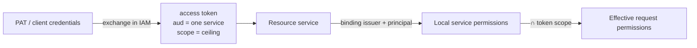

# Permissions and scopes

Authorization reference: Control Plane permissions, roles, IAM audiences and
scopes of all services, the rule that intersects permissions with the token
scope, and which permissions and ceilings `make bootstrap` grants. This page
is for a tenant administrator and for an engineer who sets up agents and
services.

## Two layers: identity and domain permissions

- **IAM** authenticates the identity and issues a short-lived access token for
  **one audience** (one service) with **scopes**, the ceiling of the token's
  authority. The token carries no domain permissions.
- The **resource service** (Control Plane, memory, an external PDP …) decides
  on its own what the principal may do. In Control Plane, permissions are
  stored in a **binding**: an `iam_principal_bindings` row that links an IAM
  principal to a local principal.
- The effective permissions of a request are the intersection of the binding
  permissions and the token scope. A scope only narrows, never widens.

Details: [Security model](../overview/security-model.md) and
[Tokens, audiences, scopes](../iam/tokens.md).

## Control Plane permissions

Permissions are flat strings, the `Permission` enumeration in
`control_plane/domain/enums.py`. The check is "at least one of" (`require`).
The `admin` permission covers any other.

| Permission | What it allows (API area) |
|---|---|
| `principals.read` | Reading principals, their roles, capabilities, skills. |
| `principals.write` | Creating and changing principals; IAM bindings (`/principals/{id}/iam-bindings`, `:revoke`). You cannot grant permissions the caller does not have (`permission_escalation`). |
| `delegations.manage` | Delegations "an agent acts on behalf of a human"; the list of delegations. |
| `sessions.open` | Open a harness session (`POST /sessions`), extend your own session. |
| `sessions.manage` | Manage other principals' sessions; the list of sessions. |
| `tasks.read` | Reading tasks, relations, comments, external references; task context. |
| `tasks.write` | Creating and changing tasks, relations, comments; status transitions. |
| `tasks.claim` | Claim a task, start runs, write checkpoints, actions, handoff, complete a run. |
| `claims.manage` | Manage other principals' claims and runs: release, reclaim, cancel, run controls, revoke a child handle. |
| `events.read` | The event log (`GET /events`, WebSocket stream). |
| `workspaces.read` | Reading workspaces and the tree. |
| `workspaces.manage` | Creating, moving, archiving workspaces; workspace types. |
| `org.read` | Reading roles, capabilities, catalog skills. |
| `org.manage` | Creating and changing roles, capabilities, skills; assigning them to principals. |
| `artifacts.read` | Reading artifacts. |
| `artifacts.write` | Registering artifacts. |
| `approvals.read` | Reading approvals. |
| `approvals.manage` | Creating and cancelling approvals. |
| `approvals.decide` | Deciding an approval (approve/reject). Humans only. |
| `observations.write` | Writing observations and knowledge snapshots to memory through the core. |
| `projects.read` | Reading project profiles and their configuration. |
| `projects.manage` | Creating and changing project profiles and configuration revisions. |
| `project_templates.read` | Reading project templates. |
| `project_templates.manage` | Creating and changing project templates. |
| `operations.read` | Operational information (delivery state, consumer cursors). |
| `operations.manage` | Operational actions: adapter redrive, archiving and pruning the log, cursor rebuild. |
| `task_types.read` | Reading task types and their lifecycle. The executor daemon needs it to take typed work. |
| `task_types.manage` | Creating task type versions. |
| `skills.invoke` | Ask the core to invoke a skill. |
| `skills.execute` | Execute skill invocations (the permission of an executor transport). |
| `processes.read` | Reading process definitions, instances, and their logs (on the process workspace; without one, on the tenant). See [Processes](../processes/index.md). |
| `processes.write` | Publishing a process version (on the process workspace). |
| `processes.operate` | Explicit instance start, `:suspend`, `:resume`, `:cancel` (on the instance workspace). |
| `packages.test` | Checking and testing a package in the core sandbox, process replay (`/packages:test`, `:replay`). |
| `packages.plan` | Planning and applying a package (`/packages:plan`, `/packages:apply`) and recording the link of objects to their package (`/packages:record`); applying and recording also require the kind permissions. |
| `packages.settings.read` | Reading [package settings](../packages/settings.md): the list of packages with settings, the settings of a package, and their history. |
| `packages.settings.manage` | Saving the settings of a package (`PUT /packages/{key}/settings`); independent of `packages.plan`. |
| `calendars.write` | Publishing a business calendar. |
| `goals.read` | Reading goals (Goals). |
| `goals.write` | Creating and changing goals. |
| `connections.read` | Reading connection types, connections, and the state of a type's OAuth application. See [Connections](../control-plane/connections.md#permissions). |
| `connections.manage` | Publishing connection types, a type's OAuth application, creating, changing, connecting, and revoking connections; publishing an agent with a non-empty `spec.connections`. |
| `connections.status.write` | Reporting lost access (`PUT /connections/{key}/status`), only for a connector whose description names the connection. |
| `agents.secrets.manage` | Setting and deleting agent secrets (`PUT`, `DELETE /agents/{key}/secrets/{name}`); the names are read with `agents.read`. |
| `admin` | All permissions. Humans only, and only under the `control-plane:admin` scope. |

!!! note "Humans only"
    `admin` and `approvals.decide` cannot be granted to a principal of kind
    `agent` or `service`: creating such a binding returns
    `422 permissions_not_allowed_for_kind`. Approval decisions and full access
    stay with a human.

### Intersection with the token scope

The `narrow_permissions` rule in `control_plane/infrastructure/auth/iam.py`:

| Scope in the token | Which binding permissions remain |
|---|---|
| `control-plane:admin` | All binding permissions without narrowing (including `admin`). |
| `control-plane:write` | All permissions except `admin` and except `*.read` (if there is no `control-plane:read`). |
| `control-plane:read` | Only permissions ending in `.read`. |
| `control-plane:read` + `control-plane:write` | All binding permissions except `admin`. |
| none | No permissions. |

Example: an operator has a binding with all permissions, but the token was
issued with the `control-plane:read` scope; a request to create a task gets
`403 permission_denied`.

### IAM principal bindings {#iam-principal-bindings}

A binding is looked up by the pair **(issuer, IAM principal id)**.
Consequences:

- Changing the public address (`TAIMEN_PUBLIC_URL`) changes the IAM issuer,
  and no bindings can be found anymore: sign-in is closed. Move the bindings
  together with the address change.
- Create the binding **before** the principal's first request. A
  `binding_not_found` denial is cached as a credential revocation for
  `CP_IAM_BINDING_STALE_AFTER_SECONDS` (120 s by default). Changing a binding
  through the Control Plane API resets the cache for that identity in the
  process that handled the request; if the binding appeared bypassing the API
  (for example, via SQL) or the API runs in several instances, the denial
  holds until that window expires or until `control-plane-api` restarts.
- Binding statuses: `active`, `disabled`, `revoked`. A disabled binding
  returns the same `401 invalid_credentials` as a missing one.
- Management is through the Control Plane API: `POST /api/v1/bootstrap` with
  the `iamBinding` field, `GET/POST /api/v1/principals/{id}/iam-bindings`,
  `…/iam-bindings/{id}:revoke`.

One IAM identity can be linked to only one Control Plane tenant
(`409 iam_identity_bound_elsewhere`).

### Domain authorization through an external PDP

With `CP_AUTHZ_MODE=policy`, the decision on a request with an IAM subject is
made by an external PDP using the action catalog
`services/control-plane/authz/catalog.yaml` (action names match permissions). In
`shadow` mode, the local check decides, the PDP is queried in parallel, and
discrepancies are logged. Legacy keys are always checked locally. An
unavailable PDP returns `503 decision_unavailable`, and the request is not
executed (fail closed). See
[Authorization and permissions](../control-plane/authorization.md).

## Roles {#roles}

A role in the platform is a Control Plane organizational role. The external
IdP does not assign roles: it only confirms who the person is.

| Where | What it is | How it is managed |
|---|---|---|
| Control Plane | Organizational role (`slug`, `name`, optionally `workspaceId`). Used in task requirements (`requirements`: role / capability / skill), in approvals (`requiredRoleId`), and in policy context tuples. **It grants no permissions.** | `POST /api/v1/roles`, `POST /api/v1/principals/{id}/roles` (permission `org.manage`); `make bootstrap` installs roles from catalog packages. |

## IAM audiences and scopes

An audience is the identifier of one resource service. A token is issued for
exactly one audience; services reject a list of audiences in `aud`. The
allowed scopes of an audience are set by the IAM registry (`allowedScopes`);
`make bootstrap` brings them to the list below idempotently.

| Audience | Scopes | Meaning |
|---|---|---|
| `control-plane` | `control-plane:read`, `control-plane:write`, `control-plane:admin` | Ceiling of Control Plane domain permissions (see the intersection table). |
| `memory-service` | `memory:read` | Reading the token's namespaces. |
| | `memory:write` | Writing to the token's namespaces. |
| | `memory:pii` | Full access to personal data; without it, output is masked when `CB_PII_PROTECTION=true`. |
| | `memory:tenants` | The whole `tenant:*` subtree regardless of the token's tenant. Core service account only. |
| | `memory:on-behalf` | The service reads memory on behalf of a principal with the passed visibility (with `CB_POLICY_ENABLED`). |
| | `memory:service` | Core service scope: registry of kind domain packages, reconcile, namespace kinds. Core service account only. |
| `iam-scim` | `scim:write` (configured by `IAM_SCIM_AUDIENCE`, `IAM_SCIM_SCOPE`) | SCIM provisioning; confidential service identity only. |
| `openbao` | `secrets:read` | Login to the [secret store](../operations/secret-store.md) with the `jwt` method. The store does not check the scope; its policies set the permissions. |

Memory namespaces available to an IAM token without `memory:tenants`:
`tenant:<tenant_id>` and the subtree `tenant:<tenant_id>:*`, plus the
namespaces from the `memory_namespaces` claim (each one exactly and with its
subtree). A token without memory scopes is valid but covers no namespace.

### How scopes are chosen during exchange

| Exchange | Rule |
|---|---|
| PAT → access token (`POST /api/v1/platform-access-tokens:exchange`) | The audience must be in the PAT's audience list and active in the tenant. Requested scopes ⊆ (PAT ceiling ∩ `allowedScopes`); an empty request gets that whole intersected ceiling. A violation returns `403 audience_not_allowed` / `403 scope_not_allowed`. |
| Client credentials (`POST /api/v1/tokens/exchange`) | The audience is in the service account's audience list. Requested scopes ⊆ the service account ceiling **and** ⊆ `allowedScopes`. Exactly the requested scopes are issued. |
| Federation (`POST /api/v1/tenants/{t}/federation:exchange`) | Human principal only. Scopes ⊆ `allowedScopes`; an empty request gets all `allowedScopes`. |

!!! tip "A scope always has the audience prefix"
    Short `read`/`write` do not exist: a request with `scopes: ["read"]` gets
    `403 scope_not_allowed`. Write `control-plane:read`.

### Who IAM issues a PAT to

A PAT is issued only to a principal of kind `human` or `agent`; for
`service_account` the result is `422 principal_kind_not_allowed` (services
use client credentials). A human needs a fresh authentication context (not
older than `IAM_PAT_MAX_AUTHENTICATION_AGE_SECONDS`, 300 s by default). The
PAT ceiling (`scopeCeiling`) must be within the `allowedScopes` of its
audiences (`422 invalid_scope_ceiling`). Details:
[Credentials and PAT](../iam/credentials.md).

## What `make bootstrap` grants {#bootstrap-grants}

`deploy/bootstrap.py` sets up identities and permissions idempotently (state
is in `deploy/state/<env>.json`).

### Human operator

| What | Value |
|---|---|
| IAM principal | `kind: human` |
| Control Plane binding | All permissions (`ALL_PERMISSIONS`), created together with the tenant in `POST /api/v1/bootstrap` |
| PAT | `secrets/harness-pat`, audience `control-plane`, ceiling `control-plane:read`, `control-plane:write`, `control-plane:admin`, lifetime `--pat-ttl` (180 days by default) |

### Agents

Bootstrap does not set up executors: an agent is described by a catalog
package (kind `Agent`), the binding permissions come from the description's
`identity.permissions`, and the platform issues the principal and the PAT.
An agent cannot have `admin` or `approvals.decide`.

!!! warning "An executor requires `task_types.read`"
    Without `task_types.read`, the executor daemon does not take typed work
    (fail closed): otherwise the code adapter could take a task intended for
    a skill.

### Service accounts

| Service account | Audiences | Scope ceiling | Control Plane permissions | Where the secret is |
|---|---|---|---|---|
| Control Plane (core) | `memory-service`, `openbao` | `memory:read`, `memory:write`, `memory:tenants`, `memory:on-behalf`, `memory:service`, `secrets:read` | — | `secrets/control-plane-iam.env` |

When the ceiling of the core service account changes, bootstrap changes it in
place (`PATCH …/service-accounts/{clientId}`, see [Service
accounts](../iam/service-accounts.md#update)): the principal and the
`clientId` stay the same, and the env file does not change. The core gets the
new scopes with its next client credentials exchange; to avoid waiting,
restart `control-plane-api`, `control-plane-worker`, `context-adapter`.

## Common questions

**An agent gets `403 permission_denied` on `POST /api/v1/tasks/{id}:claim`.**
Check three things: the binding has `tasks.claim`; the token was exchanged
with the `control-plane:write` scope; with `CP_AUTHZ_MODE=policy`, the
principal has a role with the `tasks.claim` action in the scope of the task's
workspace.

**A human sees tasks but cannot decide an approval.** You need the
`approvals.decide` permission and the `control-plane:write` scope; under a
policy, also the decider must not be the author of the request.

**The memory service returns 403 to the core token on package registration.**
The token lacks `memory:service`: check `CP_CONTEXT_IAM_SCOPES` and the ceiling
of the core service account.

## See also

- [Authorization and permissions](../control-plane/authorization.md)
- [Tenants and principals](../iam/principals.md)
- [Tokens, audiences, scopes](../iam/tokens.md)
- [Service accounts](../iam/service-accounts.md)
- [Agent identity](../runner/agent-identity.md)
- [Bootstrap](../getting-started/bootstrap.md)
- [Error codes](errors.md)
