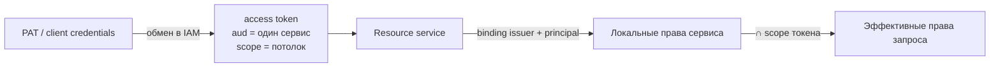

# Права и scopes

Справочник по авторизации: права (permissions) Control Plane, роли,
IAM audiences и scopes всех сервисов, правило пересечения прав со scope
токена и то, какие права и потолки выдаёт `make bootstrap`. Статья для
администратора tenant и инженера, который заводит агентов и сервисы.

## Два слоя: identity и доменные права

- **IAM** удостоверяет identity и выдаёт короткоживущий access token на
  **один audience** (один сервис) со **scopes** — потолком полномочий
  токена. Доменных прав в токене нет.
- **Resource service** (Control Plane, память, внешний PDP …) сам решает,
  что principal может делать. В Control Plane права хранятся в
  **binding** — строке `iam_principal_bindings`, связывающей IAM principal
  с локальным principal.
- Эффективные права запроса — пересечение прав binding и scope токена.
  Scope только сужает, никогда не расширяет.

Подробнее — [Модель безопасности](../overview/security-model.md) и
[Токены, audiences, scopes](../iam/tokens.md).

## Права Control Plane

Права — плоские строки, перечисление `Permission` в
`control_plane/domain/enums.py`. Проверка «хотя бы одно из» (`require`).
Право `admin` покрывает любое другое.

| Право | Что разрешает (область API) |
|---|---|
| `principals.read` | Чтение principals, их ролей, capabilities, skills. |
| `principals.write` | Создание и изменение principals; IAM-bindings (`/principals/{id}/iam-bindings`, `:revoke`). Выдать права, которых нет у вызывающего, нельзя (`permission_escalation`). |
| `delegations.manage` | Делегирования «агент действует от имени человека»; список делегирований. |
| `sessions.open` | Открыть сессию харнесса (`POST /sessions`), продлевать свою сессию. |
| `sessions.manage` | Управлять чужими сессиями; список сессий. |
| `tasks.read` | Чтение задач, связей, комментариев, внешних ссылок; контекст задачи. |
| `tasks.write` | Создание и изменение задач, связей, комментариев; переходы статусов. |
| `tasks.claim` | Взять задачу (claim), запускать runs, писать checkpoints, actions, handoff, завершать run. |
| `claims.manage` | Управлять чужими claims и runs: освобождение, reclaim, отмена, run controls, отзыв child handle. |
| `events.read` | Журнал событий (`GET /events`, WebSocket-поток). |
| `workspaces.read` | Чтение workspaces и дерева. |
| `workspaces.manage` | Создание, перемещение, архивирование workspaces; типы workspace. |
| `org.read` | Чтение ролей, capabilities, skills каталога. |
| `org.manage` | Создание и изменение ролей, capabilities, skills; назначение их principals. |
| `artifacts.read` | Чтение артефактов. |
| `artifacts.write` | Регистрация артефактов. |
| `approvals.read` | Чтение approvals. |
| `approvals.manage` | Создание и отмена approvals. |
| `approvals.decide` | Решение по approval (approve/reject). Только для людей. |
| `observations.write` | Запись наблюдений и снимков знаний в память через ядро. |
| `projects.read` | Чтение project profiles и их конфигурации. |
| `projects.manage` | Создание и изменение project profiles, ревизий конфигурации. |
| `project_templates.read` | Чтение шаблонов проектов. |
| `project_templates.manage` | Создание и изменение шаблонов проектов. |
| `operations.read` | Операционные сведения (состояние доставки, курсоры потребителей). |
| `operations.manage` | Операционные действия: redrive адаптера, архивирование и очистка журнала, rebuild курсора. |
| `task_types.read` | Чтение типов задач и их жизненного цикла. Нужен демону исполнителя, чтобы брать типизированную работу. |
| `task_types.manage` | Создание версий типов задач. |
| `skills.invoke` | Попросить ядро вызвать skill. |
| `skills.execute` | Исполнять вызовы skills (право исполнителя-транспорта). |
| `processes.read` | Чтение определений процессов, экземпляров и их журналов (на workspace процесса, без него — на tenant). См. [Процессы](../processes/index.md). |
| `processes.write` | Публикация версии процесса (на workspace процесса). |
| `processes.operate` | Явный старт экземпляра, `:suspend`, `:resume`, `:cancel` (на workspace экземпляра). |
| `packages.test` | Проверка и тесты пакета в песочнице ядра, replay процесса (`/packages:test`, `:replay`). |
| `packages.plan` | План и применение пакета (`/packages:plan`, `/packages:apply`) и запись связи объектов с пакетом (`/packages:record`); применение и запись требуют ещё права видов. |
| `packages.settings.read` | Чтение [настроек пакетов](../packages/settings.md): список пакетов с настройками, настройки пакета и их история. |
| `packages.settings.manage` | Сохранение настроек пакета (`PUT /packages/{key}/settings`); не зависит от `packages.plan`. |
| `calendars.write` | Публикация производственного календаря. |
| `goals.read` | Чтение целей (Goals). |
| `goals.write` | Создание и изменение целей. |
| `connections.read` | Чтение типов подключений, подключений и состояния OAuth-приложения типа. См. [Подключения](../control-plane/connections.md#permissions). |
| `connections.manage` | Публикация типов подключений, OAuth-приложение типа, заведение, изменение, подключение и отзыв подключений; публикация агента с непустым `spec.connections`. |
| `connections.status.write` | Сообщение о потере доступа (`PUT /connections/{key}/status`) — только коннектору, чьё описание называет подключение. |
| `agents.secrets.manage` | Задание и удаление секретов агентов (`PUT`, `DELETE /agents/{key}/secrets/{name}`); имена читаются по `agents.read`. |
| `admin` | Все права. Только для людей и только под scope `control-plane:admin`. |

!!! note "Только для людей"
    `admin` и `approvals.decide` нельзя выдать principal вида `agent` или
    `service`: создание такого binding отвечает
    `422 permissions_not_allowed_for_kind`. Решение по approval и полный
    доступ остаются за человеком.

### Пересечение со scope токена

Правило `narrow_permissions` в `control_plane/infrastructure/auth/iam.py`:

| Scope в токене | Какие права binding остаются |
|---|---|
| `control-plane:admin` | Все права binding без сужения (включая `admin`). |
| `control-plane:write` | Все права, кроме `admin` и кроме `*.read` (если нет `control-plane:read`). |
| `control-plane:read` | Только права, оканчивающиеся на `.read`. |
| `control-plane:read` + `control-plane:write` | Все права binding, кроме `admin`. |
| ни одного | Ни одного права. |

Пример: у оператора binding со всеми правами, но токен выпущен со scope
`control-plane:read` — запрос на создание задачи получит
`403 permission_denied`.

### IAM principal bindings {#iam-principal-bindings}

Binding ищется по паре **(issuer, IAM principal id)**. Следствия:

- Смена публичного адреса (`TAIMEN_PUBLIC_URL`) меняет issuer IAM, и все
  bindings перестают находиться — вход закрывается. Bindings нужно
  переносить одновременно со сменой адреса.
- Заводите binding **до** первого запроса principal. Отказ
  `binding_not_found` кэшируется как отзыв credential на
  `CP_IAM_BINDING_STALE_AFTER_SECONDS` (по умолчанию 120 с). Изменение
  binding через API Control Plane сбрасывает кэш этой identity в процессе,
  который обработал запрос; если binding появился в обход API (например,
  SQL-ом) или API работает в нескольких экземплярах, отказ держится до
  истечения этого окна либо до перезапуска `control-plane-api`.
- Статусы binding: `active`, `disabled`, `revoked`. Отключённый binding
  даёт тот же `401 invalid_credentials`, что и отсутствующий.
- Управление — API Control Plane: `POST /api/v1/bootstrap` с полем
  `iamBinding`, `GET/POST /api/v1/principals/{id}/iam-bindings`,
  `…/iam-bindings/{id}:revoke`.

Одна IAM identity может быть связана только с одним tenant Control Plane
(`409 iam_identity_bound_elsewhere`).

### Доменная авторизация через внешний PDP

При `CP_AUTHZ_MODE=policy` решение по запросу с IAM-субъектом принимает
внешний PDP по каталогу действий `services/control-plane/authz/catalog.yaml`
(имена действий совпадают с правами). В режиме `shadow` решает локальная
проверка, а PDP опрашивается параллельно и расхождения пишутся в журнал.
Legacy-ключи всегда проверяются локально. Недоступность PDP даёт
`503 decision_unavailable` — запрос не выполняется (fail closed). См.
[Авторизация и права](../control-plane/authorization.md).

## Роли {#roles}

Роль в платформе — организационная роль Control Plane. Внешний IdP ролей не
назначает: он только подтверждает, кто человек.

| Где | Что это | Как управляется |
|---|---|---|
| Control Plane | Организационная роль (`slug`, `name`, опционально `workspaceId`). Используется в требованиях задач (`requirements`: role / capability / skill), в approvals (`requiredRoleId`) и в контекстных кортежах policy. **Права не даёт.** | `POST /api/v1/roles`, `POST /api/v1/principals/{id}/roles` (право `org.manage`); роли из пакетов каталога ставит `make bootstrap`. |

## IAM audiences и scopes

Audience — идентификатор одного resource service. Токен выпускается ровно
на один audience; список audiences в `aud` сервисы отвергают. Допустимые
scopes audience задаёт реестр IAM (`allowedScopes`), `make bootstrap`
приводит их к списку ниже идемпотентно.

| Audience | Scopes | Смысл |
|---|---|---|
| `control-plane` | `control-plane:read`, `control-plane:write`, `control-plane:admin` | Потолок доменных прав Control Plane (см. таблицу пересечения). |
| `memory-service` | `memory:read` | Чтение namespaces токена. |
| | `memory:write` | Запись в namespaces токена. |
| | `memory:pii` | Полный доступ к персональным данным; без него при `CB_PII_PROTECTION=true` выдача маскируется. |
| | `memory:tenants` | Всё поддерево `tenant:*` независимо от tenant токена. Только service account ядра. |
| | `memory:on-behalf` | Сервис читает память от имени principal с переданной видимостью (при `CB_POLICY_ENABLED`). |
| | `memory:service` | Service scope ядра: реестр доменных пакетов видов, reconcile, виды namespace. Только service account ядра. |
| `iam-scim` | `scim:write` (настраивается `IAM_SCIM_AUDIENCE`, `IAM_SCIM_SCOPE`) | SCIM-provisioning; только confidential service identity. |
| `openbao` | `secrets:read` | Вход в [хранилище секретов](../operations/secret-store.md) методом `jwt`. Scope хранилище не проверяет — права задают его политики. |

Namespaces памяти, доступные IAM-токену без `memory:tenants`:
`tenant:<tenant_id>` и поддерево `tenant:<tenant_id>:*`, плюс namespaces из
claim `memory_namespaces` (каждый — ровно и с поддеревом). Токен без
scopes памяти валиден, но не покрывает ни одного namespace.

### Как выбираются scopes при обмене

| Обмен | Правило |
|---|---|
| PAT → access token (`POST /api/v1/platform-access-tokens:exchange`) | Audience должен быть в списке audiences PAT и активен в tenant. Запрошенные scopes ⊆ (потолок PAT ∩ `allowedScopes`); пустой запрос — весь этот пересечённый потолок. Нарушение — `403 audience_not_allowed` / `403 scope_not_allowed`. |
| Client credentials (`POST /api/v1/tokens/exchange`) | Audience — в списке audiences service account. Запрошенные scopes ⊆ потолок service account **и** ⊆ `allowedScopes`. Выдаются ровно запрошенные. |
| Федерация (`POST /api/v1/tenants/{t}/federation:exchange`) | Только human principal. Scopes ⊆ `allowedScopes`; пустой запрос — все `allowedScopes`. |

!!! tip "Scope — всегда с префиксом audience"
    Короткие `read`/`write` не существуют: запрос `scopes: ["read"]`
    получит `403 scope_not_allowed`. Пишите `control-plane:read`.

### Кому IAM выпускает PAT

PAT выпускается только principal вида `human` или `agent`; для
`service_account` — `422 principal_kind_not_allowed` (сервисы используют
client credentials). Человеку нужен свежий authentication context (не
старше `IAM_PAT_MAX_AUTHENTICATION_AGE_SECONDS`, по умолчанию 300 с).
Потолок PAT (`scopeCeiling`) должен входить в `allowedScopes` его
audiences (`422 invalid_scope_ceiling`). Подробнее —
[Credentials и PAT](../iam/credentials.md).

## Что выдаёт `make bootstrap` {#bootstrap-grants}

`deploy/bootstrap.py` заводит identity и права идемпотентно (состояние —
`deploy/state/<env>.json`).

### Human-оператор

| Что | Значение |
|---|---|
| IAM principal | `kind: human` |
| Binding в Control Plane | Все права (`ALL_PERMISSIONS`), создаётся вместе с tenant в `POST /api/v1/bootstrap` |
| PAT | `secrets/harness-pat`, audience `control-plane`, потолок `control-plane:read`, `control-plane:write`, `control-plane:admin`, срок `--pat-ttl` (по умолчанию 180 дней) |

### Агенты

Исполнителей bootstrap не заводит: агента описывает пакет каталога (вид
`Agent`), права связки берутся из `identity.permissions` описания, а principal
и PAT выпускает платформа.
Агенту нельзя `admin` и `approvals.decide`.

!!! warning "`task_types.read` обязателен исполнителю"
    Без `task_types.read` демон исполнителя не берёт типизированную работу
    (fail closed): иначе задачу, предназначенную скиллу, мог бы забрать
    кодовый адаптер.

### Service accounts

| Service account | Audiences | Потолок scopes | Права в Control Plane | Где секрет |
|---|---|---|---|---|
| Control Plane (ядро) | `memory-service`, `openbao` | `memory:read`, `memory:write`, `memory:tenants`, `memory:on-behalf`, `memory:service`, `secrets:read` | — | `secrets/control-plane-iam.env` |

При изменении потолка service account ядра bootstrap меняет его на месте
(`PATCH …/service-accounts/{clientId}`, см. [Service
accounts](../iam/service-accounts.md#update)): principal и `clientId` прежние,
env-файл не меняется. Новые scope ядро получит со следующим обменом client
credentials; чтобы не ждать, перезапустите `control-plane-api`,
`control-plane-worker`, `context-adapter`.

## Типичные вопросы

**Агент получает `403 permission_denied` на `POST /api/v1/tasks/{id}:claim`.**
Проверьте три вещи: в binding есть `tasks.claim`; токен обменян со scope
`control-plane:write`; при `CP_AUTHZ_MODE=policy` у principal есть роль с
действием `tasks.claim` в scope workspace задачи.

**Человек видит задачи, но не может решить approval.** Нужно право
`approvals.decide` и scope `control-plane:write`; при политике — ещё и то,
что решающий не является автором запроса.

**Сервис памяти отвечает 403 токену ядра на регистрацию пакета.** В токене
нет `memory:service`: проверьте `CP_CONTEXT_IAM_SCOPES` и потолок service
account ядра.

## См. также

- [Авторизация и права](../control-plane/authorization.md)
- [Tenants и principals](../iam/principals.md)
- [Токены, audiences, scopes](../iam/tokens.md)
- [Service accounts](../iam/service-accounts.md)
- [Identity агента](../runner/agent-identity.md)
- [Bootstrap](../getting-started/bootstrap.md)
- [Коды ошибок](errors.md)
