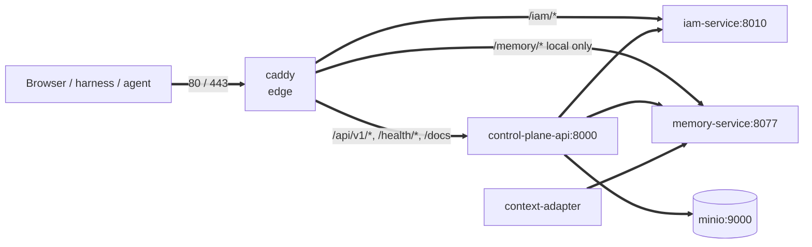

# Services and ports

All services of the `deploy/local/compose.yml`: profile, image or build context,
internal and published port, dependencies, volumes, healthcheck, memory
limit, and route at the edge (Caddy). This page is for an engineer who
deploys the stack, opens ports on the host, or looks for the container that
answers on a path `/…`.

## Overview

- All containers share one network `taimen` (the name is
  `${TAIMEN_NETWORK:-taimen_default}`) and reach each other by service DNS
  names.
- **Only** `caddy` faces the outside. The other services publish a port only
  on `127.0.0.1`, for `make smoke`, `make bootstrap`, and debugging from the
  host.

- The `caddy` container has the network alias `${TAIMEN_PUBLIC_HOST}`:
  services reach IAM by the public name so that the issuer in the token
  matches what the browser sees.

## Profiles

By default, `make up` brings up `core edge`. The other profiles are enabled
explicitly: `make up PROFILES="core notify edge"` or
`tools/compose --profile core --profile edge up -d`.

| Profile | Status | Services |
|---|---|---|
| `core` | core | `iam-db`, `iam-service`, `control-plane-db`, `control-plane-api`, `control-plane-worker`, `context-adapter`, `memory-db`, `memory-service`, `minio`, `minio-bootstrap` |
| `edge` | core | `caddy`, `guide` |

!!! note "Dependencies between profiles"
    `depends_on` works only within active profiles: bring up dependent
    profiles together.

## Port summary

| Service | Internal port | Published on host | Port variable | Caddy path |
|---|---|---|---|---|
| `caddy` | 80, 443 | `0.0.0.0:80`, `0.0.0.0:443` | `EDGE_HTTP_PORT`, `EDGE_HTTPS_PORT` | — |
| `control-plane-api` | 8000 | `127.0.0.1:18000` | `CP_HOST_PORT` | `/api/v1/*`, `/health/*`, `/docs`, `/docs/*`, `/redoc`, `/redoc/*`, `/openapi.json` |
| `memory-service` | 8077 | `127.0.0.1:18001` | `MEMORY_HOST_PORT` | `/memory/*` (local Caddyfile only) |
| `iam-service` | 8010 | `127.0.0.1:18010` | `IAM_HOST_PORT` | `/iam/*` (prefix stripped) |
| `guide` | 8080 | no | — | `/guide/*` (prefix stripped) |
| `minio` | 9000 | no | — | no |
| `*-db` databases | 5432 | no | — | no |
| `control-plane-worker`, `context-adapter` | — | no | — | no |

!!! tip "Caddy route order"
    Caddy picks the first matching `handle`. Specific prefixes (`/iam/*`,
    `/guide/*` …) and the Control Plane matcher `@cp_api` come before the
    general `handle`. When you add your own route, put it before the general
    `handle`.

## Core (`core`)

### iam-db

| Parameter | Value |
|---|---|
| Image | `postgres:16-alpine` |
| Database / role | `iam` / `iam`, password `${IAM_POSTGRES_PASSWORD}` |
| Volume | `iam_db` → `/var/lib/postgresql/data` |
| Healthcheck | `pg_isready -U iam -d iam` |
| Memory limit | `${PG_MEM_LIMIT:-256m}` |

### iam-service

| Parameter | Value |
|---|---|
| Image / build | `${IMAGE_PREFIX}/iam-service:${IMAGE_TAG}`, context `${IAM_BUILD_CONTEXT:-./services/iam-service}` |
| Command | `alembic upgrade head && uvicorn iam_service.app:app --host 0.0.0.0 --port 8010` |
| Port | 8010 → `127.0.0.1:${IAM_HOST_PORT:-18010}` |
| Depends on | `iam-db` (healthy) |
| Secrets | `iam_signing_key` → `/run/secrets/iam_signing_key` (file `${IAM_SIGNING_KEY_FILE}`) |
| Healthcheck | `GET http://127.0.0.1:8010/healthz` |
| Memory limit | `${IAM_MEM_LIMIT:-256m}` |
| User | uid 10001 |

### control-plane-db

| Parameter | Value |
|---|---|
| Image | `postgres:16-alpine` |
| Database / role | `control_plane` / `control_plane` |
| Volume | `control_plane_db` |
| Healthcheck | `pg_isready -U control_plane -d control_plane` |
| Memory limit | `${PG_MEM_LIMIT:-256m}` |

### control-plane-api

| Parameter | Value |
|---|---|
| Image / build | `${IMAGE_PREFIX}/control-plane:${IMAGE_TAG}`, context `${CP_BUILD_CONTEXT:-.}` (superproject root), Dockerfile `services/control-plane/Dockerfile` |
| Command | `alembic upgrade head && uvicorn control_plane.main:app --host 0.0.0.0 --port 8000` |
| Port | 8000 → `127.0.0.1:${CP_HOST_PORT:-18000}` |
| Depends on | `control-plane-db`, `memory-service`, `iam-service` (all healthy) |
| env_file | `./secrets/control-plane-iam.env` (optional) |
| Healthcheck | `GET http://127.0.0.1:8000/health/ready` |
| Memory limit | `${CP_MEM_LIMIT:-512m}` |
| User | uid 10001 |

### control-plane-worker

| Parameter | Value |
|---|---|
| Image | the same as `control-plane-api` (not built separately) |
| Command | `python -m control_plane.worker` |
| Port | none |
| Depends on | `control-plane-db` (healthy), `control-plane-api` (healthy) |
| env_file | `./secrets/control-plane-iam.env` |
| Healthcheck | none |
| Memory limit | `${CP_WORKER_MEM_LIMIT:-256m}` |

### context-adapter

| Parameter | Value |
|---|---|
| Image | the same as `control-plane-api` |
| Command | `python -m control_plane.worker.context_adapter` |
| Port | none |
| Depends on | `control-plane-db`, `control-plane-api`, `memory-service` (all healthy) |
| env_file | `./secrets/control-plane-iam.env` |
| Healthcheck | none |
| Memory limit | `${CP_WORKER_MEM_LIMIT:-256m}` |

!!! warning "One image for three processes"
    `control-plane-api`, `control-plane-worker`, and `context-adapter` run on
    one image. Only the `control-plane-api` service builds the image; after a
    build, recreate all three containers, otherwise the worker and the adapter
    stay on the previous code.

### memory-db

| Parameter | Value |
|---|---|
| Image / build | `${IMAGE_PREFIX}/memory-db:${IMAGE_TAG}`, context `${MEMORY_BUILD_CONTEXT:-./services/memory-service}/infra/memory-db` (PostgreSQL 16 + Apache AGE + pgvector) |
| Database / role | `company_brain` / `memory` |
| Volume | `memory_db` |
| Healthcheck | `pg_isready -U memory -d company_brain` |
| Memory limit | `${MEMORY_DB_MEM_LIMIT:-512m}` |

### memory-service

| Parameter | Value |
|---|---|
| Image / build | `${IMAGE_PREFIX}/memory-service:${IMAGE_TAG}`, context `${MEMORY_BUILD_CONTEXT:-.}`, Dockerfile `services/memory-service/Dockerfile` |
| Port | 8077 → `127.0.0.1:${MEMORY_HOST_PORT:-18001}` |
| Depends on | `memory-db` (healthy) |
| env_file | `./secrets/memory-service-iam.env` (optional) |
| Healthcheck | `GET http://127.0.0.1:8077/healthz` |
| Memory limit | `${MEMORY_MEM_LIMIT:-512m}` |

### minio and minio-bootstrap

| Service | Image | Port | Depends on | Volume | Healthcheck | Limit |
|---|---|---|---|---|---|---|
| `minio` | `cgr.dev/chainguard/minio@sha256:4692462f…`, `server /data` | 9000, not published | — | `platform_minio` | `mc ready local` | `${MINIO_MEM_LIMIT:-256m}` |
| `minio-bootstrap` | `cgr.dev/chainguard/minio-client@sha256:19c80ef1…` (-dev), one-shot: bucket `${CP_S3_BUCKET}`, policy `cp-artifacts`, and the core user | — | `minio` (healthy) | — | — | — |

It stores only the content of core artifacts; see
[Object storage](../operations/object-storage.md).

## Edge (`edge`)

### caddy

| Parameter | Value |
|---|---|
| Image | `caddy:2-alpine` |
| Ports | `${EDGE_HTTP_PORT:-80}:80`, `${EDGE_HTTPS_PORT:-443}:443` on all interfaces |
| Volumes | `${CADDYFILE}` → `/etc/caddy/Caddyfile` (read-only), `caddy_data` → `/data` (ACME certificates), `caddy_config` → `/config` |
| Network alias | `${TAIMEN_PUBLIC_HOST:-taimen.localhost}` |
| Healthcheck | none |

The local `deploy/caddy/Caddyfile.local` serves `http://taimen.localhost`
and `http://localhost` without ACME, logs to stderr, and compresses responses
(`zstd`, `gzip`). The production Caddyfile is set by the `CADDYFILE`
variable and repeats the same path layout with TLS, but without the
`/memory/*` route: memory is not exposed externally. Details:
[Edge and TLS](../operations/edge-and-tls.md).

!!! warning "Editing the Caddyfile in place"
    The file is bind-mounted and holds its inode. If you replace the file with
    `mv`, `caddy reload` rereads the old version. Edit the file in place or
    recreate the container: `tools/compose up -d --force-recreate caddy`.

## Healthchecks and smoke {#healthchecks}

The core Python services share a healthcheck template: interval 5 s,
timeout 5 s, 30 retries; the check is `urllib.request.urlopen` against
`127.0.0.1` (not `localhost`: in slim images `localhost` can resolve to IPv6
`::1`, where the server does not listen).

`make smoke` (`tools/smoke.py`) checks running services through ports on
`127.0.0.1` and skips those that are not running:

| Service | Default port | Path |
|---|---|---|
| `iam-service` | 18010 | `/healthz` |
| `control-plane-api` | 18000 | `/health/ready` |
| `memory-service` | 18001 | `/healthz` |

A response with code `< 400` is `OK`; otherwise it is `ERR` with a non-zero
exit code.

## Volumes

| Volume | Service | What it stores |
|---|---|---|
| `iam_db` | `iam-db` | IAM tenants, principals, credentials |
| `control_plane_db` | `control-plane-db` | Work graph, event log, bindings |
| `memory_db` | `memory-db` | Knowledge graph, chunks, observations |
| `platform_minio` | `minio` | Content of core artifacts (the volume name is historical) |
| `caddy_data`, `caddy_config` | `caddy` | Caddy certificates and state |

Names are set by the `VOLUME_*` variables (see
[Environment variables](environment.md)). `make down` does not remove volumes.

## Docker secrets

| Secret | Default file | Used by |
|---|---|---|
| `iam_signing_key` | `./secrets/iam-signing.pem` | `iam-service` |

Containers read secrets under an unprivileged uid (10001 for the core
services). On Linux, run `chown 10001` on the files in `secrets/`, and keep
mode `600`.

## See also

- [Environment variables](environment.md)
- [Make targets](make.md)
- [Edge and TLS](../operations/edge-and-tls.md)
- [Monitoring and health](../operations/monitoring.md)
- [Resources and scaling](../operations/capacity.md)
- [Installation and launch: troubleshooting](../troubleshooting/startup.md)
