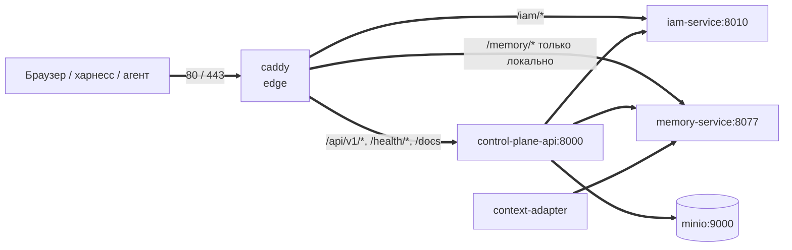

# Сервисы и порты

Все сервисы `deploy/local/compose.yml`: профиль, образ или контекст сборки,
внутренний и публикуемый порт, зависимости, volumes, healthcheck, лимит
памяти и маршрут во внешнем контуре (Caddy). Статья для инженера, который
разворачивает стек, открывает порты на хосте или ищет, какой контейнер
отвечает на путь `/…`.

## Общая схема

- Все контейнеры в одной сети `taimen` (имя — `${TAIMEN_NETWORK:-taimen_default}`)
  и обращаются друг к другу по DNS-именам сервисов.
- Наружу смотрит **только** `caddy`. Остальные сервисы публикуют порт
  исключительно на `127.0.0.1` — для `make smoke`, `make bootstrap` и
  отладки с хоста.

- У контейнера `caddy` есть сетевой alias `${TAIMEN_PUBLIC_HOST}`: сервисы
  обращаются к IAM по публичному имени, чтобы issuer в токене
  совпадал с тем, что видит браузер.

## Профили

По умолчанию `make up` поднимает `core edge`. Остальные профили включаются
явно: `make up PROFILES="core notify edge"` или
`tools/compose --profile core --profile edge up -d`.

| Профиль | Статус | Сервисы |
|---|---|---|
| `core` | ядро | `iam-db`, `iam-service`, `control-plane-db`, `control-plane-api`, `control-plane-worker`, `context-adapter`, `memory-db`, `memory-service`, `minio`, `minio-bootstrap` |
| `edge` | ядро | `caddy`, `guide` |

!!! note "Зависимости между профилями"
    `depends_on` работает только внутри активных профилей: поднимайте
    зависимые профили вместе.

## Сводная таблица портов

| Сервис | Внутренний порт | Публикуется на хосте | Переменная порта | Путь в Caddy |
|---|---|---|---|---|
| `caddy` | 80, 443 | `0.0.0.0:80`, `0.0.0.0:443` | `EDGE_HTTP_PORT`, `EDGE_HTTPS_PORT` | — |
| `control-plane-api` | 8000 | `127.0.0.1:18000` | `CP_HOST_PORT` | `/api/v1/*`, `/health/*`, `/docs`, `/docs/*`, `/redoc`, `/redoc/*`, `/openapi.json` |
| `memory-service` | 8077 | `127.0.0.1:18001` | `MEMORY_HOST_PORT` | `/memory/*` (только в локальном Caddyfile) |
| `iam-service` | 8010 | `127.0.0.1:18010` | `IAM_HOST_PORT` | `/iam/*` (префикс срезается) |
| `guide` | 8080 | нет | — | `/guide/*` (префикс срезается) |
| `minio` | 9000 | нет | — | нет |
| базы `*-db` | 5432 | нет | — | нет |
| `control-plane-worker`, `context-adapter` | — | нет | — | нет |

!!! tip "Порядок маршрутов Caddy"
    Caddy выбирает первый совпавший `handle`. Специфичные префиксы (`/iam/*`,
    `/guide/*` …) и матчер Control Plane `@cp_api` стоят раньше общего
    `handle`. Добавляя свой маршрут, ставьте его перед общим `handle`.

## Ядро (`core`)

### iam-db

| Параметр | Значение |
|---|---|
| Образ | `postgres:16-alpine` |
| БД / роль | `iam` / `iam`, пароль `${IAM_POSTGRES_PASSWORD}` |
| Volume | `iam_db` → `/var/lib/postgresql/data` |
| Healthcheck | `pg_isready -U iam -d iam` |
| Лимит памяти | `${PG_MEM_LIMIT:-256m}` |

### iam-service

| Параметр | Значение |
|---|---|
| Образ / сборка | `${IMAGE_PREFIX}/iam-service:${IMAGE_TAG}`, контекст `${IAM_BUILD_CONTEXT:-./services/iam-service}` |
| Команда | `alembic upgrade head && uvicorn iam_service.app:app --host 0.0.0.0 --port 8010` |
| Порт | 8010 → `127.0.0.1:${IAM_HOST_PORT:-18010}` |
| Зависит от | `iam-db` (healthy) |
| Секреты | `iam_signing_key` → `/run/secrets/iam_signing_key` (файл `${IAM_SIGNING_KEY_FILE}`) |
| Healthcheck | `GET http://127.0.0.1:8010/healthz` |
| Лимит памяти | `${IAM_MEM_LIMIT:-256m}` |
| Пользователь | uid 10001 |

### control-plane-db

| Параметр | Значение |
|---|---|
| Образ | `postgres:16-alpine` |
| БД / роль | `control_plane` / `control_plane` |
| Volume | `control_plane_db` |
| Healthcheck | `pg_isready -U control_plane -d control_plane` |
| Лимит памяти | `${PG_MEM_LIMIT:-256m}` |

### control-plane-api

| Параметр | Значение |
|---|---|
| Образ / сборка | `${IMAGE_PREFIX}/control-plane:${IMAGE_TAG}`, контекст `${CP_BUILD_CONTEXT:-.}` (корень суперпроекта), Dockerfile `services/control-plane/Dockerfile` |
| Команда | `alembic upgrade head && uvicorn control_plane.main:app --host 0.0.0.0 --port 8000` |
| Порт | 8000 → `127.0.0.1:${CP_HOST_PORT:-18000}` |
| Зависит от | `control-plane-db`, `memory-service`, `iam-service` (все healthy) |
| env_file | `./secrets/control-plane-iam.env` (необязательный) |
| Healthcheck | `GET http://127.0.0.1:8000/health/ready` |
| Лимит памяти | `${CP_MEM_LIMIT:-512m}` |
| Пользователь | uid 10001 |

### control-plane-worker

| Параметр | Значение |
|---|---|
| Образ | тот же, что у `control-plane-api` (не собирается отдельно) |
| Команда | `python -m control_plane.worker` |
| Порт | нет |
| Зависит от | `control-plane-db` (healthy), `control-plane-api` (healthy) |
| env_file | `./secrets/control-plane-iam.env` |
| Healthcheck | нет |
| Лимит памяти | `${CP_WORKER_MEM_LIMIT:-256m}` |

### context-adapter

| Параметр | Значение |
|---|---|
| Образ | тот же, что у `control-plane-api` |
| Команда | `python -m control_plane.worker.context_adapter` |
| Порт | нет |
| Зависит от | `control-plane-db`, `control-plane-api`, `memory-service` (все healthy) |
| env_file | `./secrets/control-plane-iam.env` |
| Healthcheck | нет |
| Лимит памяти | `${CP_WORKER_MEM_LIMIT:-256m}` |

!!! warning "Один образ на три процесса"
    `control-plane-api`, `control-plane-worker` и `context-adapter` работают
    на одном образе. Образ собирается только сервисом `control-plane-api`;
    после сборки пересоздайте все три контейнера, иначе worker и адаптер
    останутся на прежнем коде.

### memory-db

| Параметр | Значение |
|---|---|
| Образ / сборка | `${IMAGE_PREFIX}/memory-db:${IMAGE_TAG}`, контекст `${MEMORY_BUILD_CONTEXT:-./services/memory-service}/infra/memory-db` (PostgreSQL 16 + Apache AGE + pgvector) |
| БД / роль | `company_brain` / `memory` |
| Volume | `memory_db` |
| Healthcheck | `pg_isready -U memory -d company_brain` |
| Лимит памяти | `${MEMORY_DB_MEM_LIMIT:-512m}` |

### memory-service

| Параметр | Значение |
|---|---|
| Образ / сборка | `${IMAGE_PREFIX}/memory-service:${IMAGE_TAG}`, контекст `${MEMORY_BUILD_CONTEXT:-.}`, Dockerfile `services/memory-service/Dockerfile` |
| Порт | 8077 → `127.0.0.1:${MEMORY_HOST_PORT:-18001}` |
| Зависит от | `memory-db` (healthy) |
| env_file | `./secrets/memory-service-iam.env` (необязательный) |
| Healthcheck | `GET http://127.0.0.1:8077/healthz` |
| Лимит памяти | `${MEMORY_MEM_LIMIT:-512m}` |

### minio и minio-bootstrap

| Сервис | Образ | Порт | Зависит от | Volume | Healthcheck | Лимит |
|---|---|---|---|---|---|---|
| `minio` | `cgr.dev/chainguard/minio@sha256:4692462f…`, `server /data` | 9000, не публикуется | — | `platform_minio` | `mc ready local` | `${MINIO_MEM_LIMIT:-256m}` |
| `minio-bootstrap` | `cgr.dev/chainguard/minio-client@sha256:19c80ef1…` (-dev), одноразовый: бакет `${CP_S3_BUCKET}`, политика `cp-artifacts` и пользователь ядра | — | `minio` (healthy) | — | — | — |

Хранит только содержимое артефактов ядра; см.
[Хранилище объектов](../operations/object-storage.md).

## Периметр (`edge`)

### caddy

| Параметр | Значение |
|---|---|
| Образ | `caddy:2-alpine` |
| Порты | `${EDGE_HTTP_PORT:-80}:80`, `${EDGE_HTTPS_PORT:-443}:443` на всех интерфейсах |
| Volumes | `${CADDYFILE}` → `/etc/caddy/Caddyfile` (read-only), `caddy_data` → `/data` (сертификаты ACME), `caddy_config` → `/config` |
| Сетевой alias | `${TAIMEN_PUBLIC_HOST:-taimen.localhost}` |
| Healthcheck | нет |

Локальный `deploy/caddy/Caddyfile.local` обслуживает `http://taimen.localhost`
и `http://localhost` без ACME, пишет лог в stderr и сжимает ответы
(`zstd`, `gzip`). Промышленный Caddyfile задаётся переменной `CADDYFILE` и
повторяет ту же раскладку путей с TLS, но без маршрута `/memory/*`: память
наружу не публикуется. Подробнее — [Периметр и TLS](../operations/edge-and-tls.md).

!!! warning "Правка Caddyfile на месте"
    Файл смонтирован bind-mount'ом и держит inode. Если заменить файл через
    `mv`, `caddy reload` перечитает старую версию. Правьте файл на месте или
    пересоздайте контейнер: `tools/compose up -d --force-recreate caddy`.

## Healthcheck'и и smoke {#healthchecks}

У Python-сервисов ядра общий шаблон healthcheck: интервал 5 s, таймаут
5 s, 30 попыток; проверка — `urllib.request.urlopen` на `127.0.0.1`
(не `localhost`: в slim-образах `localhost` может резолвиться в IPv6
`::1`, где сервер не слушает).

`make smoke` (`tools/smoke.py`) проверяет поднятые сервисы по портам на
`127.0.0.1` и пропускает не запущенные:

| Сервис | Порт по умолчанию | Путь |
|---|---|---|
| `iam-service` | 18010 | `/healthz` |
| `control-plane-api` | 18000 | `/health/ready` |
| `memory-service` | 18001 | `/healthz` |

Ответ с кодом `< 400` — `OK`, иначе `ERR` и ненулевой код выхода.

## Volumes

| Volume | Сервис | Что хранит |
|---|---|---|
| `iam_db` | `iam-db` | Tenants, principals, credentials IAM |
| `control_plane_db` | `control-plane-db` | Work graph, журнал событий, bindings |
| `memory_db` | `memory-db` | Граф знаний, чанки, наблюдения |
| `platform_minio` | `minio` | Содержимое артефактов ядра (имя тома историческое) |
| `caddy_data`, `caddy_config` | `caddy` | Сертификаты и состояние Caddy |

Имена задаются переменными `VOLUME_*` (см.
[Переменные окружения](environment.md)). `make down` volumes не удаляет.

## Docker-секреты

| Секрет | Файл по умолчанию | Кому |
|---|---|---|
| `iam_signing_key` | `./secrets/iam-signing.pem` | `iam-service` |

Контейнеры читают секреты под непривилегированным uid (10001 у сервисов
ядра). На Linux выполните `chown 10001` для файлов в `secrets/`, права
оставьте `600`.

## См. также

- [Переменные окружения](environment.md)
- [Цели make](make.md)
- [Периметр и TLS](../operations/edge-and-tls.md)
- [Мониторинг и здоровье](../operations/monitoring.md)
- [Ресурсы и масштабирование](../operations/capacity.md)
- [Установка и запуск — диагностика](../troubleshooting/startup.md)
