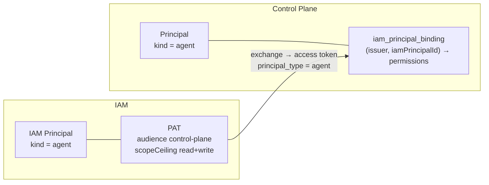

# Agent identity

How to give an autonomous executor its own identity: a principal of kind `agent` in IAM and
Control Plane, a binding with a limited set of permissions, and a Platform Access Token (PAT),
and how the runner stores and presents this PAT. The article is for tenant administrators and
engineers who deploy the runner.

## Why a separate principal

An agent never works under a human's credential. The reason is audit: under a shared
credential the operator's work and the agent's work are indistinguishable in the event log,
and telling them apart is the whole point of the separation. A separate principal gives:

- **attribution** — every claim, run, artifact, comment, and event carries the agent's
  principal;
- **a permission ceiling** — the agent has neither `admin` nor `approvals.decide`, so it can
  neither rewrite its own permissions nor approve a gate set up to stop it;
- **independent revocation** — the agent's PAT is revoked without affecting human access;
- **work addressing** — tasks are assigned to the agent by its CP principal id
  (`assigneeId`), and a runner with `CONTROL_PLANE_AGENT_ONLY_ASSIGNED=1` takes only those.

If there are several executors (for example, a coder and a reviewer, or executors for
different repositories), **each** has its own principal: otherwise, with `ONLY_ASSIGNED`,
they would take each other's tasks.

## The two halves of identity



| Entity | Where | What it defines |
|---|---|---|
| IAM Principal (`kind: agent`) | IAM | who presents the PAT |
| PAT | IAM | audiences and the scope ceiling (`control-plane:read`, `control-plane:write`) |
| CP Principal (`kind: agent`) | Control Plane | in whose name the work is recorded, to whom tasks are assigned |
| Binding | Control Plane | the pair `(issuer, iamPrincipalId)` → CP Principal + a list of permissions |

The access token the runner obtains by exchanging the PAT lives for minutes (300 s by
default) and carries `principal_type = agent`. The agent has no human login, so the token has
no `auth_time` and no `acr` — this is how the core tells agent sessions from operator
sessions.

## Agent permissions

Permissions are set as a list in the binding. The server rejects a binding of a non-human
principal with `admin` or `approvals.decide` with the error
`permissions_not_allowed_for_kind`, and the creator of the binding cannot grant permissions
they do not have themselves (`permission_escalation`).

The base set that `deploy/bootstrap.py` uses for agents:

| Permission | Why the runner needs it |
|---|---|
| `sessions.open` | open a harness session |
| `tasks.read` | see tasks and `/work/available` |
| `tasks.write` | comments, relations, field edits (reviewer verdict), creating a review task |
| `tasks.claim` | claim a task |
| `events.read` | event log |
| `artifacts.read`, `artifacts.write` | `report`, `transcript`, `commit` artifacts |
| `projects.read` | project context in the prompt |
| `task_types.read` | find out whether the task type is executed by a skill (without it such tasks are not taken) |

Additionally, depending on the situation:

| Permission | When it is needed |
|---|---|
| `approvals.manage` | a coder in `human` review mode: the daemon itself requests a gate approval for the review task |
| `skills.execute` | the daemon executes skill calls (`CONTROL_PLANE_SKILLS_*`) |
| `observations.write` | the agent writes to memory through `cp_remember` |

!!! danger "Never grant an agent"
    `admin` and `approvals.decide`. The server refuses on its own, but keep this rule in mind
    when you edit permissions manually through roles: an agent that can decide approvals
    bypasses any review gate.

## Creating the identity step by step

!!! note "Agents with a description do not need these steps"
    For an agent described by the `Agent` kind, the platform sets up the identity:
    fleet-controller creates the principal in IAM (scope `iam:agents`) and issues a PAT for
    each placement, and the core derives the Control Plane principal and the binding with
    the permissions from `identity.permissions` (`PUT /api/v1/agents/{key}/identity`).
    Revocation is retiring the agent. See [Agents by
    description](declarative-agents.md#lifecycle) and [Nodes and fleet](fleet.md#identity-and-pat).
    The manual steps below are for principals without a description.

Below is the sequence of API calls. You repeat it manually when you add an executor without
a description to an already deployed system.

Notation: `$IAM` — IAM base URL (for example `https://platform.example.com/iam`), `$CP` —
Control Plane, `$ISSUER` — IAM issuer (matches the public IAM URL), `$BOOT` — IAM bootstrap
token, `$ADMIN` — access token of a Control Plane administrator.

### 1. Principal in IAM

```bash
curl -sS -X POST "$IAM/api/v1/tenants/<iam-tenant-id>/principals" \
  -H "X-IAM-Bootstrap-Token: $BOOT" -H 'Content-Type: application/json' \
  -d '{"kind": "agent", "displayName": "Autonomous Runner"}'
```

```json
{"id": "<iam-principal-id>", "kind": "agent", "displayName": "Autonomous Runner", "...": "..."}
```

!!! note "Why `agent` and not `service_account`"
    IAM issues PATs only to principals of kind `human` and `agent`; for `service_account`
    issuance returns `422 principal_kind_not_allowed`. A service account gets access through
    client credentials — a different mechanism (see [Service accounts](../iam/service-accounts.md)).

### 2. Principal in Control Plane

```bash
curl -sS -X POST "$CP/api/v1/principals" \
  -H "Authorization: Bearer $ADMIN" -H 'Content-Type: application/json' \
  -d '{"kind": "agent", "displayName": "Autonomous Runner", "metadata": {"slug": "runner"}}'
```

Note the `id` from the response — this is `<cp-principal-id>`: tasks are assigned to it, and
it is specified as the reviewer of another executor.

### 3. Binding with permissions

```bash
curl -sS -X POST "$CP/api/v1/principals/<cp-principal-id>/iam-bindings" \
  -H "Authorization: Bearer $ADMIN" -H 'Content-Type: application/json' \
  -H "Idempotency-Key: $(uuidgen)" \
  -d '{
        "issuer": "'"$ISSUER"'",
        "iamTenantId": "<iam-tenant-id>",
        "iamPrincipalId": "<iam-principal-id>",
        "permissions": ["sessions.open","tasks.read","tasks.write","tasks.claim",
                        "events.read","artifacts.read","artifacts.write",
                        "projects.read","task_types.read"]
      }'
```

!!! warning "Binding first, first request second"
    Control Plane caches a negative binding check result for the lifetime of the
    `control-plane-api` process. If the runner presents a token before the binding exists,
    the `binding_not_found` answer "sticks", and a binding created later is not picked up
    until `control-plane-api` restarts. The order is strict: the binding, then the runner
    start.

The binding is looked up by the pair `(issuer, iamPrincipalId)`. Changing the IAM issuer (for
example, the public URL) requires moving the binding in the same step, otherwise login
closes.

### 4. PAT

```bash
curl -sS -X POST "$IAM/api/v1/tenants/<iam-tenant-id>/principals/<iam-principal-id>/platform-access-tokens" \
  -H "X-IAM-Bootstrap-Token: $BOOT" -H 'Content-Type: application/json' \
  -H "Idempotency-Key: $(uuidgen)" \
  -d '{
        "name": "runner-2026-09",
        "audiences": ["control-plane"],
        "scopeCeiling": ["control-plane:read", "control-plane:write"],
        "expiresInSeconds": 15552000
      }'
```

The response contains `token` — the full PAT, shown **once** — and `credential.publicPrefix`
— a safe prefix for logs.

| Parameter | Rule |
|---|---|
| `Idempotency-Key` | required; without it — `400 idempotency_key_required` |
| `scopeCeiling` | with the audience prefix: `control-plane:read`, not `read`; must be within the audience's `allowedScopes`, otherwise `422 invalid_scope_ceiling` |
| `expiresInSeconds` | default 30 days (`pat_default_ttl_seconds`), maximum 365 days (`pat_max_ttl_seconds`), more — `422 expiry_too_long` |
| `control-plane:admin` | do not grant to an agent |

For a human, IAM requires a fresh authentication context (no older than 300 s) to issue a
PAT; an agent has no such login, and the PAT record honestly stores an `agent_bootstrap`
snapshot — who issued the credential with a bootstrap operation and when.

More on PATs: [Credentials and PAT](../iam/credentials.md).

## Where the runner keeps the PAT

The runner (through `control_plane_client`) looks for a credential in this order: IAM
identity if `CONTROL_PLANE_IAM_URL` is set; otherwise a legacy API key
(`CONTROL_PLANE_API_KEY` or the `control-plane login` store). On an IAM-only server only the
first path works.

The PAT for IAM identity comes from one of these sources:

=== "Credentials file (host)"

    `~/.config/iam/credentials.json` of the user the runner runs as
    (`$XDG_CONFIG_HOME/iam/credentials.json` if set). The file permissions must be strictly
    `0600`: with broader ones the client refuses to read it
    (`iam_credentials_file_permissions`).

    An entry is addressed by the key `<CONTROL_PLANE_IAM_URL>|<iam-tenant-id>|<iam-principal-id>`,
    so several executors of one tenant live in one file. Each process declares who it is with
    the `IAM_PRINCIPAL` variable (IAM principal id).

    It is easier to write the token with the `iam` CLI from the iam-service package — it
    checks the token's tenant and audience by introspection:

    ```bash
    sudo -u runner env HOME=/home/runner IAM_PRINCIPAL=<iam-principal-id> \
      IAM_BINDING_FILE=/opt/runner/iam-binding.json \
      iam auth login --stdin < agent.pat
    ```

    where `iam-binding.json` is a non-secret file
    `{"iamUrl": "https://platform.example.com/iam", "tenantId": "<iam-tenant-id>"}`.

=== "Environment variable (container)"

    ```bash
    IAM_CREDENTIAL_MODE=environment
    IAM_PLATFORM_ACCESS_TOKEN=<pat>
    ```

    The variable without `IAM_CREDENTIAL_MODE=environment` (or `ci`) is the error
    `iam_environment_mode_required`: an inherited variable must not silently replace the
    account. This is how the container variant works: the entrypoint reads the PAT from
    `/run/secrets/agent-pat` and exports it only into the process environment.

=== "Keychain (macOS)"

    On macOS the client first looks in the Keychain (service `iam.platform-access-token`).
    On runner hosts this is usually not needed; `IAM_NO_KEYCHAIN=1` turns the lookup off.

### Several executors on one machine

If the file has several entries for the same `IAM URL | tenant` and the process has not
declared `IAM_PRINCIPAL`, the client refuses with `iam_credential_ambiguous`. This is
intentional: picking an entry at random would mean working under someone else's identity,
and that would become visible only in the audit. Set `IAM_PRINCIPAL` in the environment of
each process (for example, in a systemd unit drop-in).

## Rotation and revocation

| Action | How |
|---|---|
| Issue a new PAT | step 4 with a new `name`; write the token; restart the runner; revoke the old one |
| Rotate an existing one | `POST $IAM/api/v1/tenants/<t>/platform-access-tokens/<credential-id>:rotate` — does not extend the lifetime window, the expiry is set at issuance |
| Revoke | `POST $IAM/api/v1/tenants/<t>/platform-access-tokens/<credential-id>:revoke?reason=...` |
| List a principal's PATs | `GET $IAM/api/v1/tenants/<t>/platform-access-tokens?principalId=<iam-principal-id>` |
| Disable a binding | `POST $CP/api/v1/iam-bindings/<binding-id>:revoke` |

After the PAT is revoked, the runner cannot obtain a new access token and stops claiming and
writing; an already issued access token lives out its term (minutes). The CP Principal
remains — the work history is not lost.

!!! tip "Watch the PAT expiry"
    PATs are issued with an expiry; the runner sees an expired PAT as an exchange error, and
    all tasks stop being taken. Set up a reminder to reissue it in advance.

The coding agent's subscription token (Claude Code, Codex) is a separate credential; it
belongs to a human, not to the agent, and is revoked at the provider. Details:
[Executor adapters](adapters.md).

## See also

- [Tenants and principals](../iam/principals.md)
- [Tokens, audiences, scopes](../iam/tokens.md)
- [Authorization and permissions](../control-plane/authorization.md)
- [Installing the runner](installation.md)
- [Secrets and rotation](../operations/secrets.md)
