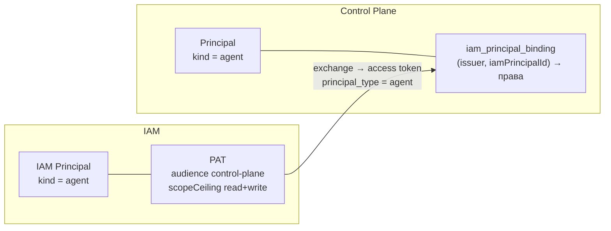

# Identity агента

Как завести автономному исполнителю собственную identity: principal вида `agent` в IAM и
Control Plane, binding с ограниченным набором прав и Platform Access Token (PAT), и как
runner этот PAT хранит и предъявляет. Статья для администратора tenant'а и инженера,
разворачивающего runner.

## Зачем отдельный principal

Агент никогда не работает под credential человека. Причина — аудит: под общим credential
работа оператора и работа агента в журнале событий неотличимы, а различить их и есть смысл
разделения. Отдельный principal даёт:

- **атрибуцию** — каждый claim, run, артефакт, комментарий и событие несут principal агента;
- **потолок прав** — у агента нет `admin` и `approvals.decide`, поэтому он не может ни
  переписать собственные права, ни одобрить gate, поставленный, чтобы его остановить;
- **независимый отзыв** — PAT агента отзывается, не задевая доступ людей;
- **адресацию работы** — задачи назначаются агенту по его CP principal id
  (`assigneeId`), а runner с `CONTROL_PLANE_AGENT_ONLY_ASSIGNED=1` берёт только их.

Если исполнителей несколько (например, кодер и ревьюер или исполнители разных
репозиториев), у **каждого** свой principal: иначе с `ONLY_ASSIGNED` они брали бы задачи
друг друга.

## Две половины identity



| Сущность | Где | Что задаёт |
|---|---|---|
| IAM Principal (`kind: agent`) | IAM | кто предъявляет PAT |
| PAT | IAM | audiences и потолок scopes (`control-plane:read`, `control-plane:write`) |
| CP Principal (`kind: agent`) | Control Plane | чьим именем записана работа, кому назначаются задачи |
| Binding | Control Plane | пара `(issuer, iamPrincipalId)` → CP Principal + список прав |

Access token, который runner получает обменом PAT, живёт минуты (по умолчанию 300 с) и
несёт `principal_type = agent`. У агента нет человеческого входа, поэтому в токене нет
`auth_time` и `acr` — по этому признаку ядро и отличает сессии агента от операторских.

## Права агента

Права задаются списком в binding. Сервер отклоняет binding не-человеческого principal'а с
`admin` или `approvals.decide` ошибкой `permissions_not_allowed_for_kind`, а создатель
binding не может выдать права, которых нет у него самого (`permission_escalation`).

Базовый набор, который использует `deploy/bootstrap.py` для агентов:

| Право | Зачем runner'у |
|---|---|
| `sessions.open` | открыть сессию харнесса |
| `tasks.read` | видеть задачи и `/work/available` |
| `tasks.write` | комментарии, отношения, правка полей (вердикт ревьюера), создание задачи ревью |
| `tasks.claim` | claim задачи |
| `events.read` | журнал событий |
| `artifacts.read`, `artifacts.write` | артефакты `report`, `transcript`, `commit` |
| `projects.read` | контекст проекта в prompt |
| `task_types.read` | понять, не исполняется ли тип задачи скиллом (без него такие задачи не берутся) |

Дополнительно по ситуации:

| Право | Когда нужно |
|---|---|
| `approvals.manage` | кодер в режиме ревью `human`: демон сам запрашивает gate-approval на задачу ревью |
| `skills.execute` | демон исполняет вызовы скиллов (`CONTROL_PLANE_SKILLS_*`) |
| `observations.write` | агент пишет в память через `cp_remember` |

!!! danger "Никогда не выдавайте агенту"
    `admin` и `approvals.decide`. Сервер откажет и сам, но при ручной правке прав через
    роли это правило стоит держать в голове: агент, способный решать approvals, обходит
    любой gate ревью.

## Заведение identity по шагам

!!! note "Агентам с описанием шаги не нужны"
    Для агента, описанного видом `Agent`, identity заводит платформа: fleet-controller
    создаёт principal в IAM (scope `iam:agents`) и выпускает PAT на каждое размещение, а
    principal Control Plane и связку с правами из `identity.permissions` выводит ядро
    (`PUT /api/v1/agents/{key}/identity`). Отзыв — вывод агента из оборота. См. [Агенты
    описанием](declarative-agents.md#lifecycle) и [Узлы и fleet](fleet.md#identity-and-pat).
    Ручные шаги ниже нужны для principal'ов без описания.

Ниже — последовательность вызовов API. Вручную её повторяют, когда добавляют исполнителя
без описания в уже развёрнутую систему.

Обозначения: `$IAM` — базовый URL IAM (например `https://platform.example.com/iam`), `$CP` —
Control Plane, `$ISSUER` — issuer IAM (совпадает с публичным URL IAM), `$BOOT` — bootstrap-токен
IAM, `$ADMIN` — access token администратора Control Plane.

### 1. Principal в IAM

```bash
curl -sS -X POST "$IAM/api/v1/tenants/<iam-tenant-id>/principals" \
  -H "X-IAM-Bootstrap-Token: $BOOT" -H 'Content-Type: application/json' \
  -d '{"kind": "agent", "displayName": "Autonomous Runner"}'
```

```json
{"id": "<iam-principal-id>", "kind": "agent", "displayName": "Autonomous Runner", "...": "..."}
```

!!! note "Почему `agent`, а не `service_account`"
    IAM выпускает PAT только principal'ам вида `human` и `agent`; для `service_account`
    выпуск отвечает `422 principal_kind_not_allowed`. Service account получает доступ через
    client credentials — это другой механизм (см. [Service accounts](../iam/service-accounts.md)).

### 2. Principal в Control Plane

```bash
curl -sS -X POST "$CP/api/v1/principals" \
  -H "Authorization: Bearer $ADMIN" -H 'Content-Type: application/json' \
  -d '{"kind": "agent", "displayName": "Autonomous Runner", "metadata": {"slug": "runner"}}'
```

Запомните `id` ответа — это `<cp-principal-id>`: на него назначают задачи и его указывают
как ревьюера у другого исполнителя.

### 3. Binding с правами

```bash
curl -sS -X POST "$CP/api/v1/principals/<cp-principal-id>/iam-bindings" \
  -H "Authorization: Bearer $ADMIN" -H 'Content-Type: application/json' \
  -H "Idempotency-Key: $(uuidgen)" \
  -d '{
        "issuer": "'"$ISSUER"'",
        "iamTenantId": "<iam-tenant-id>",
        "iamPrincipalId": "<iam-principal-id>",
        "permissions": ["sessions.open","tasks.read","tasks.write","tasks.claim",
                        "events.read","artifacts.read","artifacts.write",
                        "projects.read","task_types.read"]
      }'
```

!!! warning "Сначала binding, потом первый запрос"
    Control Plane кэширует отрицательный ответ проверки binding до конца жизни процесса
    `control-plane-api`. Если runner предъявит токен до создания binding, ответ
    `binding_not_found` «залипнет», и появившийся позже binding не будет подхвачен до
    перезапуска `control-plane-api`. Порядок — строго: binding, затем запуск runner'а.

Binding ищется по паре `(issuer, iamPrincipalId)`. Смена issuer IAM (например, публичного
URL) требует перенести binding тем же движением, иначе вход закроется.

### 4. PAT

```bash
curl -sS -X POST "$IAM/api/v1/tenants/<iam-tenant-id>/principals/<iam-principal-id>/platform-access-tokens" \
  -H "X-IAM-Bootstrap-Token: $BOOT" -H 'Content-Type: application/json' \
  -H "Idempotency-Key: $(uuidgen)" \
  -d '{
        "name": "runner-2026-09",
        "audiences": ["control-plane"],
        "scopeCeiling": ["control-plane:read", "control-plane:write"],
        "expiresInSeconds": 15552000
      }'
```

Ответ содержит `token` — полный PAT, он показывается **один раз**, и `credential.publicPrefix`
— безопасный префикс для журналов.

| Параметр | Правило |
|---|---|
| `Idempotency-Key` | обязателен, без него `400 idempotency_key_required` |
| `scopeCeiling` | с префиксом audience: `control-plane:read`, не `read`; должен входить в `allowedScopes` audience, иначе `422 invalid_scope_ceiling` |
| `expiresInSeconds` | по умолчанию 30 дней (`pat_default_ttl_seconds`), максимум 365 дней (`pat_max_ttl_seconds`), больше — `422 expiry_too_long` |
| `control-plane:admin` | агенту не выдавать |

Человеку для выпуска PAT IAM требует свежий authentication context (не старше 300 с); у
агента такого входа нет, и в записи PAT честно фиксируется снимок `agent_bootstrap` —
кто и когда выпустил credential bootstrap-операцией.

Подробнее о PAT — [Credentials и PAT](../iam/credentials.md).

## Где runner держит PAT

Runner (через `control_plane_client`) ищет credential в таком порядке: IAM-identity, если
задан `CONTROL_PLANE_IAM_URL`; иначе legacy API-ключ (`CONTROL_PLANE_API_KEY` или хранилище
`control-plane login`). На IAM-only сервере работает только первый путь.

PAT для IAM-identity берётся из одного из источников:

=== "Файл credentials (хост)"

    `~/.config/iam/credentials.json` пользователя, под которым работает runner
    (`$XDG_CONFIG_HOME/iam/credentials.json`, если задан). Права файла — строго `0600`:
    при более широких клиент отказывается его читать (`iam_credentials_file_permissions`).

    Запись адресуется ключом `<CONTROL_PLANE_IAM_URL>|<iam-tenant-id>|<iam-principal-id>`,
    поэтому несколько исполнителей одного tenant'а живут в одном файле. Каждый процесс
    объявляет, кто он, переменной `IAM_PRINCIPAL` (IAM principal id).

    Записать токен удобнее CLI `iam` из пакета iam-service — он проверит tenant и audience
    токена интроспекцией:

    ```bash
    sudo -u runner env HOME=/home/runner IAM_PRINCIPAL=<iam-principal-id> \
      IAM_BINDING_FILE=/opt/runner/iam-binding.json \
      iam auth login --stdin < agent.pat
    ```

    где `iam-binding.json` — несекретный файл
    `{"iamUrl": "https://platform.example.com/iam", "tenantId": "<iam-tenant-id>"}`.

=== "Переменная окружения (контейнер)"

    ```bash
    IAM_CREDENTIAL_MODE=environment
    IAM_PLATFORM_ACCESS_TOKEN=<pat>
    ```

    Переменная без `IAM_CREDENTIAL_MODE=environment` (или `ci`) — ошибка
    `iam_environment_mode_required`: унаследованная переменная не должна молча подменять
    учётную запись. Так устроен контейнерный вариант: entrypoint читает PAT из
    `/run/secrets/agent-pat` и экспортирует его только в окружение процесса.

=== "Keychain (macOS)"

    На macOS клиент сначала смотрит в Keychain (сервис `iam.platform-access-token`).
    На хостах runner'а это обычно не нужно; `IAM_NO_KEYCHAIN=1` отключает поиск.

### Несколько исполнителей на одной машине

Если в файле несколько записей одного `IAM URL | tenant`, а процесс не объявил
`IAM_PRINCIPAL`, клиент откажет с `iam_credential_ambiguous`. Это намеренно: выбрать запись
наугад значило бы работать под чужой identity, а заметно это стало бы только в аудите.
Задавайте `IAM_PRINCIPAL` в окружении каждого процесса (например, drop-in юнита
systemd).

## Ротация и отзыв

| Действие | Как |
|---|---|
| Выпустить новый PAT | шаг 4 с новым `name`; записать токен; перезапустить runner; отозвать старый |
| Ротация существующего | `POST $IAM/api/v1/tenants/<t>/platform-access-tokens/<credential-id>:rotate` — не продлевает окно жизни, срок задаётся при выпуске |
| Отозвать | `POST $IAM/api/v1/tenants/<t>/platform-access-tokens/<credential-id>:revoke?reason=...` |
| Список PAT principal'а | `GET $IAM/api/v1/tenants/<t>/platform-access-tokens?principalId=<iam-principal-id>` |
| Отключить binding | `POST $CP/api/v1/iam-bindings/<binding-id>:revoke` |

После отзыва PAT runner не получит новый access token и перестанет claim'ить и писать; уже
выданный access token доживает свой срок (минуты). CP Principal при этом остаётся — история
работы не теряется.

!!! tip "Следите за сроком PAT"
    PAT выпускаются со сроком; истёкший PAT runner увидит как ошибку обмена, и все задачи
    перестанут браться. Заведите напоминание о перевыпуске заранее.

Токен подписки кодового агента (Claude Code, Codex) — отдельный credential, он
принадлежит человеку, а не агенту, и отзывается у поставщика. Подробнее —
[Адаптеры исполнителей](adapters.md).

## См. также

- [Tenants и principals](../iam/principals.md)
- [Токены, audiences, scopes](../iam/tokens.md)
- [Авторизация и права](../control-plane/authorization.md)
- [Установка runner](installation.md)
- [Секреты и ротация](../operations/secrets.md)
