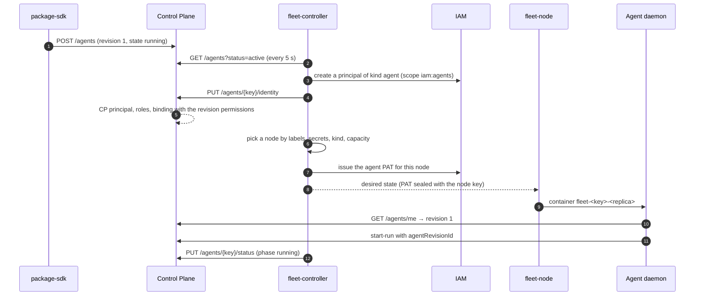

# Declarative agents

A platform agent is described by a single YAML object of kind `Agent` in a catalog package.
The description says who the agent is, which work it takes, what it executes the work with,
which working copy it uses, and where to run it. From there the platform does everything
itself: Control Plane stores the description revisions and derives the agent's identity
from them, fleet-controller places the agent on a suitable node, and the executor daemon
takes its configuration from its revision. This article is for tenant administrators and
package authors. Rationale: TAI-ADR-0052 and CP-ADR-0073.

## Three facts instead of one record

There is one description, but the platform stores three independent facts:

| Fact | Where it lives | What changes it |
|---|---|---|
| **Identity**: a principal in IAM and Control Plane, a binding with permissions | IAM and Control Plane | derived from the description; survives a change of model, executor kind, and node. The event log refers to the principal, not to the description |
| **Revision**: an immutable snapshot of the description | Control Plane (`agent_revisions`) | every changed description. A run remembers which revision it ran on |
| **Placement**: which node executes the revision | fleet-controller | decided by the controller from the labels, secrets, executor kinds, and capacity of nodes |

Separately from the revision, the core stores the **desired state** (`state`, the number of
instances) and the **actual state**, which only fleet-controller writes. Stopping an agent
does not create a new revision, and a new revision does not cancel a stop.

```mermaid
flowchart LR
    Y["YAML of kind Agent<br/>in a package"] -->|package-sdk apply| CP["Control Plane<br/>revisions, desired state"]
    CP -->|GET /agents| FC["fleet-controller"]
    FC -->|iam:agents: principal, PAT| IAM["IAM"]
    FC -->|PUT /agents/{key}/identity| CP
    FC -->|node desired state| N["fleet-node"]
    N -->|container| D["control-plane-agent daemon"]
    D -->|GET /agents/me| CP
    FC -->|PUT /agents/{key}/status| CP
```

Nodes and the controller are described in the [Nodes and fleet](fleet.md) article.

## Example description

```yaml
# yaml-language-server: $schema=../../../sdk/package-sdk/schema/v1/object.schema.json
apiVersion: taimen.ai/v1
kind: Agent
key: coder
spec:
  displayName: Autonomous coder
  description: Coding executor for the service repository
  identity:
    kind: agent
    permissions:
    - sessions.open
    - tasks.read
    - tasks.write
    - tasks.claim
    - claims.manage
    - events.read
    - artifacts.read
    - artifacts.write
    - projects.read
    - workspaces.read
    - task_types.read
    - goals.read
    - rules.read
  work:
    workspace: ${AGENTS_WORKSPACE_ID}
    onlyAssigned: true
    taskTypes: [coding-task]
  executor:
    kind: claude-code
    params:
      model: <model-id>
      permissionMode: bypassPermissions
      timeoutSeconds: 10800
      tools:
        deny: [WebFetch]
    instructions: |
      # Repository conventions
      - Run the full test suite before reporting.
      - Do not touch main or other people's branches: the daemon publishes the task branch.
  workingCopy:
    repository: https://git.example.com/org/service.git
    directory: service
    baseRef: main
    neighbours:
      platform-auth-sdk: https://git.example.com/org/platform-auth-sdk.git
    superproject: https://git.example.com/org/platform.git
    publish: true
  skills:
    protocols: [local]
    local:
    - example_package.checks:invoke
  placement:
    requires: [repos, claude-subscription]
    secrets: [claude-oauth-token, github-token]
    resources: {cpus: 2, memoryMb: 4096}
    replicas: 1
    drainSeconds: 14400
  state: running
```

The `# yaml-language-server: $schema=…` line enables hints from the
`sdk/package-sdk/schema/v1/object.schema.json` schema (`$defs.agentSpec`) in the editor.

## Object envelope

| Field | Rule |
|---|---|
| `apiVersion` | `taimen.ai/v1` |
| `kind` | `Agent` |
| `key` | slug `^[a-z0-9][a-z0-9-]*$`, 2–63 characters. The key of a retired agent is not reused |
| `spec` | the body of the description, sections below. `displayName` and `identity` are required; `executor` is required for all agents except `placement: none` |

The core rejects an unknown field in any section except `executor.params` with `400
invalid_request`: a typo in `onlyAssigned` does not silently turn into "take any work".

## `spec` sections

### `displayName`, `description`

The agent name (1–200 characters), which is also the name of its principal in Control Plane.
The description is up to 2000 characters.

### `identity`: identity

| Field | Meaning |
|---|---|
| `kind` | `agent` for an executor, `service` for a platform service on IAM client credentials (see [below](#service-agents)). Required. For an agent with an already bound identity, `kind` does not change (`409 agent_identity_conflict`) |
| `permissions` | Control Plane permissions (`tasks.claim`, `artifacts.write`, …). The core requires a non-empty list: an agent without permissions cannot read even its own task |
| `roles` | slugs of tenant-level roles; roles inside a workspace are not assigned by a description |
| `capabilities` | names of tenant capabilities |
| `iam` | `{audiences, scopeCeiling}`: the IAM part of a service credential, 1–20 audiences and 1–50 scopes of the form `<audience>:<action>`. The core stores the section but does not interpret it; it is read by whoever issues the credential (the installation bootstrap) |

Permissions and roles are checked on every application, before the write:

- an unknown permission gives `422 invalid_permissions`;
- human-only permissions (`admin`, `approvals.decide`) on an `agent` or a `service` give
  `422 permissions_not_allowed_for_kind`;
- every permission must be held by whoever applies the description (except an
  administrator), otherwise `403 permission_escalation` with `details.missing`;
- `roles` and `capabilities` require `org.manage` from the applier, otherwise `403
  permission_escalation`; a nonexistent role or capability gives `422 unknown_reference`.

The authority of the agent's binding is the authority of whoever applied the revision. If
that person's permissions are revoked later, what was granted to the agent is not revoked.

### `work`: which work to take

| Field | Default | Meaning |
|---|---|---|
| `workspace` | — | the workspace to take tasks from |
| `project` | — | the project |
| `includeSubprojects` | `false` | including subprojects |
| `onlyAssigned` | `true` | only tasks assigned to this agent (`assigneeId`) |
| `taskTypes` | empty, meaning any | keys of the task types the agent takes |

In a package, `workspace` and `project` are written as an installation variable `${NAME}` or
as a UUID: the environment topology does not get into the package. The core checks that the
workspace, the project, and the task types exist and that the workspace is visible to the
applier, otherwise `422 unknown_reference`.

!!! note "The `onlyAssigned` default differs between a description and env mode"
    In an agent description `onlyAssigned` defaults to `true`: the agent takes only work
    intended for it. For a daemon started without a description (env mode), the filter is
    off until `CONTROL_PLANE_AGENT_ONLY_ASSIGNED=1` is set.

### `executor`: what to execute with { #executor }

| Field | Meaning |
|---|---|
| `kind` | `claude-code`, `codex`, `skills`, `git-connector`, or `observer` |
| `params` | parameters of the kind (below). The core stores them without interpreting; the package schema and the adapter at daemon startup validate them |
| `image` | optional: the executor image, a reference `[registry[:port]/]path:tag`, `…@sha256:<64 hex>`, or `…:tag@sha256:<64 hex>`, up to 255 characters. A tag or a digest is required |
| `instructions` | instructions for the executor, up to 64 KiB. A layer after the platform, project, and task type instructions (CP-ADR-0066); replaces the former conventions file |

For the core, the executor kind is a string. The node picks the default image for a kind
from its configuration. A description can name its own image in the `image` field; this is
how an integration package brings an image with its code:

```yaml
executor:
  kind: observer
  image: registry.example.com/claims/observer:1.2.0
  params:
    entrypoint: claims_integration.observer:observe
```

- The core checks only the form of the reference: without a tag and a digest, with spaces,
  or with credentials it gives `400 invalid_request` with `loc` `body.spec.executor.image`.
- The image is part of the revision and its hash: changing the image is a new revision, and
  removing the field returns the hash of the description without it. `GET /agents/me` and
  the agent list return `spec.executor.image`; the image is not included in the
  `agent.revision_published` event.
- Naming an image does not grant the right to run it. A node runs it only if the node's
  `executors.<kind>.images` list allows the image; otherwise the agent waits with the reason
  `image_not_allowed` (see [Nodes and fleet](fleet.md#images)). Without `image`, the agent
  runs on the default image of its kind.

=== "claude-code"

    | Parameter | Default | Meaning |
    |---|---|---|
    | `model` | as in the CLI | model |
    | `permissionMode` | `acceptEdits` | `default`, `acceptEdits`, `plan`, `bypassPermissions` |
    | `timeoutSeconds` | `3600` | turn ceiling, 60–14400 |
    | `resume` | `true` | continue the session of the previous attempt |
    | `tools.allow` | — | goes to `--allowedTools` without the authoritative Control Plane commands |
    | `tools.deny` | — | added to the ban on authoritative commands (`--disallowedTools`) |

    A description cannot lift the ban on authoritative Control Plane commands inside the
    agent.

=== "codex"

    | Parameter | Default | Meaning |
    |---|---|---|
    | `model` | as in the CLI | model |
    | `sandbox` | `workspace-write` | `read-only`, `workspace-write`, `danger-full-access` |
    | `timeoutSeconds` | `3600` | turn ceiling, 60–14400 |
    | `resume` | `true` | continue the session |
    | `credentialClass` | — | whose credential is spent: `subscription` or `api_key` |

=== "skills"

    No parameters. The agent executes only the skills from the `skills` section and work
    whose type declares execution by a skill; it does not take ordinary tasks. The daemon
    does not start the `skills` kind without a `skills` section.

=== "git-connector"

    A source of observations about git repositories: it takes no tasks, but writes
    observations to the workspace from the `work` section (`POST /api/v1/observations`) and
    contract snapshots to memory through the core (`POST /api/v1/knowledge/snapshots`). What
    to observe is set only by the description: the list of repositories is stored neither
    in the code nor in compose. `params` are required.

    | Parameter | Default | Meaning |
    |---|---|---|
    | `repositories` | — (required) | 1–50 items `{name, url, branch}`: `name` (`^[a-z0-9][a-z0-9._-]*$`) is the name in observations (`payload.data.repo`, source `git:<name>`); `branch` defaults to `main` |
    | `observe` | `[commits]` | observation kinds: `commits` gives `repo.commit_observed`, `adrRegistry` gives `adr.registry_observed`, `ciRuns` gives `ci.run_observed` |
    | `intervalSeconds` | `300` | polling period, 60–86400 |
    | `knowledgeSnapshots` | `true` | send contract snapshots to memory |
    | `registryRepository` | — | which repository (`name`) to read the ADR registry from; required for `adrRegistry` if there is more than one repository |
    | `ciRepository` | — | `owner/repo` of the CI runs; required for `ciRuns` |
    | `ciBranch` | `main` | branch of the CI runs |

    ```yaml
    identity:
      kind: agent
      permissions: [observations.write, tasks.read]
    work:
      workspace: ${AGENTS_WORKSPACE_ID}
    executor:
      kind: git-connector
      params:
        repositories:
          - {name: service, url: "https://git.example.com/<org>/service.git"}
          - {name: platform, url: "${PLATFORM_REPOSITORY_URL}", branch: main}
        observe: [commits, adrRegistry, ciRuns]
        registryRepository: platform
        ciRepository: <org>/platform
        intervalSeconds: 300
    placement:
      requires: [platform-node]
      secrets: [github-token]
      resources: {cpus: 1, memoryMb: 384}
    ```

    The connector process reads its revision (`GET /agents/me`) and on a new revision exits
    with code 75, like the executor daemon; an agent in `stopped` or retired exits with 0;
    a principal that is not an agent, or another executor kind, exits with code 2. This is
    the common observer environment `package_sdk.connector`: `params` that cannot be
    executed (a required one is missing, repository names repeat) are a cycle failure with
    a `connector.cycle_failed` observation once an hour. The connector keeps its cursor (the
    last revisions it sent) and the repository clones in the replica volume
    (`<dataPath>/connector-state.json` and `<dataPath>/repos`), so a restart and a new
    revision do not repeat observations. The forge token for reading repositories and CI
    runs is a node secret named in `placement.secrets` (see [Nodes and
    fleet](fleet.md#node-secrets)).

=== "observer"

    A source of observations for an integration package: a long-lived process that polls an
    external system in a cycle and writes observations to the workspace from the `work`
    section. It takes no tasks. The observer code lives in the image, either the one named in
    `executor.image` or the node's default image of the `observer` kind; the description
    names the entry point and passes data to it. `params` are required. How to write an
    observer and build the image is in the [Integrations](../packages/integrations.md#observer)
    article.

    | Parameter | Default | Meaning |
    |---|---|---|
    | `entrypoint` | — (required) | the observer `module:function`; the image process checks that it executes exactly this one, otherwise it exits with code 2 |
    | `intervalSeconds` | `900` | pause between cycles, 60–86400 |
    | `config` | — | integration parameters (filters, addresses, limits) interpreted by the integration code. The schema does not allow keys ending in `token`, `secret`, `password`: secrets come only as node secret files from `placement.secrets` |

    ```yaml
    identity:
      kind: agent
      permissions: [observations.write, artifacts.write]
    work:
      workspace: ${SOURCE_WORKSPACE_ID}
    executor:
      kind: observer
      params:
        entrypoint: <integration>.agent:observe
        intervalSeconds: 900
        config:
          filters: {minPrice: 1000000}
    placement:
      requires: [<node label with access to the source>]
      secrets: [<source secret name>]
      resources: {cpus: 0.5, memoryMb: 256}
    ```

    The process reads its revision the same way as the git connector: a new revision means
    exit 75, `stopped` or retirement means exit 0, and the state lives in the replica volume
    (the node's `dataPath`). The controller places the agent only on a node that has a file
    for every named secret, so a secret that does not exist yet is created as an empty file.
    The integration observer must re-read the file on every cycle and, if there is no value,
    not crash but report it with an observation.

The adapter does not replace an unknown or invalid parameter with a default: the daemon
exits with code `2`, and the node shows the agent in `crash_looping`.

### `workingCopy`: working copy

The core stores the section as data: it only checks that it is an object, looks for secret
material in it, and includes the section in the revision hash. The form is validated by the
executor kind schema (`$defs.agentWorkingCopies` in
`sdk/package-sdk/schema/v1/object.schema.json`) and by the executor daemon. The
`claude-code` kind has two forms: **a single repository** and **a repository catalog**. The
catalog is chosen if the section has `repositories` or `repositoryField`.

#### A single repository

| Field | Default | Meaning |
|---|---|---|
| `repository` | — (required) | URL of the working repository |
| `directory` | repository name | repository directory in the working copy (`^[a-z0-9][a-z0-9._-]*$`) |
| `baseRef` | the mirror's `HEAD` | what to branch from |
| `neighbours` | — | neighbouring repositories `name: URL`; laid out alongside at the revisions pinned by the superproject |
| `superproject` | — | URL of the superproject that pins the neighbours' revisions |
| `publish` | `true` | publish the task branch to the mirror's `origin` |
| `review` | — | **deprecated**, see below |

Repositories in the description are URLs. The daemon cuts working copies from the host's
bare mirrors: the mirror `<copies root>/.mirrors/<name>.git` (or a directory from
`CONTROL_PLANE_AGENT_MIRRORS`) is created with `git clone --bare` on first access. If a
mirror with that name already exists but its `origin` is a different URL, the daemon exits
with code `2`: two repositories with the same name on one host are separated by a human.
More on copies and neighbours: [Working copies](execution-workspace.md).

!!! warning "`workingCopy.review` is deprecated"
    Code review is declared by the **task type** with acceptance criteria (human review,
    then merge), not by the agent description: see [Type
    acceptance](../control-plane/task-types.md#type-acceptance). The format schema marks the
    section `deprecated`, the core still accepts it, but the executor daemon does not read
    the section: a revision with it runs without its own review, and a warning is written
    to the log. Remove the section from descriptions.

#### Repository catalog { #working-copy-catalog }

One coding agent executes tasks of several repositories. A task field names the task's
repository, and the addresses are taken only from the catalog:

```yaml
workingCopy:
  repositoryField: repositoryKey
  superproject: platform
  publish: true
  repositories:
    service: {url: "${SERVICE_REPO_URL}", baseRef: main}
    platform:
      url: "${PLATFORM_REPO_URL}"
      baseRef: main
      aliases: [umbrella]
    platform-auth-sdk: {url: "${AUTH_SDK_REPO_URL}", baseRef: main, publish: false}
```

| Field | Default | Meaning |
|---|---|---|
| `repositoryField` | — (required) | name of the task's `customFields` field with the repository key (`^[A-Za-z][A-Za-z0-9_]{0,62}$`) |
| `repositories` | — (required) | 1–50 entries `key: {url, baseRef?, directory?, publish?, aliases?}`; the key is `^[a-z0-9][a-z0-9-]{0,62}$` |
| `repositories.<key>.url` | — (required) | an installation variable `${…}` or `https` without credentials, query, or fragment |
| `repositories.<key>.baseRef` | the mirror's `HEAD` | base branch if the task has none of its own |
| `repositories.<key>.directory` | the key | copy directory in the task container |
| `repositories.<key>.publish` | the catalog's `publish` | `false` for a neighbour the agent does not write to |
| `repositories.<key>.aliases` | — | former names accepted instead of the key (Latin and Cyrillic letters, digits, `. _ -`) |
| `superproject` | — | key of the entry whose submodules pin the neighbours' revisions |
| `publish` | `true` | publish task branches to the forge |

- The daemon looks up the entry by the value of the task field, a key or an alias,
  case-insensitively. An address from the task is not accepted, and there is no default: a
  task without a key or with an unknown key goes to `blocked` with the reason
  `repository_unknown`.
- A key changed on a task when the previous copy already has work gives `blocked` with the
  reason `repository_changed`; without work, the previous copy is deleted.
- A pool of working copies per key is created on the repository's first task; the task
  branch is `task/<publicId>`.
- Neighbours, the install command, test services, and checks are set by the repository's
  own `.agents/runner.yaml` file; the daemon reads it from the base revision.
- Keys and aliases do not repeat (case-insensitively), nor do entry addresses and
  directories; `package-sdk check` verifies this, and a daemon with an invalid catalog does
  not start.


The core checks keys inside `workingCopy` (including neighbour names), `executor.params`, and
`placement.resources` for secret material: a key whose name looks like a secret (`token`,
`password`, and so on) gives `422 secret_material_rejected` with the path in
`details.path`. Secrets are passed only by name in `placement.secrets`.

### `skills`: skills the agent executes itself

| Field | Meaning |
|---|---|
| `protocols` | a subset of `local`, `http`, `mcp` |
| `local` | allowed entrypoints `module:function` or packages |
| `httpOrigins` | `scheme://host[:port]` the `http` protocol may call |
| `mcpOrigins` | the same for remote MCP servers |
| `audiences` | IAM audiences for which the skills receive a token |
| `concurrency` | 1–32 concurrent calls |

What is not in the description is not available to the executor either, even if it is set
on the host with a `CONTROL_PLANE_SKILLS_*` variable. The host keeps the isolation of local
skills, trusted internal hosts, and stdio MCP servers. To execute skills, the agent needs the
`skills.execute` permission.

`skills.audiences` also affects the agent's PAT: fleet-controller issues a token for the
`control-plane` audience and for those audiences from this list that are allowed to the
controller itself (see [Nodes and fleet](fleet.md#identity-and-pat)).

### `placement`: where and how many

| Field | Default | Meaning |
|---|---|---|
| `requires` | — | labels the node must have: `name` (matches `name` and `name=…`) or `name=value` (exact) |
| `secrets` | — | names of secrets that must be present on the node (`^[a-z0-9][a-z0-9-]{0,62}$`); the values are not written into the description |
| `resources.cpus` | — | CPU per instance, an **integer**: the core rejects a fractional core with `422 non_canonical_value` |
| `resources.memoryMb` | — | memory per instance, 64–262144 |
| `replicas` | `1` | number of instances, 0–20; stored as the desired state |
| `drainSeconds` | `14400` | how long to wait for an in-flight run when stopping, 0–14400 |

Instead of an object you can write `placement: none`: the agent then has only an identity,
without a process. Without the `placement` field, the agent is placed with the defaults.

### `state`

`running` (default) or `stopped`. Stored as the desired state, not in the revision.

## Revisions

Every applied change to a description is a new revision: a number starting from 1 within the
key, `spec`, `specHash`, `createdBy`, `createdAt`. A revision is neither changed nor deleted.

- **Hash.** `specHash` is `sha256:<hex>` of the canonical JSON of the description as it was
  sent: keys sorted, strings in NFC, no defaults substituted, and no desired state fields
  (`state`, `placement.replicas`). Floating-point numbers are forbidden. The whole `spec` is
  up to 256 KiB.
- **A new revision** appears only if the hash differs from the current one. Applying the
  same file again returns `200` without a revision and without an event; the first or a
  changed description returns `201` and the `agent.revision_published` event.
- **Rollback** means applying the previous file: revision N+1 appears with the same hash as
  N−1. The history is linear, and the rollback is visible in the log.
- **Address.** `GET /api/v1/agents/{key}` returns the current revision, `GET
  /api/v1/agents/{key}@{revision}` the specified one.
- **A run** stores `agentRevisionId`. A principal bound to an agent must name its agent's
  revision in `POST /tasks/{ref}:start-run`: without it, `422 agent_revision_required`;
  with someone else's, `422 agent_revision_mismatch`. A revision of its own agent that is
  not the current one is accepted: the executor learns about a new revision between runs.

## Applying through packages

An agent is applied like any catalog object, with `package-sdk` (see [Catalog
packages](../control-plane/catalog-packages.md#agent)):

```bash
make packages-check                                   # schema, core AgentSpec, references
export CP_TOKEN=<access-token audience control-plane>
package-sdk plan --install deploy/<environment>/packages.yaml \
  --server https://platform.example.com --out plan.json
package-sdk apply --plan plan.json --server https://platform.example.com
```

For each agent the installer:

1. substitutes `${NAME}` variables from `.env` and the environment;
2. on `plan`, calls `POST /api/v1/agents:validate`: the same checks as publication, without
   a write. The response says whether there will be a new revision (`wouldCreateRevision`)
   and whether the desired state changes (`wouldChangeState`); for a package with processes
   or calendars, the core itself plans the agents together with them
   (`POST /api/v1/packages:plan`);
3. on `apply --plan`, if nothing changes, prints `ревизия N без изменений` ("revision N
   unchanged"); otherwise calls `POST /api/v1/agents`.

```text
   Agent/coder: опубликована ревизия 4, running × 1
   Agent/reviewer: ревизия 2 без изменений
```

The output reads: "Agent/coder: revision 4 published, running × 1" and "Agent/reviewer:
revision 2 unchanged".

Order of kinds on application: `WorkspaceType` → `Capability` → `ConnectionType` → `Role` →
`Skill` → `ArtifactType` → `TaskType` → **`Agent`** → `ProjectTemplate` → `WorkRule` →
`NotificationRule`. An agent refers to roles and task types, so it comes after them, and a
rule with an identity (`identity.agent`) refers to an agent, so it comes after it. `check`
additionally requires `work.taskTypes` to be declared in the package or its `requires`, and
warns about roles not declared in the packages.

The `package-sdk` token needs the `agents.manage` permission for agents, as well as the
permissions it grants to the agent (otherwise `permission_escalation`).

!!! warning "The package is the source of truth for the state as well"
    `POST /agents` applies `state` and `placement.replicas` from the file in the same
    transaction as the revision. An agent stopped manually will be started again by the
    next package application if the file says `state: running`. Stop an agent by editing
    the file.

### Calling the API directly

```bash
curl -sS -X POST https://platform.example.com/api/v1/agents:validate \
  -H "Authorization: Bearer $CP_TOKEN" -H 'Content-Type: application/json' \
  -d '{"key": "coder", "spec": { ... }}'
```

```json
{
  "key": "coder",
  "specHash": "sha256:9f2c…",
  "currentRevision": 3,
  "wouldCreateRevision": true,
  "wouldChangeState": false
}
```

The response of `POST /api/v1/agents` and `GET /api/v1/agents/{key}` is the agent with a
revision:

```json
{
  "id": "<agent-id>",
  "tenantId": "<tenant-id>",
  "key": "coder",
  "displayName": "Autonomous coder",
  "status": "active",
  "state": "running",
  "replicas": 1,
  "currentRevision": 4,
  "revision": {
    "id": "<revision-id>",
    "agentId": "<agent-id>",
    "agentKey": "coder",
    "revision": 4,
    "spec": {"displayName": "Autonomous coder", "identity": {"kind": "agent", "permissions": ["…"]}},
    "specHash": "sha256:…",
    "createdBy": "<principal-id>",
    "createdAt": "2026-01-15T10:00:00Z"
  },
  "principalId": "<principal-id>",
  "workspaceId": "<workspace-id>",
  "retiredAt": null,
  "retiredBy": null,
  "version": 5,
  "createdAt": "2026-01-10T09:00:00Z",
  "updatedAt": "2026-01-15T10:00:00Z"
}
```

`principalId` appears once the agent's identity is bound (see [below](#lifecycle)).

### Exporting to a package

```bash
package-sdk export --server https://platform.example.com \
  --kind Agent --key coder [--version 3] --package packages/<package>
```

The `spec` of the revision (current or specified) is exported, and `state` and
`placement.replicas` come from the desired state. Defaults (`running`, one instance) are not
written to the file.

## Registry API

| Method and path | Permission | What it does |
|---|---|---|
| `POST /api/v1/agents` | `agents.manage` | publish a description: `201` new revision, `200` unchanged |
| `POST /api/v1/agents:validate` | `agents.manage` | all publication checks without a write; the error is the same that `POST` would return |
| `GET /api/v1/agents` | `agents.read` | list; filters `status` (`active`/`retired`), `state`, `workspaceId`; cursor `cursor`, `limit` |
| `GET /api/v1/agents/{key}` and `/{key}@{revision}` | `agents.read` | the agent with the current or specified revision |
| `GET /api/v1/agents/me` | authentication only | the calling principal's agent; not an agent gives `404` |
| `PATCH /api/v1/agents/{key}/state` | `agents.manage` | `{state?, replicas?}`: the desired state only, without a revision |
| `POST /api/v1/agents/{key}:retire` | `agents.manage` | `{reason}`: retire |
| `GET /api/v1/agents/{key}/status` | `agents.read` | actual state |
| `PUT /api/v1/agents/{key}/status` | `agents.status.write` | report of the placement service |
| `PUT /api/v1/agents/{key}/identity` | `agents.status.write` | bind the agent's IAM identity |

Only the fleet-controller service account receives `agents.status.write`; the catalog
administrator does not have this permission, and `agents.manage` does not include it. Writes
accept an optional `Idempotency-Key` header.

## Lifecycle { #lifecycle }

### First application



`PUT …/identity` is idempotent: a repeat with the same identity returns `200` without
changes, and a different identity for a bound agent gives `409 agent_identity_conflict`.
After binding, the core resets the binding cache, and the agent signs in without an API
restart.

### Changing the model or another setting

Editing the description and running `apply` produce a new revision. If `identity` changes,
the core brings the binding and role assignments to the new revision in the same
transaction. A running executor switches to the new revision itself:

1. A process always works on one revision, the one it started with, and names it in every
   `start-run`.
2. Between runs (right after a run and while idle, at most once every 30 seconds), the daemon
   reads `GET /agents/me` again.
3. When it sees a different revision, the daemon takes no new work and exits with code
   **75** (`EX_TEMPFAIL`). By that time the in-flight run has already finished on the old
   revision.
4. The node treats code 75 as a regular exit and immediately starts the container again; the
   daemon now reads the new revision.

The container is not recreated in this case. The node recreates it only if the image,
resources, set of secrets, or credential changed; then the old container is stopped with
`drainSeconds` for the in-flight run.

```yaml
# before
executor:
  kind: claude-code
  params: {model: <model-a>}
# after: a new revision, the executor switches to it after the current run
executor:
  kind: claude-code
  params: {model: <model-b>}
```

### Stopping and resuming

Edit the package file (`state: stopped` or `placement.replicas: 0`) and apply it. For a
one-off stop without a package:

```bash
curl -sS -X PATCH https://platform.example.com/api/v1/agents/coder/state \
  -H "Authorization: Bearer $CP_TOKEN" -H 'Content-Type: application/json' \
  -d '{"state": "stopped"}'
```

- The change writes the `agent.state_changed` event; the revision does not change.
- Between runs, the daemon sees `stopped` and exits with code 0.
- fleet-controller removes the placement, revokes the agent's PAT on the node, and reports
  the `stopped` phase; the node stops the container.

!!! warning "Stopping interrupts an in-flight run"
    When an agent disappears from a node's desired state (stop, `replicas: 0`, retirement),
    the node stops the container with a 30-second timeout, not `drainSeconds`. On `SIGTERM`
    the daemon stops taking work, but a long run does not have time to finish: after
    `SIGKILL` the run stays `running` until the lease expires, and recovery on the next
    start closes it (`restart_recovery`). Stop an agent when it has no run, or cancel the
    run in advance (`POST /runs/{id}:request-cancel`).

Resuming is `state: running` in the file or `PATCH …/state {"state": "running"}`.

### Retirement

Add the key to `retire.Agent` of the installation file:

```yaml
apiVersion: taimen.ai/v1
kind: Installation
key: production
spec:
  packages: [my-agents]
  retire:
    Agent: [old-coder]
```

`apply` calls `POST /api/v1/agents/{key}:retire {reason}`. In one transaction the core:

- sets `status: retired` and `state: stopped`;
- revokes the bindings of the agent's principal and moves the principal to `disabled`
  without deleting it: the history of runs and the log refer to it;
- releases the agent's active claims, and the tasks return to the queue;
- writes the `agent.retired` event (`releasedClaims`, `reason`).

fleet-controller no longer sees the agent in the list of active agents, removes the
placement, and revokes the PAT. A repeated `:retire` returns `200` without an event.
Revisions, the actual state, and runs remain. Publishing to a retired key gives `409
agent_retired`: the key is not reused. A key cannot be in a package and in `retire` at the
same time.

### Actual state

```bash
curl -sS https://platform.example.com/api/v1/agents/coder/status \
  -H "Authorization: Bearer $CP_TOKEN"
```

```json
{
  "agentKey": "coder",
  "phase": "running",
  "reason": null,
  "observedRevision": 4,
  "node": "worker-1",
  "instances": {"desired": 1, "ready": 1},
  "observedAt": "2026-01-15T10:00:20Z",
  "reportedBy": "<principal-id>",
  "updatedAt": "2026-01-15T10:00:20Z"
}
```

| `phase` | Meaning | `reason.code` from fleet-controller |
|---|---|---|
| `unknown` | no report yet; stays so forever for `placement: none` | — |
| `pending` | placed, the executor has not come up yet | `identity_pending`: the identity or the PAT is not ready yet |
| `running` | at least as many ready instances as desired | — |
| `waiting_for_node` | no suitable node | `no_node`, `no_executor_kind`, `image_not_allowed`, `no_label`, `no_secret`, `no_capacity` |
| `crash_looping` | an instance crashes on startup | `crash_loop`, the last reason is in `message` |
| `node_unavailable` | the node stopped reporting, and there is nowhere to move | `node_offline` |
| `stopped` | stopped according to the desired state | — |

`observedRevision` is the revision the node received for the running instances. Comparing it
with `currentRevision` shows whether an edit has reached the executor. The
`agent.status_changed` event is written only when `phase`, `reason.code`, `node`, or
`observedRevision` changes.

## Events

| Type | When | Payload |
|---|---|---|
| `agent.revision_published` | new revision | `key, revision, specHash, previousRevision, executorKind, placed, permissionsChanged` |
| `agent.state_changed` | `state` or `replicas` changed | `key, state, replicas, previousState, previousReplicas` |
| `agent.status_changed` | the actual state changed | `key, phase, previousPhase, reasonCode, node, observedRevision, observedAt` |
| `agent.retired` | retirement | `key, revision, principalId, reason, releasedClaims` |

`entityType` is `agent`, and the envelope's `workspaceId` is the workspace from `work`. The
full description is not put into the event: a consumer reads the revision with `GET
/agents/{key}@{revision}`. The first application of a key writes both
`agent.revision_published` and `agent.state_changed` with `previousState: null`.

## Agent reference: `agent:<key>` { #agent-ref }

A task executor can be assigned not by the UUID of its principal but by a reference to the
agent description, `agent:<key>` (`^agent:[a-z0-9][a-z0-9-]{0,62}$`). This way documents,
packages, and rules do not carry identity identifiers of a specific installation. The
reference is accepted by:

- `assigneeId` in `POST /tasks` and `PATCH /tasks/{ref}`;
- `assignee` in `ensureWork` of approval outcomes and in the task type's `completionSchema`;
- `fields.assignee` of the `ensure_work` and `request_decision` rule actions (see [Work
  rules](../control-plane/work-rules.md)).

```bash
curl -sS -X POST https://platform.example.com/api/v1/tasks \
  -H "Authorization: Bearer $TOKEN" -H 'Content-Type: application/json' \
  -d '{"title": "Add a date filter", "typeKey": "coding-task",
       "workspaceId": "<workspace-id>", "assigneeId": "agent:coder"}'
```

- On write, the core replaces the reference with the agent's `principalId` in the tenant.
  The task stores, and the API returns, the UUID (`TaskOut.assigneeId`): an assignment is a
  fact about an identity, not about a description. In rule and outcome templates, the
  reference is resolved after rendering, when the action is executed.
- The refusal is `422 unknown_agent`, `details: {field, agent}`, if there is no agent with
  that key, it is retired, or it is not yet bound to an identity (there is no one to
  assign). `details.field` is the request field: `assigneeId`, `ensureWork.assignee`,
  `action.fields.assignee`. In a rule or an outcome, this is a command error that rolls the
  action back.
- No separate permission is needed: the reference is resolved inside the task write
  **after** the `tasks.write` check, so without the write permission the response is `403`,
  not information about whether the agent exists. `agents.read` is not required.
- `package-sdk check` verifies literal `agent:<key>` references in a package: the agent must
  be described in the same package or its `requires` and must not be retired by the same
  installation.

## The agent stopped without a result { #blocked }

An executor that cannot do the work (no access, a contradictory task, a decision that
belongs to a human) must not hand in the run as successful: otherwise the task would be
completed and its acceptance would start on undone work. The signal for this is
**structural**; the report text is not parsed:

- an executor with Control Plane tools leaves a checkpoint of kind `blocked` with
  `data.reason` on the run (`cp_checkpoint`), as the platform contract in the executor
  instructions requires;
- an executor without them (Codex) writes the reason to the file from the
  `CONTROL_PLANE_BLOCKED_FILE` variable; the adapter turns the file into the same
  checkpoint.

After the executor's turn, the daemon reads the run's checkpoints. On a signal:

1. the run fails with the reason **`executor_blocked`**, the report is published, and there
   is no commit;
2. the task under the claim moves to the first status of the `blocked` category reachable
   from the current one by its type's lifecycle;
3. the reason is written as a comment on the task (up to 2000 characters, without local
   paths);
4. the claim is released.

The task is not completed: no verification attempt is opened and no review is requested. The
daemon does not take a task in the `blocked` category until a human returns it to work. A
run without a signal, even without changes, behaves as before.

## Service agents { #service-agents }

Platform services that work on IAM client credentials (for example notification-service,
or fleet-controller itself) are also described with the `Agent` kind:

```yaml
apiVersion: taimen.ai/v1
kind: Agent
key: fleet-controller
spec:
  displayName: Fleet Controller
  identity:
    kind: service
    permissions: [agents.read, agents.status.write]
    iam:
      audiences: [control-plane, iam, notification-service]
      scopeCeiling:
      - control-plane:read
      - control-plane:write
      - iam:agents
      - notifications:send
  placement: none
```

- `identity.kind: service` and `placement: none`: there is no process, and `executor` and
  `work` are not needed.
- The description is the source of the service's permissions in Control Plane
  (`permissions`) and of the IAM part of its service account (`identity.iam`).
- The credential is issued by `deploy/bootstrap.py`: from `identity.iam` it creates an IAM
  service account, writes its client credentials to `secrets/<service>-iam.env`, publishes
  the description (`POST /agents`), and binds the identity (`PUT /agents/{key}/identity`);
  the core derives the principal and the binding. If the ceiling or the audiences in the
  description changed, bootstrap issues the service account again and revokes the previous
  one; the service must be restarted.
- fleet-controller neither touches nor places such identities; the actual state stays
  `unknown`.
- Such an agent can be the **rules identity** of a package: a rule with `identity: {agent:
  <key>}` acts with its authority and becomes the author of the work it creates (see [Rule
  identity](../control-plane/work-rules.md#identity)). The agent's permissions are exactly
  those the rule actions need.

An agent of kind `agent` with `placement: none` is an identity without a process:
fleet-controller creates its principal in IAM and binds it in the core, but neither issues a
PAT nor places it.

## Common problems

| Symptom | Cause and fix |
|---|---|
| `403 permission_escalation`, `details.missing` | the `package-sdk` token lacks the permissions granted to the agent, or `org.manage` for roles; apply with a token that has these permissions |
| `422 permissions_not_allowed_for_kind` | `admin` or `approvals.decide` in the agent's `identity.permissions`: remove them |
| `422 non_canonical_value` | a fractional `resources.cpus` or another floating-point number: integers only |
| `422 unknown_reference` | no such workspace, project, task type, role, or capability; the workspace slug is ambiguous: use a UUID |
| `409 agent_retired` | the key is retired: create the agent with a new key |
| `409 agent_identity_conflict` | `identity.kind` was changed on a bound agent: this is a new agent with a new key |
| `400 invalid_request`, `loc` `body.spec.executor.image` | an image reference without a tag and a digest, or with invalid characters |
| the agent is in `waiting_for_node`, `image_not_allowed` | no node with the agent's kind allows `executor.image`: the node administrator adds the image to `executors.<kind>.images`, or the field is removed from the description |
| the agent is in `waiting_for_node` | see `reason.code` and [Nodes and fleet](fleet.md#troubleshooting) |
| the agent is in `crash_looping`, the daemon exits with code 2 | the description cannot be executed on the node: invalid `executor.params`, a `skills` agent without a `skills` section, a `git-connector` without the required `params`, a mirror with a different `origin`. The reason is in the log of the `fleet-<key>-<replica>` container |
| `422 unknown_agent` when assigning `agent:<key>` | the agent does not exist, is retired, or is not yet bound to an identity: check `GET /agents/{key}` and `principalId` |
| the task went to `blocked`, the run is `failed: executor_blocked` | the executor reported that it cannot do the work; the reason is in the task comment. Fix the cause and return the task to work |
| `422 agent_revision_required` on a run | the agent principal's process was started in env mode (`CONTROL_PLANE_AGENT_CONFIG=env`): remove the variable |
| a manual stop was undone | the next package `apply` restored `state` from the file: stop by editing the file |

## See also

- [Nodes and fleet](fleet.md)
- [Package agents](../packages/agents.md): which agent to create in a package
- [Catalog packages](../control-plane/catalog-packages.md)
- [Executor configuration](configuration.md)
- [Executor adapters](adapters.md)
- [Working copies](execution-workspace.md)
- [Work rules](../control-plane/work-rules.md): the rules identity
- [Agent identity](agent-identity.md)
- [Bootstrap](../getting-started/bootstrap.md)
