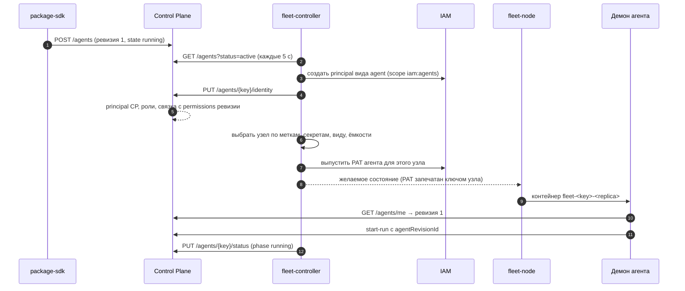

# Агенты описанием

Агент платформы описывается одним YAML-объектом вида `Agent` в пакете каталога. В описании
сказано, кто агент, какую работу он берёт, чем её исполняет, с какой рабочей копией и где
его запускать. Дальше платформа всё делает сама: Control Plane хранит ревизии описания и
выводит из них личность агента, fleet-controller размещает агента на подходящем узле, а
демон исполнителя берёт конфигурацию из своей ревизии. Статья для администраторов tenant'а
и авторов пакетов. Обоснование — TAI-ADR-0052 и CP-ADR-0073.

## Три факта вместо одной записи

Описание одно, но платформа хранит три независимых факта:

| Факт | Где живёт | Что меняет |
|---|---|---|
| **Личность** — principal в IAM и Control Plane, связка с правами | IAM и Control Plane | выводится из описания; переживает смену модели, вида исполнителя и узла. Журнал событий ссылается на principal, а не на описание |
| **Ревизия** — неизменяемый снимок описания | Control Plane (`agent_revisions`) | каждое изменённое описание. Прогон запоминает, по какой ревизии шёл |
| **Размещение** — какой узел исполняет ревизию | fleet-controller | решает контроллер по меткам, секретам, видам исполнителя и ёмкости узлов |

Отдельно от ревизии ядро хранит **желаемое состояние** (`state`, число экземпляров) и
**фактическое состояние**, которое пишет только fleet-controller. Остановка агента не
создаёт новую ревизию, а новая ревизия не отменяет остановку.

```mermaid
flowchart LR
    Y["YAML вида Agent<br/>в пакете"] -->|package-sdk apply| CP["Control Plane<br/>ревизии, желаемое состояние"]
    CP -->|GET /agents| FC["fleet-controller"]
    FC -->|iam:agents: principal, PAT| IAM["IAM"]
    FC -->|PUT /agents/{key}/identity| CP
    FC -->|желаемое состояние узла| N["fleet-node"]
    N -->|контейнер| D["демон control-plane-agent"]
    D -->|GET /agents/me| CP
    FC -->|PUT /agents/{key}/status| CP
```

Узлы и контроллер описаны в статье [Узлы и fleet](fleet.md).

## Пример описания

```yaml
# yaml-language-server: $schema=../../../sdk/package-sdk/schema/v1/object.schema.json
apiVersion: taimen.ai/v1
kind: Agent
key: coder
spec:
  displayName: Autonomous coder
  description: Кодовый исполнитель репозитория сервиса
  identity:
    kind: agent
    permissions:
    - sessions.open
    - tasks.read
    - tasks.write
    - tasks.claim
    - claims.manage
    - events.read
    - artifacts.read
    - artifacts.write
    - projects.read
    - workspaces.read
    - task_types.read
    - goals.read
    - rules.read
  work:
    workspace: ${AGENTS_WORKSPACE_ID}
    onlyAssigned: true
    taskTypes: [coding-task]
  executor:
    kind: claude-code
    params:
      model: <model-id>
      permissionMode: bypassPermissions
      timeoutSeconds: 10800
      tools:
        deny: [WebFetch]
    instructions: |
      # Соглашения репозитория
      - Полный прогон тестов перед отчётом.
      - Не трогай main и чужие ветки: ветку задачи публикует демон.
  workingCopy:
    repository: https://git.example.com/org/service.git
    directory: service
    baseRef: main
    neighbours:
      platform-auth-sdk: https://git.example.com/org/platform-auth-sdk.git
    superproject: https://git.example.com/org/platform.git
    publish: true
  skills:
    protocols: [local]
    local:
    - example_package.checks:invoke
  placement:
    requires: [repos, claude-subscription]
    secrets: [claude-oauth-token, github-token]
    resources: {cpus: 2, memoryMb: 4096}
    replicas: 1
    drainSeconds: 14400
  state: running
```

Строка `# yaml-language-server: $schema=…` включает подсказки по схеме
`sdk/package-sdk/schema/v1/object.schema.json` (`$defs.agentSpec`) в редакторе.

## Обёртка объекта

| Поле | Правило |
|---|---|
| `apiVersion` | `taimen.ai/v1` |
| `kind` | `Agent` |
| `key` | slug `^[a-z0-9][a-z0-9-]*$`, 2–63 символа. Ключ выведенного из оборота агента заново не используется |
| `spec` | тело описания, разделы ниже. Обязательны `displayName` и `identity`; `executor` обязателен у всех агентов, кроме `placement: none` |

Неизвестное поле в любом разделе, кроме `executor.params`, ядро отвергает `400
invalid_request`: опечатка в `onlyAssigned` не превращается молча в «брать любую работу».

## Разделы `spec`

### `displayName`, `description`

Имя агента (1–200 символов) — оно же имя его principal в Control Plane. Описание — до
2000 символов.

### `identity` — личность

| Поле | Значение |
|---|---|
| `kind` | `agent` — исполнитель, `service` — сервис платформы на client credentials IAM (см. [ниже](#service-agents)). Обязательно. У агента с уже привязанной личностью `kind` не меняется (`409 agent_identity_conflict`) |
| `permissions` | права Control Plane (`tasks.claim`, `artifacts.write`, …). Ядро требует непустой список: агент без прав не прочтёт даже свою задачу |
| `roles` | slug'и ролей уровня tenant'а; роли внутри workspace описанием не назначаются |
| `capabilities` | имена capabilities tenant'а |
| `iam` | `{audiences, scopeCeiling}` — IAM-часть учётки сервиса: 1–20 audiences и 1–50 scope вида `<audience>:<действие>`. Ядро хранит раздел и не толкует; его читает тот, кто выпускает учётку (bootstrap установки) |

Права и роли проверяются при каждом применении, до записи:

- неизвестное право — `422 invalid_permissions`;
- права только для человека (`admin`, `approvals.decide`) у `agent` и `service` —
  `422 permissions_not_allowed_for_kind`;
- каждое право должно быть у того, кто применяет описание (кроме администратора), иначе
  `403 permission_escalation` с `details.missing`;
- `roles` и `capabilities` требуют у применяющего `org.manage`, иначе `403
  permission_escalation`; несуществующая роль или capability — `422 unknown_reference`.

Полномочие связки агента — полномочие того, кто применил ревизию. Если позже у него
отзовут права, выданное агенту не отзывается.

### `work` — какую работу брать

| Поле | По умолчанию | Значение |
|---|---|---|
| `workspace` | — | workspace, из которого брать задачи |
| `project` | — | проект |
| `includeSubprojects` | `false` | включая подпроекты |
| `onlyAssigned` | `true` | только задачи, назначенные этому агенту (`assigneeId`) |
| `taskTypes` | пусто — любые | ключи типов задач, которые агент берёт |

`workspace` и `project` в пакете пишутся переменной установки `${ИМЯ}` или UUID:
топология окружения в пакет не попадает. Ядро проверяет, что workspace, проект и типы
задач существуют и что workspace виден применяющему, иначе `422 unknown_reference`.

!!! note "Умолчание `onlyAssigned` у описания и у env-режима разное"
    В описании агента `onlyAssigned` по умолчанию `true`: агент берёт только работу,
    предназначенную ему. У демона, запущенного без описания (env-режим), фильтр
    выключен, пока не задан `CONTROL_PLANE_AGENT_ONLY_ASSIGNED=1`.

### `executor` — чем исполнять { #executor }

| Поле | Значение |
|---|---|
| `kind` | `claude-code`, `codex`, `skills`, `git-connector` или `observer` |
| `params` | параметры вида (ниже). Ядро хранит их, не толкуя; проверяют схема пакета и адаптер при старте демона |
| `image` | необязательно: образ исполнителя, ссылка `[registry[:port]/]path:tag`, `…@sha256:<64 hex>` или `…:tag@sha256:<64 hex>`, до 255 символов. Тег или дайджест обязателен |
| `instructions` | инструкции исполнителю, до 64 KiB. Слой после инструкций платформы, проекта и типа задачи (CP-ADR-0066); заменяет прежний файл соглашений |

Вид исполнителя для ядра — строка. Образ по умолчанию для вида выбирает узел по своей
конфигурации. Описание может назвать свой образ полем `image` — так пакет интеграции
приносит образ со своим кодом:

```yaml
executor:
  kind: observer
  image: registry.example.com/claims/observer:1.2.0
  params:
    entrypoint: claims_integration.observer:observe
```

- Ядро проверяет только форму ссылки: без тега и дайджеста, с пробелами или
  учётными данными — `400 invalid_request` с `loc` `body.spec.executor.image`.
- Образ — часть ревизии и её хэша: смена образа — новая ревизия, снятие поля
  возвращает хэш описания без него. `GET /agents/me` и список агентов отдают
  `spec.executor.image`; в событие `agent.revision_published` образ не кладётся.
- Назвать образ — не право его запустить. Узел запустит его, только если образ
  допускает список `executors.<вид>.images` узла; иначе агент ждёт с причиной
  `image_not_allowed` (см. [Узлы и fleet](fleet.md#images)). Без `image` агент
  работает на образе вида по умолчанию.

=== "claude-code"

    | Параметр | По умолчанию | Значение |
    |---|---|---|
    | `model` | как у CLI | модель |
    | `permissionMode` | `acceptEdits` | `default`, `acceptEdits`, `plan`, `bypassPermissions` |
    | `timeoutSeconds` | `3600` | потолок хода, 60–14400 |
    | `resume` | `true` | продолжать сессию прошлой попытки |
    | `tools.allow` | — | уходит в `--allowedTools` без авторитетных команд Control Plane |
    | `tools.deny` | — | добавляется к запрету авторитетных команд (`--disallowedTools`) |

    Запрет авторитетных команд Control Plane внутри агента описанием не снимается.

=== "codex"

    | Параметр | По умолчанию | Значение |
    |---|---|---|
    | `model` | как у CLI | модель |
    | `sandbox` | `workspace-write` | `read-only`, `workspace-write`, `danger-full-access` |
    | `timeoutSeconds` | `3600` | потолок хода, 60–14400 |
    | `resume` | `true` | продолжать сессию |
    | `credentialClass` | — | чей credential расходуется: `subscription` или `api_key` |

=== "skills"

    Параметров нет. Агент исполняет только скиллы из раздела `skills` и работу, тип
    которой объявляет исполнение скиллом; обычные задачи он не берёт. Вид `skills` без
    раздела `skills` демон не запустит.

=== "git-connector"

    Источник наблюдений за git-репозиториями: задач он не берёт, а пишет наблюдения
    в workspace из раздела `work` (`POST /api/v1/observations`) и снимки контрактов
    в память через ядро (`POST /api/v1/knowledge/snapshots`). Что наблюдать, задаёт
    только описание — список репозиториев в коде и в compose не хранится.
    `params` обязательны.

    | Параметр | По умолчанию | Значение |
    |---|---|---|
    | `repositories` | — (обязательно) | 1–50 элементов `{name, url, branch}`: `name` (`^[a-z0-9][a-z0-9._-]*$`) — имя в наблюдениях (`payload.data.repo`, источник `git:<name>`); `branch` по умолчанию `main` |
    | `observe` | `[commits]` | виды наблюдений: `commits` — `repo.commit_observed`, `adrRegistry` — `adr.registry_observed`, `ciRuns` — `ci.run_observed` |
    | `intervalSeconds` | `300` | период опроса, 60–86400 |
    | `knowledgeSnapshots` | `true` | отдавать снимки контрактов в память |
    | `registryRepository` | — | из какого репозитория (`name`) читать реестр ADR; обязателен для `adrRegistry`, если репозиториев больше одного |
    | `ciRepository` | — | `owner/repo` прогонов CI; обязателен для `ciRuns` |
    | `ciBranch` | `main` | ветка прогонов CI |

    ```yaml
    identity:
      kind: agent
      permissions: [observations.write, tasks.read]
    work:
      workspace: ${AGENTS_WORKSPACE_ID}
    executor:
      kind: git-connector
      params:
        repositories:
          - {name: service, url: "https://git.example.com/<org>/service.git"}
          - {name: platform, url: "${PLATFORM_REPOSITORY_URL}", branch: main}
        observe: [commits, adrRegistry, ciRuns]
        registryRepository: platform
        ciRepository: <org>/platform
        intervalSeconds: 300
    placement:
      requires: [platform-node]
      secrets: [github-token]
      resources: {cpus: 1, memoryMb: 384}
    ```

    Процесс коннектора читает свою ревизию (`GET /agents/me`) и при новой ревизии
    выходит с кодом 75, как демон исполнителя; агент в `stopped` или выведенный из
    оборота — выход 0; principal не агент или другой вид исполнителя — выход с
    кодом 2. Это общая среда наблюдателей `package_sdk.connector`: `params`, которые
    нельзя исполнить (нет обязательного, повтор имён репозиториев), — сбой цикла с
    наблюдением `connector.cycle_failed` раз в час. Курсор (последние
    отданные ревизии) и клоны репозиториев коннектор держит в томе реплики
    (`<dataPath>/connector-state.json` и `<dataPath>/repos`), поэтому перезапуск и
    новая ревизия не повторяют наблюдений. Токен forge для чтения репозиториев и
    прогонов CI — секрет узла по имени из `placement.secrets` (см. [Узлы и
    fleet](fleet.md#node-secrets)).

=== "observer"

    Источник наблюдений пакета интеграции: долгоживущий процесс, который по циклу
    опрашивает внешнюю систему и пишет наблюдения в workspace из раздела `work`.
    Задач он не берёт. Код наблюдателя лежит в образе — названном в `executor.image`
    или образе вида `observer` по умолчанию на узле; описание называет точку входа и
    передаёт ей данные. `params` обязательны. Как написать наблюдателя и собрать
    образ — в статье [Интеграции](../packages/integrations.md#observer).

    | Параметр | По умолчанию | Значение |
    |---|---|---|
    | `entrypoint` | — (обязательно) | наблюдатель `модуль:функция`; процесс образа проверяет, что исполняет именно его, иначе выход с кодом 2 |
    | `intervalSeconds` | `900` | пауза между циклами, 60–86400 |
    | `config` | — | параметры интеграции (фильтры, адреса, лимиты), их толкует код интеграции. Ключи, оканчивающиеся на `token`, `secret`, `password`, схема не пропускает: секреты — только файлами секретов узла из `placement.secrets` |

    ```yaml
    identity:
      kind: agent
      permissions: [observations.write, artifacts.write]
    work:
      workspace: ${SOURCE_WORKSPACE_ID}
    executor:
      kind: observer
      params:
        entrypoint: <integration>.agent:observe
        intervalSeconds: 900
        config:
          filters: {minPrice: 1000000}
    placement:
      requires: [<метка узла с доступом к источнику>]
      secrets: [<имя секрета источника>]
      resources: {cpus: 0.5, memoryMb: 256}
    ```

    Ревизию процесс читает так же, как коннектор git: новая ревизия — выход 75,
    `stopped` или вывод из оборота — выход 0, состояние — в томе реплики
    (`dataPath` узла). Контроллер размещает агента только на узле, где есть файл
    каждого названного секрета, поэтому секрет, которого ещё нет, заводят пустым
    файлом. Наблюдатель интеграции должен перечитывать файл на каждом цикле, а без
    значения — не падать, а сообщать об этом наблюдением.

Неизвестный или неверный параметр адаптер не заменяет умолчанием: демон завершается с
кодом `2`, и узел покажет агента в `crash_looping`.

### `workingCopy` — рабочая копия

Ядро хранит раздел как данные: проверяет только, что это объект, ищет в нём секретный
материал и включает раздел в хэш ревизии. Форму проверяют схема вида исполнителя
(`$defs.agentWorkingCopies` в `sdk/package-sdk/schema/v1/object.schema.json`) и демон
исполнителя. У вида `claude-code` две формы: **один репозиторий** и **каталог
репозиториев**. Каталог выбирается, если в разделе есть `repositories` или
`repositoryField`.

#### Один репозиторий

| Поле | По умолчанию | Значение |
|---|---|---|
| `repository` | — (обязательно) | URL рабочего репозитория |
| `directory` | имя репозитория | каталог репозитория в рабочей копии (`^[a-z0-9][a-z0-9._-]*$`) |
| `baseRef` | `HEAD` зеркала | от чего ветвиться |
| `neighbours` | — | соседние репозитории `имя: URL`; раскладываются рядом на ревизиях, закреплённых суперпроектом |
| `superproject` | — | URL суперпроекта, закрепляющего ревизии соседей |
| `publish` | `true` | публиковать ветку задачи в `origin` зеркала |
| `review` | — | **устарело**, см. ниже |

Репозитории в описании — URL. Демон режет рабочие копии из bare-зеркал хоста: зеркало
`<корень копий>/.mirrors/<имя>.git` (или каталог из `CONTROL_PLANE_AGENT_MIRRORS`)
создаётся `git clone --bare` при первом обращении. Если зеркало с таким именем уже есть,
но его `origin` — другой URL, демон завершается с кодом `2`: два репозитория одного имени
на одном хосте разводит человек. Подробнее о копиях и соседях — [Рабочие
копии](execution-workspace.md).

!!! warning "`workingCopy.review` устарел"
    Ревью кода объявляет **тип задачи** критериями приёмки (ревью человека, затем
    вливание), а не описание агента: см. [Приёмка
    типа](../control-plane/task-types.md#type-acceptance). Схема формата помечает раздел `deprecated`, ядро его
    пока принимает, но демон исполнителя раздел не читает: ревизия с ним
    исполняется без собственного ревью, в журнал пишется предупреждение. Уберите
    раздел из описаний.

#### Каталог репозиториев { #working-copy-catalog }

Один кодовый агент исполняет задачи нескольких репозиториев. Репозиторий задачи
называет её поле, а адреса берутся только из каталога:

```yaml
workingCopy:
  repositoryField: repositoryKey
  superproject: platform
  publish: true
  repositories:
    service: {url: "${SERVICE_REPO_URL}", baseRef: main}
    platform:
      url: "${PLATFORM_REPO_URL}"
      baseRef: main
      aliases: [umbrella]
    platform-auth-sdk: {url: "${AUTH_SDK_REPO_URL}", baseRef: main, publish: false}
```

| Поле | По умолчанию | Значение |
|---|---|---|
| `repositoryField` | — (обязательно) | имя поля `customFields` задачи с ключом репозитория (`^[A-Za-z][A-Za-z0-9_]{0,62}$`) |
| `repositories` | — (обязательно) | 1–50 записей `ключ: {url, baseRef?, directory?, publish?, aliases?}`; ключ — `^[a-z0-9][a-z0-9-]{0,62}$` |
| `repositories.<ключ>.url` | — (обязательно) | переменная установки `${…}` или `https` без учётных данных, запроса и фрагмента |
| `repositories.<ключ>.baseRef` | `HEAD` зеркала | базовая ветка, если у задачи нет своей |
| `repositories.<ключ>.directory` | ключ | каталог копии в контейнере задачи |
| `repositories.<ключ>.publish` | `publish` каталога | `false` — сосед, в который агент не пишет |
| `repositories.<ключ>.aliases` | — | прежние имена, принимаемые вместо ключа (латиница, кириллица, цифры, `. _ -`) |
| `superproject` | — | ключ записи, чьи сабмодули закрепляют ревизии соседей |
| `publish` | `true` | публиковать ветки задач в forge |

- Демон ищет запись по значению поля задачи — ключу или псевдониму, без учёта
  регистра. Адрес из задачи не принимается, значения по умолчанию нет: задача без
  ключа или с незнакомым ключом уходит в `blocked` с причиной `repository_unknown`.
- Ключ, сменённый у задачи, когда в прежней копии уже есть работа, — `blocked` с
  причиной `repository_changed`; без работы прежняя копия удаляется.
- Пул рабочих копий на ключ создаётся при первой задаче репозитория; ветка задачи —
  `task/<publicId>`.
- Соседей, команду установки, тестовые сервисы и проверки задаёт файл
  `.agents/runner.yaml` самого репозитория; демон читает его с базовой ревизии.
- Ключи и псевдонимы не повторяются (без учёта регистра), адреса и каталоги записей —
  тоже; это проверяет `package-sdk check`, а демон с неверным каталогом не стартует.


Ключи внутри `workingCopy` (включая имена соседей), `executor.params` и
`placement.resources` ядро проверяет на секретный материал: ключ, имя которого похоже на
секрет (`token`, `password` и т. п.), — `422 secret_material_rejected` с путём в
`details.path`. Секреты передаются только именами в `placement.secrets`.

### `skills` — скиллы, которые агент исполняет сам

| Поле | Значение |
|---|---|
| `protocols` | подмножество `local`, `http`, `mcp` |
| `local` | разрешённые entrypoints `module:function` или пакеты |
| `httpOrigins` | `scheme://host[:port]`, куда можно ходить протоколу `http` |
| `mcpOrigins` | то же для удалённых MCP-серверов |
| `audiences` | IAM audiences, в которые скиллы получают токен |
| `concurrency` | 1–32 одновременных вызова |

Чего нет в описании, того нет и у исполнителя, даже если это задано на хосте переменной
`CONTROL_PLANE_SKILLS_*`. Хосту остаются изоляция локальных скиллов, доверенные внутренние
хосты и stdio-серверы MCP. Агенту для исполнения скиллов нужно право `skills.execute`.

`skills.audiences` влияет и на PAT агента: fleet-controller выдаёт токен на audience
`control-plane` и на те audiences из этого списка, которые разрешены самому контроллеру
(см. [Узлы и fleet](fleet.md#identity-and-pat)).

### `placement` — где и сколько

| Поле | По умолчанию | Значение |
|---|---|---|
| `requires` | — | метки, которые должны быть у узла: `имя` (совпадает с `имя` и `имя=…`) или `имя=значение` (точно) |
| `secrets` | — | имена секретов, которые должны лежать на узле (`^[a-z0-9][a-z0-9-]{0,62}$`); значения в описание не пишутся |
| `resources.cpus` | — | CPU на экземпляр, **целое** число: дробное ядро отвергает `422 non_canonical_value` |
| `resources.memoryMb` | — | память на экземпляр, 64–262144 |
| `replicas` | `1` | число экземпляров, 0–20; хранится как желаемое состояние |
| `drainSeconds` | `14400` | сколько ждать прогон в полёте при остановке, 0–14400 |

Вместо объекта можно написать `placement: none` — у агента будет только личность, без
процесса. Без поля `placement` агент размещается с умолчаниями.

### `state`

`running` (по умолчанию) или `stopped`. Хранится как желаемое состояние, а не в ревизии.

## Ревизии

Каждое применённое изменение описания — новая ревизия: номер с 1 внутри ключа, `spec`,
`specHash`, `createdBy`, `createdAt`. Ревизия не меняется и не удаляется.

- **Хэш.** `specHash` — `sha256:<hex>` канонического JSON описания в том виде, в каком его
  прислали: ключи отсортированы, строки NFC, без подстановки умолчаний и без полей
  желаемого состояния (`state`, `placement.replicas`). Числа с плавающей точкой запрещены.
  Весь `spec` — до 256 KiB.
- **Новая ревизия** появляется, только если хэш отличается от текущего. Повторное
  применение того же файла отвечает `200` без ревизии и без события; первое или
  изменённое описание — `201` и событие `agent.revision_published`.
- **Откат** — применить прежний файл: появится ревизия N+1 с тем же хэшем, что у N−1.
  История линейна, откат виден в журнале.
- **Адрес.** `GET /api/v1/agents/{key}` — текущая ревизия, `GET
  /api/v1/agents/{key}@{revision}` — указанная.
- **Прогон** хранит `agentRevisionId`. Principal, привязанный к агенту, обязан назвать
  ревизию своего агента в `POST /tasks/{ref}:start-run`: без неё — `422
  agent_revision_required`, с чужой — `422 agent_revision_mismatch`. Ревизия своего
  агента, но не текущая, принимается: исполнитель узнаёт о новой ревизии между прогонами.

## Применение через пакеты

Агент применяется как любой объект каталога — `package-sdk` (см. [Пакеты
каталога](../control-plane/catalog-packages.md#agent)):

```bash
make packages-check                                   # схема, AgentSpec ядра, ссылки
export CP_TOKEN=<access-token audience control-plane>
package-sdk plan --install deploy/<окружение>/packages.yaml \
  --server https://platform.example.com --out plan.json
package-sdk apply --plan plan.json --server https://platform.example.com
```

Для каждого агента установщик:

1. подставляет переменные `${ИМЯ}` из `.env` и окружения;
2. при `plan` вызывает `POST /api/v1/agents:validate` — те же проверки, что у
   публикации, без записи. Ответ говорит, будет ли новая ревизия
   (`wouldCreateRevision`) и изменится ли желаемое состояние (`wouldChangeState`); у
   пакета с процессами или календарями агентов планирует само ядро вместе с ними
   (`POST /api/v1/packages:plan`);
3. при `apply --plan` — если ничего не меняется, печатает «ревизия N без
   изменений»; иначе вызывает `POST /api/v1/agents`.

```text
   Agent/coder: опубликована ревизия 4, running × 1
   Agent/reviewer: ревизия 2 без изменений
```

Порядок видов при применении: `WorkspaceType` → `Capability` → `ConnectionType` → `Role` → `Skill` →
`ArtifactType` → `TaskType` → **`Agent`** → `ProjectTemplate` → `WorkRule` →
`NotificationRule`. Агент ссылается на роли и типы задач, поэтому идёт после них, а
правило с личностью (`identity.agent`) — на агента, поэтому идёт после него. `check` дополнительно требует, чтобы
`work.taskTypes` были объявлены в пакете или его `requires`, и предупреждает о ролях, не
объявленных в пакетах.

Токену `package-sdk` для агентов нужно право `agents.manage`, а также права, которые он
выдаёт агенту (`permission_escalation` иначе).

!!! warning "Пакет — источник истины и для состояния"
    `POST /agents` применяет `state` и `placement.replicas` из файла в той же транзакции,
    что и ревизию. Агент, остановленный вручную, следующее применение пакета запустит
    снова, если в файле `state: running`. Останавливайте агента правкой файла.

### Прямой вызов API

```bash
curl -sS -X POST https://platform.example.com/api/v1/agents:validate \
  -H "Authorization: Bearer $CP_TOKEN" -H 'Content-Type: application/json' \
  -d '{"key": "coder", "spec": { ... }}'
```

```json
{
  "key": "coder",
  "specHash": "sha256:9f2c…",
  "currentRevision": 3,
  "wouldCreateRevision": true,
  "wouldChangeState": false
}
```

Ответ `POST /api/v1/agents` и `GET /api/v1/agents/{key}` — агент с ревизией:

```json
{
  "id": "<agent-id>",
  "tenantId": "<tenant-id>",
  "key": "coder",
  "displayName": "Autonomous coder",
  "status": "active",
  "state": "running",
  "replicas": 1,
  "currentRevision": 4,
  "revision": {
    "id": "<revision-id>",
    "agentId": "<agent-id>",
    "agentKey": "coder",
    "revision": 4,
    "spec": {"displayName": "Autonomous coder", "identity": {"kind": "agent", "permissions": ["…"]}},
    "specHash": "sha256:…",
    "createdBy": "<principal-id>",
    "createdAt": "2026-01-15T10:00:00Z"
  },
  "principalId": "<principal-id>",
  "workspaceId": "<workspace-id>",
  "retiredAt": null,
  "retiredBy": null,
  "version": 5,
  "createdAt": "2026-01-10T09:00:00Z",
  "updatedAt": "2026-01-15T10:00:00Z"
}
```

`principalId` появляется, когда личность агента привязана (см. [ниже](#lifecycle)).

### Выгрузка в пакет

```bash
package-sdk export --server https://platform.example.com \
  --kind Agent --key coder [--version 3] --package packages/<пакет>
```

Выгружается `spec` ревизии (текущей или указанной), а `state` и `placement.replicas` — из
желаемого состояния. Умолчания (`running`, один экземпляр) в файл не пишутся.

## API реестра

| Метод и путь | Право | Что делает |
|---|---|---|
| `POST /api/v1/agents` | `agents.manage` | опубликовать описание: `201` новая ревизия, `200` без изменений |
| `POST /api/v1/agents:validate` | `agents.manage` | все проверки публикации без записи; ошибка — та же, что вернул бы `POST` |
| `GET /api/v1/agents` | `agents.read` | список; фильтры `status` (`active`/`retired`), `state`, `workspaceId`; курсор `cursor`, `limit` |
| `GET /api/v1/agents/{key}` и `/{key}@{revision}` | `agents.read` | агент с текущей или указанной ревизией |
| `GET /api/v1/agents/me` | только аутентификация | агент вызывающего principal; не агент — `404` |
| `PATCH /api/v1/agents/{key}/state` | `agents.manage` | `{state?, replicas?}` — только желаемое состояние, без ревизии |
| `POST /api/v1/agents/{key}:retire` | `agents.manage` | `{reason}` — вывести из оборота |
| `GET /api/v1/agents/{key}/status` | `agents.read` | фактическое состояние |
| `PUT /api/v1/agents/{key}/status` | `agents.status.write` | отчёт службы размещения |
| `PUT /api/v1/agents/{key}/identity` | `agents.status.write` | привязать IAM-идентичность агента |

`agents.status.write` получает только service account fleet-controller; администратор
каталога этого права не имеет, и `agents.manage` его не включает. Записи принимают
необязательный заголовок `Idempotency-Key`.

## Жизненный цикл { #lifecycle }

### Первое применение



`PUT …/identity` идемпотентен: повтор с той же идентичностью — `200` без изменений,
другая идентичность у привязанного агента — `409 agent_identity_conflict`. После привязки
ядро сбрасывает кэш связок, и агент входит без перезапуска API.

### Смена модели или другой настройки

Правка описания и `apply` дают новую ревизию. Если меняется `identity`, ядро приводит
связку и назначения ролей к новой ревизии в той же транзакции. Работающий исполнитель
переходит на новую ревизию сам:

1. Процесс всегда работает по одной ревизии — той, с которой стартовал, и называет её
   в каждом `start-run`.
2. Между прогонами (сразу после прогона и в простое, не чаще раза в 30 секунд) демон
   снова читает `GET /agents/me`.
3. Увидев другую ревизию, демон новой работы не берёт и завершается с кодом **75**
   (`EX_TEMPFAIL`). Прогон в полёте к этому моменту уже закончен по старой ревизии.
4. Узел считает код 75 штатным выходом и сразу запускает контейнер снова; демон читает
   уже новую ревизию.

Контейнер при этом не пересоздаётся. Узел пересоздаёт его, только если изменились образ,
ресурсы, набор секретов или credential; тогда старый контейнер останавливается с
`drainSeconds` на прогон в полёте.

```yaml
# было
executor:
  kind: claude-code
  params: {model: <model-a>}
# стало — новая ревизия, исполнитель перейдёт на неё после текущего прогона
executor:
  kind: claude-code
  params: {model: <model-b>}
```

### Остановка и возобновление

Правьте файл пакета (`state: stopped` или `placement.replicas: 0`) и применяйте его. Для
разовой остановки без пакета:

```bash
curl -sS -X PATCH https://platform.example.com/api/v1/agents/coder/state \
  -H "Authorization: Bearer $CP_TOKEN" -H 'Content-Type: application/json' \
  -d '{"state": "stopped"}'
```

- Изменение пишет событие `agent.state_changed`; ревизия не меняется.
- Демон между прогонами видит `stopped` и завершается с кодом 0.
- fleet-controller снимает размещение, отзывает PAT агента на узле и сообщает фазу
  `stopped`; узел останавливает контейнер.

!!! warning "Остановка прерывает прогон в полёте"
    Когда агент пропадает из желаемого состояния узла (остановка, `replicas: 0`, вывод из
    оборота), узел останавливает контейнер с таймаутом 30 секунд, а не `drainSeconds`.
    Демон на `SIGTERM` перестаёт брать работу, но длинный прогон не успеет закончиться:
    после `SIGKILL` run остаётся `running` до истечения аренды, и его закроет
    восстановление при следующем старте (`restart_recovery`). Останавливайте агента, когда
    у него нет прогона, или отмените прогон заранее (`POST /runs/{id}:request-cancel`).

Возобновление — `state: running` в файле или `PATCH …/state {"state": "running"}`.

### Вывод из оборота

Добавьте ключ в `retire.Agent` файла установки:

```yaml
apiVersion: taimen.ai/v1
kind: Installation
key: production
spec:
  packages: [my-agents]
  retire:
    Agent: [old-coder]
```

`apply` вызывает `POST /api/v1/agents/{key}:retire {reason}`. В одной транзакции ядро:

- ставит `status: retired` и `state: stopped`;
- отзывает связки principal агента и переводит principal в `disabled` — не удаляет: на
  нём история прогонов и журнала;
- отпускает активные claim'ы агента, задачи возвращаются в очередь;
- пишет событие `agent.retired` (`releasedClaims`, `reason`).

fleet-controller перестаёт видеть агента в списке активных, снимает размещение и отзывает
PAT. Повторный `:retire` — `200` без события. Ревизии, фактическое состояние и прогоны
остаются. Публикация в выведенный ключ — `409 agent_retired`: ключ не переиспользуется.
Ключ не может одновременно быть в пакете и в `retire`.

### Фактическое состояние

```bash
curl -sS https://platform.example.com/api/v1/agents/coder/status \
  -H "Authorization: Bearer $CP_TOKEN"
```

```json
{
  "agentKey": "coder",
  "phase": "running",
  "reason": null,
  "observedRevision": 4,
  "node": "worker-1",
  "instances": {"desired": 1, "ready": 1},
  "observedAt": "2026-01-15T10:00:20Z",
  "reportedBy": "<principal-id>",
  "updatedAt": "2026-01-15T10:00:20Z"
}
```

| `phase` | Значение | `reason.code` от fleet-controller |
|---|---|---|
| `unknown` | отчёта ещё не было; у `placement: none` остаётся всегда | — |
| `pending` | размещён, исполнитель ещё не поднялся | `identity_pending` — личность или PAT ещё не готовы |
| `running` | готовых экземпляров не меньше желаемого | — |
| `waiting_for_node` | подходящего узла нет | `no_node`, `no_executor_kind`, `image_not_allowed`, `no_label`, `no_secret`, `no_capacity` |
| `crash_looping` | экземпляр падает при запуске | `crash_loop`, в `message` — последняя причина |
| `node_unavailable` | узел перестал отчитываться, переехать некуда | `node_offline` |
| `stopped` | остановлен по желаемому состоянию | — |

`observedRevision` — ревизия, которую узел получил для работающих экземпляров. Сравнение
её с `currentRevision` показывает, дошла ли правка до исполнителя. Событие
`agent.status_changed` пишется, только когда меняются `phase`, `reason.code`, `node` или
`observedRevision`.

## События

| Тип | Когда | Payload |
|---|---|---|
| `agent.revision_published` | новая ревизия | `key, revision, specHash, previousRevision, executorKind, placed, permissionsChanged` |
| `agent.state_changed` | изменились `state` или `replicas` | `key, state, replicas, previousState, previousReplicas` |
| `agent.status_changed` | изменилось фактическое состояние | `key, phase, previousPhase, reasonCode, node, observedRevision, observedAt` |
| `agent.retired` | вывод из оборота | `key, revision, principalId, reason, releasedClaims` |

`entityType` — `agent`, `workspaceId` конверта — workspace из `work`. Описание целиком в
событие не кладётся: потребитель читает ревизию по `GET /agents/{key}@{revision}`. Первое
применение ключа пишет и `agent.revision_published`, и `agent.state_changed` с
`previousState: null`.

## Ссылка на агента: `agent:<key>` { #agent-ref }

Исполнителя задачи можно назначить не UUID его principal'а, а ссылкой на описание
агента — `agent:<key>` (`^agent:[a-z0-9][a-z0-9-]{0,62}$`). Так документы, пакеты и
правила не несут идентификаторов личностей конкретной установки. Ссылку принимают:

- `assigneeId` в `POST /tasks` и `PATCH /tasks/{ref}`;
- `assignee` в `ensureWork` исходов approval и `completionSchema` типа задачи;
- `fields.assignee` у `ensure_work` и `request_decision` правил (см. [Правила вывода
  работы](../control-plane/work-rules.md)).

```bash
curl -sS -X POST https://platform.example.com/api/v1/tasks \
  -H "Authorization: Bearer $TOKEN" -H 'Content-Type: application/json' \
  -d '{"title": "Добавить фильтр по дате", "typeKey": "coding-task",
       "workspaceId": "<workspace-id>", "assigneeId": "agent:coder"}'
```

- Ядро при записи заменяет ссылку на `principalId` агента в tenant'е. В задаче
  хранится и из API отдаётся UUID (`TaskOut.assigneeId`): назначение — факт о
  личности, а не об описании. В шаблонах правил и исходов ссылка разрешается после
  рендеринга, при исполнении действия.
- Отказ — `422 unknown_agent`, `details: {field, agent}`, если агента с таким ключом
  нет, он выведен из оборота или ещё не связан с личностью (некого назначать).
  `details.field` — поле запроса: `assigneeId`, `ensureWork.assignee`,
  `action.fields.assignee`. В правиле и исходе это ошибка команды, которая
  откатывает действие.
- Отдельного права не нужно: ссылка разрешается внутри записи задачи **после**
  проверки `tasks.write`, поэтому без права на запись ответ — `403`, а не сведения о
  том, есть ли агент. `agents.read` не требуется.
- `package-sdk check` проверяет литеральные `agent:<key>` в пакете: агент должен быть
  описан в том же пакете или его `requires` и не выводиться из оборота той же
  установкой.

## Агент остановился без результата { #blocked }

Исполнитель, который не может сделать работу (нет доступа, противоречивая задача,
решение за человеком), не должен сдавать прогон как успешный: иначе задача была бы
завершена, и её приёмка началась бы на несделанной работе. Сигнал об этом —
**структурный**, текст отчёта не разбирается:

- исполнитель с инструментами Control Plane оставляет на прогоне checkpoint вида
  `blocked` с `data.reason` (`cp_checkpoint`) — так велит контракт платформы в
  инструкциях исполнителю;
- исполнитель без них (Codex) пишет причину в файл из переменной
  `CONTROL_PLANE_BLOCKED_FILE`; адаптер превращает файл в тот же checkpoint.

Демон после хода исполнителя читает checkpoint'ы прогона. При сигнале:

1. прогон проваливается с причиной **`executor_blocked`**, отчёт публикуется, коммита
   нет;
2. задача под claim переводится в первый статус категории `blocked`, достижимый из
   текущего по lifecycle её типа;
3. причина пишется комментарием к задаче (до 2000 символов, без локальных путей);
4. claim снимается.

Задача не завершена: попытка проверки не открывается и ревью не запрашивается. Демон
задачи в категории `blocked` не берёт, пока человек не вернёт её в работу. Прогон без
сигнала, даже без изменений, ведёт себя как прежде.

## Агенты-сервисы { #service-agents }

Сервисы платформы, которые работают по client credentials IAM (например
notification-service, сам fleet-controller), тоже описываются видом
`Agent`:

```yaml
apiVersion: taimen.ai/v1
kind: Agent
key: fleet-controller
spec:
  displayName: Fleet Controller
  identity:
    kind: service
    permissions: [agents.read, agents.status.write]
    iam:
      audiences: [control-plane, iam, notification-service]
      scopeCeiling:
      - control-plane:read
      - control-plane:write
      - iam:agents
      - notifications:send
  placement: none
```

- `identity.kind: service` и `placement: none`: процесса нет, `executor` и `work` не нужны.
- Описание — источник прав сервиса в Control Plane (`permissions`) и IAM-части его service
  account (`identity.iam`).
- Учётку выпускает `deploy/bootstrap.py`: по `identity.iam` заводит service account IAM,
  пишет его client credentials в `secrets/<сервис>-iam.env`, публикует описание (`POST
  /agents`) и привязывает личность (`PUT /agents/{key}/identity`) — principal и связку
  выводит ядро. Если потолок или audiences в описании изменились, bootstrap выпускает
  service account заново и отзывает прежний; сервис нужно перезапустить.
- fleet-controller такие личности не трогает и не размещает; фактическое состояние
  остаётся `unknown`.
- Такой агент может быть **личностью правил** пакета: правило с `identity: {agent:
  <key>}` действует его полномочиями и становится автором заведённой работы (см.
  [Личность правила](../control-plane/work-rules.md#identity)). Права агента — ровно
  те, что нужны действиям правил.

Агент вида `agent` с `placement: none` — личность без процесса: fleet-controller заводит
ему principal в IAM и привязывает его в ядре, но не выпускает PAT и не размещает.

## Типичные проблемы

| Симптом | Причина и решение |
|---|---|
| `403 permission_escalation`, `details.missing` | у токена `package-sdk` нет выдаваемых агенту прав или `org.manage` для ролей; применять токеном с этими правами |
| `422 permissions_not_allowed_for_kind` | `admin` или `approvals.decide` в `identity.permissions` агента — убрать |
| `422 non_canonical_value` | дробное `resources.cpus` или другое число с плавающей точкой — только целые |
| `422 unknown_reference` | нет workspace, проекта, типа задачи, роли или capability; slug workspace неоднозначен — использовать UUID |
| `409 agent_retired` | ключ выведен из оборота — завести агента с новым ключом |
| `409 agent_identity_conflict` | сменили `identity.kind` у привязанного агента — это новый агент с новым ключом |
| `400 invalid_request`, `loc` `body.spec.executor.image` | ссылка на образ без тега и дайджеста или с недопустимыми символами |
| агент в `waiting_for_node`, `image_not_allowed` | ни один узел с видом агента не допускает `executor.image` — администратор узла добавляет образ в `executors.<вид>.images`, либо поле убирают из описания |
| агент в `waiting_for_node` | см. `reason.code` и [Узлы и fleet](fleet.md#troubleshooting) |
| агент в `crash_looping`, демон выходит с кодом 2 | описание не исполнимо на узле: неверные `executor.params`, `skills`-агент без раздела `skills`, `git-connector` без обязательных `params`, зеркало с другим `origin`. Причина — в журнале контейнера `fleet-<key>-<replica>` |
| `422 unknown_agent` при назначении `agent:<key>` | агента нет, он выведен из оборота или ещё не связан с личностью — проверить `GET /agents/{key}` и `principalId` |
| задача ушла в `blocked`, прогон `failed: executor_blocked` | исполнитель сообщил, что не может сделать работу; причина — в комментарии задачи. Устранить причину и вернуть задачу в работу |
| `422 agent_revision_required` у прогона | процесс principal'а-агента запущен в env-режиме (`CONTROL_PLANE_AGENT_CONFIG=env`) — убрать переменную |
| ручная остановка отменилась | следующий `apply` пакета вернул `state` из файла — останавливать правкой файла |

## См. также

- [Узлы и fleet](fleet.md)
- [Агенты пакета](../packages/agents.md) — какого агента завести в пакете
- [Пакеты каталога](../control-plane/catalog-packages.md)
- [Конфигурация исполнителя](configuration.md)
- [Адаптеры исполнителей](adapters.md)
- [Рабочие копии](execution-workspace.md)
- [Правила вывода работы](../control-plane/work-rules.md) — личность правил
- [Identity агента](agent-identity.md)
- [Bootstrap](../getting-started/bootstrap.md)
