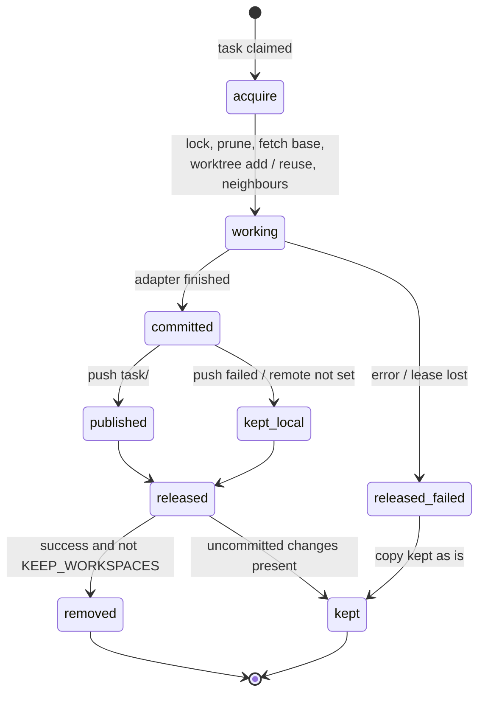

# Working copies

How the runner prepares an isolated working copy of the repository for every task, lays out
neighbouring repositories next to it at pinned revisions, turns the result into evidence (a
commit), and publishes the task branch to the forge. The article is for engineers who
configure the runner and for operators who accept the result.

## Why a separate copy per task

An adapter that works in the current process directory serializes the executor to one task
and mixes changes from different tasks — the commit stops being proof. Therefore every task
gets its own git worktree on the deterministic branch `task/<publicId>`, and the result is
recorded as a commit to which Control Plane stores a **reference**, not a copy.

The working copy pool is turned on when both variables are set:

```bash
CONTROL_PLANE_AGENT_REPO=/opt/runner/<repo>.git        # source of copies (bare mirror)
CONTROL_PLANE_AGENT_WORKTREE_ROOT=/opt/runner/worktrees # where the copies live
```

Without them the adapter gets `workspace=None` and works in the process directory — this is
convenient for checking the protocol, but not for executing real tasks.

!!! note "Do not confuse two similar variables"
    `CONTROL_PLANE_AGENT_WORKSPACE` is the **Workspace in Control Plane** from which tasks are
    taken. `CONTROL_PLANE_AGENT_WORKTREE_ROOT` is the **directory on disk** for working
    copies.

## Layout: the task container

A working copy is not a single directory but a small container: the copy itself and, next to
it, the neighbours it is built against.

```text
<WORKTREE_ROOT>/
├── .locks/
│   └── <publicId>.lock              exclusive lock of the copy (flock)
└── <publicId>/                      task container, laid out like the superproject
    ├── services/
    │   ├── control-plane/           <REPO_DIR>: working copy, branch task/<publicId>
    │   └── memory-service/          another neighbour (for example a contract service)
    └── sdk/
        └── platform-auth-sdk/       neighbour at the revision pinned by the superproject
```

Why neighbours. A repository that is built against a neighbour through a path dependency
(`../../sdk/platform-auth-sdk`) does not build from a copy of itself alone. And the neighbour must be
**at the revision pinned by the superproject**, not at the tip of its branch: otherwise a
green test run checks a combination of revisions that exists in no commit.

The neighbour directory path in the container matches the submodule path in the
superproject — exactly what the path dependency names (`../../sdk/<neighbour>` from
`services/<repository>`). The paths of `REPO_DIR` and of the neighbours may have several
segments (`services/control-plane`); the task container is the directory as many levels
above the copy as `REPO_DIR` has segments. That is why neighbours are laid out at the same
paths as in the superproject.

## Configuring neighbours

```bash
CONTROL_PLANE_AGENT_REPO_DIR=services/control-plane
CONTROL_PLANE_AGENT_NEIGHBOURS=sdk/platform-auth-sdk=/opt/runner/platform-auth-sdk.git,services/memory-service=/opt/runner/memory-service.git
CONTROL_PLANE_AGENT_SUPERPROJECT=/opt/runner/superproject.git
CONTROL_PLANE_AGENT_SUPERPROJECT_REF=HEAD
CONTROL_PLANE_AGENT_SUPERPROJECT_REMOTE=origin
```

| Variable | Meaning |
|---|---|
| `CONTROL_PLANE_AGENT_REPO_DIR` | path of the working copy inside the container (one or several segments, for example `services/control-plane`); defaults to the repository name without `.git`. Matters when neighbours refer to it by a relative path |
| `CONTROL_PLANE_AGENT_NEIGHBOURS` | `path=mirror-path` pairs separated by commas or spaces; the path is the submodule path in the superproject (`sdk/platform-auth-sdk`) |
| `CONTROL_PLANE_AGENT_SUPERPROJECT` | superproject mirror: neighbour revisions are read from its tree (`git ls-tree`, gitlink `160000`) |
| `CONTROL_PLANE_AGENT_SUPERPROJECT_REF` | superproject ref from which revisions are taken; default `HEAD` |
| `CONTROL_PLANE_AGENT_SUPERPROJECT_REMOTE` | remote from which the superproject is updated before the layout; empty — whatever is on disk is used |

Rules checked at startup and on every task:

- neighbours without a superproject are a pool construction error (`neighbours require a
  superproject that pins their revisions`): laying out neighbours "at whatever is in main
  now" is forbidden;
- an invalid pair in `NEIGHBOURS` is an error, not a silent skip: a skipped neighbour would
  come back as a build error inside the agent's copy, where the cause is no longer visible;
- a neighbour that is not among the superproject's submodules at the given ref is the error
  `<name> is not a submodule of the superproject`;
- if the neighbour's mirror does not have the pinned commit, the daemon runs `fetch` on the
  mirror itself (best-effort); without access to the forge the task fails with a clear
  `invalid reference` error.

Neighbours are read-only working copies by intent: tell the agent explicitly in the
conventions file that it does not make edits outside its own repository and that it takes
the contracts of neighbouring services from their code instead of inventing them.

!!! tip "A contract service as a neighbour"
    If the repository calls the API of another service, add that service as a neighbour.
    Without it the agent tends to invent the contract and write tests against its own fake —
    only a review catches that. With the neighbour it reads the real request schemas and can
    pin them with a contract test.

## Copy lifecycle



### acquire

1. Key check: `publicId` must match `^[A-Za-z0-9][A-Za-z0-9._-]{0,63}$` — it becomes the
   directory and branch name.
2. Exclusive lock `<root>/.locks/<publicId>.lock`. Held by another process —
   `WorkspaceBusyError`, the run fails with `failure_reason=workspace_busy`.
3. `git worktree prune` in the mirror — removes records of copies deleted bypassing git.
4. Base update: if `CONTROL_PLANE_AGENT_PUSH_REMOTE` is set, the daemon runs `git fetch
   <remote> <base-branch>` and branches from `FETCH_HEAD`. The base branch is
   `CONTROL_PLANE_AGENT_BASE_REF`, and with `HEAD` it is the branch the mirror's HEAD points
   to. Without a remote or with an unreachable forge — branching from `BASE_REF` as is.
5. The copy:
    - already exists (a repeated attempt) — the daemon checks that it is a worktree on the
      `task/<publicId>` branch and reuses it **together with uncommitted changes**;
    - the branch exists, the copy does not (the copy was removed after a previous success) —
      `worktree add` on the existing branch: the second attempt continues the work instead of
      starting from scratch and is **not rebased** onto a fresh base;
    - nothing exists — `worktree add -b task/<publicId> <base>`.
6. Neighbours are laid out at superproject revisions. A neighbour with local changes is not
   switched — such edits are not destroyed silently.
7. `execution.workspace` checkpoint in the run.

A copy on a branch other than the expected one is an error: switching silently would mix two
tasks in one copy.

### Checkpoint `execution.workspace`

Only portable state goes to Control Plane, without host paths:

```json
{
  "kind": "execution.workspace",
  "data": {
    "workspaceKey": "<publicId>",
    "branch": "task/<publicId>",
    "baseCommit": "3f1c…",
    "reused": false,
    "neighbours": {"platform-auth-sdk": "a8c5…"}
  }
}
```

After the commit, a second checkpoint of the same kind is written with `head` and
`published`. `neighbours` is part of the evidence: a green run is meaningful only together
with the revisions it ran against.

### commit — evidence

After a successful turn the daemon:

1. runs `git add -A`;
2. if the tree is clean, compares HEAD with `baseCommit`. The agent may have committed on its
   own: the branch moved forward, and that is evidence too, which must be published. If HEAD
   did not move, there are "no changes", and there is no `commit` artifact;
3. otherwise commits as `control-plane-agent <agent@control-plane.local>` with `--no-verify`;
   the message is `<publicId>: <title>`, so the public task id is always in the message.

### publish — branch to the forge

If `CONTROL_PLANE_AGENT_PUSH_REMOTE` is set, the daemon publishes the branch:

```text
git push <remote> refs/heads/task/<publicId>:refs/heads/task/<publicId>
```

Three deliberate restrictions:

- **only the task branch is pushed**, with both sides named explicitly — the runner offers
  work for review and does not move the branch others build on;
- **the push is never forced** — a diverged branch in the forge is sorted out by a human;
  overwriting would destroy the review history;
- **a failed push does not fail the run** — the commit is already evidence, and an
  unreachable forge must not turn completed work into a failure.

It is the **daemon** that publishes, not the agent inside: the daemon holds the claim and the
fencing token, so what is published is attributed to the run that produced it. The agent is
told explicitly not to push.

The stderr of a failed push stays in the runner log and does not go to Control Plane: it can
contain remote URLs and local paths.

### The `commit` artifact

```json
{
  "type": "commit",
  "name": "task/<publicId>@3f1c2a9b7e10",
  "uri": "git:3f1c2a9b7e10d4…",
  "metadata": {
    "branch": "task/<publicId>",
    "commit": "3f1c2a9b7e10d4…",
    "workspaceKey": "<publicId>",
    "published": true,
    "repository": "https://git.example.com/<org>/service.git",
    "targetBranch": "main"
  }
}
```

`published: false` means there is no branch in the forge, the commit exists only on the
runner, and the reviewer has nothing to look at: the review and merge criteria of the
`coding-task` type skip such a commit. `repository` and `targetBranch` are written when a
publishing remote is set: the remote address and the branch the copy was cut from (the task
field `baseBranch`, otherwise the default branch) — this is where the merge skill merges the
approved commit (see [Type acceptance](../control-plane/task-types.md#type-acceptance)).

A task returned after a failed verification continues the same `task/<publicId>` branch: the
daemon takes the local branch of the mirror, otherwise the one published in the forge, and
only if neither exists does it cut a new one from the base. The next publication goes
through without `--force`.

### release

| Run outcome | What happens to the copy |
|---|---|
| success | the copy is removed (`worktree remove --force`) if it has no uncommitted changes and `CONTROL_PLANE_AGENT_KEEP_WORKSPACES=1` is not set; the neighbours are removed with it; **the branch always stays** |
| failure, lease loss, exception | the copy is kept as is — this is the state the next attempt continues from |

`--force` on removal destroys nothing valuable: an empty `git status --porcelain` has already
proven that the copy holds no work, only ignored files remain (`.venv`, caches).

### Disk budget

After every release the daemon keeps no more than `CONTROL_PLANE_AGENT_MAX_WORKSPACES`
(default 8) idle containers: the oldest by modification time are removed. The following are
not touched:

- the copy of the current task;
- copies with uncommitted changes;
- copies whose lock is held (someone is working in them now);
- directories that do not look like a pool container.

Branches are never deleted during cleanup.

## Portability: what does not leave the host

Everything that goes to Control Plane (checkpoints, artifacts, `failure_reason`) passes the
`assert_portable` check. The following are rejected:

- strings with host path roots (`/Users/`, `/home/`, `/root/`, `/private/`, `/var/`, `/tmp/`,
  `/opt/`, `/mnt/`), `file://`, `~/`, Windows paths, strings that are entirely an absolute
  path;
- values under keys like `token`, `secret`, `password`, `authorization`, `apikey`,
  `credential`;
- strings with the prefixes `cp_`, `sk-`, `ghp_`, `github_pat_`, `xox`, `-----BEGIN`.

A violation in an artifact the daemon is about to write fails the run — that is why adapters
redact the summary in advance (`<path>` instead of an absolute path), and error texts pass
the same redaction before being written to `failure_reason`.

## Common problems

| Symptom | Cause |
|---|---|
| `failed: workspace_busy` | another process holds the copy (a second runner instance on the same directories) |
| `<dir> is on branch X, expected task/<id>` | someone switched the branch in the copy by hand |
| `invalid reference` when creating a neighbour | the neighbour's mirror does not have the pinned commit, and `fetch` failed |
| `<name> is not a submodule of the superproject` | a typo in the neighbour name or the submodule was renamed |
| the branch diff looks like a revert of other people's commits | the branch was cut from an old base; the reviewer should look at the diff from the merge-base with `targetBranch` |
| the agent "fixes code that no longer exists" | the mirror is not updated: `CONTROL_PLANE_AGENT_PUSH_REMOTE` is not set and nobody pulls the base |
| copies pile up on disk | many failed tasks (their copies are not removed) or copies with uncommitted files; sort them out and remove them manually with `git worktree remove` |

## See also

- [Installing the runner](installation.md)
- [Executor adapters](adapters.md)
- [Goals, acceptance, and evidence](../control-plane/goals-and-evidence.md)
- [Artifacts and comments](../control-plane/artifacts.md)
