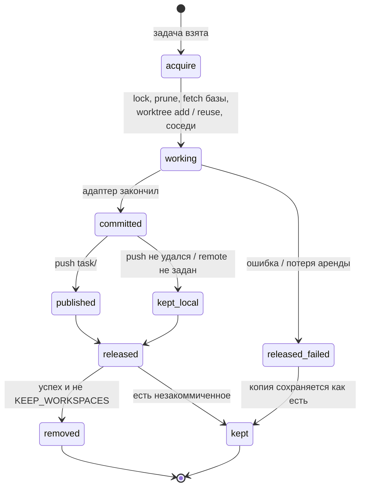

# Рабочие копии

Как runner готовит каждой задаче изолированную рабочую копию репозитория, раскладывает рядом
соседние репозитории на закреплённых ревизиях, превращает результат в evidence (коммит) и
публикует ветку задачи в forge. Статья для инженера, настраивающего runner, и для оператора,
который принимает результат.

## Зачем отдельная копия на задачу

Адаптер, работающий в текущем каталоге процесса, сериализует исполнителя на одну задачу и
смешивает изменения разных задач — коммит перестаёт быть доказательством. Поэтому каждая
задача получает собственный git worktree на детерминированной ветке `task/<publicId>`, а
результат фиксируется коммитом, на который Control Plane хранит **ссылку**, а не копию.

Пул рабочих копий включается, когда заданы обе переменные:

```bash
CONTROL_PLANE_AGENT_REPO=/opt/runner/<repo>.git        # источник копий (bare-зеркало)
CONTROL_PLANE_AGENT_WORKTREE_ROOT=/opt/runner/worktrees # где живут копии
```

Без них адаптер получает `workspace=None` и работает в каталоге процесса — так удобно
проверять протокол, но не выполнять реальные задачи.

!!! note "Не путайте две похожие переменные"
    `CONTROL_PLANE_AGENT_WORKSPACE` — это **Workspace в Control Plane**, из которого берутся
    задачи. `CONTROL_PLANE_AGENT_WORKTREE_ROOT` — **каталог на диске** для рабочих копий.

## Раскладка: контейнер задачи

Рабочая копия — не один каталог, а небольшой контейнер: сама копия и рядом соседи, от
которых она собирается.

```text
<WORKTREE_ROOT>/
├── .locks/
│   └── <publicId>.lock              эксклюзивная блокировка копии (flock)
└── <publicId>/                      контейнер задачи — раскладка суперпроекта
    ├── services/
    │   ├── control-plane/           <REPO_DIR>: рабочая копия, ветка task/<publicId>
    │   └── memory-service/          ещё один сосед (например сервис-контракт)
    └── sdk/
        └── platform-auth-sdk/       сосед на ревизии, закреплённой суперпроектом
```

Зачем соседи. Репозиторий, который собирается против соседа path-зависимостью
(`../../sdk/platform-auth-sdk`), не соберётся из копии самого себя. А сосед должен стоять **на той
ревизии, которую закрепляет суперпроект**, а не на вершине своей ветки: иначе зелёный прогон
тестов проверил комбинацию ревизий, которой нет ни в одном коммите.

Путь каталога соседа в контейнере совпадает с путём сабмодуля в суперпроекте — ровно то,
что называет path-зависимость (`../../sdk/<neighbour>` из `services/<repository>`). Путь
`REPO_DIR` и соседей может состоять из нескольких сегментов (`services/control-plane`);
контейнер задачи — каталог на столько уровней выше копии, сколько сегментов в `REPO_DIR`.
Поэтому соседи раскладываются по тем же путям, что в суперпроекте.

## Настройка соседей

```bash
CONTROL_PLANE_AGENT_REPO_DIR=services/control-plane
CONTROL_PLANE_AGENT_NEIGHBOURS=sdk/platform-auth-sdk=/opt/runner/platform-auth-sdk.git,services/memory-service=/opt/runner/memory-service.git
CONTROL_PLANE_AGENT_SUPERPROJECT=/opt/runner/superproject.git
CONTROL_PLANE_AGENT_SUPERPROJECT_REF=HEAD
CONTROL_PLANE_AGENT_SUPERPROJECT_REMOTE=origin
```

| Переменная | Смысл |
|---|---|
| `CONTROL_PLANE_AGENT_REPO_DIR` | путь рабочей копии внутри контейнера (один или несколько сегментов, например `services/control-plane`); по умолчанию — имя репозитория без `.git`. Важно, когда соседи ссылаются на него относительным путём |
| `CONTROL_PLANE_AGENT_NEIGHBOURS` | пары `путь=путь-к-зеркалу` через запятую или пробел; путь — путь сабмодуля в суперпроекте (`sdk/platform-auth-sdk`) |
| `CONTROL_PLANE_AGENT_SUPERPROJECT` | зеркало суперпроекта: ревизии соседей читаются из его дерева (`git ls-tree`, gitlink `160000`) |
| `CONTROL_PLANE_AGENT_SUPERPROJECT_REF` | ref суперпроекта, из которого берутся ревизии; по умолчанию `HEAD` |
| `CONTROL_PLANE_AGENT_SUPERPROJECT_REMOTE` | remote, из которого суперпроект обновляется перед раскладкой; пусто — используется то, что лежит на диске |

Правила, которые проверяются при старте и на каждой задаче:

- соседи без суперпроекта — ошибка конструкции пула (`neighbours require a superproject that
  pins their revisions`): раскладывать соседей «на то, что сейчас в main» запрещено;
- некорректная пара в `NEIGHBOURS` — ошибка, а не молчаливый пропуск: пропущенный сосед
  вернулся бы сборочной ошибкой внутри копии агента, где причины уже не видно;
- сосед, которого нет среди сабмодулей суперпроекта на заданном ref, — ошибка
  `<name> is not a submodule of the superproject`;
- если в зеркале соседа нет закреплённого коммита, демон делает `fetch` зеркала сам
  (best-effort); без доступа к forge задача упадёт с понятной ошибкой `invalid reference`.

Соседи — рабочие копии только для чтения по смыслу: агенту в файле соглашений стоит прямо
сказать, что правки вне своего репозитория он не делает, а контракты сервисов-соседей берёт
из их кода, а не придумывает.

!!! tip "Сервис-контракт как сосед"
    Если репозиторий вызывает API другого сервиса, добавьте этот сервис соседом. Агент без
    него склонен выдумать контракт и написать тесты под собственный фейк — такое ловит
    только ревью. С соседом он читает настоящие схемы запросов и может закрепить их
    contract-тестом.

## Жизненный цикл копии



### acquire

1. Проверка ключа: `publicId` должен соответствовать `^[A-Za-z0-9][A-Za-z0-9._-]{0,63}$` —
   он становится именем каталога и ветки.
2. Эксклюзивная блокировка `<root>/.locks/<publicId>.lock`. Занята другим процессом —
   `WorkspaceBusyError`, run проваливается с `failure_reason=workspace_busy`.
3. `git worktree prune` в зеркале — снять записи о копиях, удалённых мимо git.
4. Обновление базы: если задан `CONTROL_PLANE_AGENT_PUSH_REMOTE`, демон делает `git fetch
   <remote> <base-branch>` и ветвится от `FETCH_HEAD`. Базовая ветка —
   `CONTROL_PLANE_AGENT_BASE_REF`, а при `HEAD` — ветка, на которую указывает HEAD зеркала.
   Без remote или при недоступном forge — ветвление от `BASE_REF` как есть.
5. Копия:
    - уже есть (повторная попытка) — проверяется, что это worktree на ветке
      `task/<publicId>`, и она переиспользуется **вместе с незакоммиченными изменениями**;
    - ветка есть, копии нет (копию убрали после прошлого успеха) — `worktree add` на
      существующую ветку: вторая попытка продолжает работу, а не начинает с нуля и **не
      перебазируется** на свежую базу;
    - ничего нет — `worktree add -b task/<publicId> <base>`.
6. Раскладка соседей на ревизиях суперпроекта. Сосед с локальными изменениями не
   переключается — такие правки не уничтожаются молча.
7. Checkpoint `execution.workspace` в run.

Копия на ветке, отличной от ожидаемой, — ошибка: молча переключить значило бы смешать две
задачи в одной копии.

### Checkpoint `execution.workspace`

Что уходит в Control Plane — только переносимое состояние, без путей хоста:

```json
{
  "kind": "execution.workspace",
  "data": {
    "workspaceKey": "<publicId>",
    "branch": "task/<publicId>",
    "baseCommit": "3f1c…",
    "reused": false,
    "neighbours": {"platform-auth-sdk": "a8c5…"}
  }
}
```

После коммита пишется второй checkpoint того же вида с `head` и `published`.
`neighbours` — часть evidence: зелёный прогон осмыслен только вместе с ревизиями, против
которых он шёл.

### commit — evidence

После успешного хода демон:

1. `git add -A`;
2. если дерево чистое — сравнивает HEAD с `baseCommit`. Агент мог закоммитить сам: ветка
   ушла вперёд, и это тоже evidence, его надо опубликовать. Если HEAD не сдвинулся —
   «изменений нет», артефакта `commit` не будет;
3. иначе — коммит от имени `control-plane-agent <agent@control-plane.local>` с `--no-verify`;
   сообщение — `<publicId>: <title>`, и публичный id задачи в сообщении есть всегда.

### publish — ветка в forge

Если задан `CONTROL_PLANE_AGENT_PUSH_REMOTE`, демон публикует ветку:

```text
git push <remote> refs/heads/task/<publicId>:refs/heads/task/<publicId>
```

Три сознательных ограничения:

- **пушится только ветка задачи**, обе стороны названы явно — runner предлагает работу к
  рассмотрению и не двигает ветку, на которой строят остальные;
- **push никогда не форсируется** — разошедшаяся ветка в forge разбирается человеком;
  перезапись уничтожила бы историю ревью;
- **неудача push не валит run** — коммит уже является evidence, недоступный forge не должен
  превращать сделанную работу в проваленную.

Публикует именно **демон**, а не агент внутри: claim и fencing token держит демон, поэтому
опубликованное атрибутируется run'у, который это произвёл. Агенту прямо сказано не пушить.

stderr неудачного push остаётся в журнале runner'а и в Control Plane не уходит: в нём бывают
URL remote и локальные пути.

### Артефакт `commit`

```json
{
  "type": "commit",
  "name": "task/<publicId>@3f1c2a9b7e10",
  "uri": "git:3f1c2a9b7e10d4…",
  "metadata": {
    "branch": "task/<publicId>",
    "commit": "3f1c2a9b7e10d4…",
    "workspaceKey": "<publicId>",
    "published": true,
    "repository": "https://git.example.com/<org>/service.git",
    "targetBranch": "main"
  }
}
```

`published: false` означает, что ветки в forge нет, коммит существует только на runner'е, и
ревьюеру смотреть нечего: критерии ревью и вливания типа `coding-task` такой коммит
пропускают. `repository` и `targetBranch` пишутся, когда задан remote публикации:
адрес remote и ветка, от которой отведена копия (поле задачи `baseBranch`, иначе ветка
по умолчанию), — туда скилл вливания вольёт одобренный коммит (см. [Приёмка
типа](../control-plane/task-types.md#type-acceptance)).

Задача, вернувшаяся после проваленной проверки, продолжает ту же ветку `task/<publicId>`:
демон берёт локальную ветку зеркала, иначе опубликованную в forge, и только если нет ни
той, ни другой — отводит новую от базы. Следующая публикация проходит без `--force`.

### release

| Исход run | Что с копией |
|---|---|
| успех | копия удаляется (`worktree remove --force`), если в ней нет незакоммиченных изменений и не задан `CONTROL_PLANE_AGENT_KEEP_WORKSPACES=1`; соседи удаляются вместе с ней; **ветка остаётся всегда** |
| провал, потеря аренды, исключение | копия сохраняется как есть — это состояние, с которого продолжит следующая попытка |

`--force` при удалении ничего ценного не уничтожает: пустой `git status --porcelain` уже
доказал, что в копии нет работы, остались только игнорируемые файлы (`.venv`, кэши).

### Бюджет диска

После каждого release демон держит не больше `CONTROL_PLANE_AGENT_MAX_WORKSPACES` (по
умолчанию 8) простаивающих контейнеров: самые старые по времени изменения удаляются. Не
трогаются:

- копия текущей задачи;
- копии с незакоммиченными изменениями;
- копии, чья блокировка занята (в них сейчас работают);
- каталоги, не похожие на контейнер пула.

Ветки при чистке не удаляются никогда.

## Переносимость: что не покидает хост

Всё, что уходит в Control Plane (checkpoints, артефакты, `failure_reason`), проходит проверку
`assert_portable`. Отклоняются:

- строки с корнями путей хоста (`/Users/`, `/home/`, `/root/`, `/private/`, `/var/`, `/tmp/`,
  `/opt/`, `/mnt/`), `file://`, `~/`, пути Windows, строки целиком вида абсолютного пути;
- значения по ключам вида `token`, `secret`, `password`, `authorization`, `apikey`,
  `credential`;
- строки с префиксами `cp_`, `sk-`, `ghp_`, `github_pat_`, `xox`, `-----BEGIN`.

Нарушение в артефакте, который демон собирается записать, проваливает run — поэтому
адаптеры заранее редактируют summary (`<path>` вместо абсолютного пути), а тексты ошибок
перед записью в `failure_reason` проходят ту же редакцию.

## Типичные проблемы

| Симптом | Причина |
|---|---|
| `failed: workspace_busy` | копию держит другой процесс (второй экземпляр runner'а на тех же каталогах) |
| `<dir> is on branch X, expected task/<id>` | в копии кто-то переключил ветку руками |
| `invalid reference` при создании соседа | в зеркале соседа нет закреплённого коммита, а `fetch` не удался |
| `<name> is not a submodule of the superproject` | опечатка в имени соседа или сабмодуль переименован |
| диф ветки выглядит как откат чужих коммитов | ветка отведена от старой базы; ревьюер должен смотреть диф от merge-base с `targetBranch` |
| агент «чинит код, которого уже нет» | зеркало не обновляется: не задан `CONTROL_PLANE_AGENT_PUSH_REMOTE` и базу никто не подтягивает |
| на диске копятся копии | много проваленных задач (их копии не удаляются) или копии с незакоммиченными файлами; разберите и удалите вручную через `git worktree remove` |

## См. также

- [Адаптеры исполнителей](adapters.md)
- [Цели, приёмка и evidence](../control-plane/goals-and-evidence.md)
- [Артефакты и комментарии](../control-plane/artifacts.md)
