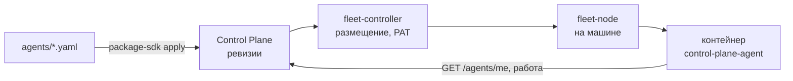
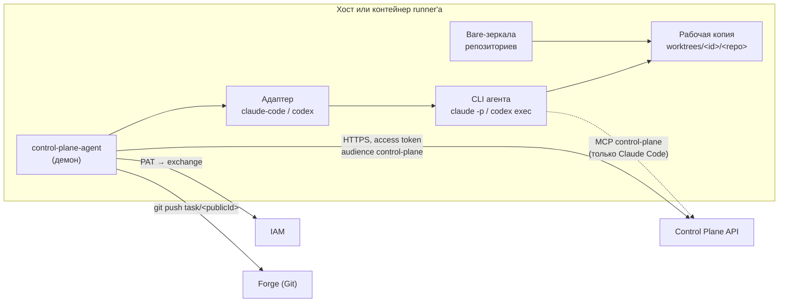
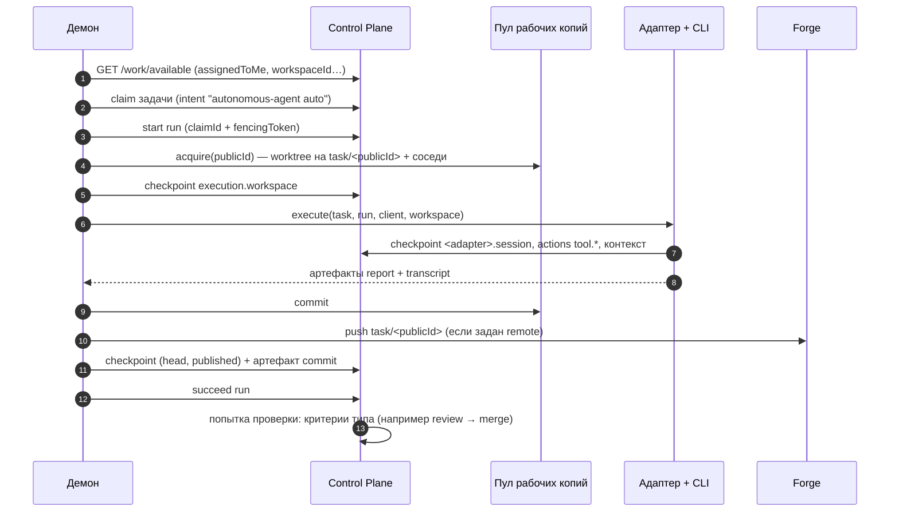

# Агенты и runner

Раздел описывает автономных исполнителей: демон `control-plane-agent`, который сам
берёт задачи из Control Plane и выполняет их кодовым агентом (Claude Code, Codex) или
скиллами в изолированной рабочей копии. Каждый исполнитель описан видом каталога `Agent`,
а запускает его платформа на машинах-узлах fleet. Раздел для инженеров, которые
подключают машины и описывают агентов, и для операторов, которые ставят агентам задачи
и принимают результат.

## Агент описанием и узлы

Агент — один YAML-объект в пакете каталога: личность и права, какую работу брать, вид
исполнителя с моделью и инструкциями, рабочая копия, ревью, скиллы, размещение. Control
Plane хранит неизменяемые ревизии описания и выводит из них principal и связку агента;
fleet-controller выбирает узел по меткам, секретам, видам исполнителя и ёмкости и
доставляет агенту PAT; узел запускает контейнер с демоном, а демон берёт конфигурацию из
своей ревизии (`GET /agents/me`).

Правка описания — новая ревизия: исполнитель доводит текущий прогон, завершается с кодом
75 и поднимается на новой ревизии. Подробно — [Агенты описанием](declarative-agents.md)
и [Узлы и fleet](fleet.md).

## Что такое runner

Runner — это **клиент** Control Plane, а не часть ядра. Он проходит тот же цикл
харнесс-протокола, что и человек в Claude Code: сессия → поиск работы → claim → run →
артефакты → завершение. Особого серверного пути для агентов нет: те же эндпоинты, тот же
SDK `control_plane_client`, те же проверки прав, аренд и fencing token.

Отличие одно: человек-оператор принимает решения сам (claim, завершение, approval), а
демон runner'а действует по конфигурации — claim'ит автоматически и сам решает исход run
по результату адаптера.

## Роли процессов

| Процесс | Что делает | Чего не делает |
|---|---|---|
| Демон `control-plane-agent` | открывает сессию, ищет работу, claim'ит, стартует run, готовит рабочую копию, коммитит и публикует ветку, пишет артефакты, завершает run, заводит ревью | не пишет код |
| Адаптер (`claude-code`, `codex`) | строит prompt, запускает CLI агента, пишет checkpoint сессии, публикует summary и транскрипт | не решает исход run, не держит claim |
| Кодовый агент внутри run | меняет файлы в рабочей копии, может читать контекст и оставлять checkpoints через MCP | не claim'ит, не завершает, не пушит, не открывает PR |

Граница принципиальна: исход run решает тот, кто держит claim и его fencing token, то есть
демон. Агенту внутри авторитетные инструменты MCP даже не предлагаются (см.
[Адаптеры](adapters.md#mcp-inside)).

## Жизненный цикл одной задачи

Если на любом шаге что-то пошло не так, run завершается честным `fail` с причиной
(`lease_lost`, `ownership_lost`, `workspace_busy`, текст исключения с вырезанными путями
хоста), а рабочая копия сохраняется для следующей попытки.

## Что runner берёт

Какую работу брать, говорит раздел `work` описания агента:

- `onlyAssigned` (по умолчанию `true`) — только задачи, назначенные principal'у этого
  агента (`assigneeId`): «могу взять» и «предназначено мне» — разные вопросы;
- `workspace` — только задачи этого Workspace (вместе с поддеревом);
- `project` (+ `includeSubprojects`) — только задачи проекта;
- `taskTypes` — только задачи этих типов.

Задачи, тип которых объявляет исполнение скиллом (`execution = {skill, version}`), идут не
в кодовый адаптер, а в исполнитель скиллов того же демона — и только если он умеет этот
скилл. Без права `task_types.read` демон такие задачи не трогает вообще (fail-closed).

!!! warning "Без сужения очереди"
    Агент с `onlyAssigned: false` и без `workspace` возьмёт любую доступную задачу
    tenant'а, включая эпики и задачи других репозиториев. Выпускать исполнителя в общую
    очередь стоит только сознательно. То же относится к демону, запущенному вручную без
    описания: у него фильтр `CONTROL_PLANE_AGENT_ONLY_ASSIGNED` по умолчанию выключен.

## Развёртывание

Исполнитель всегда работает в контейнере на узле fleet: периметр — контейнер, внутри
только volume реплики с рабочими копиями и зеркалами и секреты, названные в описании
агента. Узлом может быть выделенный сервер, VM или машина разработчика — любая машина с
Docker и исходящим HTTPS к стенду. Демон можно запустить и вручную, без описания (режим
env), но только для отладки. Подробно — [Установка исполнителя](installation.md).

## Разделы

| Статья | О чём |
|---|---|
| [Агенты описанием](declarative-agents.md) | вид `Agent`: разделы описания, ревизии, применение через пакеты, остановка и вывод из оборота, агенты-сервисы |
| [Узлы и fleet](fleet.md) | контроллер и узлы: регистрация, `node.yaml`, размещение по меткам, доставка PAT, отказы |
| [Identity агента](agent-identity.md) | отдельный principal `agent`, binding без admin, PAT и его хранение |
| [Установка исполнителя](installation.md) | контроллер, образ, узел, первый агент, обновление, ручной запуск для отладки |
| [Адаптеры исполнителей](adapters.md) | Claude Code, Codex, OpenCode: запуск CLI, токены, режимы разрешений, prompt |
| [Рабочие копии](execution-workspace.md) | контейнер `worktrees/<id>/<repo>`, соседи, ветки, evidence, публикация |
| [Трасса прогонов](trace.md) | артефакт `transcript`, actions `tool.*`, флаги публикации |
| [Конфигурация](configuration.md) | что берётся из ревизии, переменные хоста и режима env |

## См. также

- [Пакеты каталога](../control-plane/catalog-packages.md#agent)

- [Исполнение — claims и runs](../control-plane/execution.md)
- [Харнесс-протокол](../control-plane/harness-protocol.md)
- [Работа оператора](../operator/index.md)
- [Диагностика: исполнение и runner](../troubleshooting/runner.md)
