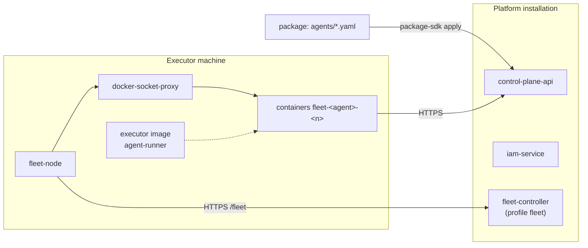

# Installing executors

How to start autonomous executors: connect a machine to the platform as a fleet node and
describe the agents in a package. There is no need to install a daemon separately, issue it
a PAT, or write an env file — the platform derives the agent's identity, configuration, and
credential from the description and delivers them to the node itself. The article is for
operations engineers. The model is described in [Declarative agents](declarative-agents.md)
and [Nodes and fleet](fleet.md).

## What runs where



| Where | What to install |
|---|---|
| Platform installation | the `fleet-controller` service (compose profile `fleet`) and its service account |
| Each executor machine | Docker, the executor image, `docker-socket-proxy`, `fleet-node`, a secrets directory |
| Catalog package | an agent description of kind `Agent` |

!!! warning "The perimeter is the container"
    A coding agent in autonomous mode is allowed to run arbitrary commands
    (`permissionMode: bypassPermissions`); otherwise it would not complete a single task.
    So the perimeter is not the permission mode but the container: inside it there is only
    the replica volume with working copies and mirrors, and the secret files that the node
    mounted according to the agent description. The machine's home directory, SSH keys, and
    people's credentials do not get into the container. The node controls Docker only
    through a socket proxy that allows containers and volumes.

## Machine requirements

| Component | Why |
|---|---|
| Docker with Compose | node and agent containers |
| Outbound HTTPS | to the installation: `/fleet` (controller), Control Plane, and IAM; to the forge and the model provider's API |
| Resources | CPU, memory, and disk for the node's `capacity`; working copies and mirrors live in each replica's volume |
| Secrets | tokens the agents on this machine need: the coding agent's subscription, a forge token, and so on |

The machine needs no inbound connections: the node works from behind NAT.

## 1. Controller on the installation

Once per installation:

```bash
# fleet-controller service account — bootstrap step 5d
python3 deploy/bootstrap.py --env .env ...
tools/compose --profile fleet up -d --build fleet-controller
curl -sS https://platform.example.com/fleet/healthz     # {"status":"ok"}
```

Bootstrap (step 5d) issues the controller's service account and writes
`secrets/fleet-iam.env`. Until the file exists, the controller API responds
`503 not_configured`. Details — [Nodes and fleet](fleet.md#controller).

## 2. Executor image

The reference image is the `deploy/agent-runner/` directory: the `control-plane-agent`
daemon with the Claude Code and Codex adapters and the skills SDK, user uid `10001`. The
build context is the root of the delivery: `platform-auth-sdk` is connected as a
neighbouring folder.

The image must be present on the node's machine: the socket proxy does not let the node pull
images. The reference node compose (`deploy/node/`) builds it itself.


!!! tip "The image tag is the executor version"
    The node recreates an agent's container when the `image` string in `node.yaml` changes,
    not when the image content changes. When releasing a new executor version, build the
    image under a new tag and change the tag in `executors.<kind>.image`.

## 3. Node secrets and directories

```bash
install -d -m 0700 /var/lib/fleet-node              # stateDir: node token, keys, agent PATs
install -d -m 0700 /etc/fleet-node/secrets          # secretsDir: one file per secret
printf '%s' '<subscription token>' > /etc/fleet-node/secrets/claude-oauth-token
printf '%s' '<forge token>'        > /etc/fleet-node/secrets/github-token
chmod 600 /etc/fleet-node/secrets/*
```

The file name is the secret name from `placement.secrets` in the agent descriptions. The
files must be readable by the executor image's uid (`10001` for the reference image), and
`stateDir` must be writable by the node's user.

| Secret | For whom | What |
|---|---|---|
| `claude-oauth-token` | agents of kind `claude-code` | the subscription token: `claude setup-token` on a machine with a browser. The subscription token belongs to a person, not to the agent |
| `github-token` | coding agents | a forge token with write access only to the working repositories and read access to neighbours |
| custom names | per description | for example a publishing token for a skills agent; the skill reads it itself from `/run/secrets/<name>` |

Agent PATs are **not** put into the secrets directory: the controller issues them and
delivers them to the node in sealed form.

## 4. Join key

```bash
tools/compose --profile fleet exec fleet-controller \
  fleet-controller join-key --ttl 3600 --note "worker-1"
```

Put the printed key on the machine into the `joinKeyFile` file (for example
`/etc/fleet-node/join-key`). The key is single-use; after registration it is no longer
needed.

## 5. `node.yaml`

```yaml
controllerUrl: https://platform.example.com/fleet
name: worker-1
labels: [claude-subscription, repos]
capacity: {slots: 4, cpus: 8, memoryMb: 16384}
executors:
  claude-code: {image: agent-runner:1.4.0, dataPath: /runner}
  skills: {image: agent-runner:1.4.0, dataPath: /runner, env: {RUNNER_MODE: skills}}
stateDir: /var/lib/fleet-node
secretsDir: /etc/fleet-node/secrets
dockerUrl: tcp://docker-proxy:2375
network: fleet-agents
agentEnv:
  CONTROL_PLANE_SERVER: https://platform.example.com
  CONTROL_PLANE_IAM_URL: https://platform.example.com/iam
  CONTROL_PLANE_IAM_SCOPES: control-plane:read control-plane:write
joinKeyFile: /etc/fleet-node/join-key
```

- `labels` and the `executors` keys determine which agents can be placed here;
- `capacity.slots` is how many agent instances the machine holds at the same time;
- `executors.<kind>.env` passes the addresses of auxiliary services that the agents on this
  machine need (for example a disposable test database in the `network` network).

All fields — [Node configuration](fleet.md#node-yaml).

## 6. Starting the node

The reference node compose is the `deploy/node/` directory: `docker-proxy`
(`tecnativa/docker-socket-proxy`, only containers and volumes allowed), `fleet-node`
(image from `services/fleet/Dockerfile`, uid `10001`), the executor image build, and
auxiliary databases for the agents. The state and secrets directories are mounted into the
node container at the same paths as on the host: the node mounts PATs and secrets into agent
containers by the host path.

```bash
docker compose -f <node compose> up -d --build
docker compose -f <node compose> logs -f fleet-node
```

The log shows `joined the fleet as <node-id>`. From the center:

```bash
curl -sS https://platform.example.com/fleet/api/v1/nodes \
  -H "Authorization: Bearer $FLEET_TOKEN"        # token with audience fleet, fleet:read
```

## 7. Agent in a package

Describe the agent with kind `Agent` in the package's `agents/` folder and apply the
installation:

```bash
make packages-check
package-sdk plan --install deploy/<environment>/packages.yaml \
  --server https://platform.example.com --out plan.json
package-sdk apply --plan plan.json --server https://platform.example.com
```

Within a few seconds the controller creates the agent's identity, places it, and gives the
node a PAT; the node creates the container `fleet-<key>-0`. Check:

```bash
curl -sS https://platform.example.com/api/v1/agents/<key>/status \
  -H "Authorization: Bearer $CP_TOKEN"
# "phase": "running", "node": "worker-1", "observedRevision": 1
docker logs -f fleet-<key>-0
# agent mode: <key>@1 (sha256:…)
```

Tasks are assigned to the agent by its CP principal (`principalId` in
`GET /api/v1/agents/<key>`) if the description has `work.onlyAssigned: true` (the default).

## Management

| Task | How |
|---|---|
| change the model, repositories, review, skills | edit the description and `apply` — a new revision; the executor switches to it after the current run (exit 75) |
| stop an agent | `state: stopped` in the description and `apply` (or `PATCH /api/v1/agents/<key>/state`) |
| change the number of instances | `placement.replicas` in the description |
| retire an agent | the key in `retire.Agent` of the installation and `apply` |
| update the executor code | build the image under a new tag, change `image` in `node.yaml`, restart `fleet-node` — the node recreates the containers, giving runs `drainSeconds` |
| change the node's labels, capacity, kinds | edit `node.yaml` and restart `fleet-node` |
| add a secret | put a file into `secretsDir`; the controller sees it with the node's next report |
| take a machine out of service | stop the node compose; after 60 s the node is `offline`, and the agents move to other nodes |

!!! warning "Stopping during a run"
    Stopping, reducing `replicas`, and retiring stop the container after 30 seconds, not
    after `drainSeconds`. A long run is interrupted, and its run is closed with
    `restart_recovery` at the next start. Stop an agent between runs. See
    [Declarative agents](declarative-agents.md#lifecycle).

Working copies survive restarts and new revisions: they live on the volume
`fleet-<key>-<n>-data`. The next attempt at the same task reuses the copy, and the Claude
Code adapter continues the same session (`resume`).

## Revoking access

| What is revoked | How | Effect |
|---|---|---|
| the whole agent | `retire.Agent` → `:retire` | binding revoked, principal `disabled`, claims released, PAT revoked by the controller |
| only the agent's work | `state: stopped` | the placement PAT is revoked, the container is stopped; the identity and binding remain |
| a machine | stop `fleet-node` and the `fleet-*` containers | agents move; this machine's PATs are revoked at the next reconciliation after the move |
| a subscription or forge token | at the provider; remove the file from `secretsDir` | agents with this secret stop being placed on the node (`no_secret`) |

## Running the daemon manually (env mode)

To debug the daemon, you can run `control-plane-agent` without a node and without a
description — under a principal that is not bound to an agent. Then the whole configuration
comes from environment variables ([Configuration — env mode](configuration.md#env-mode)).

```bash
uv tool install --reinstall ./services/control-plane      # neighbour — ../../sdk/platform-auth-sdk
export CONTROL_PLANE_SERVER=https://platform.example.com
export CONTROL_PLANE_IAM_URL=https://platform.example.com/iam
export CONTROL_PLANE_IAM_TENANT=<iam-tenant-id>
export CONTROL_PLANE_AGENT_CONFIG=env
export CONTROL_PLANE_AGENT_ADAPTER=echo
export CONTROL_PLANE_AGENT_WORKSPACE=<sandbox workspace-id>
export CONTROL_PLANE_AGENT_ONLY_ASSIGNED=1
control-plane-agent
```

The `control-plane` package installs the commands `control-plane` (CLI),
`control-plane-mcp` (the MCP server the daemon passes to Claude Code), `control-plane-agent`
(the daemon), and `control-plane-opencode` (the OpenCode harness). The credential is the
principal's PAT in `~/.config/iam/credentials.json` or in `IAM_PLATFORM_ACCESS_TOKEN` with
`IAM_CREDENTIAL_MODE=environment` ([Agent identity](agent-identity.md)).

!!! danger "Not for permanent work"
    Env mode gives no revisions, no configuration review, and no `agentRevisionId` on runs,
    and a daemon outside a container works with the machine user's permissions. Run it only
    on sandbox tasks and only with a narrow queue (`ONLY_ASSIGNED`, a separate workspace).
    If the principal is already bound to an agent, `CONTROL_PLANE_AGENT_CONFIG=env` leads to
    `422 agent_revision_required` on every run.

## Common problems

| Symptom | Cause and solution |
|---|---|
| agent in `waiting_for_node` | the nodes lack the kind, label, secret, or room — `reason.code` in `GET /agents/<key>/status`, analysis — [Nodes and fleet](fleet.md#troubleshooting) |
| agent in `pending`, `identity_pending` | the controller has not created the identity or PAT — the `fleet-controller` log |
| agent in `crash_looping` | `docker logs fleet-<key>-0`: exit 2 — the description cannot be executed on the image (parameters, `review` without `reviewer`, a mirror with a foreign `origin`) |
| `control-plane-agent requires CONTROL_PLANE_SERVER` | no `agentEnv.CONTROL_PLANE_SERVER` in `node.yaml` |
| `control-plane-agent has no credentials for …` | no `CONTROL_PLANE_IAM_URL` in `agentEnv`, or the PAT is not mounted (node in a container without `hostStateDir`) |
| the run succeeded, but the `commit` artifact has `published: false` | the push failed: no `github-token` secret in the description or on the node, or the token has no write access |
| the task is claimed but nothing happens | the agent's turn is limited by the description's `timeoutSeconds` (one hour by default); the progress watchdog stops a run without actions after `CONTROL_PLANE_AGENT_STALL_STOP_SECONDS` |
| `workspace … is held by another process`, run `failed: workspace_busy` | another process holds the working copy (lock file in `worktrees/.locks`) |
| after building a new image the behavior did not change | the image was built under the same tag — change the tag in `node.yaml` |
| `binding_not_found` for a manual daemon | the binding was created after the first request — negative cache: restart `control-plane-api` (for agents with a description, the core clears the cache itself) |

Detailed analysis — [Troubleshooting: execution and runner](../troubleshooting/runner.md).

## See also

- [Declarative agents](declarative-agents.md)
- [Nodes and fleet](fleet.md)
- [Executor configuration](configuration.md)
- [Executor adapters](adapters.md)
- [Execution workspaces](execution-workspace.md)
- [Resources and scaling](../operations/capacity.md)
