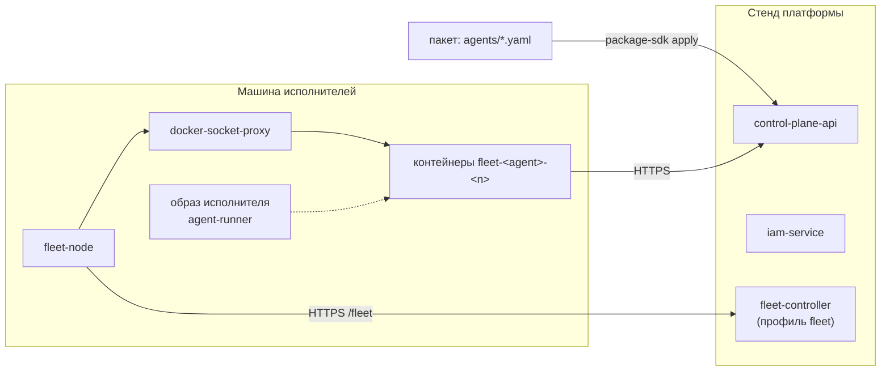

# Установка исполнителя

Как запустить автономных исполнителей: подключить машину к платформе узлом fleet и
описать агентов в пакете. Отдельно ставить демон, заводить ему PAT и писать env-файл не
нужно — личность, конфигурацию и credential агента платформа выводит из описания и
доставляет на узел сама. Статья для инженера эксплуатации. Модель — в статьях [Агенты
описанием](declarative-agents.md) и [Узлы и fleet](fleet.md).

## Что где работает



| Где | Что поставить |
|---|---|
| Стенд платформы | сервис `fleet-controller` (профиль compose `fleet`) и его service account |
| Каждая машина исполнителей | Docker, образ исполнителя, `docker-socket-proxy`, `fleet-node`, каталог секретов |
| Пакет каталога | описание агента вида `Agent` |

!!! warning "Периметр — контейнер"
    Кодовому агенту в автономном режиме разрешено выполнять произвольные команды
    (`permissionMode: bypassPermissions`), иначе он не сделает ни одной задачи. Поэтому
    периметр — не режим разрешений, а контейнер: внутри только volume реплики с рабочими
    копиями и зеркалами и файлы секретов, которые узел смонтировал по описанию агента.
    Домашний каталог машины, ключи SSH и credentials людей в контейнер не попадают.
    Узел управляет Docker только через socket proxy, которому разрешены контейнеры и
    volumes.

## Требования к машине

| Компонент | Зачем |
|---|---|
| Docker с Compose | контейнеры узла и агентов |
| Исходящий HTTPS | к стенду: `/fleet` (контроллер), Control Plane и IAM; к forge и API поставщика модели |
| Ресурсы | CPU, память и диск под `capacity` узла; рабочие копии и зеркала живут в volume каждой реплики |
| Секреты | токены, которые нужны агентам этой машины: подписка кодового агента, токен forge и т.п. |

Входящих соединений машине не нужно: узел работает из-за NAT.

## 1. Контроллер на стенде

Один раз на стенд:

```bash
# сервис учётки fleet-controller — шаг 5d bootstrap
python3 deploy/bootstrap.py --env .env ...
tools/compose --profile fleet up -d --build fleet-controller
curl -sS https://platform.example.com/fleet/healthz     # {"status":"ok"}
```

Bootstrap (шаг 5d) выпускает service account контроллера и пишет
`secrets/fleet-iam.env`. Пока файла нет, API контроллера отвечает
`503 not_configured`. Подробно — [Узлы и fleet](fleet.md#controller).

## 2. Образ исполнителя

Референсный образ — каталог `deploy/agent-runner/`: демон `control-plane-agent` с
адаптерами Claude Code и Codex и SDK скиллов, пользователь uid `10001`. Контекст сборки —
корень поставки: `platform-auth-sdk` подключён соседней папкой.

Образ должен лежать на машине узла: socket proxy не даёт узлу скачивать образы.
Референсный compose узла (`deploy/node/`) собирает его сам.


!!! tip "Тег образа — версия исполнителя"
    Узел пересоздаёт контейнер агента, когда меняется строка `image` в `node.yaml`, а не
    содержимое образа. Выпуская новую версию исполнителя, собирайте образ под новым тегом
    и меняйте тег в `executors.<вид>.image`.

## 3. Секреты и каталоги узла

```bash
install -d -m 0700 /var/lib/fleet-node              # stateDir: токен узла, ключи, PAT агентов
install -d -m 0700 /etc/fleet-node/secrets          # secretsDir: по файлу на секрет
printf '%s' '<токен подписки>' > /etc/fleet-node/secrets/claude-oauth-token
printf '%s' '<токен forge>'    > /etc/fleet-node/secrets/github-token
chmod 600 /etc/fleet-node/secrets/*
```

Имя файла — имя секрета из `placement.secrets` описаний агентов. Файлы должны читаться
uid образа исполнителя (`10001` у референсного образа), а `stateDir` — быть доступным
на запись пользователю узла.

| Секрет | Кому | Что |
|---|---|---|
| `claude-oauth-token` | агенты вида `claude-code` | токен подписки: `claude setup-token` на машине с браузером. Токен подписки принадлежит человеку, а не агенту |
| `github-token` | кодовые агенты | токен forge с правом записи только в рабочие репозитории и чтения соседей |
| свои имена | по описаниям | например токен публикации для агента-скиллов; скилл читает его сам из `/run/secrets/<имя>` |

PAT агентов в каталог секретов **не кладутся**: их выпускает контроллер и доставляет на
узел в запечатанном виде.

## 4. Ключ регистрации

```bash
tools/compose --profile fleet exec fleet-controller \
  fleet-controller join-key --ttl 3600 --note "worker-1"
```

Выведенный ключ положите на машину в файл `joinKeyFile` (например
`/etc/fleet-node/join-key`). Ключ одноразовый; после регистрации он не нужен.

## 5. `node.yaml`

```yaml
controllerUrl: https://platform.example.com/fleet
name: worker-1
labels: [claude-subscription, repos]
capacity: {slots: 4, cpus: 8, memoryMb: 16384}
executors:
  claude-code: {image: agent-runner:1.4.0, dataPath: /runner}
  skills: {image: agent-runner:1.4.0, dataPath: /runner, env: {RUNNER_MODE: skills}}
stateDir: /var/lib/fleet-node
secretsDir: /etc/fleet-node/secrets
dockerUrl: tcp://docker-proxy:2375
network: fleet-agents
agentEnv:
  CONTROL_PLANE_SERVER: https://platform.example.com
  CONTROL_PLANE_IAM_URL: https://platform.example.com/iam
  CONTROL_PLANE_IAM_SCOPES: control-plane:read control-plane:write
joinKeyFile: /etc/fleet-node/join-key
```

- `labels` и ключи `executors` определяют, каких агентов сюда можно разместить;
- `capacity.slots` — сколько экземпляров агентов машина держит одновременно;
- в `executors.<вид>.env` передаются адреса служебных сервисов, которые нужны агентам
  этой машины (например одноразовой тестовой базы в сети `network`).

Все поля — [Конфигурация узла](fleet.md#node-yaml).

## 6. Запуск узла

Референсный compose узла — каталог `deploy/node/`: `docker-proxy`
(`tecnativa/docker-socket-proxy`, разрешены только контейнеры и volumes), `fleet-node`
(образ из `services/fleet/Dockerfile`, uid `10001`), сборка образа исполнителя и служебные базы
агентов. Каталоги состояния и секретов монтируются в контейнер узла по тем же путям, что
на хосте: узел монтирует PAT и секреты в контейнеры агентов по пути хоста.

```bash
docker compose -f <compose узла> up -d --build
docker compose -f <compose узла> logs -f fleet-node
```

В журнале — `joined the fleet as <node-id>`. С центра:

```bash
curl -sS https://platform.example.com/fleet/api/v1/nodes \
  -H "Authorization: Bearer $FLEET_TOKEN"        # токен audience fleet, fleet:read
```

## 7. Агент в пакете

Опишите агента видом `Agent` в папке `agents/` пакета и примените установку:

```bash
make packages-check
package-sdk plan --install deploy/<окружение>/packages.yaml \
  --server https://platform.example.com --out plan.json
package-sdk apply --plan plan.json --server https://platform.example.com
```

Через несколько секунд контроллер заведёт агенту личность, разместит его и выдаст узлу
PAT; узел создаст контейнер `fleet-<key>-0`. Проверка:

```bash
curl -sS https://platform.example.com/api/v1/agents/<key>/status \
  -H "Authorization: Bearer $CP_TOKEN"
# "phase": "running", "node": "worker-1", "observedRevision": 1
docker logs -f fleet-<key>-0
# agent mode: <key>@1 (sha256:…)
```

Задачи агенту назначают по его CP principal (`principalId` в `GET /api/v1/agents/<key>`),
если в описании `work.onlyAssigned: true` (по умолчанию).

## Управление

| Задача | Как |
|---|---|
| сменить модель, репозитории, ревью, скиллы | правка описания и `apply` — новая ревизия; исполнитель перейдёт на неё после текущего прогона (выход 75) |
| остановить агента | `state: stopped` в описании и `apply` (или `PATCH /api/v1/agents/<key>/state`) |
| изменить число экземпляров | `placement.replicas` в описании |
| вывести агента из оборота | ключ в `retire.Agent` установки и `apply` |
| обновить код исполнителя | собрать образ под новым тегом, поменять `image` в `node.yaml`, перезапустить `fleet-node` — узел пересоздаст контейнеры, дав прогонам `drainSeconds` |
| изменить метки, ёмкость, виды узла | правка `node.yaml` и перезапуск `fleet-node` |
| добавить секрет | положить файл в `secretsDir`; контроллер увидит его со следующим отчётом узла |
| вывести машину | остановить compose узла; через 60 с узел `offline`, агенты переедут на другие узлы |

!!! warning "Остановка во время прогона"
    Остановка, уменьшение `replicas` и вывод из оборота останавливают контейнер через 30
    секунд, а не через `drainSeconds`. Длинный прогон будет прерван, его run закроется
    `restart_recovery` при следующем старте. Останавливайте агента между прогонами. См.
    [Агенты описанием](declarative-agents.md#lifecycle).

Рабочие копии переживают перезапуски и новые ревизии: они лежат на volume
`fleet-<key>-<n>-data`. Следующая попытка той же задачи переиспользует копию, а адаптер
Claude Code продолжает ту же сессию (`resume`).

## Отзыв доступа

| Что отзываем | Как | Эффект |
|---|---|---|
| агента целиком | `retire.Agent` → `:retire` | связка отозвана, principal `disabled`, claims отпущены, PAT отозван контроллером |
| только работу агента | `state: stopped` | PAT размещения отозван, контейнер остановлен; личность и связка остаются |
| машину | остановить `fleet-node` и контейнеры `fleet-*` | агенты переезжают; PAT этой машины отзываются на следующей сверке после переезда |
| токен подписки или forge | у поставщика; удалить файл из `secretsDir` | агенты с этим секретом перестанут размещаться на узле (`no_secret`) |

## Ручной запуск демона (режим env)

Для отладки демона можно запустить `control-plane-agent` без узла и без описания — под
principal'ом, который не привязан к агенту. Тогда вся конфигурация берётся из переменных
окружения ([Конфигурация — режим env](configuration.md#env-mode)).

```bash
uv tool install --reinstall ./services/control-plane      # сосед — ../../sdk/platform-auth-sdk
export CONTROL_PLANE_SERVER=https://platform.example.com
export CONTROL_PLANE_IAM_URL=https://platform.example.com/iam
export CONTROL_PLANE_IAM_TENANT=<iam-tenant-id>
export CONTROL_PLANE_AGENT_CONFIG=env
export CONTROL_PLANE_AGENT_ADAPTER=echo
export CONTROL_PLANE_AGENT_WORKSPACE=<workspace-id песочницы>
export CONTROL_PLANE_AGENT_ONLY_ASSIGNED=1
control-plane-agent
```

Пакет `control-plane` ставит команды `control-plane` (CLI), `control-plane-mcp`
(MCP-сервер, его демон передаёт Claude Code), `control-plane-agent` (демон) и
`control-plane-opencode` (харнесс OpenCode). Credential — PAT principal'а в
`~/.config/iam/credentials.json` или в `IAM_PLATFORM_ACCESS_TOKEN` с
`IAM_CREDENTIAL_MODE=environment` ([Identity агента](agent-identity.md)).

!!! danger "Не для постоянной работы"
    Режим env не даёт ревизий, ревью конфигурации и `agentRevisionId` на прогонах, а
    демон вне контейнера работает с правами пользователя машины. Запускайте его только
    на задачах песочницы и только с узкой очередью (`ONLY_ASSIGNED`, отдельный
    workspace). Если principal уже привязан к агенту, `CONTROL_PLANE_AGENT_CONFIG=env`
    приведёт к `422 agent_revision_required` на каждом прогоне.

## Типичные проблемы

| Симптом | Причина и решение |
|---|---|
| агент в `waiting_for_node` | у узлов нет вида, метки, секрета или места — `reason.code` в `GET /agents/<key>/status`, разбор — [Узлы и fleet](fleet.md#troubleshooting) |
| агент в `pending`, `identity_pending` | контроллер не завёл личность или PAT — журнал `fleet-controller` |
| агент в `crash_looping` | `docker logs fleet-<key>-0`: выход 2 — описание неисполнимо на образе (параметры, `review` без `reviewer`, зеркало с чужим `origin`) |
| `control-plane-agent requires CONTROL_PLANE_SERVER` | нет `agentEnv.CONTROL_PLANE_SERVER` в `node.yaml` |
| `control-plane-agent has no credentials for …` | нет `CONTROL_PLANE_IAM_URL` в `agentEnv` или PAT не смонтирован (узел в контейнере без `hostStateDir`) |
| run успешен, в артефакте `commit` стоит `published: false` | push не удался: нет секрета `github-token` в описании или на узле, либо у токена нет права записи |
| задача взята, но ничего не происходит | ход агента ограничен `timeoutSeconds` описания (по умолчанию час); сторож прогресса остановит прогон без actions через `CONTROL_PLANE_AGENT_STALL_STOP_SECONDS` |
| `workspace … is held by another process`, run `failed: workspace_busy` | рабочую копию держит другой процесс (lock-файл в `worktrees/.locks`) |
| после сборки нового образа поведение не изменилось | образ собран под тем же тегом — поменяйте тег в `node.yaml` |
| `binding_not_found` у ручного демона | связку создали после первого запроса — отрицательный кэш: перезапустите `control-plane-api` (у агентов с описанием ядро сбрасывает кэш само) |

Подробный разбор — [Диагностика: исполнение и runner](../troubleshooting/runner.md).

## См. также

- [Агенты описанием](declarative-agents.md)
- [Узлы и fleet](fleet.md)
- [Конфигурация исполнителя](configuration.md)
- [Адаптеры исполнителей](adapters.md)
- [Рабочие копии](execution-workspace.md)
- [Ресурсы и масштабирование](../operations/capacity.md)
