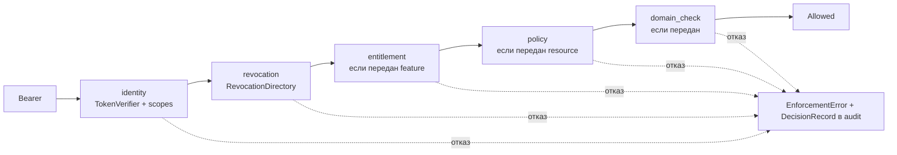

# platform-auth-sdk

`platform-auth-sdk` (пакет `platform_auth`) — единая точка применения
политики (Policy Enforcement Point) для resource services платформы. Им
пользуются Control Plane, memory-service,
skill-sdk и сервисы вертикальных пакетов. Статья
описывает проверку токенов IAM, кэш JWKS, revocation, стадии entitlement и
policy, контракт отказа и подключение к FastAPI. Для разработчиков
сервисов.

## Что делает и чего не делает

| Делает | Не делает |
|---|---|
| проверяет RS256-подпись по JWKS с ротацией, точные `iss` и `aud`, временные claims, обязательные поля | не выпускает credential |
| собирает `TrustedAuthContext` только из проверенных claims | не знает доменных permissions, Workspace, Task или namespace |
| закрывает окно между отзывом credential и истечением токена (revocation) | не читает чужие базы данных |
| спрашивает внешние сервис лицензий и PDP, если они подключены, с ограниченным кэшем | не вычисляет организационную политику сам |
| отдаёт единый код отказа клиенту и точную причину в audit | транзакционные гейты — забота сервиса (`domain_check`) |

Зависимости — только `pyjwt[crypto]` и `httpx`. Лицензия — Apache-2.0.

## Порядок проверок

```text
identity → revocation → entitlement → policy → транзакционные гейты (domain_check)
```

Порядок фиксирован и не настраивается: каждая следующая стадия дороже
предыдущей и имеет смысл только после неё.



## Проверка токена

### `TokenVerifier` и `VerifierConfig`

```python
from platform_auth import JwksCache, TokenVerifier, VerifierConfig

keys = JwksCache("http://iam-service:8010/.well-known/jwks.json")
verifier = TokenVerifier(
    keys,
    VerifierConfig(issuer="https://platform.example.com/iam", audience="acme-pack"),
)
ctx = await verifier.verify(token, correlation_id=request_id)
```

| Параметр `VerifierConfig` | По умолчанию | Смысл |
|---|---|---|
| `issuer` | обязателен | точное совпадение `iss` |
| `audience` | обязателен | точное совпадение `aud`; **список в `aud` отвергается** (`audience_not_exact`) |
| `leeway_seconds` | `5.0` | допуск часов для `exp`, `nbf`, `iat` |
| `algorithms` | `RS256`, `RS384`, `RS512` | симметричные и `none` отсекаются до обращения к ключу |
| `required_claims` | `iss sub aud tenant_id iat nbf exp jti` | отсутствие любого — отказ |
| `extra_required_claims` | `()` | дополнительные обязательные claims сервиса (например `acr`) |

Пустой `issuer` или `audience` — `VerificationUnavailable("verifier_not_configured")`
при создании: неправильно настроенный сервис не стартует, а не принимает всё.

Issuer токенов IAM — публичный адрес IAM (`${TAIMEN_PUBLIC_URL}/iam`), а
JWKS удобно брать по внутреннему адресу сети — проверка подписи не должна
зависеть от внешнего прокси.

### Кэш ключей `JwksCache`

| Параметр `JwksPolicy` | По умолчанию | Смысл |
|---|---|---|
| `refresh_after_seconds` | `300` | мягкий срок: после него неизвестный `kid` вызывает перечитывание |
| `min_refresh_interval_seconds` | `10` | не чаще одного перечитывания — защита JWKS IAM от потока токенов с чужим `kid` |
| `stale_after_seconds` | `3600` | жёсткая граница: дольше кэш без успешного обновления не живёт |
| `request_timeout_seconds` | `3` | таймаут запроса JWKS |

Поведение:

- неизвестный `kid` → принудительное перечитывание (с учётом
  `min_refresh_interval`) → всё ещё неизвестен → `InvalidToken("unknown_key_id")`;
- IAM недоступен, кэш моложе `stale_after` — сервис работает на кэше;
- кэш старше `stale_after` — `VerificationUnavailable("jwks_stale")`, то есть
  `503`: недоступный IAM закрывает вход, а не открывает его.

`StaticKeySet(public_key_pem, key_id="")` — один заранее известный ключ для
изолированных контуров без доступа к JWKS; ротация ключа тогда —
обязанность деплоя.

### `TrustedAuthContext`

| Поле | Источник |
|---|---|
| `tenant_id` | `tenant_id` |
| `principal_id` | `sub` |
| `principal_type` | `principal_type` (`human`, `agent`, `service`) |
| `credential_id` | `credential_id` или `jti` |
| `scopes` | `scope` (строка через пробел или список) |
| `scope_ceiling` | `scope_ceiling` (потолок PAT); `None` — потолка нет |
| `session_id`, `auth_time`, `acr` | одноимённые claims, если есть |
| `expires_at`, `issued_at`, `token_id`, `issuer`, `audience` | временные и служебные claims |

Tenant, subject и scope из тела, query или заголовков запроса
**авторитетными не считаются никогда**.

Scope действует, только если он есть **и** в `scope`, **и** в
`scope_ceiling` (когда потолок объявлен). Объявленный пустой потолок не
пропускает ничего — это не то же самое, что отсутствие потолка.

```python
ctx.has_scope("acme-pack:write")         # bool
ctx.require_scope("acme-pack:read", "acme-pack:write")  # любой из → иначе InsufficientScope
ctx.effective_scopes()                   # scopes ∩ ceiling
ctx.audit_subject()                      # безопасный для журнала снимок идентификаторов
```

## Revocation

Короткий TTL access token ограничивает ущерб, но между отзывом credential в
IAM и истечением уже выданного токена остаётся окно. Закрывает его сам
resource service через порт `RevocationDirectory`:

```python
class RevocationDirectory(Protocol):
    async def check(self, ctx: TrustedAuthContext) -> CredentialStatus: ...
```

Общее правило любой реализации: **неизвестность — это отказ.**

### `TokenLifetimeWindow` (по умолчанию)

Отдельного источника отзыва нет, гарантия ограничена сроком жизни токена.
Чтобы режим нельзя было включить молча, он отвергает токены, живущие
дольше `max_ttl_seconds` (по умолчанию 900 с), с причиной
`token_ttl_exceeds_revocation_window`.

### `CachingRevocationDirectory`

Кэш поверх собственного источника сервиса (своей проекции principal'ов,
подписки на outbox IAM и т. п.):

```python
from platform_auth import CachingRevocationDirectory, CredentialStatus

async def source(ctx) -> CredentialStatus:
    row = await bindings.find(ctx.issuer, ctx.principal_id)
    if row is None:
        return CredentialStatus.revoked("binding_not_found")
    return CredentialStatus.allowed()

revocation = CachingRevocationDirectory(source, ttl_seconds=30, stale_after_seconds=120)
```

Ключ кэша — пара `(tenant_id, credential_id)`.

| Ответ в кэше | Возраст | Что происходит |
|---|---|---|
| активен | ≤ `ttl_seconds` | переиспользуется |
| активен | > `ttl_seconds` | источник опрашивается заново; при его недоступности — прошлый ответ, пока возраст ≤ `stale_after_seconds` |
| отозван | ≤ `stale_after_seconds` | переиспользуется без опроса источника |
| любой | > `stale_after_seconds` | запись выбрасывается; источник обязан ответить, иначе `VerificationUnavailable("revocation_source_unavailable")` |

!!! note "Отрицательный ответ живёт не дольше `stale_after_seconds`"
    Отказ не переспрашивается по короткому TTL — отозванный credential
    обратно не оживает. Но и вечно он не хранится: иначе отказ, полученный
    **до** появления записи в источнике (например, `binding_not_found` до
    создания binding'а), держался бы до перезапуска процесса. После
    `stale_after_seconds` источник опрашивается снова. Практический вывод
    для эксплуатации: заводите binding до первого запроса principal'а, либо
    ждите окно устаревания (у Control Plane — `CP_IAM_BINDING_STALE_AFTER_SECONDS`,
    по умолчанию 120 с). `forget(tenant_id, credential_id)` сбрасывает запись
    вручную.

Отозванный credential отвечает клиенту тем же `invalid_token`, что и битый
токен: отдельный код выдал бы, существовал ли credential вообще.

## Стадия entitlement {#entitlement-stage}

Включается передачей `feature` в `enforce`. Клиент — `EntitlementClient`:

```python
from platform_auth import EntitlementClient, EntitlementPolicy, ServiceCredentials, ServiceTokenProvider

tokens = ServiceTokenProvider(
    "http://iam-service:8010",
    ServiceCredentials(client_id=..., client_secret=...,
                       audience=entitlement_audience,   # audience сервиса лицензий
                       scopes=("entitlement:check-on-behalf",)),
)
entitlement = EntitlementClient(
    entitlement_url, tokens, product="acme-pack",
    policy=EntitlementPolicy(cache_ttl_seconds=30, degraded_max_age_seconds=300),
)
```

| Ситуация | Результат |
|---|---|
| свежий кэш (≤ `cache_ttl_seconds`), лицензия не истекла, `required_amount` не больше закэшированного | решение из кэша |
| сервис ответил 4xx | `EntitlementUnavailable("entitlement_request_rejected")` — кэш **не** используется |
| сервис недоступен или 5xx, кэш моложе `degraded_max_age_seconds` и достаточно «широкий» | прошлое решение с `source="degraded"` |
| иначе | `EntitlementUnavailable("entitlement_service_unavailable")` → `503` |
| отказ по существу | `NotEntitled(reason)` → `403 not_entitled` |

Деградация ограничена дважды — возрастом записи и её содержанием: решение
для меньшего `required_amount` не применяется к запросу на большее
количество. Квоты — `reserve()`, `consume()`, `release()` того же клиента.

`NullEntitlementClient` (по умолчанию в PEP) всегда отвечает allow с
`source="disabled"`: лицензирование выключено явно, и в audit это видно.

## Стадия policy {#policy-stage}


Включается передачей `resource` в `enforce`. Клиент — `AuthorizationClient`
к внешнему PDP (Policy Decision Point), если он подключён:

```python
from platform_auth import AuthorizationClient, AuthorizationPolicy, ContextualTuple, ResourceRef

authorization = AuthorizationClient(
    pdp_url,
    pdp_tokens,                            # токен audience PDP
    policy=AuthorizationPolicy(cache_ttl_seconds=5, request_timeout_seconds=3),
)

allowed = await pep.enforce(
    token,
    action="tasks.write",
    resource=ResourceRef("task", str(task.id)),
    contextual=(ContextualTuple(f"task:{task.id}", "scope", f"workspace:{task.workspace_id}"),),
    policy_consistency="strong",
)
allowed.policy.reason_code, allowed.policy.decision_id
```

| Метод клиента | Что делает |
|---|---|
| `check(ctx, action, resource, *, contextual, on_behalf_of, consistency)` | одно решение |
| `batch_check(ctx, items, *, consistency)` | до 100 решений (`CheckItem`) |
| `list_objects(ctx, action, resource_type, *, on_behalf_of, consistency, cursor, limit)` | `ObjectPage` для фильтрации списков |
| `list_subjects(...)` | кому действие разрешено |
| `invalidate(tenant_id)` | сбросить кэш (хук на события `binding.*`) |

Правила строже, чем у entitlement:


- кэшируется только `check` с `consistency="default"`, не дольше
  `cache_ttl_seconds`; grace-окна на время сбоя **нет** — нет ответа и нет
  свежего кэша, значит `AuthorizationUnavailable` (`503`);
- `consistency="strong"` — всегда онлайн; используйте для мутаций и
  привилегированных действий;
- 4xx от PDP — отказ без обращения к кэшу;
- `resource` передан, а клиент не настроен — `AuthorizationUnavailable("authorization_not_configured")`;
- `NullAuthorizationClient` отвечает **deny** с `source="disabled"`: «проверять
  нечем» не означает «разрешено»;
- ресурс — только серверно найденный `type:id`, клиентские утверждения о
  ресурсе не принимаются; вызов за другого principal'а (`on_behalf_of`)
  требует у service identity scope `policy:check-on-behalf`.

## Токен сервиса: `ServiceTokenProvider`

Обмен client credentials service account'а на токен нужного audience с
кэшем:

```python
from platform_auth import ServiceCredentials, ServiceTokenProvider

provider = ServiceTokenProvider(
    "http://iam-service:8010",
    ServiceCredentials(client_id=os.environ["MY_IAM_CLIENT_ID"],
                       client_secret=os.environ["MY_IAM_CLIENT_SECRET"],
                       audience="memory-service",
                       scopes=("memory:read",)),
    refresh_margin_seconds=30,
)
token = await provider()        # кэшированный или свежий
provider.forget()               # сбросить после 401 от сервиса
```

Запрос — `POST {iam}/api/v1/tokens/exchange` с `clientId`, `clientSecret`,
`audience`, `scopes`. Ошибка обмена — `VerificationUnavailable("service_token_exchange_failed")`
без пересказа причины (в ней могло бы оказаться эхо секрета). Пустые
`client_id`/`client_secret` — ошибка при создании.

## Контракт отказа

У каждой ошибки две стороны: `client_payload()` — стабильный код для
клиента, `audit_reason` — точная причина только для audit.

| Исключение | `code` | HTTP | Когда |
|---|---|---|---|
| `InvalidToken` | `invalid_token` | 401 | любой дефект токена: нет, битая подпись, чужой issuer/audience, истёк, отозван |
| `InsufficientScope` | `insufficient_scope` | 403 | scope не покрывает операцию |
| `NotEntitled` | `not_entitled` | 403 | нет лицензии на feature |
| `PermissionDenied` | `permission_denied` | 403 | отказ policy или доменной политики |
| `VerificationUnavailable` | `verification_unavailable` | 503 | нет ключей, JWKS/revocation недоступны дольше окна |
| `EntitlementUnavailable` | `entitlement_unavailable` | 503 | нет решения entitlement |
| `AuthorizationUnavailable` | `authorization_unavailable` | 503 | нет решения policy |

Все дефекты токена схлопываются в один код: разные ответы превратили бы
эндпоинт в оракул для чужих credential. `error.retriable` — `True` для 5xx
(недоступность повторяют, отказ по существу — нет).

## Audit

Каждое решение PEP — allow и deny — записывается в `AuditSink`:

```python
class AuditSink(Protocol):
    def record(self, decision: DecisionRecord) -> None: ...
```

`DecisionRecord` содержит `outcome` (`allowed`, `denied`, `unavailable`),
`stage` (`identity`, `revocation`, `entitlement`, `policy`, `domain`),
`action`, `audience`, `code`, `reason`, идентификаторы tenant/principal/
credential/session, `feature`, `product`, источники решений
(`entitlement_source`, `policy_source`), `correlation_id`, время и `details`.
Токенов и секретов в записи нет; `redact(payload)` убирает из произвольного
словаря всё, похожее на credential, — по имени поля и по значению.
`CollectingAuditSink` (по умолчанию) держит записи в памяти — в
промышленном сервисе передайте свой sink (журнал, outbox).

## Подключение к FastAPI

SDK не зависит от веб-фреймворка. Типовая интеграция — зависимость FastAPI
и обработчик `EnforcementError`:

```python
from fastapi import Depends, FastAPI, Request
from fastapi.responses import JSONResponse
from platform_auth import (
    CachingRevocationDirectory, CredentialStatus, EnforcementError, JwksCache,
    PolicyEnforcementPoint, TokenVerifier, TrustedAuthContext, VerifierConfig,
)

keys = JwksCache("http://iam-service:8010/.well-known/jwks.json")
verifier = TokenVerifier(keys, VerifierConfig(
    issuer="https://platform.example.com/iam", audience="acme-pack"))

async def principal_status(ctx: TrustedAuthContext) -> CredentialStatus:
    return CredentialStatus.allowed()      # своя проекция principal'ов сервиса

pep = PolicyEnforcementPoint(
    verifier,
    revocation=CachingRevocationDirectory(principal_status),
    audit=MyAuditSink(),
)

app = FastAPI()

@app.exception_handler(EnforcementError)
async def enforcement_denied(request: Request, exc: EnforcementError) -> JSONResponse:
    return JSONResponse(status_code=exc.http_status, content=exc.client_payload())

def require(action: str, *scopes: str):
    async def dependency(request: Request) -> TrustedAuthContext:
        allowed = await pep.enforce_authorization_header(
            request.headers.get("authorization"),
            action=action,
            required_scopes=scopes,
            correlation_id=request.headers.get("x-request-id", ""),
        )
        return allowed.context
    return dependency

Reader = Depends(require("items.read", "acme-pack:read", "acme-pack:write"))
Writer = Depends(require("items.write", "acme-pack:write"))

@app.get("/api/v1/items")
async def list_items(ctx: TrustedAuthContext = Reader):
    return await items.list(tenant_id=ctx.tenant_id)   # tenant — только из токена

@app.on_event("shutdown")
async def close() -> None:
    await keys.aclose()
```

Рекомендации:

- Создавайте `JwksCache`, `TokenVerifier` и PEP **один раз** на приложение —
  иначе кэши не работают.
- Не читайте tenant или principal из запроса: только `ctx.tenant_id` и
  `ctx.principal_id`.
- Отвечайте кодами SDK (`client_payload()`), не раскрывайте `audit_reason`.
- Токены людей (PAT или федеративный вход) приходят от IAM с тем же
  audience — отдельной проверки для людей не нужно.

## Тестирование

`platform_auth.testing`:

```python
from platform_auth import StaticKeySet, TokenVerifier, VerifierConfig
from platform_auth.testing import FrozenClock, SigningKey

key = SigningKey.generate("test-key")
token = key.issue(issuer="https://iam.test", audience="acme-pack",
                  scopes=["acme-pack:read"], ttl_seconds=300)
jwks = key.jwks()                     # документ JWKS для подстановки в кэш
clock = FrozenClock(); clock.advance(600)   # управляемое время для кэшей
```

`issue()` принимает любые claims (`scope_ceiling`, `session_id`, `acr`,
`principal_type`, `extra_claims`, `drop_claims`, `algorithm`) — удобно для
негативных тестов. `JwksCache.seed(document)` подставляет JWKS без сети.

## См. также

- [SDK и интеграции](index.md)
- [Токены, audiences, scopes](../iam/tokens.md)
- [Service accounts](../iam/service-accounts.md)
- [Модель безопасности](../overview/security-model.md)
