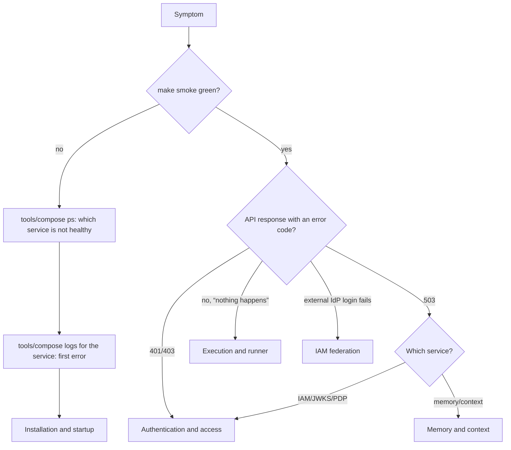

# Troubleshooting

This section collects common failures of the Taimen platform in a
"symptom → cause → fix" format. Articles are grouped by subsystem: start with
the general diagnostic order below, then go to the table for your subsystem.

## General order



Basic commands, run from the root of the superproject clone:

```bash
make smoke                                     # health of all running services
tools/compose --profile "*" ps                # statuses, healthchecks, restarts
tools/compose logs --since 15m <service>      # logs
curl -s http://127.0.0.1:18000/health/ready    # Control Plane readiness
curl -s http://127.0.0.1:18000/metrics | grep context_adapter
```

## How to read errors

Services return errors in different formats; the error code is the main key
for searching the tables in this section.

| Service | Error body format | Where the code is |
|---|---|---|
| Control Plane | `{"error": {"code", "message", "details", "requestId"}}` | `error.code`; `requestId` is the key for searching the logs |
| IAM | `{"detail": "<code>"}` | `detail` (for example, `idempotency_key_required`) |
| Memory Service | `{"detail": "<text>"}` | Human-readable text in Russian |
| `control-plane` client (CLI, MCP, runner) | Exception message | Code at the start: `iam_credential_ambiguous`, `iam_environment_mode_required`, and so on |

!!! note "Intentionally uninformative responses"
    Some failures deliberately do not disclose the cause, so that the API
    cannot serve as an oracle for enumeration. IAM returns the same
    `401 invalid_token` for a revoked, expired, or nonexistent PAT and for the
    PAT of a disabled principal; Control Plane returns `401 invalid_credentials`
    both for a bad signature and for a missing binding. The exact cause is
    available only in the IAM audit and the service logs.

## Articles in this section

| Article | When to open it |
|---|---|
| [Installation and startup](startup.md) | Compose does not come up, a container is `unhealthy`, build, migration, file permission, or Caddy errors |
| [Authentication and access](auth.md) | `401`/`403` from IAM and Control Plane, PAT issuance and exchange errors, bindings, scopes |
| [Execution and runner](runner.md) | The executor does not claim tasks, crashes, does not publish branches, OOM, credential errors on the runner host |
| [Memory and context](memory.md) | Delivery to memory has stalled, context is degraded, `401/403/503` from memory, slow search |
| [IAM federation](../iam/federation.md) | People sign in through an external IdP: provider registration in IAM, `federation:exchange` errors |
| [Keycloak as the external IdP](../iam/keycloak.md) | Signing in to the personal workspace: the realm, the `human-harness` client, registration in IAM, `federation:exchange` errors |

## What to collect before asking for help

- The superproject commit (`git rev-parse HEAD`) and `git submodule status`.
- The output of `tools/compose --profile "*" ps`.
- Logs of the affected service for the incident period (without secrets: make
  sure the excerpt contains no tokens or passwords).
- The exact API response: status, error body, `requestId` / `request_id`.
- For an executor: the run's `failure_reason` and a fragment of the daemon log.

## See also

- [Operations](../operations/index.md)
- [Monitoring and health](../operations/monitoring.md)
- [Emergency procedures](../operations/emergency.md)
- [Error codes](../reference/errors.md)
